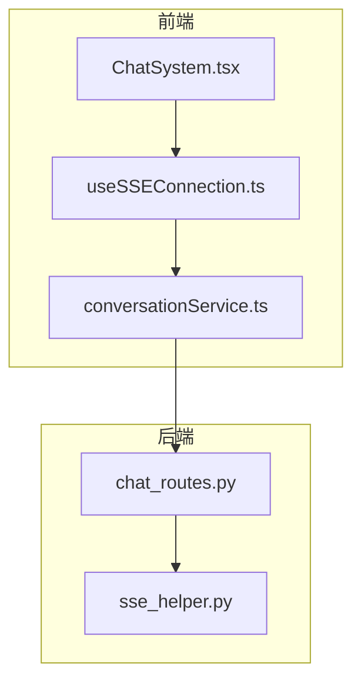
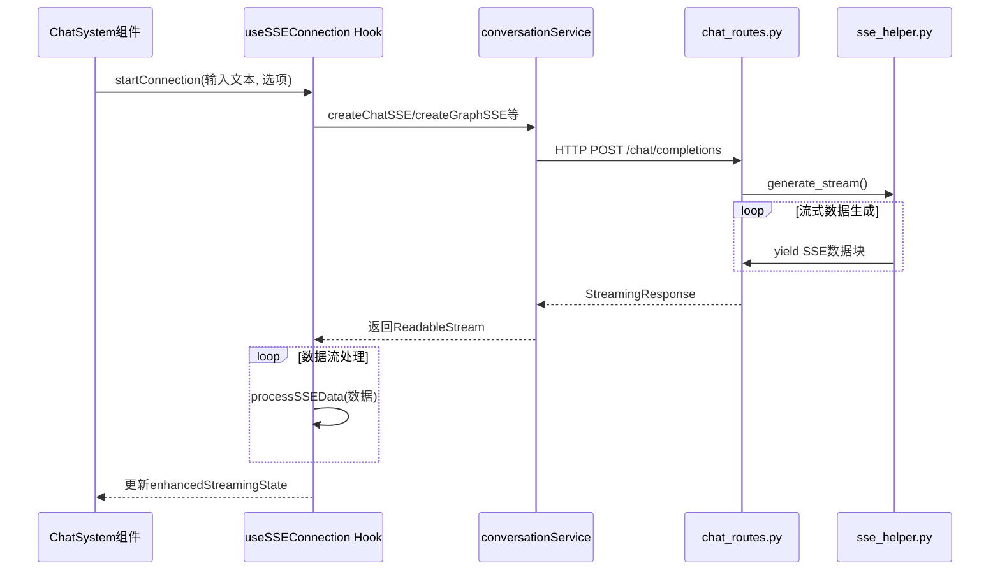
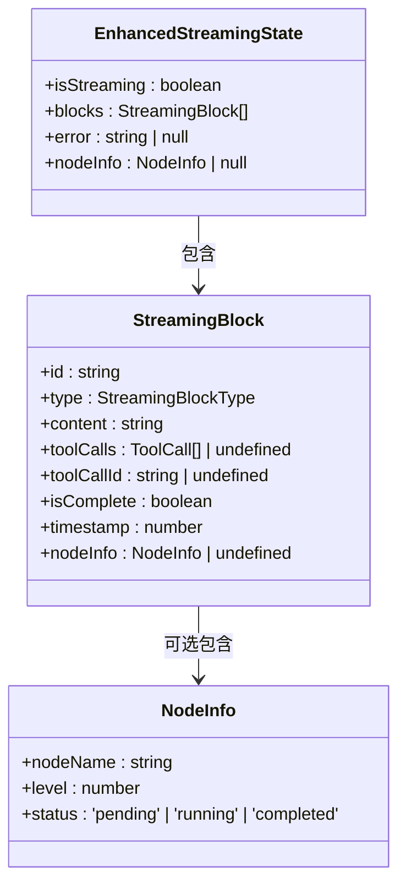
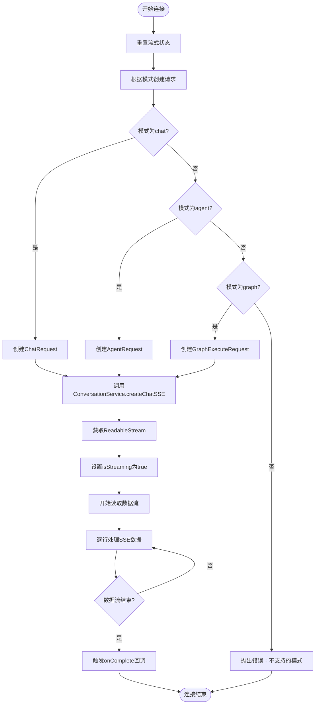
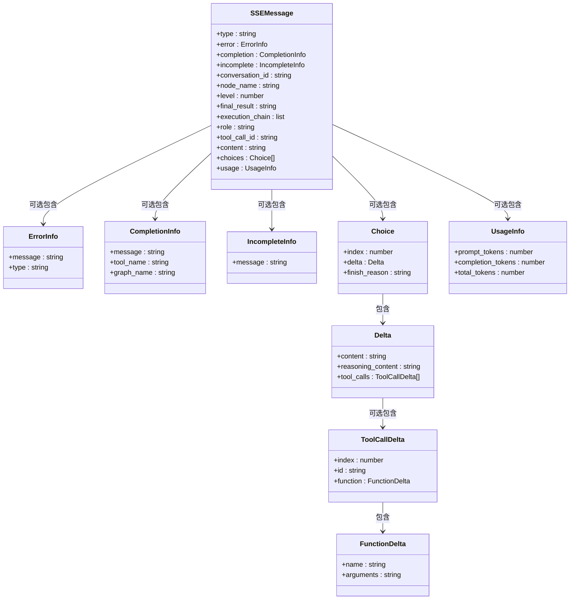
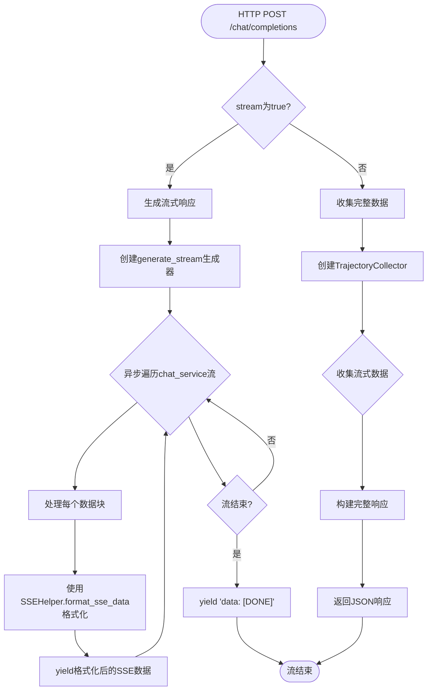
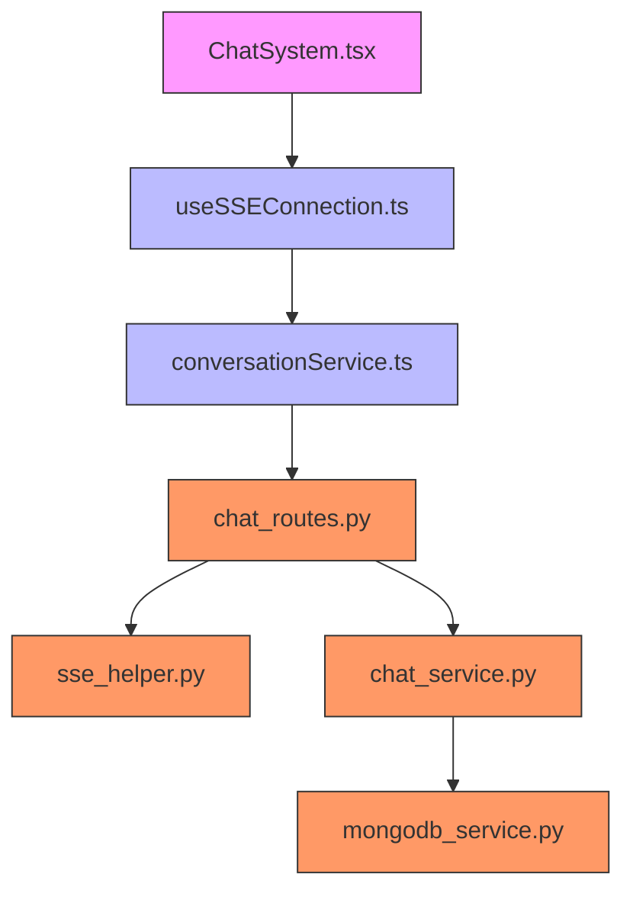

# SSE实时通信机制

<cite>
**本文档引用的文件**
- [useSSEConnection.ts](file://frontend/src/hooks/useSSEConnection.ts)
- [sse_helper.py](file://mag/app/utils/sse_helper.py)
- [chat_routes.py](file://mag/app/api/chat_routes.py)
- [ChatSystem.tsx](file://frontend/src/pages/ChatSystem.tsx)
</cite>

## 目录
1. [引言](#引言)
2. [项目结构](#项目结构)
3. [核心组件](#核心组件)
4. [架构概述](#架构概述)
5. [详细组件分析](#详细组件分析)
6. [依赖分析](#依赖分析)
7. [性能考虑](#性能考虑)
8. [故障排除指南](#故障排除指南)
9. [结论](#结论)

## 引言
本文档全面阐述了前端基于Server-Sent Events (SSE) 的实时通信实现。详细解释了`useSSEConnection`自定义Hook的设计与工作流程，包括EventSource的创建与配置、连接状态管理（连接中、已连接、断开、重连）、自动重连机制的实现策略（指数退避算法）以及错误处理逻辑。说明了如何解析从后端流式传输的SSE消息（如message、error、complete事件），并将其转换为前端可消费的状态。结合后端`sse_helper.py`和`chat_routes.py`，分析了消息格式约定与事件类型。提供了在`ChatSystem`等组件中使用该Hook的典型模式，展示了如何订阅实时消息流并更新UI。讨论了SSE的性能优势与局限性，以及在高并发场景下的优化建议。

## 项目结构
本项目采用前后端分离的架构，前端位于`frontend`目录，后端位于`mag`目录。SSE相关实现主要分布在前端的`hooks`和`services`目录，以及后端的`utils`和`api`目录。

**图示来源**
- [useSSEConnection.ts](file://frontend/src/hooks/useSSEConnection.ts)
- [ChatSystem.tsx](file://frontend/src/pages/ChatSystem.tsx)
- [chat_routes.py](file://mag/app/api/chat_routes.py)
- [sse_helper.py](file://mag/app/utils/sse_helper.py)

**本节来源**
- [useSSEConnection.ts](file://frontend/src/hooks/useSSEConnection.ts)
- [ChatSystem.tsx](file://frontend/src/pages/ChatSystem.tsx)

## 核心组件
`useSSEConnection`是前端SSE通信的核心Hook，负责管理SSE连接的生命周期、状态管理和消息处理。它通过`conversationService`与后端API进行交互，实现了流式数据的接收和解析。

**本节来源**
- [useSSEConnection.ts](file://frontend/src/hooks/useSSEConnection.ts)

## 架构概述
SSE通信架构从前端`ChatSystem`组件发起，通过`useSSEConnection`Hook建立连接，经由`conversationService`调用后端API，后端通过`chat_routes.py`处理请求，并使用`sse_helper.py`生成SSE流式响应。

**图示来源**
- [useSSEConnection.ts](file://frontend/src/hooks/useSSEConnection.ts)
- [chat_routes.py](file://mag/app/api/chat_routes.py)
- [sse_helper.py](file://mag/app/utils/sse_helper.py)
- [ChatSystem.tsx](file://frontend/src/pages/ChatSystem.tsx)

## 详细组件分析

### useSSEConnection Hook分析
`useSSEConnection` Hook实现了完整的SSE连接管理功能，包括连接建立、状态管理、数据处理和错误处理。

#### 状态管理

**图示来源**
- [useSSEConnection.ts](file://frontend/src/hooks/useSSEConnection.ts#L48-L74)

#### 连接流程

**图示来源**
- [useSSEConnection.ts](file://frontend/src/hooks/useSSEConnection.ts#L382-L421)
- [useSSEConnection.ts](file://frontend/src/hooks/useSSEConnection.ts#L450-L495)

**本节来源**
- [useSSEConnection.ts](file://frontend/src/hooks/useSSEConnection.ts)

### 后端SSE实现分析
后端通过`sse_helper.py`提供了SSE消息的生成工具，`chat_routes.py`则负责处理SSE请求并生成流式响应。

#### SSE消息类型

**图示来源**
- [sse_helper.py](file://mag/app/utils/sse_helper.py#L15-L80)
- [chat_routes.py](file://mag/app/api/chat_routes.py#L30-L50)

#### SSE流生成流程

**图示来源**
- [chat_routes.py](file://mag/app/api/chat_routes.py#L50-L150)
- [sse_helper.py](file://mag/app/utils/sse_helper.py#L15-L80)

**本节来源**
- [sse_helper.py](file://mag/app/utils/sse_helper.py)
- [chat_routes.py](file://mag/app/api/chat_routes.py)

## 依赖分析
SSE实现在前后端之间形成了清晰的依赖关系，前端依赖后端提供的SSE API，后端工具类为API提供支持。

**图示来源**
- [ChatSystem.tsx](file://frontend/src/pages/ChatSystem.tsx)
- [useSSEConnection.ts](file://frontend/src/hooks/useSSEConnection.ts)
- [chat_routes.py](file://mag/app/api/chat_routes.py)
- [sse_helper.py](file://mag/app/utils/sse_helper.py)

**本节来源**
- [ChatSystem.tsx](file://frontend/src/pages/ChatSystem.tsx)
- [useSSEConnection.ts](file://frontend/src/hooks/useSSEConnection.ts)
- [chat_routes.py](file://mag/app/api/chat_routes.py)

## 性能考虑
SSE作为一种服务器推送技术，在实时通信场景下具有显著优势，但也存在一些局限性。

### 优势
- **单向实时性**：服务器可以实时向客户端推送数据，无需客户端轮询
- **低延迟**：基于HTTP长连接，减少了连接建立的开销
- **简单易用**：基于标准HTTP协议，易于实现和调试
- **自动重连**：EventSource API内置了自动重连机制

### 局限性
- **单向通信**：只能由服务器向客户端推送数据，客户端无法通过同一连接发送数据
- **连接数限制**：每个域名下的SSE连接数受浏览器限制（通常为6个）
- **内存占用**：长时间连接可能占用较多服务器内存
- **代理兼容性**：某些代理服务器可能不支持长连接

### 高并发优化建议
1. **连接池管理**：在服务器端实现SSE连接池，复用连接资源
2. **消息压缩**：对SSE消息进行GZIP压缩，减少网络传输量
3. **分级推送**：根据消息优先级进行分级推送，重要消息优先处理
4. **连接超时**：设置合理的连接超时时间，避免无效连接占用资源
5. **负载均衡**：使用负载均衡器分发SSE连接，避免单点过载

## 故障排除指南
### 常见问题及解决方案
- **连接失败**：检查后端API是否正常运行，确认URL和端口正确
- **消息延迟**：检查网络状况，确认服务器处理能力充足
- **连接中断**：检查服务器日志，确认是否有异常抛出
- **消息乱序**：确认前端处理逻辑是否正确，避免并发处理导致状态混乱

### 错误处理机制
前端`useSSEConnection` Hook实现了完善的错误处理机制，包括：
- 连接创建失败时的错误捕获
- 数据流读取失败时的错误处理
- SSE消息解析失败时的错误处理
- 通过`onError`回调通知上层组件

**本节来源**
- [useSSEConnection.ts](file://frontend/src/hooks/useSSEConnection.ts#L489-L522)
- [sse_helper.py](file://mag/app/utils/sse_helper.py#L65-L70)

## 结论
本文档详细分析了基于SSE的实时通信实现，从前端Hook到后端API，全面阐述了其设计原理和工作流程。`useSSEConnection` Hook通过精心设计的状态管理和数据处理逻辑，实现了高效可靠的SSE通信。后端通过`sse_helper.py`和`chat_routes.py`提供了灵活的SSE消息生成和流式响应处理。整体架构清晰，职责分明，为实时通信场景提供了优秀的解决方案。在实际应用中，应根据具体需求权衡SSE的优缺点，并采取相应的优化措施以确保系统性能和稳定性。