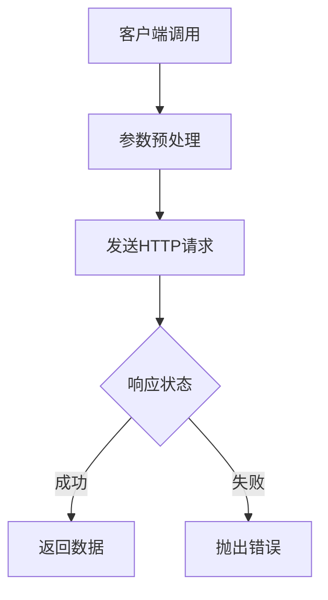
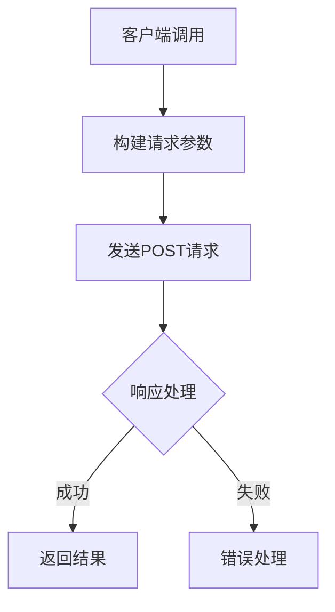
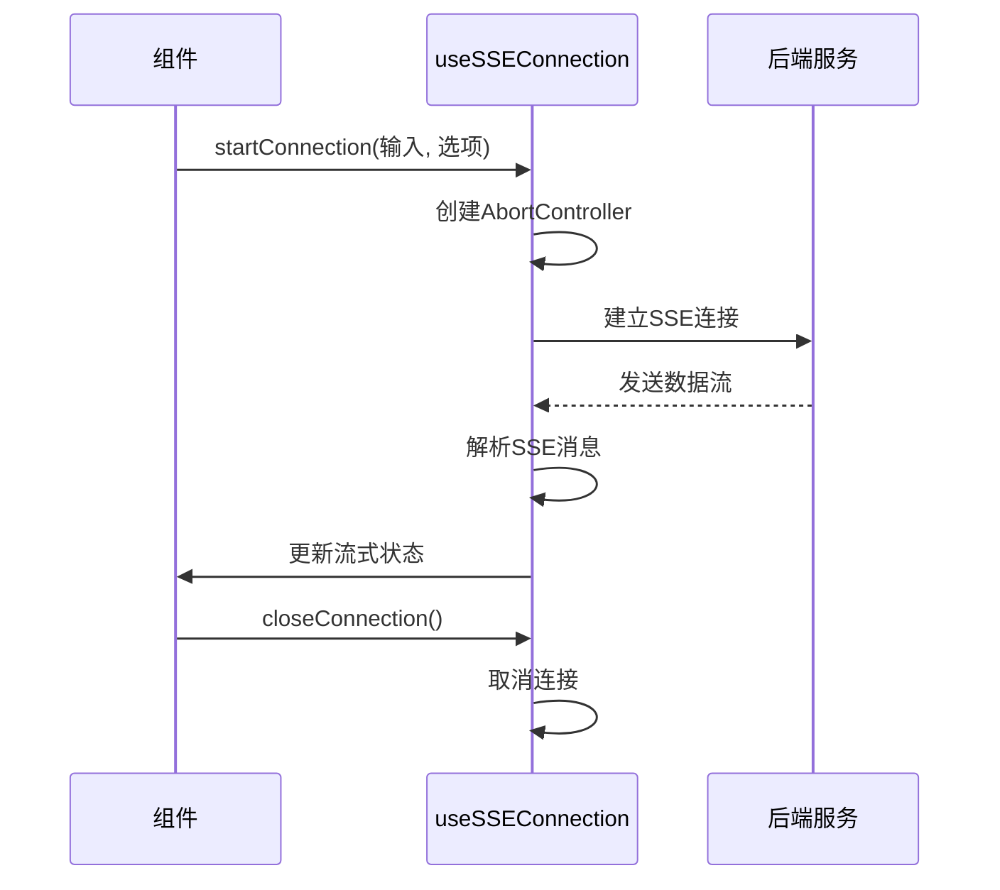
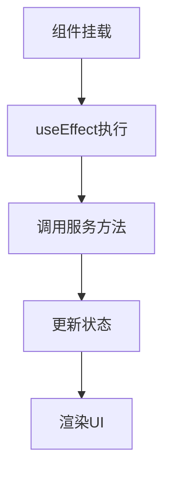

# 前端服务与API通信

<cite>
**本文档引用的文件**   
- [api.ts](file://frontend/src/services/api.ts)
- [graphService.ts](file://frontend/src/services/graphService.ts)
- [mcpService.ts](file://frontend/src/services/mcpService.ts)
- [useSSEConnection.ts](file://frontend/src/hooks/useSSEConnection.ts)
- [conversationService.ts](file://frontend/src/services/conversationService.ts)
- [ChatSystem.tsx](file://frontend/src/pages/ChatSystem.tsx)
</cite>

## 目录
1. [API基础配置](#api基础配置)
2. [RESTful API封装机制](#restful-api封装机制)
3. [SSE连接管理](#sse连接管理)
4. [组件中的服务调用模式](#组件中的服务调用模式)
5. [用户体验优化](#用户体验优化)
6. [调试工具建议](#调试工具建议)

## API基础配置

前端服务层通过`api.ts`文件中的axios实例与后端FastAPI进行通信。该实例配置了统一的基础URL和请求头，确保所有API请求的一致性。

**Section sources**
- [api.ts](file://frontend/src/services/api.ts#L1-L13)

## RESTful API封装机制

### graphService模块
`graphService.ts`模块封装了与图配置相关的RESTful API调用。该模块提供了创建、读取、更新和删除图配置的功能，并实现了请求参数的序列化和错误统一处理。

**Diagram sources**
- [graphService.ts](file://frontend/src/services/graphService.ts#L1-L223)

### mcpService模块
`mcpService.ts`模块封装了与MCP服务器相关的API调用，包括服务器配置管理、连接状态监控和工具注册等功能。

**Diagram sources**
- [mcpService.ts](file://frontend/src/services/mcpService.ts#L1-L67)

**Section sources**
- [mcpService.ts](file://frontend/src/services/mcpService.ts#L1-L67)

## SSE连接管理

`useSSEConnection`钩子实现了Server-Sent Events的连接管理，包括连接建立、消息解析和重连机制。

### 连接管理机制
该钩子使用`ReadableStreamDefaultReader`处理SSE数据流，通过`AbortController`实现连接的取消和重置。

**Diagram sources**
- [useSSEConnection.ts](file://frontend/src/hooks/useSSEConnection.ts#L1-L522)

### 消息解析机制
钩子实现了复杂的消息解析逻辑，支持多种消息类型（如节点开始、节点结束、工具调用等）的分块处理和状态更新。

**Section sources**
- [useSSEConnection.ts](file://frontend/src/hooks/useSSEConnection.ts#L1-L522)

## 组件中的服务调用模式

### useEffect中的触发
在`ChatSystem.tsx`组件中，通过`useEffect`钩子在组件挂载时触发服务调用，加载初始数据。

**Diagram sources**
- [ChatSystem.tsx](file://frontend/src/pages/ChatSystem.tsx#L1-L598)

### 错误边界处理
组件实现了完整的错误处理机制，通过try-catch捕获服务调用异常，并使用全局通知系统向用户反馈。

**Section sources**
- [ChatSystem.tsx](file://frontend/src/pages/ChatSystem.tsx#L1-L598)

## 用户体验优化

### 请求取消
通过`AbortController`实现请求的取消功能，允许用户在请求进行中取消操作。

### 加载状态反馈
使用`streamingState`状态对象管理加载状态，为用户提供实时的加载反馈。

**Section sources**
- [useSSEConnection.ts](file://frontend/src/hooks/useSSEConnection.ts#L1-L522)
- [ChatSystem.tsx](file://frontend/src/pages/ChatSystem.tsx#L1-L598)

## 调试工具建议

### 浏览器开发者工具
建议使用浏览器开发者工具的网络面板监控API通信，查看请求和响应的详细信息。

### Mock服务
在开发阶段，可以使用Mock服务模拟后端API响应，提高开发效率。

**Section sources**
- [api.ts](file://frontend/src/services/api.ts#L1-L13)
- [conversationService.ts](file://frontend/src/services/conversationService.ts#L1-L254)