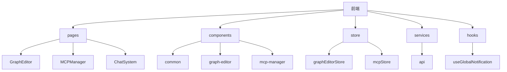
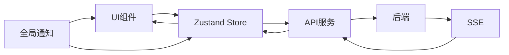
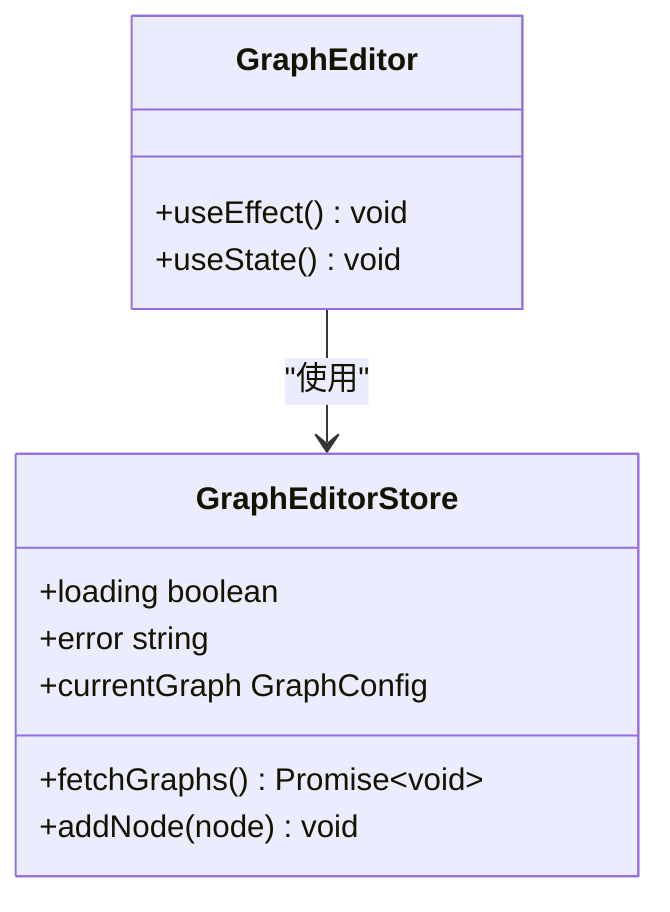
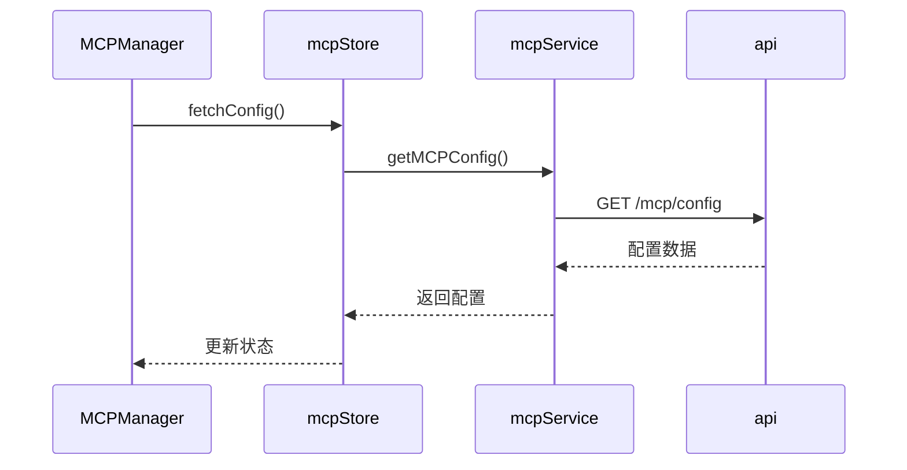
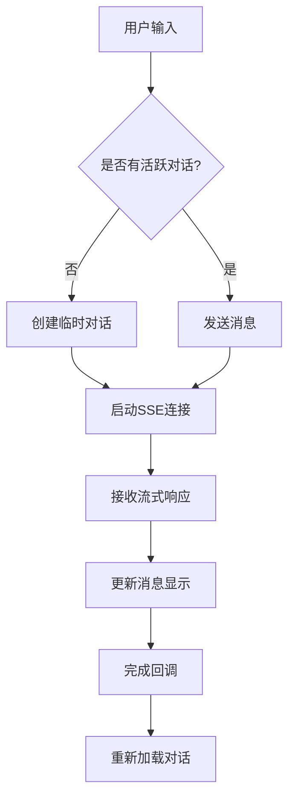
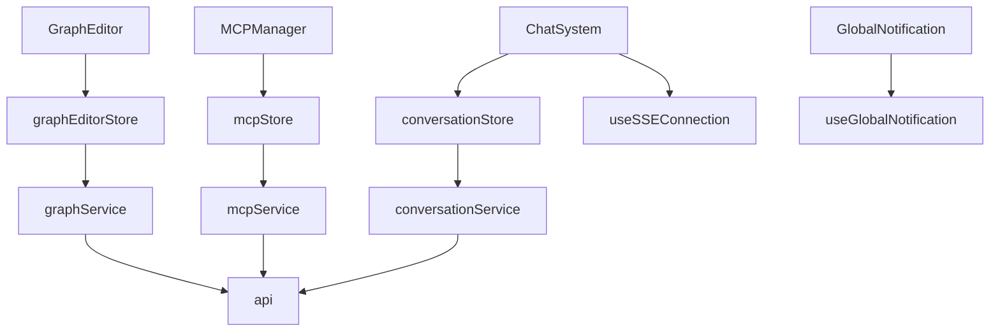

# 服务层使用模式与最佳实践

<cite>
**本文档引用文件**   
- [GraphEditor.tsx](file://frontend/src/pages/GraphEditor.tsx)
- [MCPManager.tsx](file://frontend/src/pages/MCPManager.tsx)
- [ChatSystem.tsx](file://frontend/src/pages/ChatSystem.tsx)
- [useGlobalNotification.ts](file://frontend/src/hooks/useGlobalNotification.ts)
- [api.ts](file://frontend/src/services/api.ts)
- [graphEditorStore.ts](file://frontend/src/store/graphEditorStore.ts)
- [mcpStore.ts](file://frontend/src/store/mcpStore.ts)
</cite>

## 目录
1. [引言](#引言)
2. [项目结构](#项目结构)
3. [核心组件](#核心组件)
4. [架构概述](#架构概述)
5. [详细组件分析](#详细组件分析)
6. [依赖分析](#依赖分析)
7. [性能考虑](#性能考虑)
8. [故障排除指南](#故障排除指南)
9. [结论](#结论)

## 引言
本文档旨在总结前端服务层在UI组件中的最佳使用模式与用户体验优化策略。通过`GraphEditor`、`MCPManager`和`ChatSystem`等页面的实际代码，展示如何在函数组件中安全地调用REST API和SSE服务，包括使用`useEffect`进行副作用管理、使用`useState`或Zustand store同步数据状态。详细说明加载状态（loading）、错误状态（error）和空状态（empty）的UI反馈实现。介绍如何利用`useGlobalNotification.ts`实现跨组件的全局通知（如操作成功、失败提示）。涵盖请求取消（AbortController）、防抖节流、避免内存泄漏等高级实践。提供调试建议，如使用浏览器开发者工具监控网络请求、利用Mock Service Worker进行前端独立测试。

## 项目结构
本项目采用典型的React前端架构，结合Ant Design组件库和Zustand状态管理。主要目录结构如下：
- `components/`：存放可复用的UI组件
- `hooks/`：自定义React Hooks
- `layouts/`：页面布局组件
- `pages/`：主要页面组件
- `services/`：API服务封装
- `store/`：Zustand状态管理
- `types/`：TypeScript类型定义

**Diagram sources**
- [GraphEditor.tsx](file://frontend/src/pages/GraphEditor.tsx)
- [MCPManager.tsx](file://frontend/src/pages/MCPManager.tsx)
- [ChatSystem.tsx](file://frontend/src/pages/ChatSystem.tsx)

**Section sources**
- [GraphEditor.tsx](file://frontend/src/pages/GraphEditor.tsx)
- [MCPManager.tsx](file://frontend/src/pages/MCPManager.tsx)
- [ChatSystem.tsx](file://frontend/src/pages/ChatSystem.tsx)

## 核心组件
核心组件包括`GraphEditor`、`MCPManager`和`ChatSystem`，分别用于图形化流程编辑、MCP服务器管理和对话系统。这些组件通过Zustand store进行状态管理，并使用自定义Hooks处理副作用和全局通知。

**Section sources**
- [GraphEditor.tsx](file://frontend/src/pages/GraphEditor.tsx)
- [MCPManager.tsx](file://frontend/src/pages/MCPManager.tsx)
- [ChatSystem.tsx](file://frontend/src/pages/ChatSystem.tsx)

## 架构概述
系统采用分层架构，前端通过REST API与后端通信，使用SSE进行实时数据流传输。状态管理采用Zustand，UI组件使用Ant Design。全局通知系统通过`useGlobalNotification`实现跨组件通信。

**Diagram sources**
- [api.ts](file://frontend/src/services/api.ts)
- [useGlobalNotification.ts](file://frontend/src/hooks/useGlobalNotification.ts)

## 详细组件分析

### GraphEditor分析
`GraphEditor`组件用于图形化流程编辑，通过`useGraphEditorStore`管理状态，使用`useEffect`在组件挂载时获取图配置和MCP状态。

#### 状态管理

**Diagram sources**
- [GraphEditor.tsx](file://frontend/src/pages/GraphEditor.tsx)
- [graphEditorStore.ts](file://frontend/src/store/graphEditorStore.ts)

### MCPManager分析
`MCPManager`组件用于管理MCP服务器，通过`useMCPStore`获取配置和状态，支持添加、编辑、删除和连接服务器。

#### 服务调用流程

**Diagram sources**
- [MCPManager.tsx](file://frontend/src/pages/MCPManager.tsx)
- [mcpStore.ts](file://frontend/src/store/mcpStore.ts)
- [api.ts](file://frontend/src/services/api.ts)

### ChatSystem分析
`ChatSystem`组件实现对话功能，使用SSE进行实时消息传输，通过`useSSEConnection`管理连接状态。

#### 对话流程

**Diagram sources**
- [ChatSystem.tsx](file://frontend/src/pages/ChatSystem.tsx)
- [useSSEConnection.ts](file://frontend/src/hooks/useSSEConnection.ts)

## 依赖分析
项目依赖关系清晰，UI组件依赖store，store依赖services，services依赖axios封装的api实例。全局通知系统独立于其他组件，可通过useGlobalNotification在任何组件中使用。

**Diagram sources**
- [graphEditorStore.ts](file://frontend/src/store/graphEditorStore.ts)
- [mcpStore.ts](file://frontend/src/store/mcpStore.ts)
- [api.ts](file://frontend/src/services/api.ts)

## 性能考虑
- 使用`useCallback`优化函数引用，避免不必要的重新渲染
- 通过`loading`状态管理提供良好的用户反馈
- SSE连接在组件卸载时正确关闭，避免内存泄漏
- 全局通知系统使用轻量级状态管理，不影响主要业务逻辑

## 故障排除指南
- **网络请求失败**：检查`api.ts`中的`API_BASE_URL`配置
- **状态不更新**：确保store中的`set`函数正确调用
- **内存泄漏**：在`useEffect`的清理函数中关闭SSE连接和定时器
- **通知不显示**：检查`useGlobalNotification`的调用和`GlobalNotification`组件的渲染

**Section sources**
- [useGlobalNotification.ts](file://frontend/src/hooks/useGlobalNotification.ts)
- [ChatSystem.tsx](file://frontend/src/pages/ChatSystem.tsx)

## 结论
本文档详细分析了前端服务层的最佳实践，展示了如何在React函数组件中安全有效地管理API调用和状态同步。通过Zustand、自定义Hooks和合理的架构设计，实现了可维护、可扩展的前端代码。建议在新组件开发中遵循相同的模式，确保代码质量和用户体验的一致性。