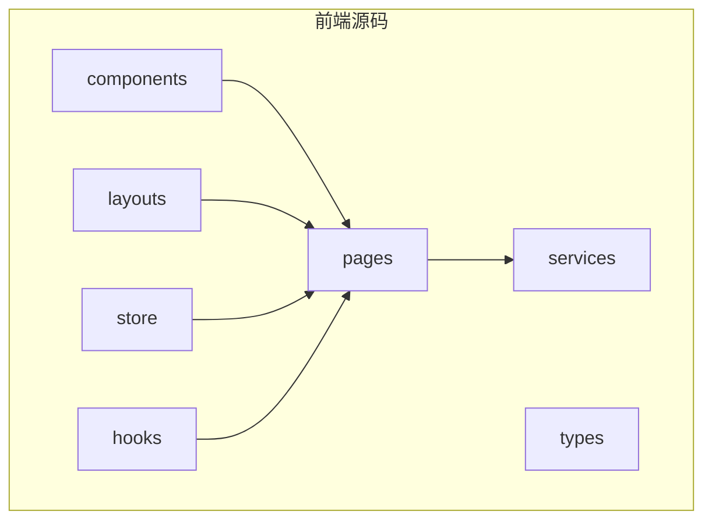
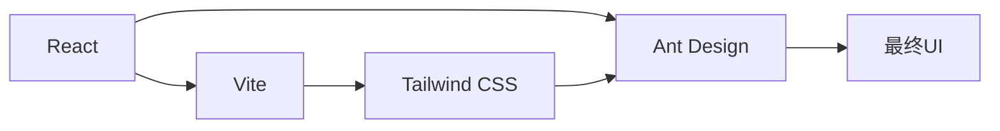
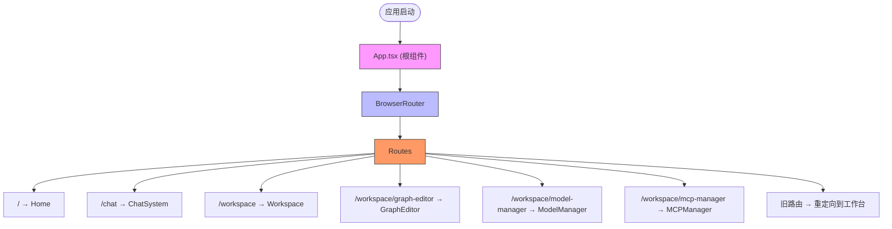
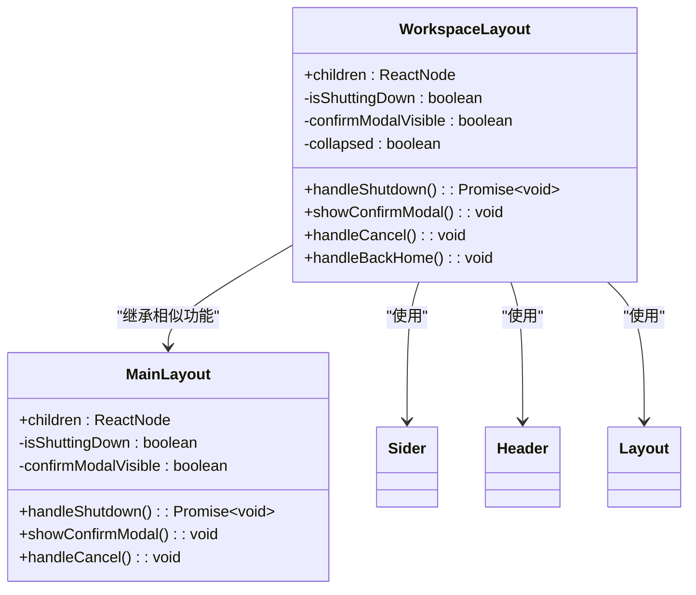
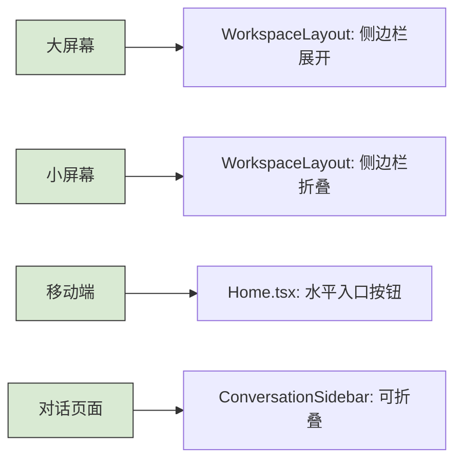

# 前端架构概述

<cite>
**本文档引用的文件**
- [main.tsx](file://frontend/src/main.tsx)
- [App.tsx](file://frontend/src/App.tsx)
- [MainLayout.tsx](file://frontend/src/layouts/MainLayout.tsx)
- [WorkspaceLayout.tsx](file://frontend/src/layouts/WorkspaceLayout.tsx)
- [tailwind.config.js](file://frontend/tailwind.config.js)
- [chat-system.css](file://frontend/src/styles/chat-system.css)
- [ChatSystem.tsx](file://frontend/src/pages/ChatSystem.tsx)
- [Workspace.tsx](file://frontend/src/pages/Workspace.tsx)
- [Home.tsx](file://frontend/src/pages/Home.tsx)
- [GraphEditor.tsx](file://frontend/src/pages/GraphEditor.tsx)
</cite>

## 目录
1. [简介](#简介)
2. [项目结构](#项目结构)
3. [技术选型与优势](#技术选型与优势)
4. [应用入口与初始化](#应用入口与初始化)
5. [根组件与路由配置](#根组件与路由配置)
6. [全局布局机制](#全局布局机制)
7. [页面路由与工作区布局](#页面路由与工作区布局)
8. [样式与UI集成](#样式与ui集成)
9. [响应式设计实现](#响应式设计实现)
10. [结论](#结论)

## 简介
本项目是一个基于React + Vite构建的前端应用，旨在提供一个高效、轻量且易于上手的Agent开发框架。系统通过图形化界面支持复杂的AI工作流设计，集成了对话系统、图编辑器、模型管理和MCP（Model Control Protocol）管理等核心功能。前端架构设计注重可扩展性和维护性，采用模块化组件结构和现代化的CSS解决方案，为开发者提供了清晰的导航路径和良好的用户体验。

## 项目结构
项目采用典型的React应用结构，核心源码位于`frontend/src`目录下，按功能模块组织。主要包含`components`（通用组件）、`layouts`（布局组件）、`pages`（页面组件）、`services`（API服务）、`store`（状态管理）和`hooks`（自定义Hook）等目录。这种分层结构清晰地分离了关注点，便于团队协作和代码维护。

**Diagram sources**
- [App.tsx](file://frontend/src/App.tsx)

**Section sources**
- [App.tsx](file://frontend/src/App.tsx)

## 技术选型与优势
项目采用React作为核心UI库，结合Vite构建工具，实现了快速的开发服务器启动和高效的生产构建。Vite利用原生ES模块和现代浏览器特性，显著提升了开发体验。Ant Design作为UI组件库，提供了丰富且一致的交互组件，加速了界面开发。Tailwind CSS作为实用优先的CSS框架，与Ant Design完美集成，实现了高度定制化的样式设计，同时保持了代码的可维护性。

**Diagram sources**
- [tailwind.config.js](file://frontend/tailwind.config.js)
- [App.css](file://frontend/src/App.css)

**Section sources**
- [tailwind.config.js](file://frontend/tailwind.config.js)

## 应用入口与初始化
应用的入口文件是`main.tsx`，它使用React 18的`createRoot` API将根组件渲染到DOM中。入口文件导入全局样式`index.css`并渲染`App`组件。值得注意的是，`StrictMode`被注释掉，这是为了调试和解决潜在的重复渲染问题，体现了开发团队对性能和行为一致性的关注。

**Section sources**
- [main.tsx](file://frontend/src/main.tsx)

## 根组件与路由配置
`App.tsx`是应用的根组件，负责全局路由配置。它使用`react-router-dom`进行客户端路由管理，定义了从首页到各个功能页面的路由规则。路由配置清晰地划分了应用的不同区域，如对话系统、工作台及其子页面。通过`Navigate`组件实现了旧路由到新工作台路由的重定向，保证了URL的统一性和用户体验的连贯性。

**Diagram sources**
- [App.tsx](file://frontend/src/App.tsx)

**Section sources**
- [App.tsx](file://frontend/src/App.tsx)

## 全局布局机制
`MainLayout.tsx`提供了应用的全局布局，包含顶部导航菜单和内容区域。导航菜单使用Ant Design的`Menu`组件，集成了图形编辑器、模型管理和MCP管理的快捷入口，并包含一个醒目的“关闭系统”按钮，允许用户安全地终止后端服务。该布局通过`useLocation`钩子高亮当前活动的菜单项，增强了用户的导航体验。

**Section sources**
- [MainLayout.tsx](file://frontend/src/layouts/MainLayout.tsx)

## 页面路由与工作区布局
工作台（Workspace）是应用的核心功能区，通过`WorkspaceLayout.tsx`提供了一个更复杂的布局。它包含一个可折叠的侧边栏（`Sider`），侧边栏内嵌了工作台的子功能菜单和一个简洁的LOGO。主内容区包含一个头部，提供返回首页和关闭系统的操作。这种布局为工作台内的多个功能页面（如图编辑器、模型管理）提供了统一且专业的界面框架。

**Diagram sources**
- [WorkspaceLayout.tsx](file://frontend/src/layouts/WorkspaceLayout.tsx)
- [MainLayout.tsx](file://frontend/src/layouts/MainLayout.tsx)

**Section sources**
- [WorkspaceLayout.tsx](file://frontend/src/layouts/WorkspaceLayout.tsx)
- [Workspace.tsx](file://frontend/src/pages/Workspace.tsx)

## 样式与UI集成
项目成功集成了Tailwind CSS和Ant Design。`tailwind.config.js`配置文件指定了内容扫描路径，确保所有JSX/TSX文件中的Tailwind类名被正确处理。`chat-system.css`文件展示了如何利用CSS自定义属性（CSS Variables）定义主题，并结合Tailwind的实用类和自定义的“玻璃拟态”（glass-morphism）样式，创造出美观且现代的用户界面。例如，`.glass-card`类通过`backdrop-filter`实现了毛玻璃效果。

**Section sources**
- [tailwind.config.js](file://frontend/tailwind.config.js)
- [chat-system.css](file://frontend/src/styles/chat-system.css)

## 响应式设计实现
前端架构充分考虑了响应式设计。`WorkspaceLayout`中的侧边栏支持折叠（`collapsible`），通过`collapsed`状态和`MenuFoldOutlined`/`MenuUnfoldOutlined`图标实现，优化了在不同屏幕尺寸下的空间利用。`Home.tsx`中的入口按钮区域采用水平长条设计，确保在移动设备上也能清晰展示。此外，`ConversationSidebar`在折叠时宽度从320px变为60px，适应了紧凑的布局需求。

**Diagram sources**
- [WorkspaceLayout.tsx](file://frontend/src/layouts/WorkspaceLayout.tsx)
- [Home.tsx](file://frontend/src/pages/Home.tsx)
- [chat-system.css](file://frontend/src/styles/chat-system.css)

**Section sources**
- [WorkspaceLayout.tsx](file://frontend/src/layouts/WorkspaceLayout.tsx)
- [Home.tsx](file://frontend/src/pages/Home.tsx)
- [chat-system.css](file://frontend/src/styles/chat-system.css)

## 结论
该前端架构设计精良，通过React + Vite的技术栈实现了高性能和良好的开发体验。清晰的模块化结构、合理的路由配置和强大的布局系统，为复杂功能的实现奠定了坚实基础。Tailwind CSS与Ant Design的协同工作，既保证了开发效率，又实现了高度定制化的视觉效果。整体架构在可扩展性、维护性和用户体验之间取得了良好平衡，为初学者提供了直观的导航，同时也为高级开发者展示了现代前端工程的最佳实践。