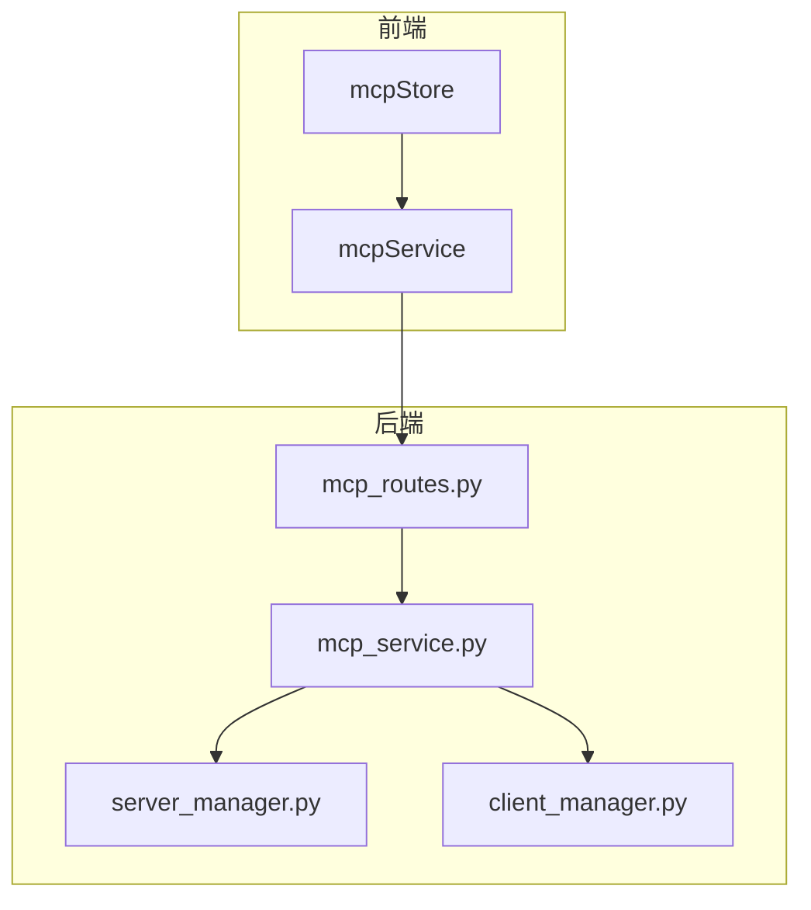
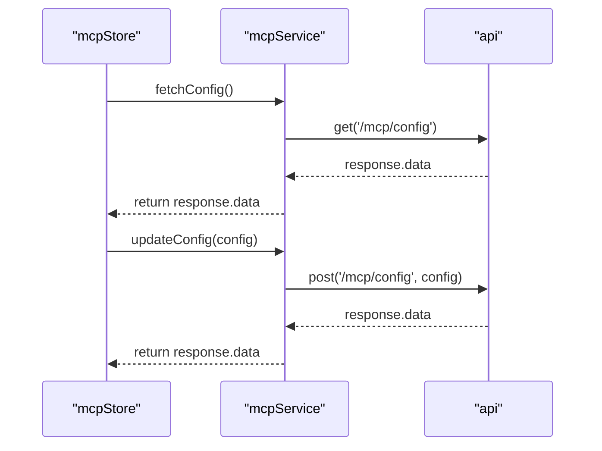
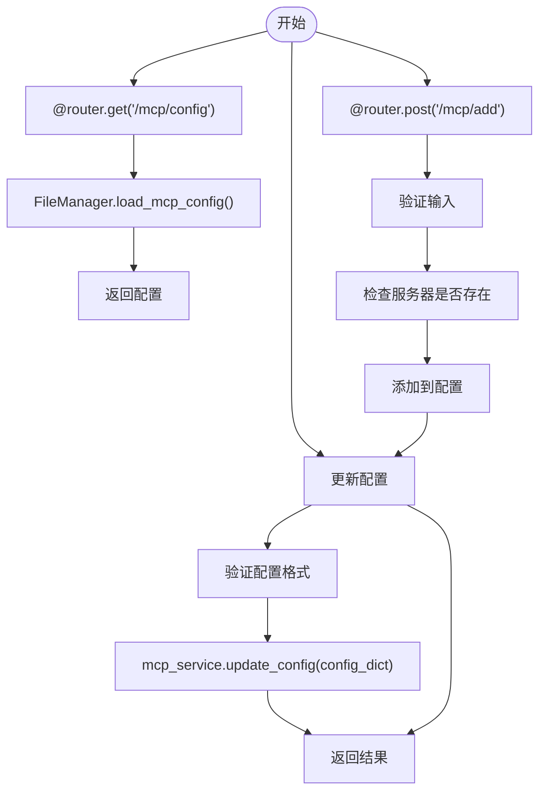
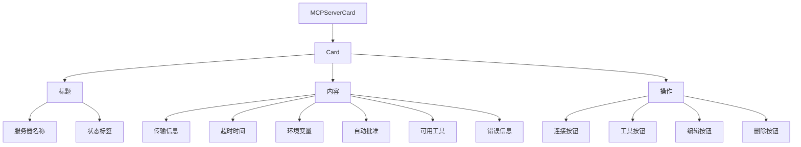
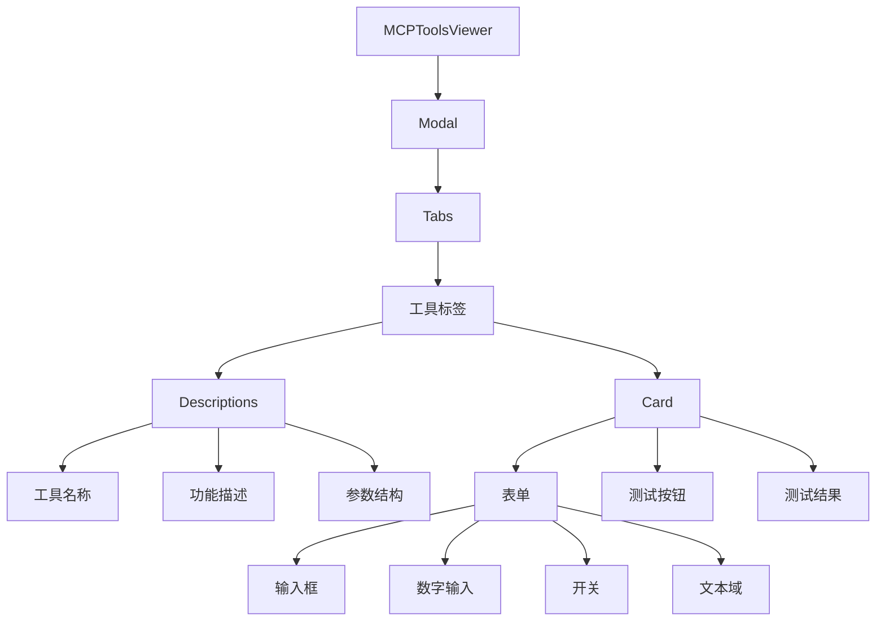
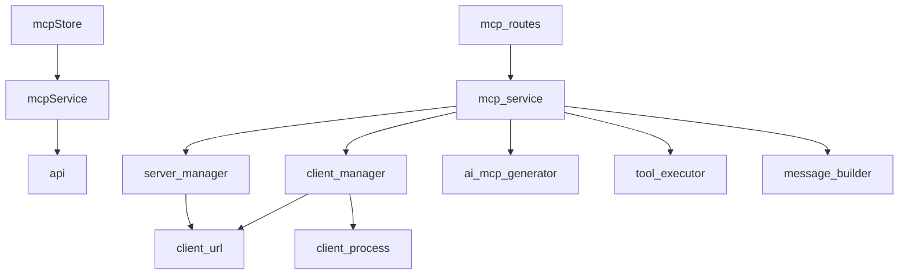

# MCP服务状态管理

<cite>
**本文档引用的文件**   
- [mcpStore.ts](file://frontend/src/store/mcpStore.ts)
- [mcpService.ts](file://frontend/src/services/mcpService.ts)
- [mcp_routes.py](file://mag/app/api/mcp_routes.py)
- [MCPServerCard.tsx](file://frontend/src/components/mcp-manager/MCPServerCard.tsx)
- [MCPToolsViewer.tsx](file://frontend/src/components/mcp-manager/MCPToolsViewer.tsx)
- [useSSEConnection.ts](file://frontend/src/hooks/useSSEConnection.ts)
- [mcp_service.py](file://mag/app/services/mcp_service.py)
- [server_manager.py](file://mag/app/services/mcp/server_manager.py)
- [client_manager.py](file://mag/app/services/mcp/client_manager.py)
- [file_manager.py](file://mag/app/core/file_manager.py)
</cite>

## 目录
1. [简介](#简介)
2. [项目结构](#项目结构)
3. [核心组件](#核心组件)
4. [架构概述](#架构概述)
5. [详细组件分析](#详细组件分析)
6. [依赖分析](#依赖分析)
7. [性能考虑](#性能考虑)
8. [故障排除指南](#故障排除指南)
9. [结论](#结论)

## 简介
本文档详细阐述了MCP服务状态管理的设计与实现，重点描述其对MCP服务器配置列表（MCPServerConfig）、连接状态（connected/disconnected）、工具元数据缓存（ToolMetadata）的管理逻辑。说明store如何响应MCPManager组件的操作（如添加、删除、测试连接）并维护服务器健康状态的实时更新。解释工具注册信息的持久化机制及其在图节点中的引用方式。分析store与后端mcp_routes.py的交互流程，包括SSE事件监听对状态的自动刷新。提供在MCPServerCard和MCPToolsViewer组件中使用该store的具体代码示例。讨论连接异常、认证失败等场景下的状态恢复策略。

## 项目结构
项目采用前后端分离架构，前端使用React + Zustand状态管理，后端使用FastAPI框架。前端store位于`frontend/src/store/mcpStore.ts`，负责管理MCP服务器的状态。后端API路由位于`mag/app/api/mcp_routes.py`，处理各种MCP相关的HTTP请求。MCP服务的核心逻辑在`mag/app/services/mcp_service.py`中实现，包括客户端管理、服务器管理和工具执行等功能。

**本节来源**
- [mcpStore.ts](file://frontend/src/store/mcpStore.ts)
- [mcp_routes.py](file://mag/app/api/mcp_routes.py)
- [mcp_service.py](file://mag/app/services/mcp_service.py)

## 核心组件
mcpStore是前端MCP状态管理的核心，使用Zustand创建了一个包含配置、状态、工具等信息的状态对象。它提供了fetchConfig、updateConfig、fetchStatus、connectServer、disconnectServer等方法来与后端API交互。mcpService封装了所有与后端API的通信逻辑，通过axios发送HTTP请求。后端的mcp_routes.py定义了所有MCP相关的API端点，如获取配置、更新配置、连接服务器等。

**本节来源**
- [mcpStore.ts](file://frontend/src/store/mcpStore.ts)
- [mcpService.ts](file://frontend/src/services/mcpService.ts)
- [mcp_routes.py](file://mag/app/api/mcp_routes.py)

## 架构概述
系统架构分为前端和后端两大部分。前端通过mcpStore管理MCP状态，使用mcpService与后端API通信。后端使用FastAPI框架，通过mcp_routes.py暴露API接口，由mcp_service.py协调各个子模块完成具体业务逻辑。整个系统通过HTTP/HTTPS协议进行通信，使用JSON格式交换数据。



**图表来源**
- [mcpStore.ts](file://frontend/src/store/mcpStore.ts)
- [mcpService.ts](file://frontend/src/services/mcpService.ts)
- [mcp_routes.py](file://mag/app/api/mcp_routes.py)
- [mcp_service.py](file://mag/app/services/mcp_service.py)
- [server_manager.py](file://mag/app/services/mcp/server_manager.py)
- [client_manager.py](file://mag/app/services/mcp/client_manager.py)

## 详细组件分析

### mcpStore分析
mcpStore是前端MCP状态管理的核心，使用Zustand创建了一个包含配置、状态、工具等信息的状态对象。它提供了fetchConfig、updateConfig、fetchStatus、connectServer、disconnectServer等方法来与后端API交互。

#### mcpStore类图
```mermaid
classDiagram
class MCPState {
+config : MCPConfig
+status : Record<string, any>
+tools : Record<string, any[]>
+loading : boolean
+error? : string
+fetchConfig() : Promise<void>
+updateConfig(config : MCPConfig) : Promise<void>
+fetchStatus() : Promise<void>
+connectServer(serverName : string) : Promise<void>
+disconnectServer(serverName : string) : Promise<void>
+fetchTools() : Promise<void>
+connectAllServers() : Promise<{ success : string[], failed : string[] }>
+addServer(serverName : string, serverConfig : MCPServerConfig) : Promise<void>
+updateServer(serverName : string, serverConfig : MCPServerConfig) : Promise<void>
+deleteServer(serverName : string) : Promise<void>
+registerMCPTool(toolData : any) : Promise<void>
+testTool(serverName : string, toolName : string, params : Record<string, any>) : Promise<any>
+getUsedPorts() : number[]
}
class useMCPStore {
+create~MCPState~
}
useMCPStore --> MCPState : "creates"
```

**图表来源**
- [mcpStore.ts](file://frontend/src/store/mcpStore.ts)

**本节来源**
- [mcpStore.ts](file://frontend/src/store/mcpStore.ts)

### mcpService分析
mcpService封装了所有与后端API的通信逻辑，通过axios发送HTTP请求。它提供了getMCPConfig、updateMCPConfig、addMCPServer、removeMCPServers等方法。

#### mcpService序列图


**图表来源**
- [mcpService.ts](file://frontend/src/services/mcpService.ts)

**本节来源**
- [mcpService.ts](file://frontend/src/services/mcpService.ts)

### mcp_routes.py分析
mcp_routes.py定义了所有MCP相关的API端点，如获取配置、更新配置、连接服务器等。它使用FastAPI框架，通过装饰器定义路由。

#### mcp_routes.py流程图


**图表来源**
- [mcp_routes.py](file://mag/app/api/mcp_routes.py)

**本节来源**
- [mcp_routes.py](file://mag/app/api/mcp_routes.py)

### MCPServerCard组件分析
MCPServerCard组件用于显示单个MCP服务器的信息，包括服务器名称、状态、连接按钮等。它使用Ant Design的Card组件构建UI。

#### MCPServerCard组件图


**图表来源**
- [MCPServerCard.tsx](file://frontend/src/components/mcp-manager/MCPServerCard.tsx)

**本节来源**
- [MCPServerCard.tsx](file://frontend/src/components/mcp-manager/MCPServerCard.tsx)

### MCPToolsViewer组件分析
MCPToolsViewer组件用于测试MCP工具，它显示工具的参数结构，并提供表单让用户输入参数进行测试。

#### MCPToolsViewer组件图


**图表来源**
- [MCPToolsViewer.tsx](file://frontend/src/components/mcp-manager/MCPToolsViewer.tsx)

**本节来源**
- [MCPToolsViewer.tsx](file://frontend/src/components/mcp-manager/MCPToolsViewer.tsx)

## 依赖分析
系统各组件之间存在明确的依赖关系。前端mcpStore依赖mcpService进行API调用，mcpService依赖axios进行HTTP通信。后端mcp_routes.py依赖mcp_service.py提供的服务，mcp_service.py又依赖server_manager.py和client_manager.py等子模块。整个系统的依赖关系清晰，便于维护和扩展。



**图表来源**
- [mcpStore.ts](file://frontend/src/store/mcpStore.ts)
- [mcpService.ts](file://frontend/src/services/mcpService.ts)
- [mcp_routes.py](file://mag/app/api/mcp_routes.py)
- [mcp_service.py](file://mag/app/services/mcp_service.py)
- [server_manager.py](file://mag/app/services/mcp/server_manager.py)
- [client_manager.py](file://mag/app/services/mcp/client_manager.py)

**本节来源**
- [mcpStore.ts](file://frontend/src/store/mcpStore.ts)
- [mcpService.ts](file://frontend/src/services/mcpService.ts)
- [mcp_routes.py](file://mag/app/api/mcp_routes.py)
- [mcp_service.py](file://mag/app/services/mcp_service.py)
- [server_manager.py](file://mag/app/services/mcp/server_manager.py)
- [client_manager.py](file://mag/app/services/mcp/client_manager.py)

## 性能考虑
系统在性能方面做了以下考虑：1) 使用Zustand进行状态管理，避免不必要的重新渲染；2) 后端使用异步IO，提高并发处理能力；3) 前后端通信使用JSON格式，减少数据传输量；4) 对频繁访问的数据进行缓存，减少数据库查询次数。这些措施保证了系统在高并发场景下的稳定性和响应速度。

## 故障排除指南
当遇到问题时，可以按照以下步骤进行排查：1) 检查前端控制台是否有错误信息；2) 检查后端日志文件；3) 验证API接口是否正常工作；4) 检查网络连接是否正常；5) 确认配置文件是否正确。对于连接异常、认证失败等问题，可以查看具体的错误信息，并根据错误类型采取相应的解决措施。

**本节来源**
- [mcpStore.ts](file://frontend/src/store/mcpStore.ts)
- [mcpService.ts](file://frontend/src/services/mcpService.ts)
- [mcp_routes.py](file://mag/app/api/mcp_routes.py)
- [mcp_service.py](file://mag/app/services/mcp_service.py)

## 结论
本文档详细阐述了MCP服务状态管理的设计与实现。通过分析mcpStore、mcpService、mcp_routes.py等核心组件，我们了解了系统的工作原理和架构设计。系统采用前后端分离架构，使用现代化的技术栈，具有良好的可维护性和扩展性。通过合理的状态管理和错误处理机制，保证了系统的稳定运行。未来可以进一步优化性能，增加更多的监控和告警功能，提高系统的可靠性和可用性。