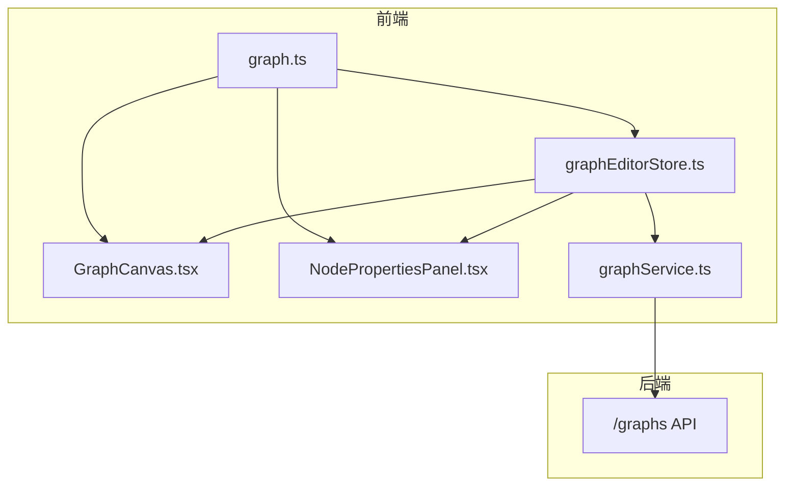
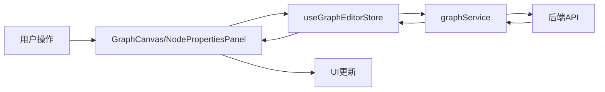
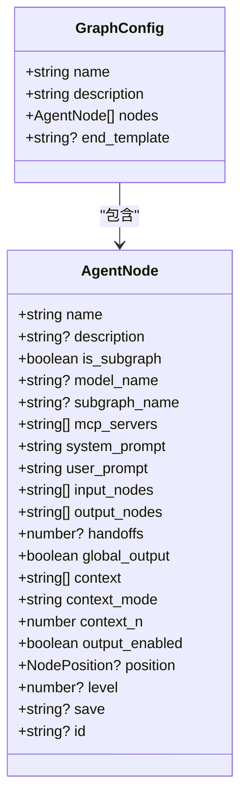
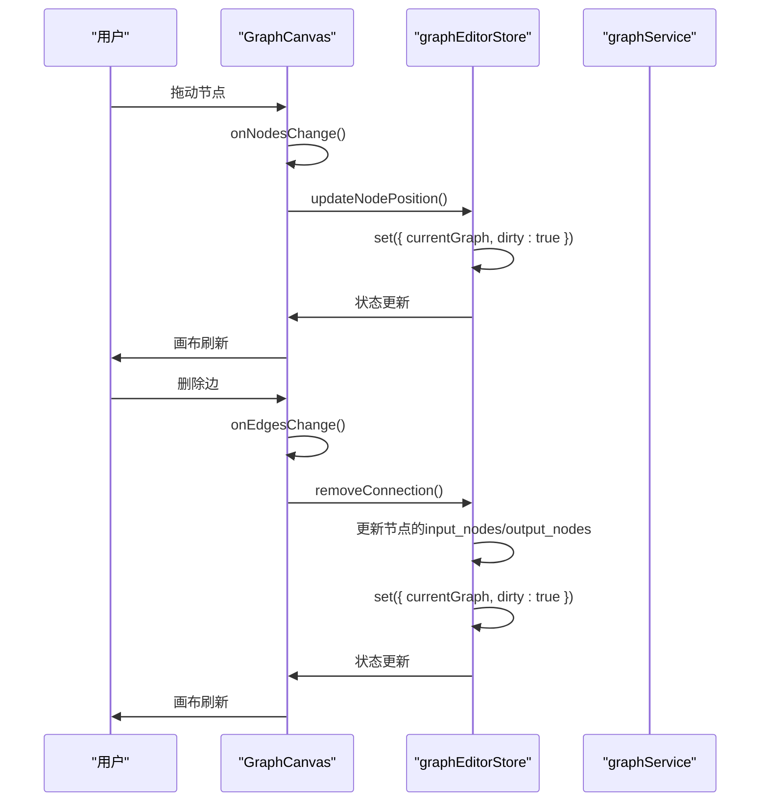

# 图编辑器状态管理

<cite>
**本文档引用文件**  
- [graphEditorStore.ts](file://frontend/src/store/graphEditorStore.ts)
- [graph.ts](file://frontend/src/types/graph.ts)
- [GraphCanvas.tsx](file://frontend/src/components/graph-editor/GraphCanvas.tsx)
- [NodePropertiesPanel.tsx](file://frontend/src/components/graph-editor/NodePropertiesPanel.tsx)
- [graphService.ts](file://frontend/src/services/graphService.ts)
</cite>

## 目录
1. [引言](#引言)
2. [项目结构](#项目结构)
3. [核心组件](#核心组件)
4. [架构概述](#架构概述)
5. [详细组件分析](#详细组件分析)
6. [依赖分析](#依赖分析)
7. [性能考虑](#性能考虑)
8. [故障排除指南](#故障排除指南)
9. [结论](#结论)

## 引言
`graphEditorStore` 是图编辑器的核心状态管理模块，负责维护图结构、节点配置、边连接关系以及执行上下文的完整生命周期。该 store 基于 Zustand 实现，与 React Flow 库深度集成，确保画布状态的实时一致性。它不仅管理图的增删改查操作，还支持异步加载、本地暂存与持久化同步策略，并提供自动布局、导入导出等高级功能。

## 项目结构
图编辑器的状态管理主要集中在 `frontend/src/store` 目录下，由 `graphEditorStore.ts` 文件实现。该 store 与 `frontend/src/components/graph-editor` 中的 UI 组件（如 `GraphCanvas` 和 `NodePropertiesPanel`）紧密协作，通过类型定义 `frontend/src/types/graph.ts` 确保数据结构的一致性，并通过 `frontend/src/services/graphService.ts` 与后端 API 进行通信。

**图来源**  
- [graphEditorStore.ts](file://frontend/src/store/graphEditorStore.ts)
- [GraphCanvas.tsx](file://frontend/src/components/graph-editor/GraphCanvas.tsx)
- [NodePropertiesPanel.tsx](file://frontend/src/components/graph-editor/NodePropertiesPanel.tsx)
- [graphService.ts](file://frontend/src/services/graphService.ts)

**节来源**  
- [graphEditorStore.ts](file://frontend/src/store/graphEditorStore.ts)
- [graph.ts](file://frontend/src/types/graph.ts)

## 核心组件
`graphEditorStore` 的核心是 `useGraphEditorStore`，它定义了图编辑器的完整状态和操作接口。状态包括当前图 (`currentGraph`)、原始图 (`originalGraph`)、图列表 (`graphs`)、加载状态 (`loading`)、错误信息 (`error`)、选中节点 (`selectedNode`) 和脏状态 (`dirty`)。操作接口涵盖了图列表管理、图属性更新、节点操作、连接管理以及导入导出等功能。

**节来源**  
- [graphEditorStore.ts](file://frontend/src/store/graphEditorStore.ts#L1-L707)

## 架构概述
`graphEditorStore` 采用分层架构，上层是 UI 组件，中层是状态管理 store，下层是服务层。UI 组件通过 `useGraphEditorStore` 选择器订阅 store 状态，store 内部通过 `set` 和 `get` 方法管理状态变更，并调用 `graphService` 进行持久化操作。数据流是单向的，从用户操作到状态更新，再到服务调用和后端同步。

**图来源**  
- [graphEditorStore.ts](file://frontend/src/store/graphEditorStore.ts)
- [GraphCanvas.tsx](file://frontend/src/components/graph-editor/GraphCanvas.tsx)
- [NodePropertiesPanel.tsx](file://frontend/src/components/graph-editor/NodePropertiesPanel.tsx)
- [graphService.ts](file://frontend/src/services/graphService.ts)

## 详细组件分析

### 图结构与节点配置管理
`graphEditorStore` 使用 `GraphConfig` 接口定义图的结构，包含名称、描述、节点列表和结束模板。每个节点由 `AgentNode` 接口定义，包含丰富的配置属性，如模型名称、MCP 服务器、提示词、输入输出节点、执行层级、循环次数等。store 通过 `addNode`、`updateNode` 和 `removeNode` 方法管理节点的增删改。

**图来源**  
- [graph.ts](file://frontend/src/types/graph.ts#L6-L27)
- [graphEditorStore.ts](file://frontend/src/store/graphEditorStore.ts#L6-L11)

### 边连接关系与执行上下文
边连接关系通过节点的 `input_nodes` 和 `output_nodes` 属性间接管理。`addConnection` 和 `removeConnection` 方法更新这些列表，从而建立或断开节点间的连接。执行上下文由 `context`、`context_mode` 和 `context_n` 字段管理，用于引用其他节点的输出。`global_output` 标志决定节点输出是否被全局管理。

**节来源**  
- [graphEditorStore.ts](file://frontend/src/store/graphEditorStore.ts#L40-L707)
- [graph.ts](file://frontend/src/types/graph.ts#L6-L27)

### 与React Flow的协同工作
`GraphCanvas` 组件将 `graphEditorStore` 中的 `currentGraph` 转换为 React Flow 所需的 `nodes` 和 `edges` 数组。当用户在画布上拖动节点时，`onNodesChange` 回调触发 `updateNodePosition`，反之亦然。删除边的操作会触发 `removeConnection`，确保状态同步。store 的 `dirty` 标志用于指示图是否已修改，提示用户保存。

**图来源**  
- [Graph