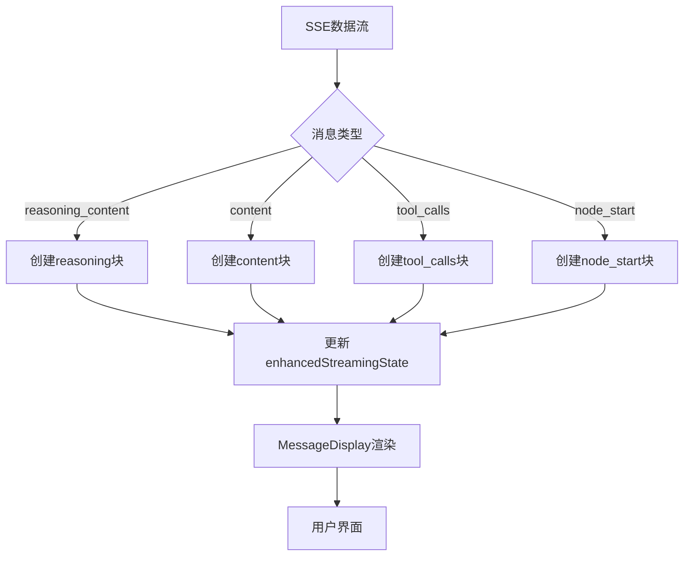
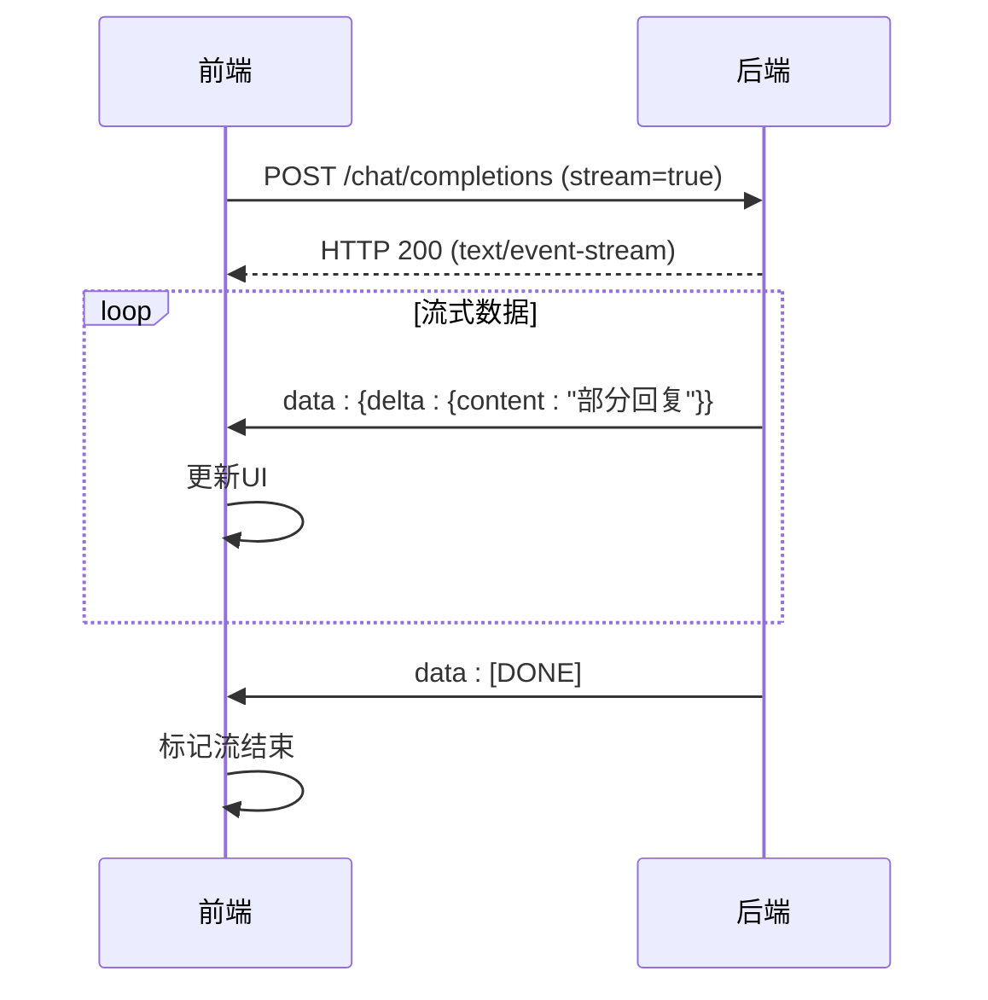
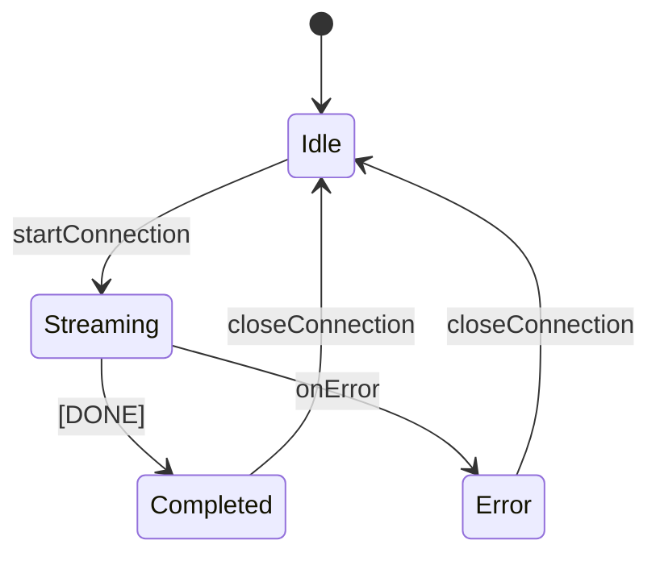
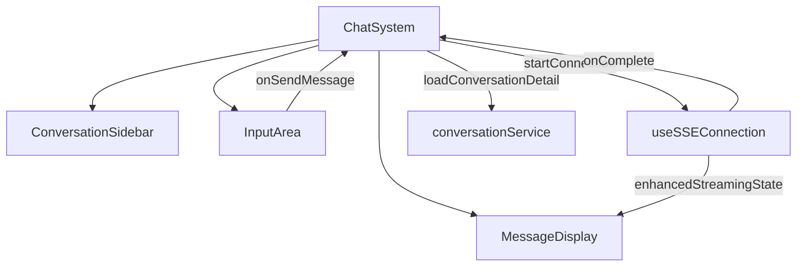

# 对话状态管理

<cite>
**本文档引用文件**  
- [conversationStore.ts](file://frontend/src/store/conversationStore.ts)
- [conversation.ts](file://frontend/src/types/conversation.ts)
- [conversationService.ts](file://frontend/src/services/conversationService.ts)
- [useSSEConnection.ts](file://frontend/src/hooks/useSSEConnection.ts)
- [MessageDisplay.tsx](file://frontend/src/components/chat/MessageDisplay.tsx)
- [InputArea.tsx](file://frontend/src/components/chat/InputArea.tsx)
- [ChatSystem.tsx](file://frontend/src/pages/ChatSystem.tsx)
- [chat_routes.py](file://mag/app/api/chat_routes.py)
- [chat_service.py](file://mag/app/services/chat_service.py)
- [conversation_manager.py](file://mag/app/services/docdb/conversation_manager.py)
</cite>

## 目录
1. [引言](#引言)
2. [会话生命周期管理](#会话生命周期管理)
3. [消息流式更新机制](#消息流式更新机制)
4. [SSE集成与实时推送](#sse集成与实时推送)
5. [消息状态流转与UI体现](#消息状态流转与ui体现)
6. [组件集成示例](#组件集成示例)
7. [常见问题调试](#常见问题调试)
8. [结论](#结论)

## 引言
本系统通过`conversationStore`实现对话状态的集中管理，支持Chat、Agent和Graph三种模式。store采用Zustand状态管理库，结合SSE（Server-Sent Events）技术实现后端实时消息推送。系统实现了对话的创建、切换、消息追加、流式更新、自动保存与清理等完整生命周期管理。前端通过`useSSEConnection`钩子处理SSE连接，将流式数据解析为结构化消息块，确保UI的高效响应。消息状态（pending, completed, error）在`MessageDisplay`组件中得到充分体现，与`InputArea`和`ChatSystem`组件无缝集成，形成完整的消息发送与接收流程。

## 会话生命周期管理

`conversationStore`通过`useConversationStore`管理会话的完整生命周期。会话的创建通过`startConnection`触发，系统生成MongoDB格式的ID作为`conversationId`。会话切换通过`handleConversationSelect`实现，会清除当前SSE连接并加载新会话详情。会话的临时存储通过`updateCurrentConversationTemporarily`实现，将对话数据暂存于`sessionStorage`。自动保存通过SSE流结束时的`onComplete`回调触发，调用`loadConversationDetail`重新加载最新数据。清理策略包括软删除（`updateConversationStatus`）和永久删除（`deleteConversationPermanent`），前者更新状态为"deleted"，后者从数据库移除记录。会话列表的缓存策略通过`ConversationStorage`实现，采用5分钟的缓存有效期，平衡性能与数据新鲜度。

**Section sources**
- [conversationStore.ts](file://frontend/src/store/conversationStore.ts#L1-L364)
- [conversationService.ts](file://frontend/src/services/conversationService.ts#L1-L254)
- [ChatSystem.tsx](file://frontend/src/pages/ChatSystem.tsx#L1-L598)

## 消息流式更新机制

系统采用分块渲染机制处理流式消息更新。`useSSEConnection`钩子中的`processSSEData`函数解析SSE数据流，根据消息类型创建不同类型的`StreamingBlock`：`reasoning`（推理内容）、`content`（普通内容）、`tool_calls`（工具调用）和`node_start`（节点开始）。每个块拥有独立的`isComplete`状态，支持并行渲染。当收到`[DONE]`信号时，所有未完成的块被标记为完成。`MessageDisplay`组件通过`StreamingBlockDisplay`渲染这些块，`SmartMarkdown`组件处理流式内容的增量渲染。这种机制避免了消息顺序错乱，确保用户看到的消息顺序与接收顺序一致。工具调用结果通过`toolResults`映射存储，与工具调用块关联显示。

**Diagram sources**
- [useSSEConnection.ts](file://frontend/src/hooks/useSSEConnection.ts#L1-L522)
- [MessageDisplay.tsx](file://frontend/src/components/chat/MessageDisplay.tsx#L1-L799)

**Section sources**
- [useSSEConnection.ts](file://frontend/src/hooks/useSSEConnection.ts#L1-L522)
- [MessageDisplay.tsx](file://frontend/src/components/chat/MessageDisplay.tsx#L1-L799)
- [conversation.ts](file://frontend/src/types/conversation.ts#L1-L174)

## SSE集成与实时推送

系统通过`conversationService`与后端SSE接口集成。`createChatSSE`、`createAgentSSE`等方法创建`ReadableStreamDefaultReader`，建立与后端的SSE连接。`useSSEConnection`的`startConnection`函数根据`mode`参数选择对应的SSE连接，通过`fetch` API发起POST请求，设置`Accept: text/event-stream`头。`processSSEData`函数处理流式数据，支持`[DONE]`结束信号和JSON格式的SSE消息。连接管理通过`AbortController`实现，`closeConnection`可主动关闭连接。后端`chat_routes.py`的`chat_completions`接口返回`StreamingResponse`，`chat_service.py`的`chat_completions_stream`生成器逐块发送数据。`SSEHelper`确保消息格式正确，`TrajectoryCollector`支持非流式响应的完整结果收集。

**Diagram sources**
- [conversationService.ts](file://frontend/src/services/conversationService.ts#L1-L254)
- [useSSEConnection.ts](file://frontend/src/hooks/useSSEConnection.ts#L1-L522)
- [chat_routes.py](file://mag/app/api/chat_routes.py#L1-L449)
- [chat_service.py](file://mag/app/services/chat_service.py#L1-L446)

**Section sources**
- [conversationService.ts](file://frontend/src/services/conversationService.ts#L1-L254)
- [useSSEConnection.ts](file://frontend/src/hooks/useSSEConnection.ts#L1-L522)
- [chat_routes.py](file://mag/app/api/chat_routes.py#L1-L449)
- [chat_service.py](file://mag/app/services/chat_service.py#L1-L446)

## 消息状态流转与UI体现

消息状态通过`enhancedStreamingState`管理，包含`isStreaming`、`error`和`blocks`。`blocks`数组中的每个`StreamingBlock`有`isComplete`状态，`nodeInfo`表示节点执行状态。`MessageDisplay`组件根据状态渲染不同UI：`reasoning`内容可折叠显示，`tool_calls`显示参数和结果，`NodeExecutionInfo`显示节点执行状态（running, completed, pending）。错误状态通过`showNotification`显示Ant Design的`message`组件。`InputArea`的发送按钮根据`streamingState.isStreaming`禁用。`ChatSystem`的`handleSendMessage`在错误时清除待发送消息。状态流转：pending（开始连接）→ streaming（接收数据）→ completed（[DONE]信号）或 error（连接失败）。

**Diagram sources**
- [useSSEConnection.ts](file://frontend/src/hooks/useSSEConnection.ts#L1-L522)
- [MessageDisplay.tsx](file://frontend/src/components/chat/MessageDisplay.tsx#L1-L799)

**Section sources**
- [useSSEConnection.ts](file://frontend/src/hooks/useSSEConnection.ts#L1-L522)
- [MessageDisplay.tsx](file://frontend/src/components/chat/MessageDisplay.tsx#L1-L799)
- [conversationStore.ts](file://frontend/src/store/conversationStore.ts#L1-L364)

## 组件集成示例

`ChatSystem`作为主组件，集成`ConversationSidebar`、`MessageDisplay`和`InputArea`。`InputArea`的`onSendMessage`回调触发`handleSendMessage`，调用`startConnection`发起SSE请求。`MessageDisplay`接收`conversation`和`enhancedStreamingState`，渲染消息和流式块。`useSSEConnection`的`onComplete`回调重新加载对话详情，确保消息不丢失。`silentUpdateConversations`静默更新对话列表，保持UI流畅。`InputArea`的`inheritedConfig`传递模型、图等配置。`ChatSystem`的`handleStartConversation`处理新建对话，创建临时对话数据。`MessageDisplay`的`renderingMode`根据`currentMode`确定渲染方式，Agent模式使用`AgentXMLRenderer`。

**Diagram sources**
- [ChatSystem.tsx](file://frontend/src/pages/ChatSystem.tsx#L1-L598)
- [InputArea.tsx](file://frontend/src/components/chat/InputArea.tsx#L1-L436)
- [MessageDisplay.tsx](file://frontend/src/components/chat/MessageDisplay.tsx#L1-L799)

**Section sources**
- [ChatSystem.tsx](file://frontend/src/pages/ChatSystem.tsx#L1-L598)
- [InputArea.tsx](file://frontend/src/components/chat/InputArea.tsx#L1-L436)
- [MessageDisplay.tsx](file://frontend/src/components/chat/MessageDisplay.tsx#L1-L799)

## 常见问题调试

消息顺序错乱通常因块状态管理不当。确保`processSSEData`中`reasoning`和`content`块可并行存在，不强制完成。重复渲染可能因`MessageDisplay`的`key`属性不当，应使用`conversation?.conversation_id`。SSE连接失败检查`fetch`请求的`Accept`头和CORS配置。流式消息解析错误需验证SSE数据格式，确保`data: `前缀和JSON有效性。工具调用结果不显示检查`toolResults`映射构建，确保`tool_call_id`匹配。对话状态不同步检查`onComplete`回调是否重新加载对话详情。性能问题可通过`silentUpdateConversations`的平滑更新优化，避免列表闪烁。

**Section sources**
- [useSSEConnection.ts](file://frontend/src/hooks/useSSEConnection.ts#L1-L522)
- [MessageDisplay.tsx](file://frontend/src/components/chat/MessageDisplay.tsx#L1-L799)
- [ChatSystem.tsx](file://frontend/src/pages/ChatSystem.tsx#L1-L598)

## 结论

`conversationStore`通过Zustand实现了高效的状态管理，结合SSE技术实现了实时消息推送。分块渲染机制确保了UI的高效响应，避免了消息顺序错乱。会话生命周期管理完整，支持创建、切换、保存与清理。与`MessageDisplay`和`InputArea`的集成流畅，形成了完整的对话系统。通过`useSSEConnection`的抽象，简化了SSE连接的复杂性。系统设计考虑了性能优化，如对话列表缓存和静默更新。未来可增强错误恢复机制，支持断线重连。