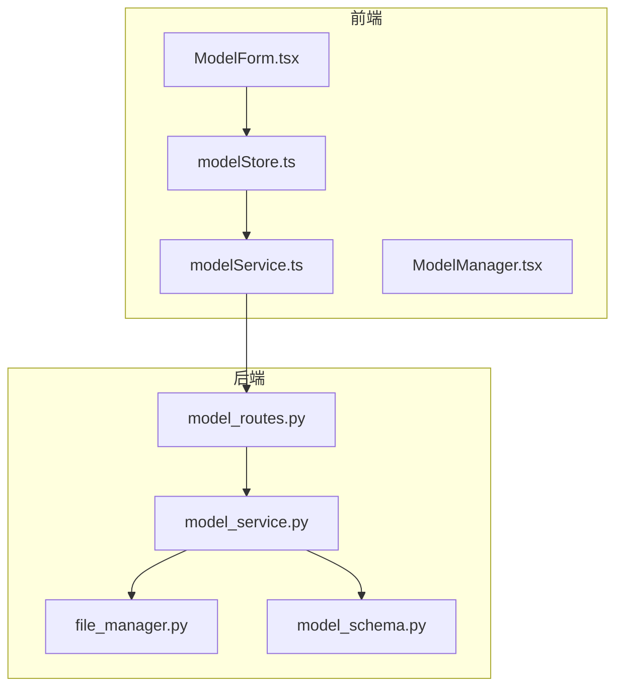
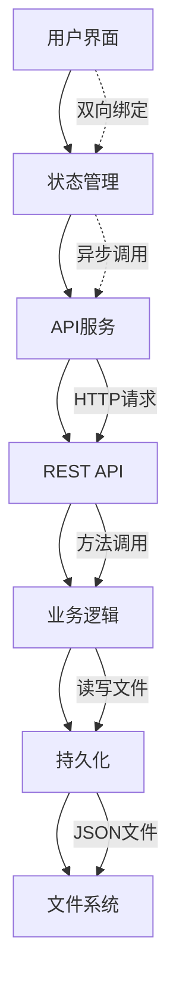
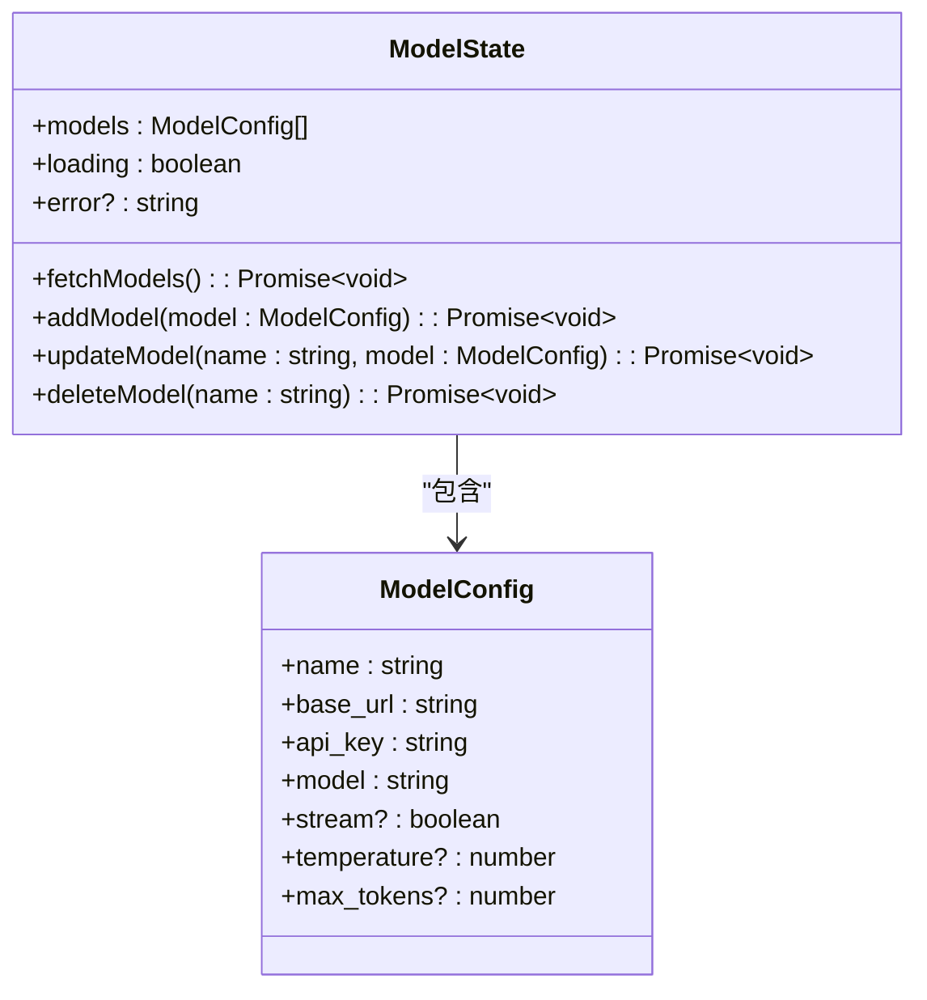
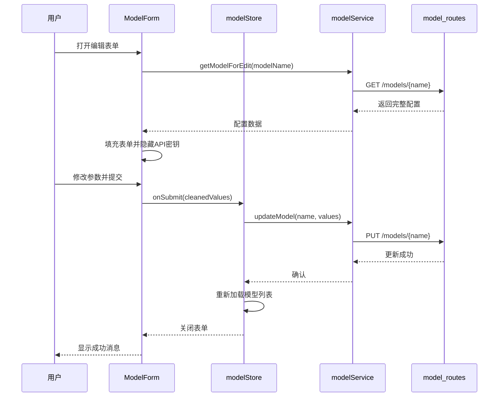
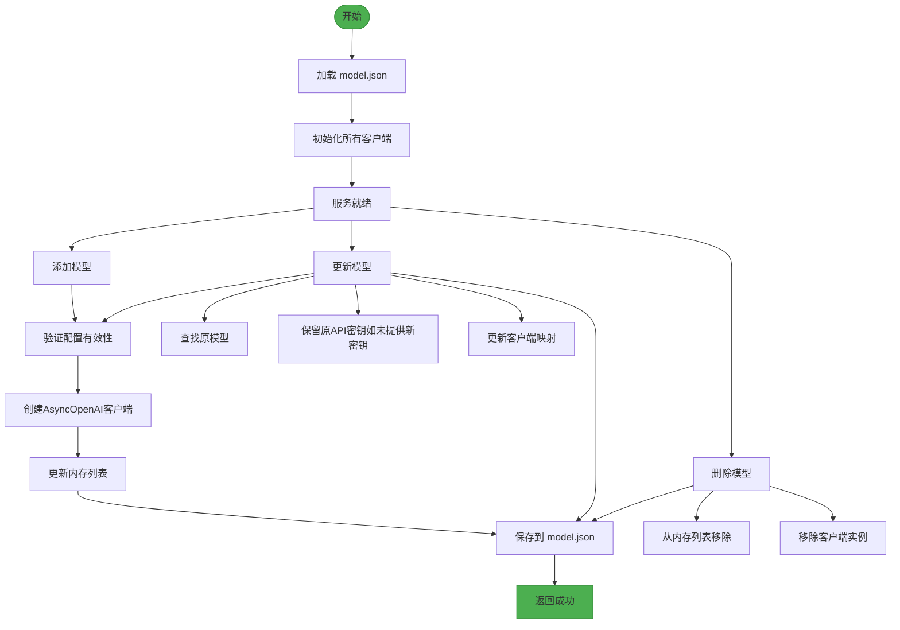
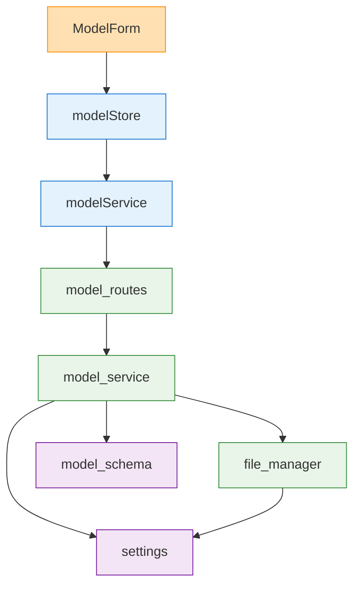

# 模型配置状态管理

<cite>
**本文档引用的文件**
- [modelStore.ts](file://frontend/src/store/modelStore.ts)
- [modelService.ts](file://frontend/src/services/modelService.ts)
- [model.ts](file://frontend/src/types/model.ts)
- [ModelForm.tsx](file://frontend/src/components/model-manager/ModelForm.tsx)
- [model_routes.py](file://mag/app/api/model_routes.py)
- [model_service.py](file://mag/app/services/model_service.py)
- [file_manager.py](file://mag/app/core/file_manager.py)
- [config.py](file://mag/app/core/config.py)
- [model_schema.py](file://mag/app/models/model_schema.py)
- [ModelManager.tsx](file://frontend/src/pages/ModelManager.tsx)
</cite>

## 目录
1. [简介](#简介)
2. [项目结构](#项目结构)
3. [核心组件](#核心组件)
4. [架构概述](#架构概述)
5. [详细组件分析](#详细组件分析)
6. [依赖分析](#依赖分析)
7. [性能考虑](#性能考虑)
8. [故障排除指南](#故障排除指南)
9. [结论](#结论)

## 简介
本文档深入讲解 `modelStore` 的实现细节，重点描述其对 AI 模型配置（ModelConfig）的全局缓存与管理机制。说明 store 如何加载、存储和更新模型参数（如模型名称、API 密钥、基础 URL、温度系数等），并支持在图节点和对话系统中跨组件共享。阐述与 ModelForm 组件的双向数据绑定流程，以及表单验证状态的管理。解释模型列表的异步加载与刷新逻辑，及其与后端 model_routes.py 的交互。提供在不同场景下（如图执行、对话生成）动态选择模型的使用模式。讨论敏感信息（如 API 密钥）的安全存储建议与最佳实践。

## 项目结构
本项目采用前后端分离架构，前端使用 React + Zustand 状态管理，后端基于 FastAPI 框架。模型配置管理功能主要分布在以下目录：

- `frontend/src/store/modelStore.ts`：前端全局模型状态管理
- `frontend/src/services/modelService.ts`：前端 API 调用服务
- `frontend/src/components/model-manager/ModelForm.tsx`：模型配置表单组件
- `mag/app/api/model_routes.py`：后端 RESTful API 接口
- `mag/app/services/model_service.py`：后端模型服务核心逻辑
- `mag/app/core/file_manager.py`：模型配置的持久化文件管理
- `mag/app/models/model_schema.py`：模型配置的数据结构定义

**图源**
- [modelStore.ts](file://frontend/src/store/modelStore.ts)
- [modelService.ts](file://frontend/src/services/modelService.ts)
- [model_routes.py](file://mag/app/api/model_routes.py)
- [model_service.py](file://mag/app/services/model_service.py)

**节源**
- [modelStore.ts](file://frontend/src/store/modelStore.ts)
- [modelService.ts](file://frontend/src/services/modelService.ts)
- [model_routes.py](file://mag/app/api/model_routes.py)

## 核心组件
`modelStore` 是基于 Zustand 实现的全局状态管理模块，负责维护所有模型配置的状态。它通过异步操作与后端 API 交互，实现模型的增删改查（CRUD）功能，并将结果缓存在内存中供其他组件使用。

`ModelForm` 组件提供用户友好的界面用于创建和编辑模型配置，支持必填和可选参数的完整设置。表单实现了智能清理逻辑，仅提交用户实际输入的值，避免覆盖后端默认值。

后端 `ModelService` 类封装了模型管理的核心业务逻辑，包括配置验证、客户端初始化、持久化存储等。它与 `FileManager` 协作，将模型配置以 JSON 格式安全地存储在本地文件系统中。

**节源**
- [modelStore.ts](file://frontend/src/store/modelStore.ts)
- [ModelForm.tsx](file://frontend/src/components/model-manager/ModelForm.tsx)
- [model_service.py](file://mag/app/services/model_service.py)

## 架构概述
系统采用典型的分层架构，从前端 UI 到后端服务再到持久化层，职责清晰分离。

**图源**
- [modelStore.ts](file://frontend/src/store/modelStore.ts)
- [modelService.ts](file://frontend/src/services/modelService.ts)
- [model_routes.py](file://mag/app/api/model_routes.py)
- [model_service.py](file://mag/app/services/model_service.py)
- [file_manager.py](file://mag/app/core/file_manager.py)

## 详细组件分析

### 前端状态管理分析
`useModelStore` 使用 Zustand 创建一个包含模型列表、加载状态和错误信息的状态容器。所有 CRUD 操作都封装为异步 action，执行时会自动更新 loading 状态，并在成功后重新拉取最新模型列表以保证数据一致性。

**图源**
- [modelStore.ts](file://frontend/src/store/modelStore.ts)
- [model.ts](file://frontend/src/types/model.ts)

**节源**
- [modelStore.ts](file://frontend/src/store/modelStore.ts)

### 表单交互流程分析
`ModelForm` 组件与 `modelStore` 通过 props 进行双向数据绑定。当用户打开编辑模式时，会先调用 `getModelForEdit` 接口获取完整配置（不含 API 密钥），然后填充到表单中。

**图源**
- [ModelForm.tsx](file://frontend/src/components/model-manager/ModelForm.tsx)
- [modelStore.ts](file://frontend/src/store/modelStore.ts)
- [modelService.ts](file://frontend/src/services/modelService.ts)
- [model_routes.py](file://mag/app/api/model_routes.py)

**节源**
- [ModelForm.tsx](file://frontend/src/components/model-manager/ModelForm.tsx)

### 后端服务逻辑分析
后端 `ModelService` 类负责处理所有模型相关的业务逻辑。它维护一个内存中的模型列表和对应的 OpenAI 客户端实例，确保高效访问。

**图源**
- [model_service.py](file://mag/app/services/model_service.py)
- [file_manager.py](file://mag/app/core/file_manager.py)

**节源**
- [model_service.py](file://mag/app/services/model_service.py)

## 依赖分析
系统各组件之间存在明确的依赖关系，从前端到后端形成清晰的调用链。

**图源**
- [modelStore.ts](file://frontend/src/store/modelStore.ts)
- [modelService.ts](file://frontend/src/services/modelService.ts)
- [model_routes.py](file://mag/app/api/model_routes.py)
- [model_service.py](file://mag/app/services/model_service.py)
- [file_manager.py](file://mag/app/core/file_manager.py)
- [config.py](file://mag/app/core/config.py)

**节源**
- [modelStore.ts](file://frontend/src/store/modelStore.ts)
- [modelService.ts](file://frontend/src/services/modelService.ts)
- [model_routes.py](file://mag/app/api/model_routes.py)
- [model_service.py](file://mag/app/services/model_service.py)

## 性能考虑
- **前端缓存**：`modelStore` 在内存中缓存所有模型配置，避免重复请求。
- **批量更新**：每次 CRUD 操作后都会重新获取完整列表，保证状态一致性。
- **客户端复用**：后端 `ModelService` 为每个模型维护一个持久化的 `AsyncOpenAI` 客户端实例，避免频繁创建销毁。
- **文件读写优化**：`FileManager` 使用原子操作保存配置，防止并发写入冲突。

## 故障排除指南
常见问题及解决方案：

- **模型列表无法加载**：检查后端服务是否正常运行，确认 `model.json` 文件路径和权限。
- **API 密钥更新失败**：确保密钥格式正确，检查网络连接和基础 URL 可达性。
- **表单提交无响应**：查看浏览器控制台是否有 JavaScript 错误，检查网络请求状态码。
- **配置未持久化**：确认 `MAG_DIR` 目录可写，检查 `file_manager.py` 的异常日志。

**节源**
- [modelStore.ts](file://frontend/src/store/modelStore.ts)
- [model_service.py](file://mag/app/services/model_service.py)
- [file_manager.py](file://mag/app/core/file_manager.py)

## 结论
`modelStore` 及其相关组件构成了一个完整、安全且高效的模型配置管理系统。通过前后端协同工作，实现了配置的全局共享、持久化存储和动态更新。系统设计充分考虑了用户体验、数据一致性和安全性，为 AI 应用提供了可靠的基础设施支持。