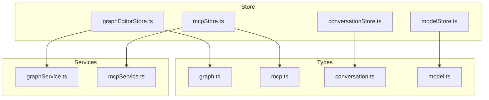
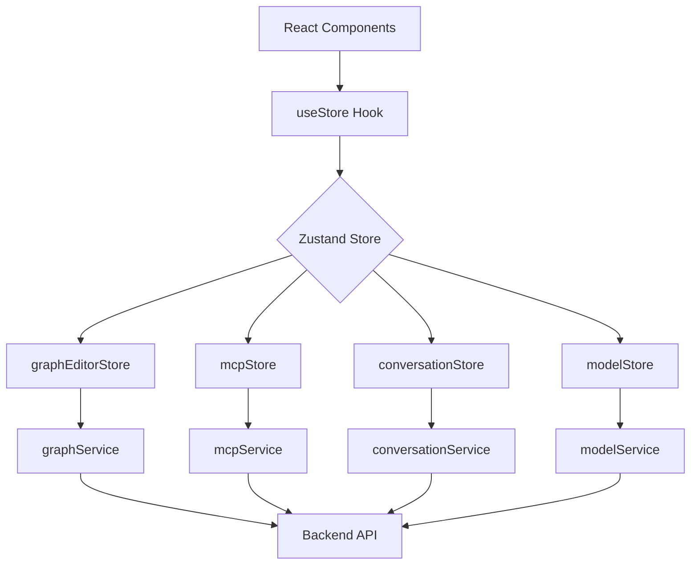
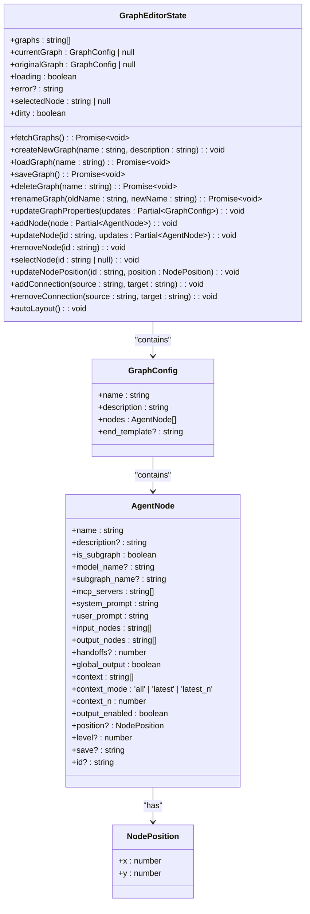
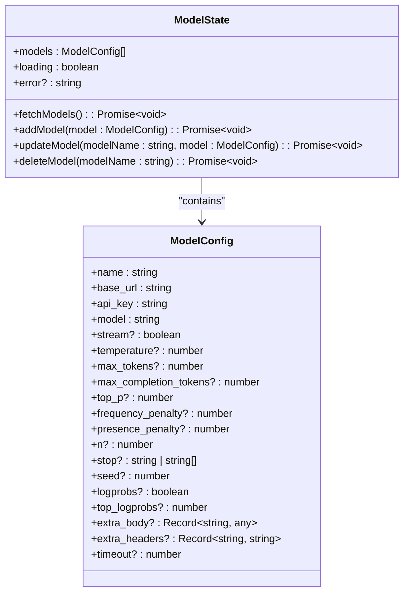
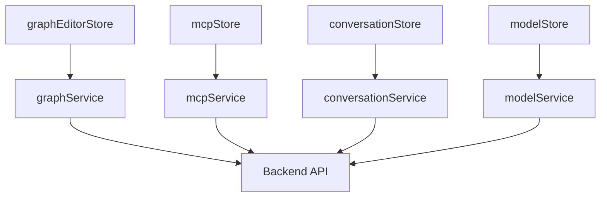

# 状态管理机制

<cite>
**本文档中引用的文件**  
- [graphEditorStore.ts](file://frontend/src/store/graphEditorStore.ts)
- [mcpStore.ts](file://frontend/src/store/mcpStore.ts)
- [conversationStore.ts](file://frontend/src/store/conversationStore.ts)
- [modelStore.ts](file://frontend/src/store/modelStore.ts)
- [graph.ts](file://frontend/src/types/graph.ts)
- [mcp.ts](file://frontend/src/types/mcp.ts)
- [conversation.ts](file://frontend/src/types/conversation.ts)
- [model.ts](file://frontend/src/types/model.ts)
- [graphService.ts](file://frontend/src/services/graphService.ts)
- [mcpService.ts](file://frontend/src/services/mcpService.ts)
</cite>

## 目录
1. [引言](#引言)
2. [项目结构](#项目结构)
3. [核心组件](#核心组件)
4. [架构概览](#架构概览)
5. [详细组件分析](#详细组件分析)
6. [依赖分析](#依赖分析)
7. [性能考虑](#性能考虑)
8. [故障排除指南](#故障排除指南)
9. [结论](#结论)

## 引言
本文档深入探讨了基于Zustand的状态管理机制在项目中的实际应用。重点分析了`graphEditorStore`对图结构、节点状态和执行上下文的管理方式；`mcpStore`对MCP服务器列表、连接状态和工具元数据的持久化处理；`conversationStore`对对话历史与会话生命周期的控制；以及`modelStore`的模型配置缓存机制。同时，文档还解释了store的设计模式（如分片存储、中间件使用）、跨store通信策略（如图执行触发对话更新）以及与React组件的高效绑定（useStore钩子）。最后，提供了性能优化建议（如选择器memoization）和常见状态不一致问题的调试方法。

## 项目结构
项目采用典型的前端分层结构，其中状态管理模块集中于`frontend/src/store`目录下，通过Zustand实现全局状态的集中管理。各store分别负责图编辑、MCP服务、对话和模型配置等核心功能。



**图源**  
- [graphEditorStore.ts](file://frontend/src/store/graphEditorStore.ts)
- [mcpStore.ts](file://frontend/src/store/mcpStore.ts)
- [conversationStore.ts](file://frontend/src/store/conversationStore.ts)
- [modelStore.ts](file://frontend/src/store/modelStore.ts)
- [graph.ts](file://frontend/src/types/graph.ts)
- [mcp.ts](file://frontend/src/types/mcp.ts)
- [conversation.ts](file://frontend/src/types/conversation.ts)
- [model.ts](file://frontend/src/types/model.ts)
- [graphService.ts](file://frontend/src/services/graphService.ts)
- [mcpService.ts](file://frontend/src/services/mcpService.ts)

**节源**  
- [graphEditorStore.ts](file://frontend/src/store/graphEditorStore.ts)
- [mcpStore.ts](file://frontend/src/store/mcpStore.ts)
- [conversationStore.ts](file://frontend/src/store/conversationStore.ts)
- [modelStore.ts](file://frontend/src/store/modelStore.ts)

## 核心组件
本节深入分析四个核心状态管理模块：`graphEditorStore`、`mcpStore`、`conversationStore` 和 `modelStore`，它们分别管理图结构、MCP服务、对话历史和模型配置。

**节源**  
- [graphEditorStore.ts](file://frontend/src/store/graphEditorStore.ts#L1-L707)
- [mcpStore.ts](file://frontend/src/store/mcpStore.ts#L1-L221)
- [conversationStore.ts](file://frontend/src/store/conversationStore.ts#L1-L364)
- [modelStore.ts](file://frontend/src/store/modelStore.ts#L1-L75)

## 架构概览
系统采用分片式状态管理架构，每个store独立管理特定领域的状态，通过Zustand的`create`函数实现状态定义与更新逻辑的封装。各store通过服务层与后端API通信，确保状态的持久化和同步。



**图源**  
- [graphEditorStore.ts](file://frontend/src/store/graphEditorStore.ts)
- [mcpStore.ts](file://frontend/src/store/mcpStore.ts)
- [conversationStore.ts](file://frontend/src/store/conversationStore.ts)
- [modelStore.ts](file://frontend/src/store/modelStore.ts)
- [graphService.ts](file://frontend/src/services/graphService.ts)
- [mcpService.ts](file://frontend/src/services/mcpService.ts)

## 详细组件分析
本节对每个核心store进行深入分析，包括其状态结构、更新逻辑和与外部系统的交互方式。

### graphEditorStore 分析
`graphEditorStore`负责管理图编辑器中的图结构、节点状态和执行上下文。它通过`AgentNode`类型定义节点结构，并提供丰富的操作方法来管理图的增删改查。



**图源**  
- [graphEditorStore.ts](file://frontend/src/store/graphEditorStore.ts#L15-L707)
- [graph.ts](file://frontend/src/types/graph.ts#L1-L113)

**节源**  
- [graphEditorStore.ts](file://frontend/src/store/graphEditorStore.ts#L1-L707)
- [graph.ts](file://frontend/src/types/graph.ts#L1-L113)

### mcpStore 分析
`mcpStore`负责管理MCP服务器的配置、连接状态和工具元数据。它通过`MCPConfig`和`MCPServerConfig`类型定义服务器配置结构，并提供方法来管理服务器的连接、断开和工具注册。

```mermaid
classDiagram
class MCPState {
+config : MCPConfig
+status : Record~string, any~
+tools : Record~string, any[]~
+loading : boolean
+error? : string
+fetchConfig() : Promise~void~
+updateConfig(config : MCPConfig) : Promise~void~
+fetchStatus() : Promise~void~
+connectServer(serverName : string) : Promise~void~
+disconnectServer(serverName : string) : Promise~void~
+fetchTools() : Promise~void~
+connectAllServers() : Promise~{ success : string[], failed : string[] }~
+addServer(serverName : string, serverConfig : MCPServerConfig) : Promise~void~
+updateServer(serverName : string, serverConfig : MCPServerConfig) : Promise~void~
+deleteServer(serverName : string) : Promise~void~
+registerMCPTool(toolData : any) : Promise~void~
+testTool(serverName : string, toolName : string, params : Record~string, any~) : Promise~any~
+getUsedPorts() : number[]
}
class MCPConfig {
+mcpServers : Record~string, MCPServerConfig~
}
class MCPServerConfig {
+autoApprove : string[]
+disabled : boolean
+timeout : number
+command? : string
+args : string[]
+transportType : 'stdio' | 'sse' | 'streamable_http'
+url? : string
+base_url? : string
+env? : Record~string, string~
}
MCPState --> MCPConfig : "contains"
MCPConfig --> MCPServerConfig : "contains"
```

**图源**  
- [mcpStore.ts](file://frontend/src/store/mcpStore.ts#L15-L221)
- [mcp.ts](file://frontend/src/types/mcp.ts#L1-L34)

**节源**  
- [mcpStore.ts](file://frontend/src/store/mcpStore.ts#L1-L221)
- [mcp.ts](file://frontend/src/types/mcp.ts#L1-L34)

### conversationStore 分析
`conversationStore`负责管理对话历史和会话生命周期。它通过`ConversationDetail`和`ConversationSummary`类型定义对话结构，并提供方法来加载、更新和删除对话。

```mermaid
classDiagram
class ConversationState {
+conversations : ConversationSummary[]
+totalCount : number
+loading : boolean
+currentConversation : ConversationDetail | null
+currentConversationLoading : boolean
+currentMode : ConversationMode
+agentType : AgentType
+searchQuery : string
+statusFilter : 'active' | 'favorite' | 'deleted'
+typeFilter : 'chat' | 'agent' | 'graph'
+currentSSE : EventSource | null
+isStreaming : boolean
+sidebarCollapsed : boolean
+loadConversations(forceRefresh? : boolean) : Promise~void~
+silentUpdateConversations() : Promise~void~
+loadConversationDetail(conversationId : string) : Promise~void~
+updateConversationStatus(conversationId : string, status : 'active' | 'deleted' | 'favorite') : Promise~void~
+updateConversationTitle(conversationId : string, title : string) : Promise~void~
+updateConversationTags(conversationId : string, tags : string[]) : Promise~void~
+deleteConversationPermanent(conversationId : string) : Promise~void~
+setCurrentMode(mode : ConversationMode) : void
+setAgentType(type : AgentType) : void
+clearCurrentConversation() : void
+updateCurrentConversationTemporarily(conversation : ConversationDetail) : void
+startSSEConnection(sse : EventSource) : void
+stopSSEConnection() : void
+handleSSEMessage(message : SSEMessage) : void
+setSearchQuery(query : string) : void
+setStatusFilter(filter : 'active' | 'favorite' | 'deleted') : void
+setTypeFilter(filter : 'chat' | 'agent' | 'graph') : void
+toggleSidebar() : void
+showNotification(message : string, type? : 'success' | 'error' | 'info') : void
}
class ConversationSummary {
+_id : string
+user_id : string
+type : 'chat' | 'agent' | 'graph'
+title : string
+created_at : string
+updated_at : string
+round_count : number
+total_token_usage : TokenUsage
+status : 'active' | 'deleted' | 'favorite'
+tags : string[]
}
class ConversationDetail {
+conversation_id : string
+title : string
+rounds : ConversationRound[]
+generation_type : 'chat' | 'graph' | 'mcp' | 'graph_run'
+parsed_results? : ParsedResults
+execution_chain? : string[][]
+final_result? : string
}
class ConversationRound {
+round : number
+messages : ConversationMessage[]
+node_name? : string
+level? : number
+output_enabled? : string
+mcp_servers? : string[]
}
class ConversationMessage {
+role : 'user' | 'assistant' | 'tool' | 'system'
+content : string
+reasoning_content? : string
+tool_calls? : ToolCall[]
+tool_call_id? : string
}
class ToolCall {
+id? : string
+type? : 'function'
+index? : number
+function : { name : string; arguments : string }
}
class TokenUsage {
+total_tokens : number
+prompt_tokens : number
+completion_tokens : number
+completion_tokens_details? : { reasoning_tokens? : number }
}
ConversationState --> ConversationSummary : "contains"
ConversationState --> ConversationDetail : "contains"
ConversationDetail --> ConversationRound : "contains"
ConversationRound --> ConversationMessage : "contains"
ConversationMessage --> ToolCall : "contains"
ConversationSummary --> TokenUsage : "contains"
```

**图源**  
- [conversationStore.ts](file://frontend/src/store/conversationStore.ts#L15-L364)
- [conversation.ts](file://frontend/src/types/conversation.ts#L1-L174)

**节源**  
- [conversationStore.ts](file://frontend/src/store/conversationStore.ts#L1-L364)
- [conversation.ts](file://frontend/src/types/conversation.ts#L1-L174)

### modelStore 分析
`modelStore`负责管理模型配置的缓存。它通过`ModelConfig`类型定义模型结构，并提供方法来增删改查模型配置。



**图源**  
- [modelStore.ts](file://frontend/src/store/modelStore.ts#L15-L75)
- [model.ts](file://frontend/src/types/model.ts#L1-L30)

**节源**  
- [modelStore.ts](file://frontend/src/store/modelStore.ts#L1-L75)
- [model.ts](file://frontend/src/types/model.ts#L1-L30)

## 依赖分析
各store通过服务层与后端API进行通信，形成清晰的依赖关系。`graphEditorStore`依赖`graphService`，`mcpStore`依赖`mcpService`，`conversationStore`依赖`conversationService`，`modelStore`依赖`modelService`。



**图源**  
- [graphEditorStore.ts](file://frontend/src/store/graphEditorStore.ts)
- [mcpStore.ts](file://frontend/src/store/mcpStore.ts)
- [conversationStore.ts](file://frontend/src/store/conversationStore.ts)
- [modelStore.ts](file://frontend/src/store/modelStore.ts)
- [graphService.ts](file://frontend/src/services/graphService.ts)
- [mcpService.ts](file://frontend/src/services/mcpService.ts)

**节源**  
- [graphEditorStore.ts](file://frontend/src/store/graphEditorStore.ts)
- [mcpStore.ts](file://frontend/src/store/mcpStore.ts)
- [conversationStore.ts](file://frontend/src/store/conversationStore.ts)
- [modelStore.ts](file://frontend/src/store/modelStore.ts)

## 性能考虑
- 使用Zustand的选择器（selector）来避免不必要的组件重渲染。
- 在`conversationStore`中使用`subscribeWithSelector`中间件，实现细粒度的状态订阅。
- 对频繁更新的状态（如SSE流）进行节流或防抖处理。
- 利用`localStorage`缓存对话列表，减少不必要的API调用。

## 故障排除指南
- **状态不一致**：检查store的更新逻辑是否正确，确保所有状态变更都通过store的action进行。
- **组件不更新**：确认是否正确使用了`useStore`钩子，并检查选择器是否返回了正确的值。
- **API调用失败**：检查服务层的错误处理逻辑，确保错误信息能正确传递到store并显示给用户。
- **内存泄漏**：在组件卸载时，确保取消所有订阅和定时器。

**节源**  
- [graphEditorStore.ts](file://frontend/src/store/graphEditorStore.ts)
- [mcpStore.ts](file://frontend/src/store/mcpStore.ts)
- [conversationStore.ts](file://frontend/src/store/conversationStore.ts)
- [modelStore.ts](file://frontend/src/store/modelStore.ts)

## 结论
本文档详细分析了项目中基于Zustand的状态管理机制，涵盖了图编辑、MCP服务、对话和模型配置四大核心模块。通过分片式store设计和清晰的依赖关系，系统实现了高效、可维护的状态管理。未来可进一步优化选择器的使用，提升组件渲染性能。