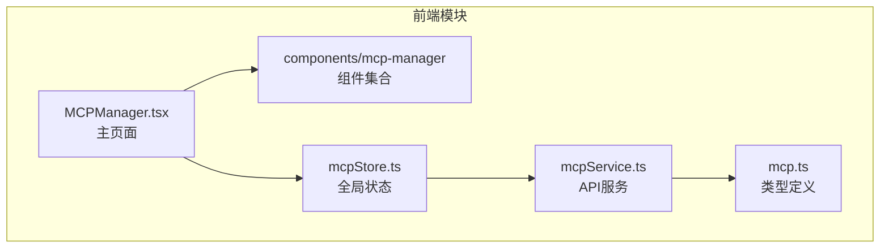
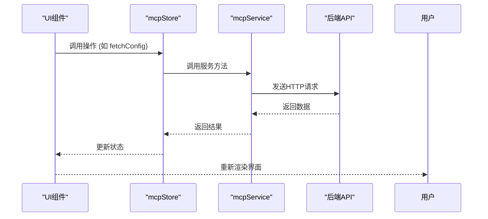
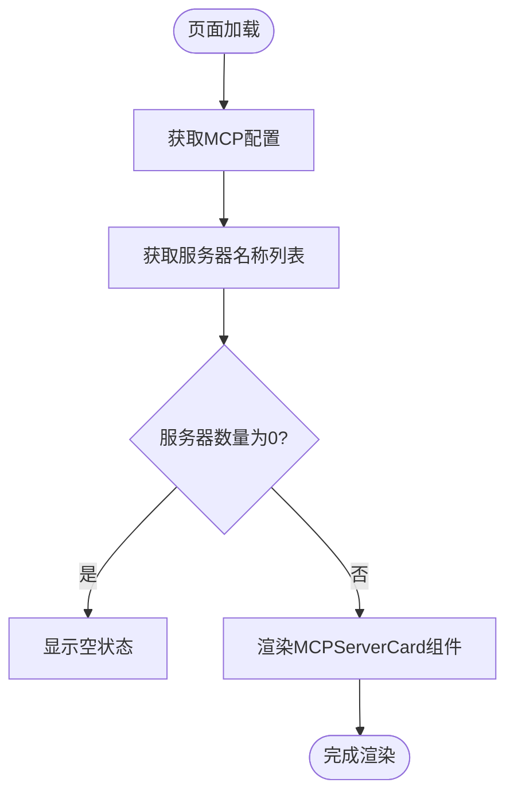
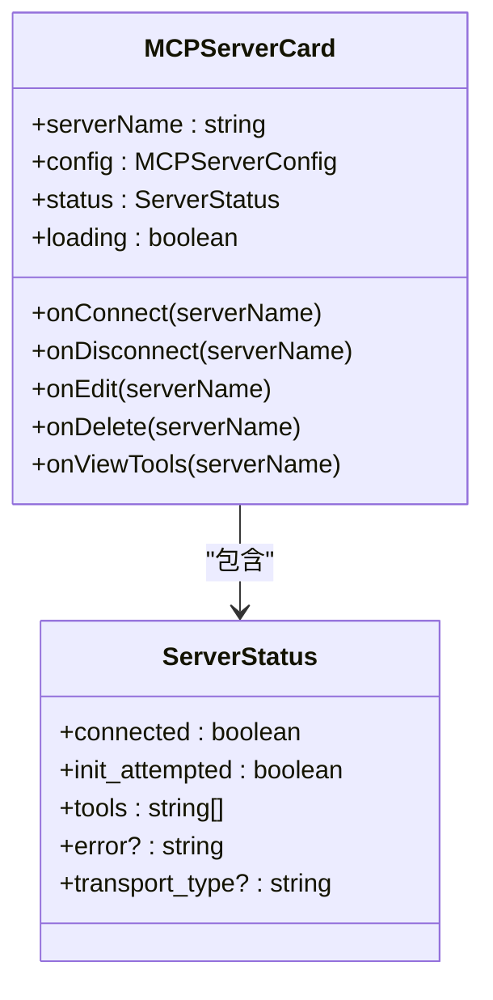
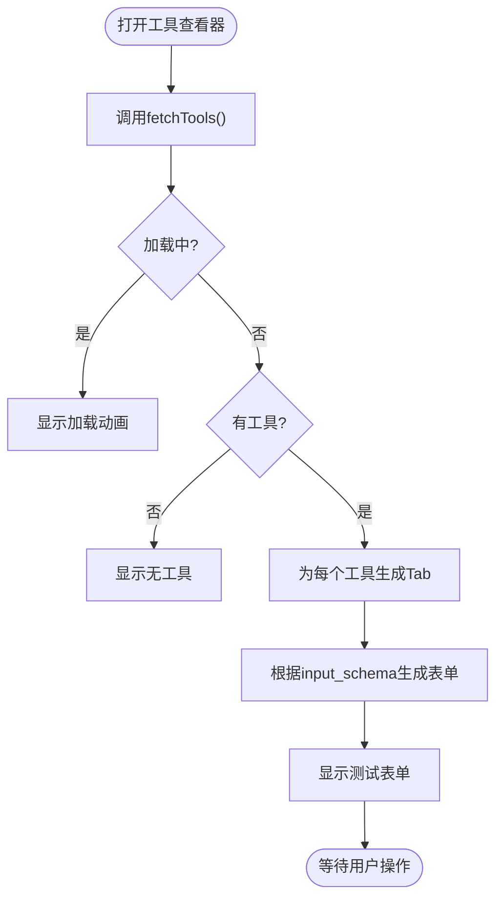
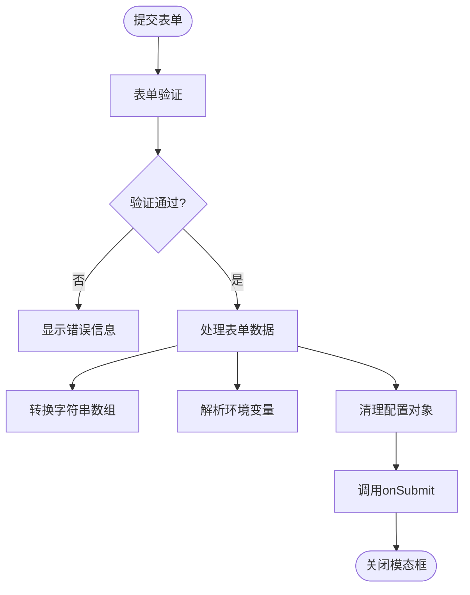
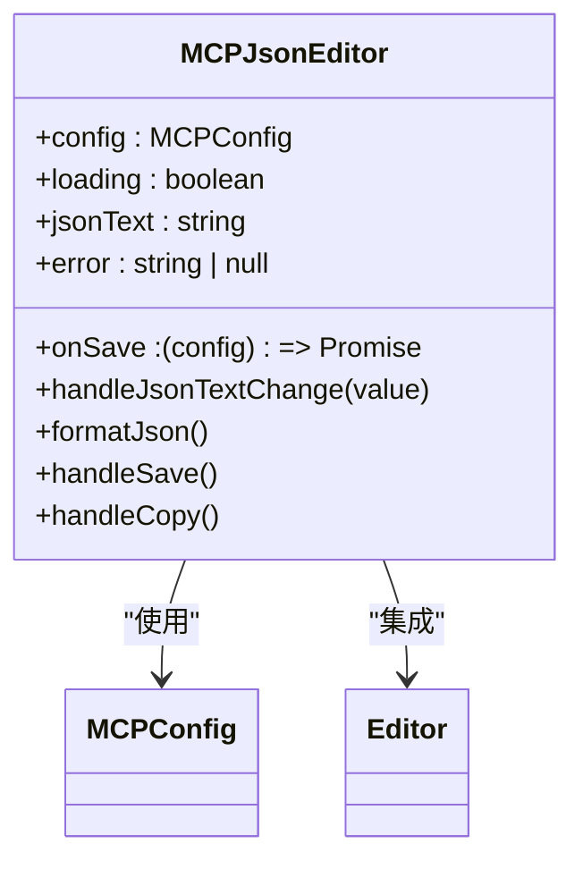
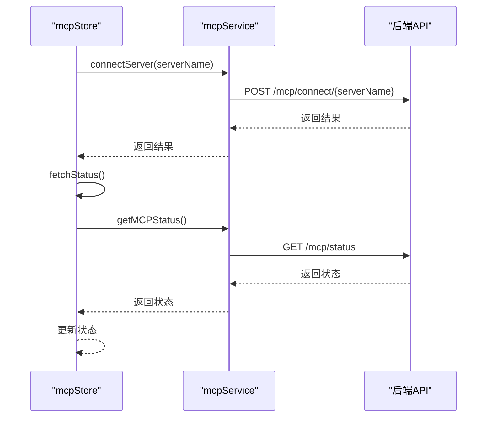
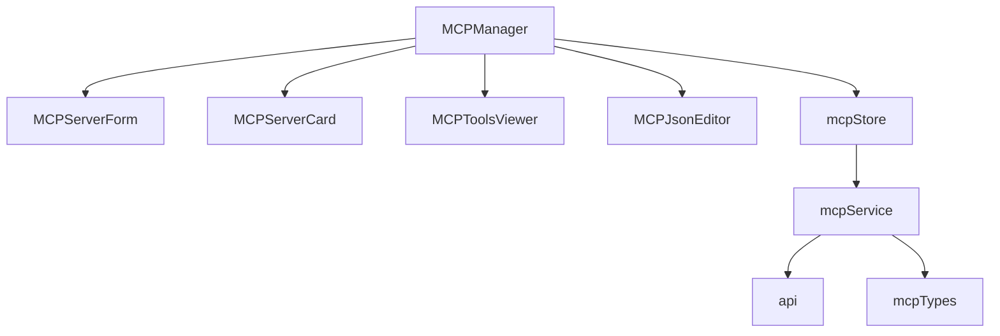

# MCP管理页面

<cite>
**本文档中引用的文件**  
- [MCPManager.tsx](file://frontend/src/pages/MCPManager.tsx)
- [mcpStore.ts](file://frontend/src/store/mcpStore.ts)
- [mcpService.ts](file://frontend/src/services/mcpService.ts)
- [MCPServerCard.tsx](file://frontend/src/components/mcp-manager/MCPServerCard.tsx)
- [MCPServerForm.tsx](file://frontend/src/components/mcp-manager/MCPServerForm.tsx)
- [MCPJsonEditor.tsx](file://frontend/src/components/mcp-manager/MCPJsonEditor.tsx)
- [MCPToolsViewer.tsx](file://frontend/src/components/mcp-manager/MCPToolsViewer.tsx)
- [mcp.ts](file://frontend/src/types/mcp.ts)
</cite>

## 目录
1. [简介](#简介)
2. [项目结构](#项目结构)
3. [核心组件](#核心组件)
4. [架构概览](#架构概览)
5. [详细组件分析](#详细组件分析)
6. [依赖分析](#依赖分析)
7. [性能考虑](#性能考虑)
8. [故障排除指南](#故障排除指南)
9. [结论](#结论)

## 简介
MCP管理页面是用于配置、监控和管理多个MCP（Model Control Protocol）服务器的核心界面。该页面支持可视化和JSON两种模式进行服务器配置，提供服务器连接状态展示、工具查看与测试、服务器增删改查等功能。通过与后端服务的通信，实现对MCP服务器的全生命周期管理。

## 项目结构
MCP管理功能主要分布在前端项目的特定目录中，采用模块化设计，分离UI组件、状态管理、服务调用和类型定义。

**图示来源**  
- [MCPManager.tsx](file://frontend/src/pages/MCPManager.tsx#L1-L515)
- [mcpStore.ts](file://frontend/src/store/mcpStore.ts#L1-L221)
- [mcpService.ts](file://frontend/src/services/mcpService.ts#L1-L67)
- [mcp.ts](file://frontend/src/types/mcp.ts#L1-L34)

**本节来源**  
- [MCPManager.tsx](file://frontend/src/pages/MCPManager.tsx#L1-L515)
- [mcpStore.ts](file://frontend/src/store/mcpStore.ts#L1-L221)

## 核心组件
MCP管理页面由多个核心组件构成，包括服务器列表渲染、服务器卡片展示、工具查看器、表单编辑和JSON编辑器等。这些组件通过Zustand状态管理进行数据同步，并通过Ant Design实现一致的UI体验。

**本节来源**  
- [MCPManager.tsx](file://frontend/src/pages/MCPManager.tsx#L1-L515)
- [MCPServerCard.tsx](file://frontend/src/components/mcp-manager/MCPServerCard.tsx#L1-L237)
- [MCPToolsViewer.tsx](file://frontend/src/components/mcp-manager/MCPToolsViewer.tsx#L1-L343)

## 架构概览
MCP管理页面采用典型的React组件化架构，结合Zustand进行状态管理，实现数据流的单向流动。

**图示来源**  
- [mcpStore.ts](file://frontend/src/store/mcpStore.ts#L1-L221)
- [mcpService.ts](file://frontend/src/services/mcpService.ts#L1-L67)
- [MCPManager.tsx](file://frontend/src/pages/MCPManager.tsx#L1-L515)

## 详细组件分析

### MCP服务器列表渲染逻辑
MCP服务器列表在MCPManager页面中通过遍历配置中的服务器名称来动态渲染MCPServerCard组件。列表支持响应式布局，在不同屏幕尺寸下自动调整列数。

**图示来源**  
- [MCPManager.tsx](file://frontend/src/pages/MCPManager.tsx#L278-L332)
- [mcpStore.ts](file://frontend/src/store/mcpStore.ts#L1-L221)

**本节来源**  
- [MCPManager.tsx](file://frontend/src/pages/MCPManager.tsx#L1-L515)

### MCPServerCard组件状态展示
MCPServerCard组件负责展示单个MCP服务器的详细信息和状态，包括连接状态、传输类型、环境变量等。组件根据服务器状态显示不同的标签和操作按钮。

**图示来源**  
- [MCPServerCard.tsx](file://frontend/src/components/mcp-manager/MCPServerCard.tsx#L1-L237)
- [mcp.ts](file://frontend/src/types/mcp.ts#L1-L34)

**本节来源**  
- [MCPServerCard.tsx](file://frontend/src/components/mcp-manager/MCPServerCard.tsx#L1-L237)

### 工具查看器动态加载机制
MCPToolsViewer组件实现工具的动态加载和测试功能。当模态框打开时，自动调用fetchTools获取服务器的可用工具列表，并根据工具的输入schema动态生成测试表单。

**图示来源**  
- [MCPToolsViewer.tsx](file://frontend/src/components/mcp-manager/MCPToolsViewer.tsx#L1-L343)
- [mcpStore.ts](file://frontend/src/store/mcpStore.ts#L1-L221)

**本节来源**  
- [MCPToolsViewer.tsx](file://frontend/src/components/mcp-manager/MCPToolsViewer.tsx#L1-L343)

### 服务器添加/编辑表单验证流程
MCPServerForm组件实现服务器配置的添加和编辑功能，包含完整的表单验证流程。表单根据传输类型动态显示不同的字段，并对输入进行验证。

**图示来源**  
- [MCPServerForm.tsx](file://frontend/src/components/mcp-manager/MCPServerForm.tsx#L1-L225)
- [mcp.ts](file://frontend/src/types/mcp.ts#L1-L34)

**本节来源**  
- [MCPServerForm.tsx](file://frontend/src/components/mcp-manager/MCPServerForm.tsx#L1-L225)

### JSON配置编辑器双向绑定实现
MCPJsonEditor组件实现JSON配置的双向绑定，使用Monaco Editor提供代码编辑体验。组件在配置变化时更新编辑器内容，在保存时解析JSON并验证结构。

**图示来源**  
- [MCPJsonEditor.tsx](file://frontend/src/components/mcp-manager/MCPJsonEditor.tsx#L1-L246)
- [mcp.ts](file://frontend/src/types/mcp.ts#L1-L34)

**本节来源**  
- [MCPJsonEditor.tsx](file://frontend/src/components/mcp-manager/MCPJsonEditor.tsx#L1-L246)

### 与后端MCP服务的通信模式
前端通过mcpService模块与后端MCP服务进行通信，实现连接测试、工具同步等功能。所有API调用都封装在服务层，由状态管理器调用。

**图示来源**  
- [mcpService.ts](file://frontend/src/services/mcpService.ts#L1-L67)
- [mcpStore.ts](file://frontend/src/store/mcpStore.ts#L1-L221)

**本节来源**  
- [mcpService.ts](file://frontend/src/services/mcpService.ts#L1-L67)

## 依赖分析
MCP管理页面的组件之间存在清晰的依赖关系，遵循单向数据流原则。

**图示来源**  
- [MCPManager.tsx](file://frontend/src/pages/MCPManager.tsx#L1-L515)
- [mcpStore.ts](file://frontend/src/store/mcpStore.ts#L1-L221)
- [mcpService.ts](file://frontend/src/services/mcpService.ts#L1-L67)

**本节来源**  
- [MCPManager.tsx](file://frontend/src/pages/MCPManager.tsx#L1-L515)
- [mcpStore.ts](file://frontend/src/store/mcpStore.ts#L1-L221)

## 性能考虑
MCP管理页面在性能方面进行了多项优化，包括状态管理的高效更新、组件的按需渲染和API调用的合理控制。建议在服务器数量较多时使用JSON编辑模式以提高性能。

## 故障排除指南
常见问题包括服务器连接失败、工具加载超时和配置保存错误。建议检查网络连接、服务器地址正确性和端口占用情况。对于连接问题，可尝试刷新状态或重新连接服务器。

**本节来源**  
- [mcpStore.ts](file://frontend/src/store/mcpStore.ts#L1-L221)
- [mcpService.ts](file://frontend/src/services/mcpService.ts#L1-L67)

## 结论
MCP管理页面提供了一套完整的MCP服务器管理解决方案，支持可视化和代码两种配置方式。通过合理的架构设计和组件分离，实现了功能的可维护性和扩展性。未来可扩展更多操作功能，如批量操作、配置导入导出等。