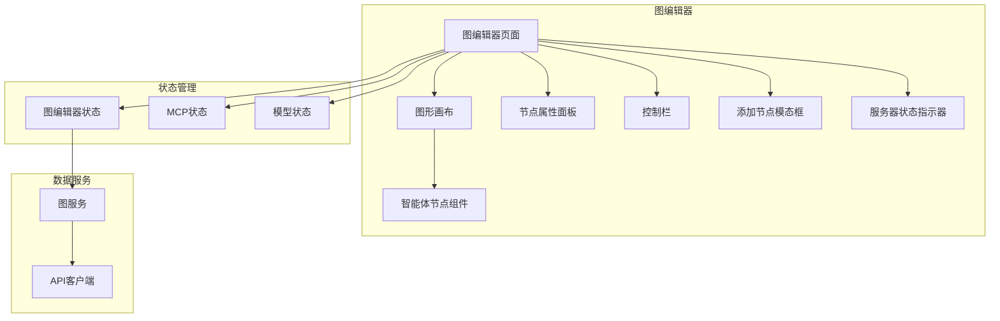
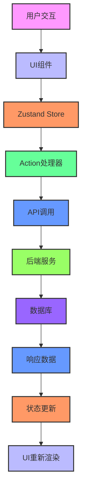
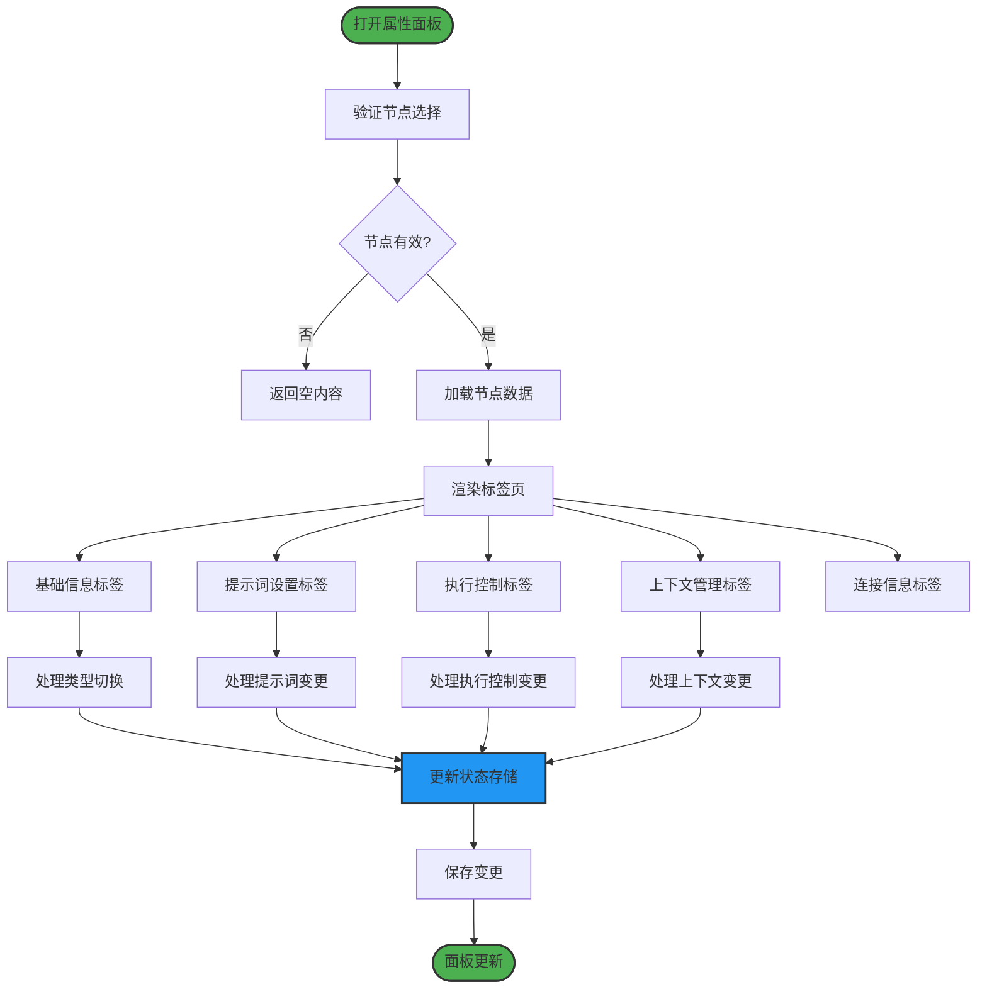
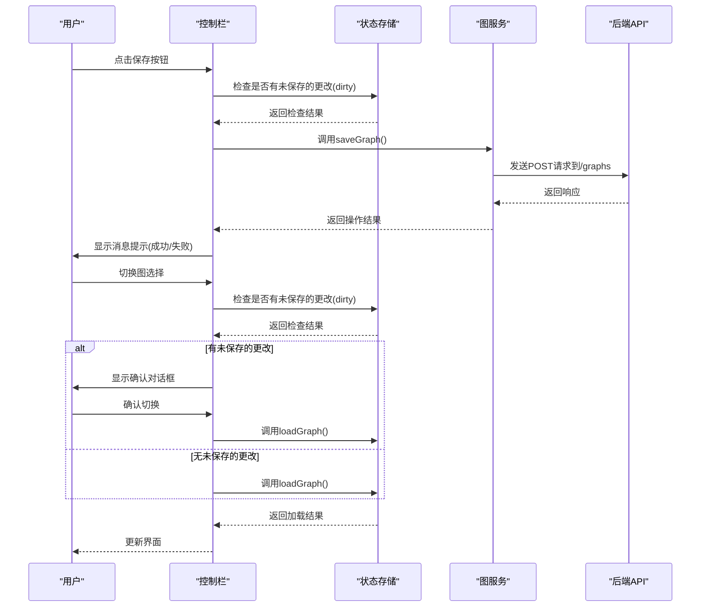

# 图编辑器页面

<cite>
**本文档引用的文件**  
- [GraphEditor.tsx](file://frontend/src/pages/GraphEditor.tsx)
- [GraphCanvas.tsx](file://frontend/src/components/graph-editor/GraphCanvas.tsx)
- [NodePropertiesPanel.tsx](file://frontend/src/components/graph-editor/NodePropertiesPanel.tsx)
- [GraphControls.tsx](file://frontend/src/components/graph-editor/GraphControls.tsx)
- [graphEditorStore.ts](file://frontend/src/store/graphEditorStore.ts)
- [graphService.ts](file://frontend/src/services/graphService.ts)
- [graph.ts](file://frontend/src/types/graph.ts)
- [AddNodeModal.tsx](file://frontend/src/components/graph-editor/AddNodeModal.tsx)
- [AgentNodeComponent.tsx](file://frontend/src/components/graph-editor/AgentNodeComponent.tsx)
</cite>

## 目录
1. [简介](#简介)
2. [项目结构](#项目结构)
3. [核心组件](#核心组件)
4. [架构概述](#架构概述)
5. [详细组件分析](#详细组件分析)
6. [依赖分析](#依赖分析)
7. [性能考虑](#性能考虑)
8. [故障排除指南](#故障排除指南)
9. [结论](#结论)

## 简介
图编辑器页面是MAG系统中的核心功能模块，提供了一个可视化的工作流设计界面，允许用户通过拖拽方式创建和管理复杂的AI工作流程。该页面集成了图形画布、节点属性面板、控制工具栏等子组件，并通过Zustand状态管理实现组件间的数据同步。系统支持节点添加、连接线创建、属性动态更新等交互功能，并与后端API进行数据同步，确保图配置的持久化存储。此外，还提供了新手引导、自动布局、导入导出等辅助功能，提升了用户体验。

## 项目结构
图编辑器相关组件位于`frontend/src/components/graph-editor`目录下，主要包括图形画布(GraphCanvas)、节点属性面板(NodePropertiesPanel)、控制栏(GraphControls)等核心组件。状态管理通过Zustand实现，存储逻辑位于`frontend/src/store/graphEditorStore.ts`。页面入口为`frontend/src/pages/GraphEditor.tsx`，负责整合各子组件并管理全局状态。数据服务通过`frontend/src/services/graphService.ts`与后端API进行通信，实现图配置的增删改查操作。



**图来源**  
- [GraphEditor.tsx](file://frontend/src/pages/GraphEditor.tsx)
- [GraphCanvas.tsx](file://frontend/src/components/graph-editor/GraphCanvas.tsx)
- [NodePropertiesPanel.tsx](file://frontend/src/components/graph-editor/NodePropertiesPanel.tsx)
- [GraphControls.tsx](file://frontend/src/components/graph-editor/GraphControls.tsx)
- [graphEditorStore.ts](file://frontend/src/store/graphEditorStore.ts)
- [graphService.ts](file://frontend/src/services/graphService.ts)

## 核心组件

图编辑器页面的核心组件包括图形画布(GraphCanvas)、节点属性面板(NodePropertiesPanel)和控制栏(GraphControls)。这些组件通过Zustand状态管理器共享数据，实现了高效的组件间通信。图形画布基于React Flow库构建，提供了节点拖拽、连接线创建等交互功能。节点属性面板允许用户编辑选中节点的详细属性，包括基础信息、提示词设置、执行控制等。控制栏则提供了图管理、导入导出、服务器状态等全局操作功能。

**组件来源**  
- [GraphCanvas.tsx](file://frontend/src/components/graph-editor/GraphCanvas.tsx)
- [NodePropertiesPanel.tsx](file://frontend/src/components/graph-editor/NodePropertiesPanel.tsx)
- [GraphControls.tsx](file://frontend/src/components/graph-editor/GraphControls.tsx)

## 架构概述
图编辑器采用组件化架构设计，以`GraphEditor`为根组件，整合了多个功能子组件。状态管理采用Zustand库，实现了全局状态的集中管理和高效更新。数据流遵循单向数据流原则，从状态存储到UI组件的更新都通过明确的action触发。与后端的通信通过`graphService`封装的API接口实现，确保了前后端数据的一致性。整个系统通过TypeScript类型定义保证了代码的类型安全，提高了开发效率和代码质量。



**图来源**  
- [GraphEditor.tsx](file://frontend/src/pages/GraphEditor.tsx)
- [graphEditorStore.ts](file://frontend/src/store/graphEditorStore.ts)
- [graphService.ts](file://frontend/src/services/graphService.ts)

## 详细组件分析

### 图形画布分析
图形画布组件基于React Flow库构建，提供了丰富的图形编辑功能。它支持节点拖拽、连接线创建、背景样式切换等交互操作。通过自定义边组件(ButtonEdge和ArcEdge)，实现了连接线的删除功能和循环连接的可视化。画布还集成了小地图(MiniMap)和控制面板(Controls)，增强了用户的导航体验。节点位置的更新通过`updateNodePosition` action与状态管理器同步，确保了数据的一致性。

```mermaid
classDiagram
class GraphCanvas {
+nodes : Node[]
+edges : Edge[]
+backgroundType : BackgroundType
-onNodesChange()
-onEdgesChange()
-onConnect()
-onPaneClick()
-renderBackground()
-renderBackgroundControls()
}
class AgentNodeComponent {
+data : AgentNodeData
+selected : boolean
-renderNodeTitle()
-renderNodeContent()
-renderNodeTags()
-getNodeStyle()
}
class ButtonEdge {
+id : string
+sourceX : number
+sourceY : number
+targetX : number
+targetY : number
-onEdgeClick()
}
class ArcEdge {
+id : string
+sourceX : number
+sourceY : number
+targetX : number
+targetY : number
+data : {handoffs : number}
-onEdgeClick()
-createArcPath()
}
GraphCanvas --> AgentNodeComponent : "使用"
GraphCanvas --> ButtonEdge : "使用"
GraphCanvas --> ArcEdge : "使用"
GraphCanvas --> useGraphEditorStore : "使用"
```

**图来源**  
- [GraphCanvas.tsx](file://frontend/src/components/graph-editor/GraphCanvas.tsx)
- [AgentNodeComponent.tsx](file://frontend/src/components/graph-editor/AgentNodeComponent.tsx)

### 节点属性面板分析
节点属性面板组件提供了对选中节点的详细属性编辑功能。它通过标签页(Tabs)组织了基础信息、提示词设置、执行控制、上下文管理等多个配置区域。面板根据节点类型(智能体或子图)动态切换显示内容，确保了配置的准确性。通过`updateNode` action与状态管理器同步数据变更，实现了实时更新。面板还集成了智能提示词编辑器(SmartPromptEditor)，支持节点引用的自动补全，提升了配置效率。



**图来源**  
- [NodePropertiesPanel.tsx](file://frontend/src/components/graph-editor/NodePropertiesPanel.tsx)
- [graphEditorStore.ts](file://frontend/src/store/graphEditorStore.ts)

### 控制栏分析
控制栏组件提供了图编辑器的全局操作功能，包括图选择、快速操作、导入导出、服务器状态等。它通过下拉菜单(Select)和按钮(Button)的组合，实现了直观的用户界面。控制栏与多个状态存储(mcpStore, modelStore)交互，获取服务器和模型的配置信息。通过`fetchStatus`定时器，实现了服务器连接状态的实时更新。各种操作(如保存、删除、导入)都通过消息提示(messageApi)向用户反馈执行结果，增强了用户体验。



**图来源**  
- [GraphControls.tsx](file://frontend/src/components/graph-editor/GraphControls.tsx)
- [graphEditorStore.ts](file://frontend/src/store/graphEditorStore.ts)
- [graphService.ts](file://frontend/src/services/graphService.ts)

## 依赖分析
图编辑器页面依赖于多个外部库和内部模块。主要的外部依赖包括React Flow(用于图形可视化)、Ant Design(用于UI组件)和Zustand(用于状态管理)。内部依赖包括图服务(graphService)、MCP状态(mcpStore)和模型状态(modelStore)。这些依赖通过模块导入的方式集成，确保了代码的可维护性和可测试性。依赖关系清晰，没有循环依赖问题，符合良好的软件设计原则。

```mermaid
graph TD
A[GraphEditor] --> B[ReactFlowProvider]
A --> C[GraphCanvas]
A --> D[NodePropertiesPanel]
A --> E[GraphControls]
A --> F[AddNodeModal]
A --> G[useGraphEditorStore]
A --> H[useMCPStore]
C --> I[ReactFlow]
C --> J[AgentNodeComponent]
C --> K[ButtonEdge]
C --> L[ArcEdge]
C --> G
D --> M[Form]
D --> N[SmartPromptEditor]
D --> G
D --> O[useModelStore]
D --> P[useMCPStore]
E --> Q[Modal]
E --> R[Form]
E --> S[SmartPromptEditor]
E --> T[MarkdownRenderer]
E --> G
E --> P
E --> O
E --> U[graphService]
F --> V[Form]
F --> W[Select]
F --> X[Switch]
F --> G
F --> O
F --> P
style A fill:#f9f,stroke:#333,stroke-width:2px
style B fill:#bbf,stroke:#333,stroke-width:2px
style C fill:#f96,stroke:#333,stroke-width:2px
style D fill:#6f9,stroke:#333,stroke-width:2px
style E fill:#69f,stroke:#333,stroke-width:2px
style F fill:#9f6,stroke:#333,stroke-width:2px
style G fill:#96f,stroke:#333,stroke-width:2px
style H fill:#69f,stroke:#333,stroke-width:2px
```



**图来源**  
- [GraphEditor.tsx](file://frontend/src/pages/GraphEditor.tsx)
- [GraphCanvas.tsx](file://frontend/src/components/graph-editor/GraphCanvas.tsx)
- [NodePropertiesPanel.tsx](file://frontend/src/components/graph-editor/NodePropertiesPanel.tsx)
- [GraphControls.tsx](file://frontend/src/components/graph-editor/GraphControls.tsx)
- [AddNodeModal.tsx](file://frontend/src/components/graph-editor/AddNodeModal.tsx)

## 性能考虑
图编辑器在性能方面进行了多项优化。首先，通过Zustand的状态选择器(useGraphEditorStore)实现了组件的精确重渲染，避免了不必要的UI更新。其次，图形画布的节点和边数据通过useCallback和useMemo进行了记忆化处理，减少了重复计算。服务器状态的更新采用了30秒的定时刷新机制，平衡了实时性和性能消耗。此外，大文件的导入导出操作通过异步处理和加载提示，避免了界面卡顿。对于大型图配置，自动布局算法采用了高效的层级计算方法，确保了布局计算的快速完成。

## 故障排除指南
当图编辑器出现异常时，可参考以下常见问题及解决方案：

1. **无法保存图配置**：检查MCP服务器是否连接，确保所有使用的服务器都处于连接状态。
2. **节点属性无法更新**：确认当前图是否有未保存的更改(dirty状态)，尝试手动保存后再进行编辑。
3. **导入文件失败**：检查文件格式是否正确，JSON文件应符合图配置的结构定义。
4. **服务器状态不更新**：确认`fetchStatus`定时器是否正常运行，检查网络连接是否稳定。
5. **节点连接线不显示**：检查节点的input_nodes和output_nodes配置是否正确，确保连接的节点名称匹配。
6. **自动布局无效**：确认图中是否有节点配置了执行层级(level)，这会影响布局算法的计算结果。

**故障排除来源**  
- [GraphEditor.tsx](file://frontend/src/pages/GraphEditor.tsx)
- [GraphControls.tsx](file://frontend/src/components/graph-editor/GraphControls.tsx)
- [graphEditorStore.ts](file://frontend/src/store/graphEditorStore.ts)

## 结论
图编辑器页面通过组件化设计和Zustand状态管理，实现了高效、可维护的图形化工作流编辑功能。系统架构清晰，组件职责明确，数据流单向且可预测。通过与后端API的紧密集成，确保了图配置的持久化和一致性。丰富的交互功能和直观的用户界面，大大提升了用户的操作体验。未来可进一步优化性能，支持更大的图配置，并增强协作编辑功能。