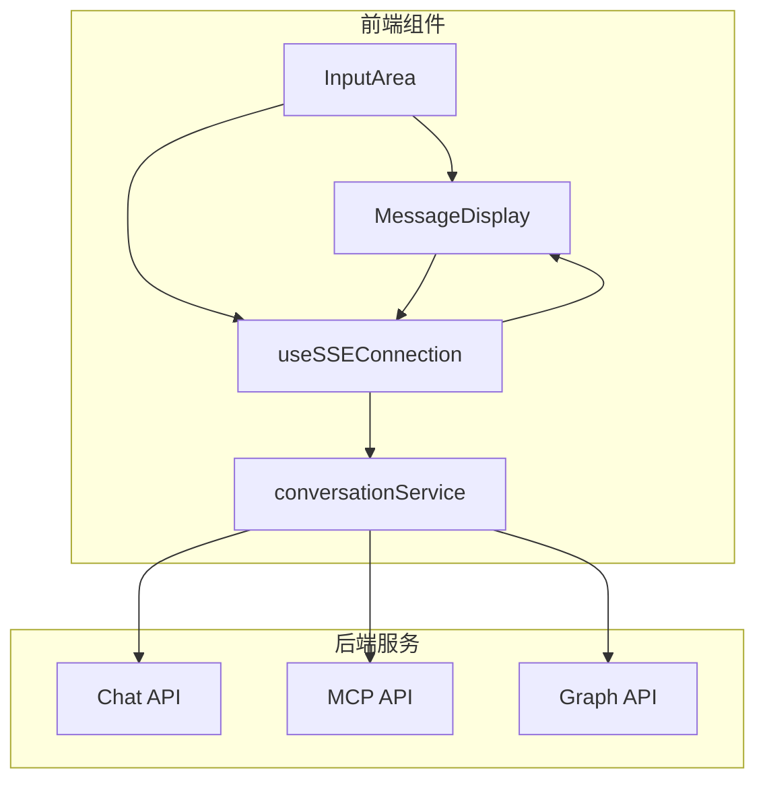
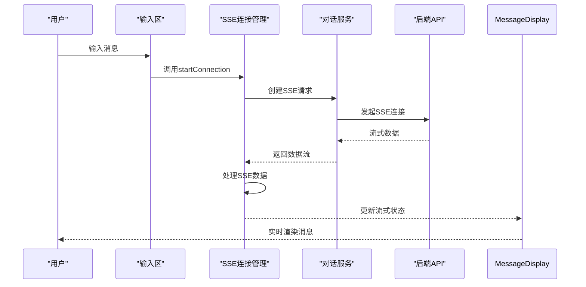
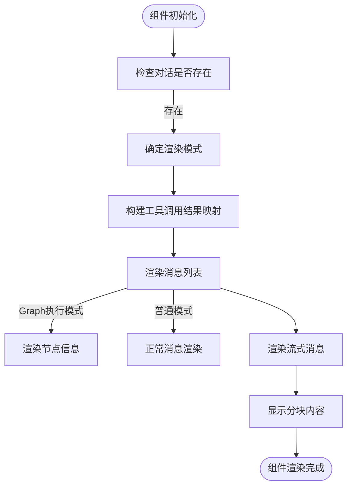
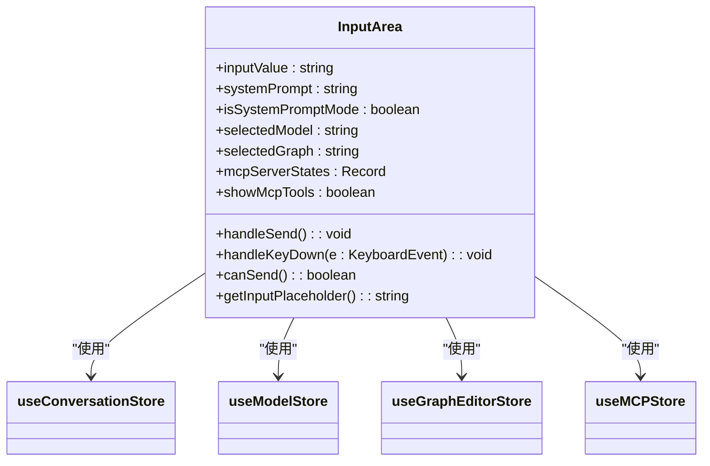
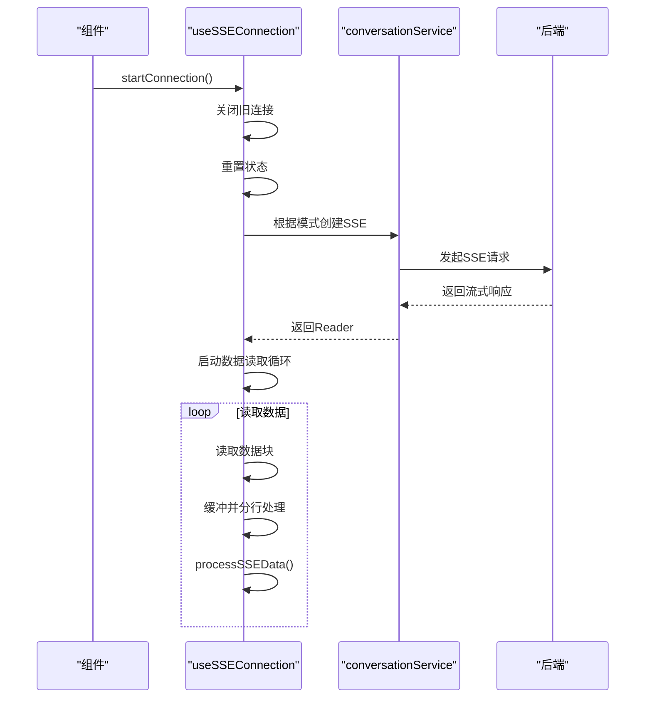
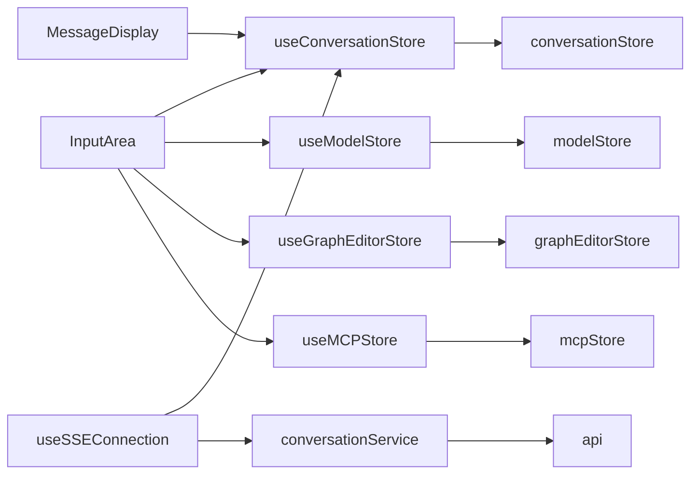

# 对话系统页面

<cite>
**本文档引用文件**  
- [MessageDisplay.tsx](file://frontend/src/components/chat/MessageDisplay.tsx)
- [InputArea.tsx](file://frontend/src/components/chat/InputArea.tsx)
- [useSSEConnection.ts](file://frontend/src/hooks/useSSEConnection.ts)
- [conversationService.ts](file://frontend/src/services/conversationService.ts)
- [conversation.ts](file://frontend/src/types/conversation.ts)
</cite>

## 目录
1. [简介](#简介)
2. [项目结构](#项目结构)
3. [核心组件](#核心组件)
4. [架构概览](#架构概览)
5. [详细组件分析](#详细组件分析)
6. [依赖分析](#依赖分析)
7. [性能考量](#性能考量)
8. [故障排除指南](#故障排除指南)
9. [结论](#结论)
10. [附录](#附录)（如有必要）

## 简介
本文档深入讲解对话系统页面的构建原理，涵盖消息列表渲染优化、输入区富文本处理与发送逻辑。重点描述基于SSE的实时消息流接入机制、对话状态管理与后端服务交互协议，以及消息分页加载、历史记录恢复和错误重连的实现方案。

## 项目结构
对话系统页面位于前端源码的 `components/chat` 目录下，主要由消息显示区、输入区和状态管理模块构成。系统采用模块化设计，各组件职责分明，通过状态管理实现数据流的统一调度。

**图示来源**  
- [MessageDisplay.tsx](file://frontend/src/components/chat/MessageDisplay.tsx#L1-L50)
- [InputArea.tsx](file://frontend/src/components/chat/InputArea.tsx#L1-L50)
- [useSSEConnection.ts](file://frontend/src/hooks/useSSEConnection.ts#L1-L50)

## 核心组件
对话系统的核心组件包括消息显示组件（MessageDisplay）、输入区域组件（InputArea）和SSE连接管理钩子（useSSEConnection）。这些组件协同工作，实现了实时对话、流式渲染和状态同步功能。

**组件来源**  
- [MessageDisplay.tsx](file://frontend/src/components/chat/MessageDisplay.tsx#L652-L946)
- [InputArea.tsx](file://frontend/src/components/chat/InputArea.tsx#L32-L434)
- [useSSEConnection.ts](file://frontend/src/hooks/useSSEConnection.ts#L33-L522)

## 架构概览
系统采用前后端分离架构，前端通过SSE（Server-Sent Events）与后端建立长连接，实现消息的实时推送。对话状态由全局状态管理器维护，组件通过钩子函数订阅状态变化。

**图示来源**  
- [useSSEConnection.ts](file://frontend/src/hooks/useSSEConnection.ts#L33-L522)
- [conversationService.ts](file://frontend/src/services/conversationService.ts#L1-L254)

## 详细组件分析

### 消息显示组件分析
消息显示组件（MessageDisplay）负责渲染对话历史和实时流式消息。组件采用分块渲染策略，支持推理内容、普通内容和工具调用的独立显示。

**图示来源**  
- [MessageDisplay.tsx](file://frontend/src/components/chat/MessageDisplay.tsx#L652-L946)

**组件来源**  
- [MessageDisplay.tsx](file://frontend/src/components/chat/MessageDisplay.tsx#L652-L946)

### 输入区域组件分析
输入区域组件（InputArea）提供富文本输入和发送功能，支持多种对话模式的配置切换。

**图示来源**  
- [InputArea.tsx](file://frontend/src/components/chat/InputArea.tsx#L32-L434)

**组件来源**  
- [InputArea.tsx](file://frontend/src/components/chat/InputArea.tsx#L32-L434)

### SSE连接管理分析
SSE连接管理钩子（useSSEConnection）封装了SSE连接的创建、数据处理和状态管理逻辑。

**图示来源**  
- [useSSEConnection.ts](file://frontend/src/hooks/useSSEConnection.ts#L33-L522)

**组件来源**  
- [useSSEConnection.ts](file://frontend/src/hooks/useSSEConnection.ts#L33-L522)

## 依赖分析
对话系统页面依赖多个前端服务和状态管理模块，形成清晰的依赖关系网络。

**图示来源**  
- [InputArea.tsx](file://frontend/src/components/chat/InputArea.tsx#L32-L434)
- [MessageDisplay.tsx](file://frontend/src/components/chat/MessageDisplay.tsx#L652-L946)
- [useSSEConnection.ts](file://frontend/src/hooks/useSSEConnection.ts#L33-L522)

## 性能考量
系统在性能方面进行了多项优化，包括消息的分块渲染、SSE连接的复用和状态更新的批处理。通过React.memo对MessageDisplay组件进行记忆化处理，避免不必要的重渲染。

## 故障排除指南
常见问题包括SSE连接失败、消息渲染异常和输入区域响应迟缓。建议检查网络连接、后端服务状态和浏览器兼容性。对于SSE连接问题，可查看控制台错误日志和网络请求状态。

**问题来源**  
- [useSSEConnection.ts](file://frontend/src/hooks/useSSEConnection.ts#L33-L522)
- [conversationService.ts](file://frontend/src/services/conversationService.ts#L1-L254)

## 结论
对话系统页面通过SSE实现实时消息流，结合分块渲染和状态管理，提供了流畅的用户体验。系统架构清晰，组件职责分明，便于维护和扩展。

## 附录
本文档基于前端代码库分析生成，所有技术细节均来自实际代码实现。建议开发者结合代码阅读本文档，以获得更深入的理解。