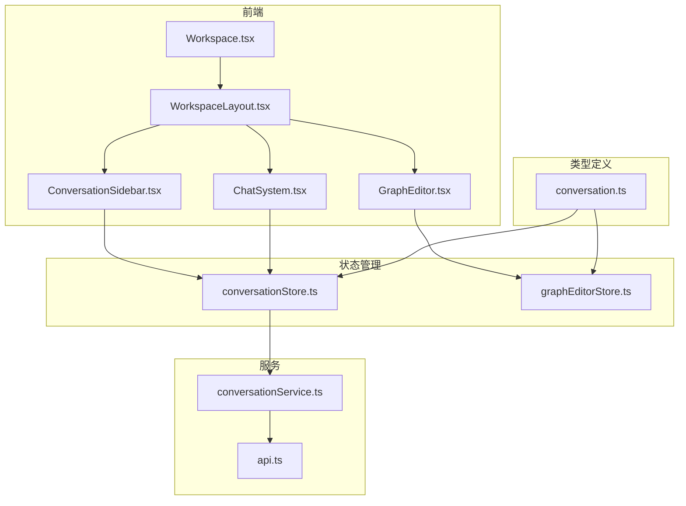
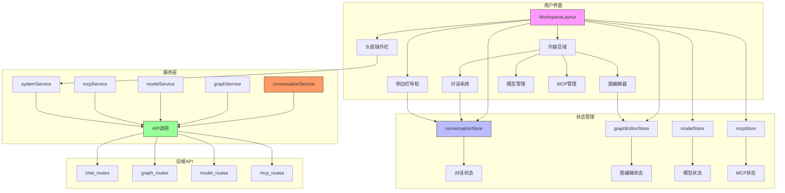
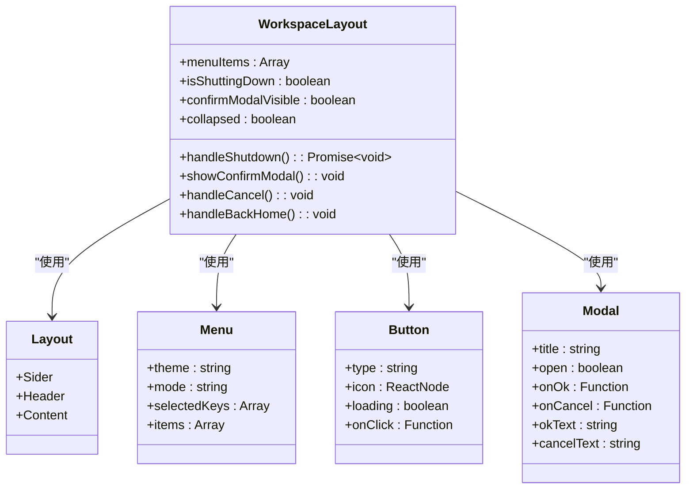
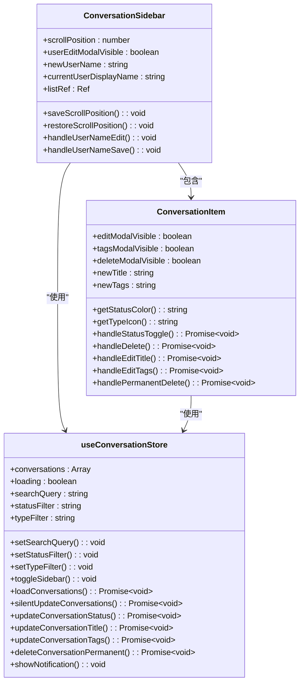
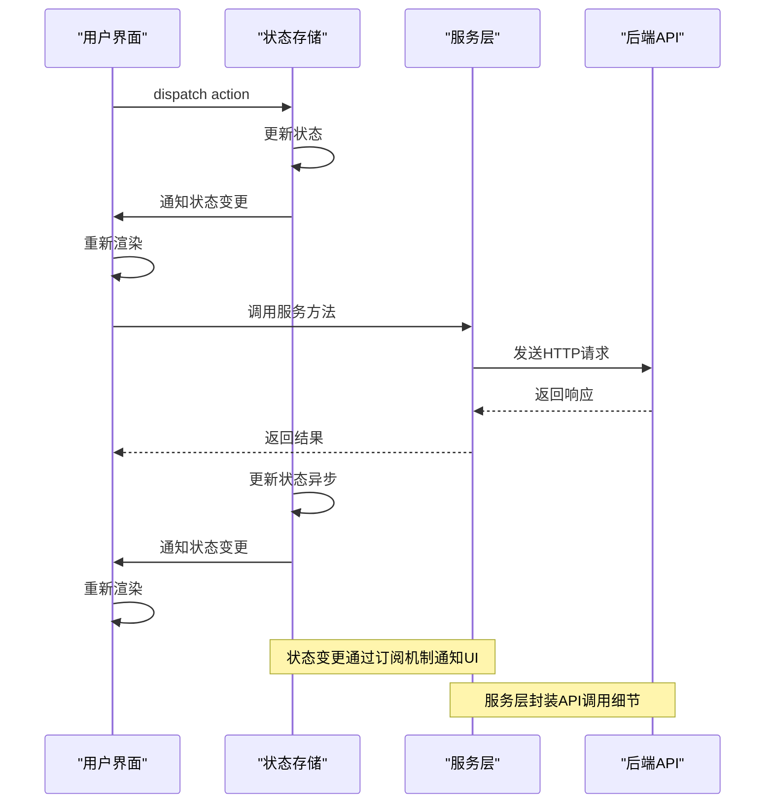

# 工作区页面

<cite>
**本文档引用的文件**   
- [Workspace.tsx](file://frontend/src/pages/Workspace.tsx)
- [WorkspaceLayout.tsx](file://frontend/src/layouts/WorkspaceLayout.tsx)
- [ConversationSidebar.tsx](file://frontend/src/components/chat/ConversationSidebar.tsx)
- [conversationStore.ts](file://frontend/src/store/conversationStore.ts)
- [graphEditorStore.ts](file://frontend/src/store/graphEditorStore.ts)
- [GraphEditor.tsx](file://frontend/src/pages/GraphEditor.tsx)
- [ChatSystem.tsx](file://frontend/src/pages/ChatSystem.tsx)
- [conversationService.ts](file://frontend/src/services/conversationService.ts)
- [api.ts](file://frontend/src/services/api.ts)
- [conversation.ts](file://frontend/src/types/conversation.ts)
</cite>

## 目录
1. [简介](#简介)
2. [项目结构](#项目结构)
3. [核心组件](#核心组件)
4. [架构概述](#架构概述)
5. [详细组件分析](#详细组件分析)
6. [依赖分析](#依赖分析)
7. [性能考虑](#性能考虑)
8. [故障排除指南](#故障排除指南)
9. [结论](#结论)

## 简介
工作区页面是MCP Agent Graph系统的核心集成环境，为用户提供统一的交互界面来管理图编辑器、对话系统、模型管理、MCP管理等多个功能模块。该页面通过`WorkspaceLayout`提供一致的布局框架，整合了`ConversationSidebar`实现会话导航，并通过状态管理机制协调各模块间的数据共享。用户可以通过工作区快速访问图形编辑器、模型管理、MCP管理等核心功能，形成高效的工作流。系统还提供了上下文管理、资源协调加载和用户操作流的串联逻辑，确保各模块能够无缝协作。

## 项目结构

**图源**
- [Workspace.tsx](file://frontend/src/pages/Workspace.tsx)
- [WorkspaceLayout.tsx](file://frontend/src/layouts/WorkspaceLayout.tsx)
- [ConversationSidebar.tsx](file://frontend/src/components/chat/ConversationSidebar.tsx)
- [GraphEditor.tsx](file://frontend/src/pages/GraphEditor.tsx)
- [ChatSystem.tsx](file://frontend/src/pages/ChatSystem.tsx)
- [conversationStore.ts](file://frontend/src/store/conversationStore.ts)
- [graphEditorStore.ts](file://frontend/src/store/graphEditorStore.ts)
- [conversationService.ts](file://frontend/src/services/conversationService.ts)
- [api.ts](file://frontend/src/services/api.ts)
- [conversation.ts](file://frontend/src/types/conversation.ts)

**节源**
- [Workspace.tsx](file://frontend/src/pages/Workspace.tsx)
- [WorkspaceLayout.tsx](file://frontend/src/layouts/WorkspaceLayout.tsx)

## 核心组件

工作区页面的核心组件包括`WorkspaceLayout`、`ConversationSidebar`和各功能模块页面。`WorkspaceLayout`作为基础布局组件，提供了统一的侧边栏导航和头部操作区域，确保用户在不同模块间切换时保持一致的用户体验。`ConversationSidebar`实现了会话导航功能，允许用户管理、筛选和搜索对话记录。各功能模块如图编辑器和对话系统通过路由集成到工作区中，共享状态管理机制。这些组件通过Zustand状态管理库实现状态共享，通过Ant Design组件库确保UI一致性，并通过SSE（Server-Sent Events）实现与后端的实时通信。

**节源**
- [WorkspaceLayout.tsx](file://frontend/src/layouts/WorkspaceLayout.tsx)
- [ConversationSidebar.tsx](file://frontend/src/components/chat/ConversationSidebar.tsx)
- [GraphEditor.tsx](file://frontend/src/pages/GraphEditor.tsx)
- [ChatSystem.tsx](file://frontend/src/pages/ChatSystem.tsx)

## 架构概述

**图源**
- [WorkspaceLayout.tsx](file://frontend/src/layouts/WorkspaceLayout.tsx)
- [conversationStore.ts](file://frontend/src/store/conversationStore.ts)
- [graphEditorStore.ts](file://frontend/src/store/graphEditorStore.ts)
- [conversationService.ts](file://frontend/src/services/conversationService.ts)
- [api.ts](file://frontend/src/services/api.ts)

## 详细组件分析

### WorkspaceLayout分析

`WorkspaceLayout`是工作区的基础布局组件，采用Ant Design的Layout组件实现侧边栏和内容区域的布局。布局包含左侧的导航侧边栏和右侧的主内容区域，侧边栏显示系统Logo和模块导航菜单，内容区域显示当前选中的功能模块。头部包含折叠/展开侧边栏按钮、工作台标题和系统操作按钮（返回首页、关闭系统）。布局支持响应式设计，用户可以折叠侧边栏以获得更大的工作空间。通过`useState`管理折叠状态，并将状态保存到`localStorage`中，确保用户刷新页面后仍保持之前的布局状态。

**图源**
- [WorkspaceLayout.tsx](file://frontend/src/layouts/WorkspaceLayout.tsx)

**节源**
- [WorkspaceLayout.tsx](file://frontend/src/layouts/WorkspaceLayout.tsx)

### ConversationSidebar分析

`ConversationSidebar`组件实现了会话导航功能，允许用户管理、筛选和搜索对话记录。侧边栏包含搜索框、状态筛选（普通、收藏、移除）、类型筛选（Chat、Agent、Graph）和对话列表。每个对话项显示标题、状态指示器和操作菜单，支持收藏、编辑标题、编辑标签和删除操作。侧边栏还显示用户信息，点击可编辑用户名。组件通过`useConversationStore`访问对话状态，支持实时更新和滚动位置记忆。侧边栏可以折叠，折叠后仅显示展开按钮，节省屏幕空间。

**图源**
- [ConversationSidebar.tsx](file://frontend/src/components/chat/ConversationSidebar.tsx)
- [conversationStore.ts](file://frontend/src/store/conversationStore.ts)

**节源**
- [ConversationSidebar.tsx](file://frontend/src/components/chat/ConversationSidebar.tsx)
- [conversationStore.ts](file://frontend/src/store/conversationStore.ts)

### 状态共享机制分析

工作区页面通过Zustand状态管理库实现多模块间的状态共享。`conversationStore`管理对话相关的全局状态，包括对话列表、当前对话、搜索筛选条件、SSE连接状态等。`graphEditorStore`管理图编辑器相关的状态，包括图列表、当前图配置、节点信息等。各组件通过`useConversationStore`和`useGraphEditorStore`钩子访问和更新共享状态。状态更新采用不可变方式，确保React组件能够正确检测到状态变化并重新渲染。状态变更后，相关组件会自动更新UI，实现数据驱动的界面更新。

**图源**
- [conversationStore.ts](file://frontend/src/store/conversationStore.ts)
- [graphEditorStore.ts](file://frontend/src/store/graphEditorStore.ts)
- [conversationService.ts](file://frontend/src/services/conversationService.ts)

**节源**
- [conversationStore.ts](file://frontend/src/store/conversationStore.ts)
- [graphEditorStore.ts](file://frontend/src/store/graphEditorStore.ts)
- [conversationService.ts](file://frontend/src/services/conversationService.ts)

## 依赖分析

```mermaid
graph TD
A[Workspace.tsx] --> B[WorkspaceLayout.tsx]
B --> C[Layout]
B --> D[Menu]
B --> E[Button]
B --> F[Modal]
B --> G[Link]
B --> H[shutdownSystem]
I[ConversationSidebar.tsx] --> J[Input]
I[ConversationSidebar.tsx] --> K[Menu]
I[ConversationSidebar.tsx] --> L[Dropdown]
I[ConversationSidebar.tsx] --> M[Button]
I[ConversationSidebar.tsx] --> N[Modal]
I[ConversationSidebar.tsx] --> O[Tag]
I[ConversationSidebar.tsx] --> P[Badge]
I[ConversationSidebar.tsx] --> Q[Tooltip]
I[ConversationSidebar.tsx] --> R[Empty]
I[ConversationSidebar.tsx] --> S[Spin]
I[ConversationSidebar.tsx] --> T[useNavigate]
I[ConversationSidebar.tsx] --> U[useConversationStore]
I[ConversationSidebar.tsx] --> V[ConversationSummary]
I[ConversationSidebar.tsx] --> W[getCurrentUserDisplayName]
I[ConversationSidebar.tsx] --> X[setUserConfig]
I[ConversationSidebar.tsx] --> Y[getUserConfig]
I[ConversationSidebar.tsx] --> Z[formatDistanceToNow]
AA[conversationStore.ts] --> AB[create]
AA[conversationStore.ts] --> AC[subscribeWithSelector]
AA[conversationStore.ts] --> AD[ConversationService]
AA[conversationStore.ts] --> AE[ConversationStorage]
AA[conversationStore.ts] --> AF[message]
AE[ConversationStorage] --> AG[localStorage]
AE[ConversationStorage] --> AH[sessionStorage]
AI[conversationService.ts] --> AJ[axios]
AI[conversationService.ts] --> AK[getCurrentUserId]
AJ[axios] --> AL[API_BASE_URL]
style A fill:#f9f,stroke:#333
style B fill:#f9f,stroke:#333
style I fill:#f9f,stroke:#333
style AA fill:#f9f,stroke:#333
style AI fill:#f9f,stroke:#333
```

**图源**
- [Workspace.tsx](file://frontend/src/pages/Workspace.tsx)
- [WorkspaceLayout.tsx](file://frontend/src/layouts/WorkspaceLayout.tsx)
- [ConversationSidebar.tsx](file://frontend/src/components/chat/ConversationSidebar.tsx)
- [conversationStore.ts](file://frontend/src/store/conversationStore.ts)
- [conversationService.ts](file://frontend/src/services/conversationService.ts)
- [api.ts](file://frontend/src/services/api.ts)

**节源**
- [Workspace.tsx](file://frontend/src/pages/Workspace.tsx)
- [WorkspaceLayout.tsx](file://frontend/src/layouts/WorkspaceLayout.tsx)
- [ConversationSidebar.tsx](file://frontend/src/components/chat/ConversationSidebar.tsx)
- [conversationStore.ts](file://frontend/src/store/conversationStore.ts)
- [conversationService.ts](file://frontend/src/services/conversationService.ts)
- [api.ts](file://frontend/src/services/api.ts)

## 性能考虑

工作区页面在性能方面采取了多项优化措施。首先，通过`localStorage`缓存对话列表，减少重复的API调用，提高加载速度。其次，实现静默更新机制，定期后台更新对话列表而不影响用户当前操作。第三，采用虚拟滚动和分页加载策略，避免一次性加载大量数据导致页面卡顿。第四，合理使用React的`useMemo`和`useCallback`钩子，避免不必要的组件重新渲染。第五，通过`sessionStorage`存储当前对话详情，避免在对话切换时重复加载相同数据。最后，实现滚动位置记忆功能，提升用户体验的连贯性。

## 故障排除指南

当工作区页面出现问题时，可以按照以下步骤进行排查：

1. **检查网络连接**：确保前端能够访问后端API服务，检查`api.ts`中的`API_BASE_URL`配置是否正确。
2. **检查状态管理**：使用浏览器开发者工具检查Zustand状态是否正确更新，特别是`conversationStore`和`graphEditorStore`中的关键状态。
3. **检查SSE连接**：如果实时通信出现问题，检查`useSSEConnection`钩子的实现，确保事件流能够正确建立和处理。
4. **检查组件依赖**：确保所有组件正确导入所需的依赖，特别是Ant Design组件和React相关钩子。
5. **检查路由配置**：确保React Router的路由配置正确，能够正确导航到各个功能模块。
6. **检查权限问题**：某些操作可能需要特定的用户权限，检查后端API的权限验证逻辑。
7. **检查缓存问题**：清除`localStorage`和`sessionStorage`中的缓存数据，排除缓存导致的问题。

**节源**
- [conversationStore.ts](file://frontend/src/store/conversationStore.ts)
- [conversationService.ts](file://frontend/src/services/conversationService.ts)
- [api.ts](file://frontend/src/services/api.ts)

## 结论

工作区页面成功整合了图编辑器、对话系统等核心模块，形成了统一的工作环境。通过`WorkspaceLayout`提供的标准化布局，`ConversationSidebar`实现的会话导航功能，以及基于Zustand的状态共享机制，系统实现了各模块间的无缝协作。工作区上下文管理、资源协调加载和用户操作流的串联逻辑确保了用户体验的一致性和流畅性。为集成新工作模块提供了清晰的布局适配、状态同步和导航集成方案，只需遵循现有的组件规范和状态管理模式即可快速集成新功能。整体架构清晰，扩展性强，为系统的持续发展奠定了坚实基础。