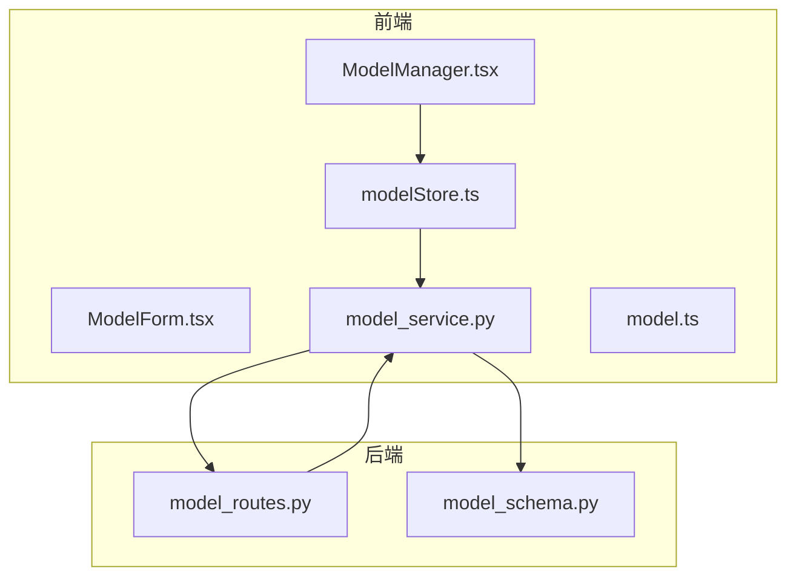
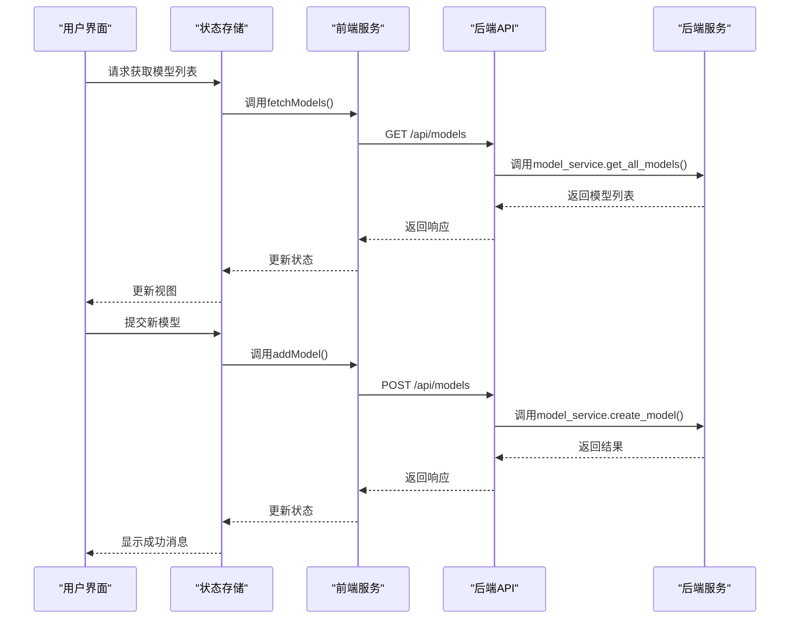
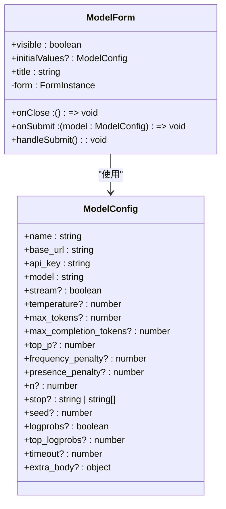
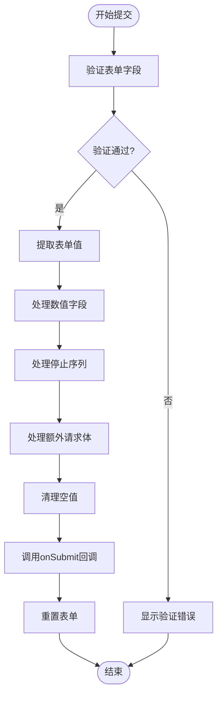
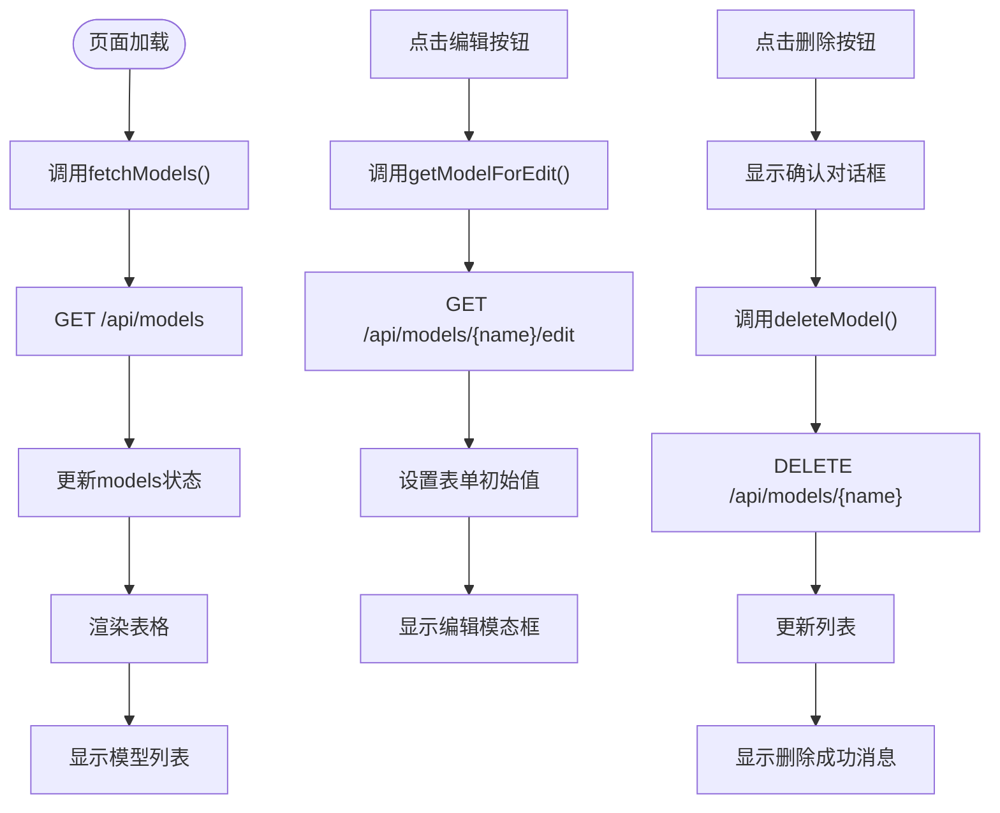
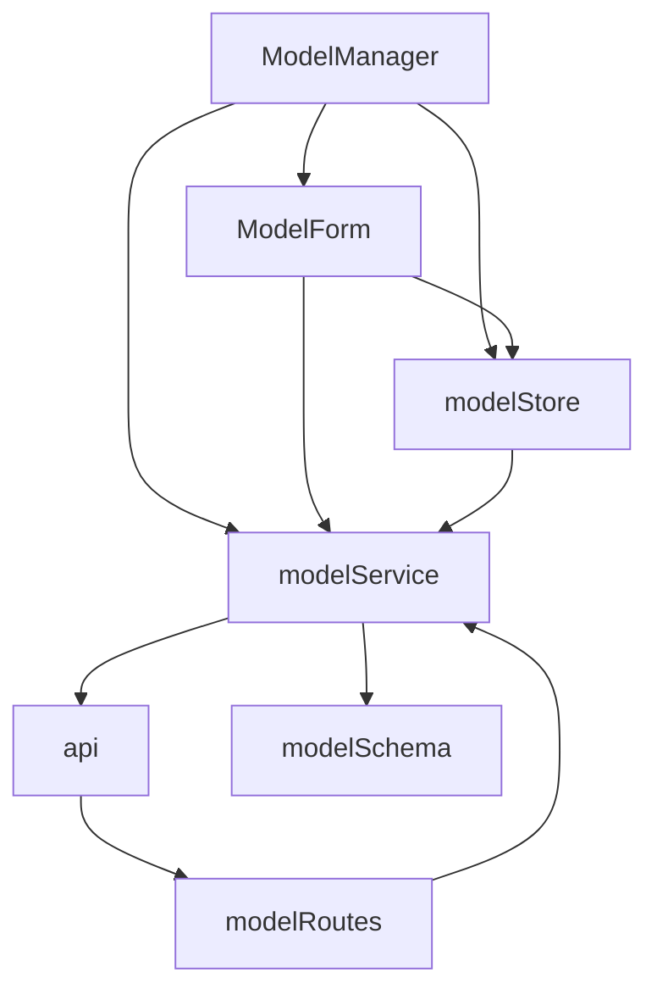

# 模型管理页面

<cite>
**本文档引用的文件**
- [ModelManager.tsx](file://frontend/src/pages/ModelManager.tsx)
- [ModelForm.tsx](file://frontend/src/components/model-manager/ModelForm.tsx)
- [modelService.ts](file://frontend/src/services/modelService.ts)
- [model.ts](file://frontend/src/types/model.ts)
- [modelStore.ts](file://frontend/src/store/modelStore.ts)
- [model_routes.py](file://mag/app/api/model_routes.py)
- [model_service.py](file://mag/app/services/model_service.py)
- [model_schema.py](file://mag/app/models/model_schema.py)
</cite>

## 目录
1. [简介](#简介)
2. [项目结构](#项目结构)
3. [核心组件](#核心组件)
4. [架构概览](#架构概览)
5. [详细组件分析](#详细组件分析)
6. [依赖分析](#依赖分析)
7. [性能考虑](#性能考虑)
8. [故障排除指南](#故障排除指南)
9. [结论](#结论)

## 简介
本系统提供了一个完整的模型管理界面，用于配置、编辑和删除AI模型。该系统包含前端表单、状态管理、服务调用以及后端API和数据处理逻辑。用户可以通过图形界面管理模型配置，包括基础信息、高级参数和自定义请求体。

## 项目结构
模型管理功能分布在前后端多个模块中，形成清晰的分层架构。

**Diagram sources**
- [ModelManager.tsx](file://frontend/src/pages/ModelManager.tsx#L1-L157)
- [ModelForm.tsx](file://frontend/src/components/model-manager/ModelForm.tsx#L1-L399)
- [model_routes.py](file://mag/app/api/model_routes.py#L1-L50)

## 核心组件
系统的核心组件包括模型配置表单(ModelForm)、模型管理页面(ModelManager)、模型状态存储(modelStore)和模型服务(modelService)。这些组件协同工作，实现了模型的增删改查功能。

**Section sources**
- [ModelManager.tsx](file://frontend/src/pages/ModelManager.tsx#L1-L157)
- [ModelForm.tsx](file://frontend/src/components/model-manager/ModelForm.tsx#L1-L399)

## 架构概览
系统采用前后端分离架构，前端使用React和Ant Design构建用户界面，通过Zustand进行状态管理；后端使用Python Flask提供RESTful API，MongoDB存储模型配置。

**Diagram sources**
- [ModelManager.tsx](file://frontend/src/pages/ModelManager.tsx#L1-L157)
- [modelService.ts](file://frontend/src/services/modelService.ts#L1-L30)
- [model_routes.py](file://mag/app/api/model_routes.py#L1-L50)

## 详细组件分析

### 模型配置表单分析
模型配置表单(ModelForm)是用户输入和编辑模型配置的核心组件，实现了字段绑定、验证和数据处理逻辑。

#### 表单字段绑定与验证

**Diagram sources**
- [ModelForm.tsx](file://frontend/src/components/model-manager/ModelForm.tsx#L1-L399)
- [model.ts](file://frontend/src/types/model.ts#L1-L20)

#### 表单提交流程

**Diagram sources**
- [ModelForm.tsx](file://frontend/src/components/model-manager/ModelForm.tsx#L1-L399)

### 模型管理页面分析
模型管理页面(ModelManager)负责展示模型列表并处理用户交互操作。

#### 模型列表展示逻辑

**Diagram sources**
- [ModelManager.tsx](file://frontend/src/pages/ModelManager.tsx#L1-L157)

## 依赖分析
系统各组件之间存在明确的依赖关系，形成了清晰的数据流和控制流。

**Diagram sources**
- [ModelManager.tsx](file://frontend/src/pages/ModelManager.tsx#L1-L157)
- [ModelForm.tsx](file://frontend/src/components/model-manager/ModelForm.tsx#L1-L399)
- [modelStore.ts](file://frontend/src/store/modelStore.ts#L1-L50)
- [modelService.ts](file://frontend/src/services/modelService.ts#L1-L30)

## 性能考虑
系统在性能方面进行了多项优化，包括：
- 使用状态管理(store)避免重复API调用
- 在编辑模式下按需加载完整配置
- 对表单数据进行清理，只发送有值的参数
- 使用Ant Design的优化组件提高渲染性能

## 故障排除指南
常见问题及解决方案：

**Section sources**
- [ModelManager.tsx](file://frontend/src/pages/ModelManager.tsx#L1-L157)
- [ModelForm.tsx](file://frontend/src/components/model-manager/ModelForm.tsx#L1-L399)

### 模型无法添加或更新
- 检查必填字段是否完整（名称、基础URL、模型标识符）
- 确认API密钥格式正确
- 查看浏览器控制台是否有验证错误
- 检查网络请求是否成功

### 编辑时无法加载完整配置
- 确认后端`/api/models/{name}/edit`接口是否正常工作
- 检查模型是否存在
- 查看网络错误信息

### JSON格式错误
- 确保"额外请求参数"字段中的JSON语法正确
- 使用标准JSON格式（双引号）
- 避免注释和尾随逗号

## 结论
模型管理页面提供了一套完整的解决方案，用于管理AI模型配置。系统设计合理，前后端分离清晰，具有良好的可维护性和扩展性。通过合理的状态管理和错误处理，确保了用户体验的流畅性。