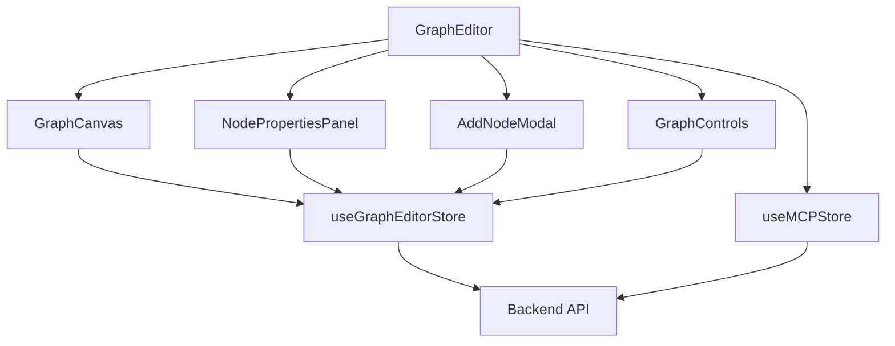
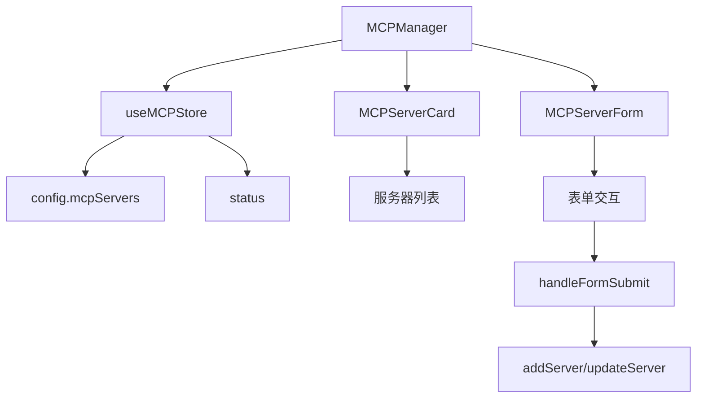

# 页面结构与路由

<cite>
**本文档引用的文件**
- [App.tsx](file://frontend/src/App.tsx)
- [GraphEditor.tsx](file://frontend/src/pages/GraphEditor.tsx)
- [MCPManager.tsx](file://frontend/src/pages/MCPManager.tsx)
- [ModelManager.tsx](file://frontend/src/pages/ModelManager.tsx)
- [Home.tsx](file://frontend/src/pages/Home.tsx)
- [WorkspaceLayout.tsx](file://frontend/src/layouts/WorkspaceLayout.tsx)
- [GraphCanvas.tsx](file://frontend/src/components/graph-editor/GraphCanvas.tsx)
- [NodePropertiesPanel.tsx](file://frontend/src/components/graph-editor/NodePropertiesPanel.tsx)
- [MCPServerCard.tsx](file://frontend/src/components/mcp-manager/MCPServerCard.tsx)
- [MCPServerForm.tsx](file://frontend/src/components/mcp-manager/MCPServerForm.tsx)
</cite>

## 目录
1. [项目结构概述](#项目结构概述)
2. [核心页面功能与实现](#核心页面功能与实现)
   - [GraphEditor 页面](#grapheditor-页面)
   - [MCPManager 页面](#mcpmanager-页面)
   - [ModelManager 页面](#modelmanager-页面)
   - [Home 页面](#home-页面)
3. [路由机制与权限控制](#路由机制与权限控制)
4. [新页面添加流程与最佳实践](#新页面添加流程与最佳实践)

## 项目结构概述

本项目采用典型的前端分层架构，主要目录结构如下：

- `frontend/src/components`：存放可复用的UI组件，按功能模块组织，如 `graph-editor`、`mcp-manager` 等。
- `frontend/src/pages`：存放页面级组件，每个页面对应一个独立的 `.tsx` 文件。
- `frontend/src/layouts`：存放布局组件，如 `WorkspaceLayout.tsx` 用于工作台的主布局。
- `frontend/src/store`：使用 Zustand 管理全局状态，如 `graphEditorStore.ts` 管理图编辑器状态。
- `frontend/src/services`：封装与后端API的交互逻辑。

**Section sources**
- [App.tsx](file://frontend/src/App.tsx)

## 核心页面功能与实现

### GraphEditor 页面

`GraphEditor` 页面是系统的核心，集成了 `GraphCanvas`、`NodePropertiesPanel` 等子组件，通过 `useGraphEditorStore` 和 `useMCPStore` 共享状态。

- **GraphCanvas 集成**：`GraphCanvas` 组件使用 `reactflow` 库渲染图形画布。它通过 `useGraphEditorStore` 获取当前图的节点和边数据，并将其转换为 `reactflow` 所需的格式。画布支持拖拽、缩放、连接节点等交互操作。
- **NodePropertiesPanel 协调**：当用户在画布上选择一个节点时，`GraphEditor` 会通过 `selectNode` 更新状态，`NodePropertiesPanel` 监听 `selectedNode` 变化并显示该节点的属性。属性的修改通过 `updateNode` 同步回 `graphEditorStore`。
- **状态管理**：`GraphEditor` 使用 `useState` 和 `useEffect` 管理本地状态（如模态框可见性），并通过 `useGraphEditorStore` 访问和修改全局图状态。`useEffect` 在组件挂载时加载图列表和MCP服务器状态。



**Diagram sources**
- [GraphEditor.tsx](file://frontend/src/pages/GraphEditor.tsx)
- [GraphCanvas.tsx](file://frontend/src/components/graph-editor/GraphCanvas.tsx)
- [NodePropertiesPanel.tsx](file://frontend/src/components/graph-editor/NodePropertiesPanel.tsx)

**Section sources**
- [GraphEditor.tsx](file://frontend/src/pages/GraphEditor.tsx)
- [GraphCanvas.tsx](file://frontend/src/components/graph-editor/GraphCanvas.tsx)
- [NodePropertiesPanel.tsx](file://frontend/src/components/graph-editor/NodePropertiesPanel.tsx)

### MCPManager 页面

`MCPManager` 页面负责MCP服务器的管理，其核心是服务器列表的渲染和表单交互。

- **服务器列表渲染**：页面从 `useMCPStore` 获取 `config.mcpServers` 配置和 `status` 状态。使用 `Object.keys` 遍历服务器名称，并为每个服务器渲染一个 `MCPServerCard` 组件。`MCPServerCard` 显示服务器名称、连接状态、传输类型等信息，并根据状态显示不同的操作按钮（连接/断开）。
- **表单交互逻辑**：点击“添加服务器”或“编辑”按钮会打开 `MCPServerForm` 模态框。该表单根据 `transportType` 动态显示不同的字段（如 `stdio` 显示命令和参数，`sse` 显示URL）。表单提交时，`handleFormSubmit` 会调用 `addServer` 或 `updateServer`，并将环境变量字符串转换为对象格式。



**Diagram sources**
- [MCPManager.tsx](file://frontend/src/pages/MCPManager.tsx)
- [MCPServerCard.tsx](file://frontend/src/components/mcp-manager/MCPServerCard.tsx)
- [MCPServerForm.tsx](file://frontend/src/components/mcp-manager/MCPServerForm.tsx)

**Section sources**
- [MCPManager.tsx](file://frontend/src/pages/MCPManager.tsx)
- [MCPServerCard.tsx](file://frontend/src/components/mcp-manager/MCPServerCard.tsx)
- [MCPServerForm.tsx](file://frontend/src/components/mcp-manager/MCPServerForm.tsx)

### ModelManager 页面

`ModelManager` 页面提供模型配置的管理界面，主要功能是展示模型列表和提供增删改操作。

- **模型配置界面**：使用 `Ant Design` 的 `Table` 组件展示 `models` 列表。`columns` 定义了“名称”、“基础URL”、“模型标识”和“操作”列。操作列包含“编辑”和“删除”按钮。
- **编辑流程**：点击“编辑”会触发 `showEditModal`，该函数会先调用 `modelService.getModelForEdit` 获取完整的模型配置，然后打开 `ModelForm` 模态框。`ModelForm` 是一个通用的表单组件，用于添加或编辑模型。

**Section sources**
- [ModelManager.tsx](file://frontend/src/pages/ModelManager.tsx)

### Home 页面

`Home` 页面是应用的入口，其设计重点是提供清晰的导航入口。

- **导航入口设计**：页面采用大按钮设计，引导用户进入“工作台”或“对话系统”。使用 `useNavigate` 实现路由跳转。`handleEnterWorkspace` 和 `handleEnterChat` 函数分别导航到 `/workspace` 和 `/chat` 路由。
- **视觉设计**：页面使用 `Home.css` 进行样式定制，包括背景、按钮样式和布局。核心特性通过图标和文字展示，增强用户体验。

**Section sources**
- [Home.tsx](file://frontend/src/pages/Home.tsx)

## 路由机制与权限控制

### 路由机制

项目使用 `React Router` 实现路由管理，核心配置在 `App.tsx` 中。

- **路由定义**：`<Routes>` 组件内定义了多个 `<Route>`。根路径 `/` 指向 `Home` 页面。`/workspace` 路径使用 `WorkspaceLayout` 作为布局容器，其子路由（如 `/workspace/graph-editor`）将页面组件嵌入布局中。
- **路由重定向**：为了兼容旧路由，使用 `<Navigate>` 组件将 `/graph-editor` 等旧路径重定向到新的 `/workspace/graph-editor` 路径。

```mermaid
graph TB
A[/] --> B[Home]
C[/chat] --> D[ChatSystem]
E[/workspace] --> F[WorkspaceLayout]
F --> G[/workspace/graph-editor]
F --> H[/workspace/model-manager]
F --> I[/workspace/mcp-manager]
J[/graph-editor] --> K[Navigate to /workspace/graph-editor]
L[/model-manager] --> M[Navigate to /workspace/model-manager]
N[/mcp-manager] --> O[Navigate to /workspace/mcp-manager]
```

**Diagram sources**
- [App.tsx](file://frontend/src/App.tsx)

### 权限控制

当前代码库中未实现显式的权限控制（如用户登录、角色权限）。路由跳转是开放的，任何用户都可以访问所有页面。如果未来需要添加权限，可以在 `App.tsx` 的路由定义中加入权限检查逻辑，例如使用高阶组件或路由守卫。

**Section sources**
- [App.tsx](file://frontend/src/App.tsx)

## 新页面添加流程与最佳实践

### 新页面添加标准流程

1.  **创建页面文件**：在 `frontend/src/pages` 目录下创建新的 `.tsx` 文件，例如 `NewPage.tsx`。
2.  **编写页面组件**：导入必要的依赖，使用函数式组件定义页面内容。
3.  **配置路由**：在 `App.tsx` 的 `<Routes>` 中添加新的 `<Route>`，指定 `path` 和 `element`。
4.  **添加导航**：如果需要，将新页面的入口添加到 `WorkspaceLayout` 或其他导航组件中。

### 最佳实践

- **样式隔离**：为每个页面或组件创建独立的CSS文件（如 `NewPage.css`），并在组件中导入。避免使用全局样式污染。
- **资源懒加载**：对于非首屏加载的页面，可以使用 `React.lazy` 和 `Suspense` 进行代码分割和懒加载，例如：
    ```tsx
    const NewPage = React.lazy(() => import('./pages/NewPage'));
    ...
    <Route path="/new-page" element={<Suspense fallback={<Spin />}><NewPage /></Suspense>} />
    ```
- **SEO优化建议**：虽然本项目是SPA，但仍可通过以下方式优化SEO：
    - 在 `index.html` 中设置合理的 `<title>` 和 `<meta>` 标签。
    - 使用 `react-helmet` 等库动态更新页面标题和描述。
    - 配置服务器端渲染（SSR）或静态站点生成（SSG）以提升首屏加载速度和搜索引擎抓取效果。

**Section sources**
- [App.tsx](file://frontend/src/App.tsx)