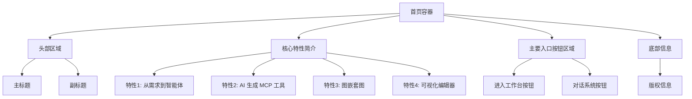
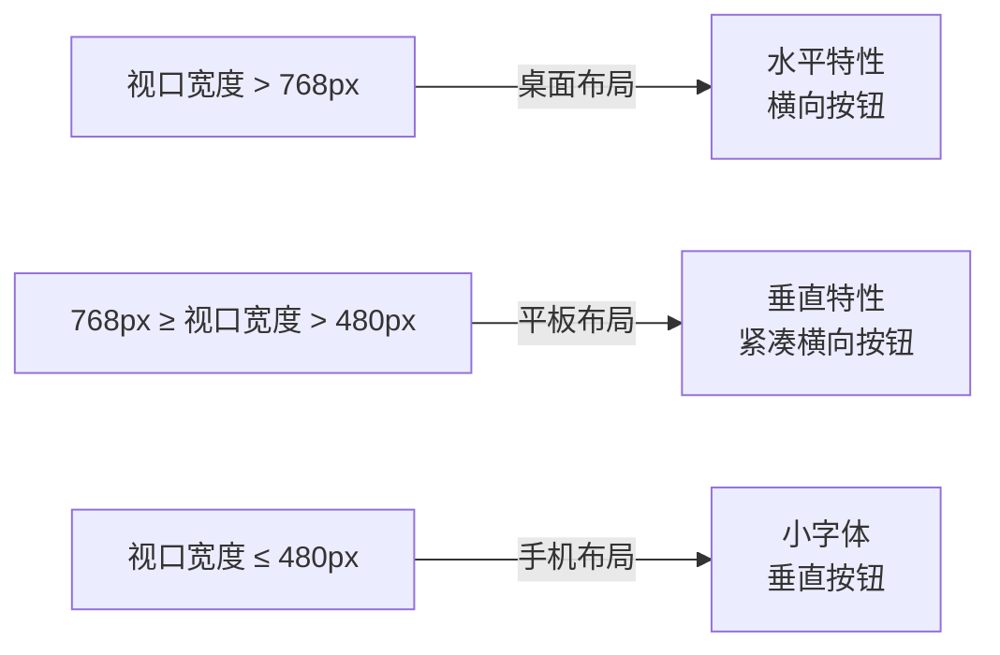
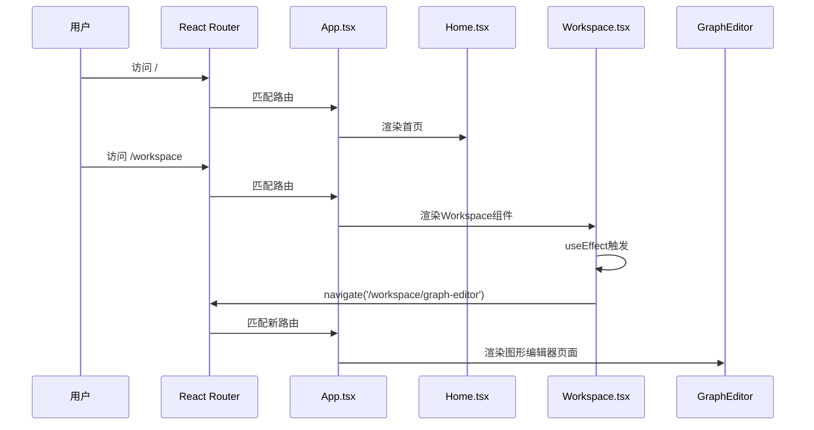

# 首页

<cite>
**本文档中引用的文件**  
- [Home.tsx](file://frontend/src/pages/Home.tsx)
- [Home.css](file://frontend/src/pages/Home.css)
- [MainLayout.tsx](file://frontend/src/layouts/MainLayout.tsx)
- [App.tsx](file://frontend/src/App.tsx)
- [Workspace.tsx](file://frontend/src/pages/Workspace.tsx)
</cite>

## 目录
1. [简介](#简介)
2. [页面布局结构](#页面布局结构)
3. [核心功能入口与UI组织](#核心功能入口与ui组织)
4. [响应式设计实现](#响应式设计实现)
5. [与MainLayout的集成与路由逻辑](#与mainlayout的集成与路由逻辑)
6. [用户体验优化策略](#用户体验优化策略)
7. [新功能入口添加指南](#新功能入口添加指南)
8. [结论](#结论)

## 简介
首页（Home）是MCP Agent Graph系统的导航中枢，承担着引导用户进入核心功能模块的关键角色。该页面通过简洁直观的视觉设计和流畅的交互体验，为用户提供“进入工作台”和“对话系统”两大核心入口。页面采用渐变背景、动态动画和响应式布局，确保在不同设备上均能提供一致且现代的用户体验。其设计目标是降低用户认知负荷，快速引导用户进入工作流。

**Section sources**
- [Home.tsx](file://frontend/src/pages/Home.tsx#L1-L101)
- [Home.css](file://frontend/src/pages/Home.css#L1-L379)

## 页面布局结构
首页的布局采用垂直居中的设计，整体结构清晰，分为四个主要区域：
1.  **头部区域（Header）**：位于页面顶部，包含系统主标题“MCP Agent Graph”和副标题“高效、轻量、易上手的 Agent 开发框架”，用于品牌展示和价值传达。
2.  **核心特性简介（Features Brief）**：位于头部下方，以水平排列的图标和文字展示系统的四大核心特性：“从需求到智能体”、“AI 生成 MCP 工具”、“图嵌套图”和“可视化编辑器”，帮助用户快速了解系统能力。
3.  **主要入口按钮区域（Main Actions）**：页面的核心交互区，包含两个水平排列的长条形卡片按钮：“进入工作台”和“对话系统”。此区域是用户进入系统功能的主要通道。
4.  **底部信息（Footer）**：位于页面底部，显示版权信息“© 2025 MCP Agent Graph - 让智能体开发变得简单”。

整个布局通过`flex-direction: column`实现垂直堆叠，并利用`justify-content: center`和`align-items: center`实现内容在视口中的居中对齐。



**Diagram sources**
- [Home.tsx](file://frontend/src/pages/Home.tsx#L1-L101)
- [Home.css](file://frontend/src/pages/Home.css#L1-L379)

**Section sources**
- [Home.tsx](file://frontend/src/pages/Home.tsx#L1-L101)
- [Home.css](file://frontend/src/pages/Home.css#L1-L379)

## 核心功能入口与UI组织
首页的核心功能入口通过两个视觉突出的“长条形卡片按钮”（Action Bar）来组织，其UI设计具有高度的可识别性和点击引导性。

### 进入工作台 (Workspace)
- **图标**：使用`DesktopOutlined`图标，直观代表工作台和图形化操作环境。
- **文本**：主标题为“进入工作台”，副标题为“GRAPH • MODEL • MCP 管理”，明确告知用户此入口的功能范围。
- **视觉**：采用蓝绿色渐变背景（`linear-gradient(135deg, #4facfe 0%, #00f2fe 100%)`），传递专业、可靠的感觉。
- **交互**：点击后通过`useNavigate`钩子跳转至`/workspace`路由。

### 对话系统 (Chat System)
- **图标**：使用`MessageOutlined`图标，代表对话和聊天功能。
- **文本**：主标题为“对话系统”，副标题为“CHAT • AGENT • GRAPH 运行”，表明此入口用于与智能体进行交互和运行流程。
- **视觉**：采用青绿色渐变背景（`linear-gradient(135deg, #43e97b 0%, #38f9d7 100%)`），传递活力、互动的感觉。
- **交互**：点击后跳转至`/chat`路由。

两个按钮均设计有悬停动效：
- **悬停效果**：鼠标悬停时，按钮会轻微上移（`transform: translateY(-3px)`）并增强阴影（`box-shadow`），提供明确的点击反馈。
- **光效动画**：按钮内部有一个从左到右扫过的高光（通过`::before`伪元素和`animation: float`实现），模拟光线掠过的效果，增加视觉吸引力。
- **箭头动效**：右侧的箭头图标（`bar-arrow`）带有持续的“弹跳”动画（`animation: bounce`），动态引导用户进行点击操作。

```mermaid
classDiagram
class ActionButton {
+icon : ReactNode
+title : string
+subtitle : string
+onClick() : void
+hoverEffect() : void
+shineAnimation() : void
+arrowBounce() : void
}
ActionButton : -background : linear-gradient
ActionButton : -cursor : pointer
ActionButton : -transition : all 0.3s ease
class WorkspaceButton {
+icon : DesktopOutlined
+title : "进入工作台"
+subtitle : "GRAPH • MODEL • MCP 管理"
+onClick() : navigate('/workspace')
}
class ChatButton {
+icon : MessageOutlined
+title : "对话系统"
+subtitle : "CHAT • AGENT • GRAPH 运行"
+onClick() : navigate('/chat')
}
ActionButton <|-- WorkspaceButton
ActionButton <|-- ChatButton
```

**Diagram sources**
- [Home.tsx](file://frontend/src/pages/Home.tsx#L1-L101)
- [Home.css](file://frontend/src/pages/Home.css#L1-L379)

**Section sources**
- [Home.tsx](file://frontend/src/pages/Home.tsx#L1-L101)
- [Home.css](file://frontend/src/pages/Home.css#L1-L379)

## 响应式设计实现
首页通过CSS媒体查询（Media Queries）实现了完整的响应式设计，确保在桌面端、平板和手机等不同尺寸的屏幕上都能提供良好的用户体验。

### 关键断点与调整
- **桌面端 (> 768px)**：采用默认布局，特性图标水平排列，入口按钮为横向长条形。
- **平板 (≤ 768px)**：
  - 特性图标区域从水平排列变为垂直堆叠（`flex-direction: column`）。
  - 入口按钮的内边距和字体大小适当减小。
  - 按钮内部的图标和文本变为垂直排列，以适应更窄的屏幕。
- **手机 (≤ 480px)**：
  - 主标题和副标题的字体进一步缩小。
  - 入口按钮的内边距再次减小，整体更加紧凑。
  - 特性图标之间的间距减小，避免内容过于分散。

所有调整均通过`@media (max-width: ...)`规则在`Home.css`文件中定义，确保了布局的流畅过渡和内容的可读性。



**Diagram sources**
- [Home.css](file://frontend/src/pages/Home.css#L320-L377)

**Section sources**
- [Home.css](file://frontend/src/pages/Home.css#L320-L377)

## 与MainLayout的集成与路由逻辑
首页作为系统的根路径（`/`）入口，与`MainLayout`的集成主要通过React Router的路由配置来实现，其逻辑清晰且高效。

### 路由配置
在`App.tsx`中，定义了应用的路由表：
- 根路径`/`指向`<Home />`组件。
- `/chat`路径指向`<ChatSystem />`组件。
- `/workspace`路径指向`<Workspace />`组件，这是一个重定向中间页。

### 工作台路由逻辑
`/workspace`路径的设计体现了良好的用户体验优化：
1.  当用户访问`/workspace`时，`Workspace`组件被加载。
2.  该组件内部使用`useEffect`钩子，在挂载后立即通过`navigate('/workspace/graph-editor', { replace: true })`将用户重定向到`/workspace/graph-editor`。
3.  `{ replace: true }`选项确保重定向不会在浏览器历史中留下`/workspace`记录，避免用户点击“后退”按钮时陷入循环。

### 旧路由兼容
为了兼容旧版本的路由，系统还设置了从`/graph-editor`、`/model-manager`、`/mcp-manager`到新`/workspace/...`路径的重定向，确保了URL的统一和向后兼容。



**Diagram sources**
- [App.tsx](file://frontend/src/App.tsx#L1-L68)
- [Workspace.tsx](file://frontend/src/pages/Workspace.tsx#L1-L17)

**Section sources**
- [App.tsx](file://frontend/src/App.tsx#L1-L68)
- [Workspace.tsx](file://frontend/src/pages/Workspace.tsx#L1-L17)

## 用户体验优化策略
首页在用户体验方面进行了多项精心设计，旨在提升用户的第一印象和操作效率。

### 加载状态与引导提示
- **无加载状态**：由于首页是静态页面，不涉及复杂的数据获取，因此无需显示加载指示器，用户可以立即进行交互。
- **视觉引导**：
  - **动画引导**：页面元素采用渐进式动画（`fadeInUp`, `slideInLeft`, `slideInRight`）依次出现，引导用户的视觉流从上到下。
  - **动效提示**：入口按钮的“光效扫过”和“箭头弹跳”动画，强烈暗示了可点击性，有效引导用户进行下一步操作。
  - **色彩引导**：使用对比鲜明的渐变色区分两个主要入口，帮助用户快速识别和选择。

### 性能与可访问性
- **性能**：页面代码简洁，仅包含必要的React组件和CSS，加载速度快。
- **可访问性**：使用语义化的HTML结构和Ant Design的UI组件，确保了基本的可访问性。图标与文字结合，提高了信息的可理解性。

**Section sources**
- [Home.tsx](file://frontend/src/pages/Home.tsx#L1-L101)
- [Home.css](file://frontend/src/pages/Home.css#L1-L379)

## 新功能入口添加指南
若需在首页添加新的功能入口，应遵循以下样式规范和建议，以保持UI的一致性和用户体验的连贯性。

### 样式规范
1.  **布局**：新入口应添加到`main-actions`区域，与现有按钮保持一致的水平或垂直排列。
2.  **尺寸**：新按钮应与现有`action-bar`具有相同的内边距（`padding: 1.5rem 2rem;`）和圆角（`border-radius: 15px;`）。
3.  **字体**：主标题使用`font-size: 1.5rem; font-weight: 600;`，副标题使用`font-size: 1rem; opacity: 0.9;`。
4.  **图标**：使用`@ant-design/icons`库中的图标，尺寸为`2.5rem`，并保持与文字的间距一致。

### 动效建议
1.  **悬停效果**：必须包含`transform: translateY(-3px)`和增强的`box-shadow`，以提供点击反馈。
2.  **光效动画**：建议复用`::before`伪元素的扫光动画，保持视觉风格统一。
3.  **入口动画**：新元素的出现应遵循页面现有的动画序列，使用`fadeInUp`或`slideInUp`等动画，并设置合适的`animation-delay`。

### 可访问性指导
1.  **语义化**：确保按钮的`role`为`button`，并提供有意义的`aria-label`。
2.  **键盘导航**：确保新按钮可以通过Tab键聚焦，并支持Enter/Space键触发。
3.  **色彩对比**：确保文本与背景的色彩对比度符合WCAG标准，保证在不同光照条件下的可读性。

**Section sources**
- [Home.tsx](file://frontend/src/pages/Home.tsx#L1-L101)
- [Home.css](file://frontend/src/pages/Home.css#L1-L379)

## 结论
首页作为MCP Agent Graph系统的门户，其设计成功地将导航中枢的角色具象化。通过清晰的布局、醒目的功能入口、精美的动效和完善的响应式设计，为用户提供了直观、愉悦的初始体验。其与`MainLayout`和路由系统的集成逻辑清晰，用户体验优化策略到位。该页面不仅是功能的入口，更是系统设计理念的集中体现。遵循其既定的样式和动效规范，可以确保未来新功能的无缝融入，持续提升产品的整体品质。