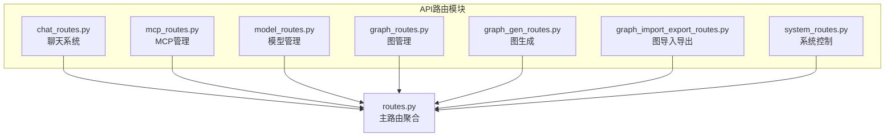
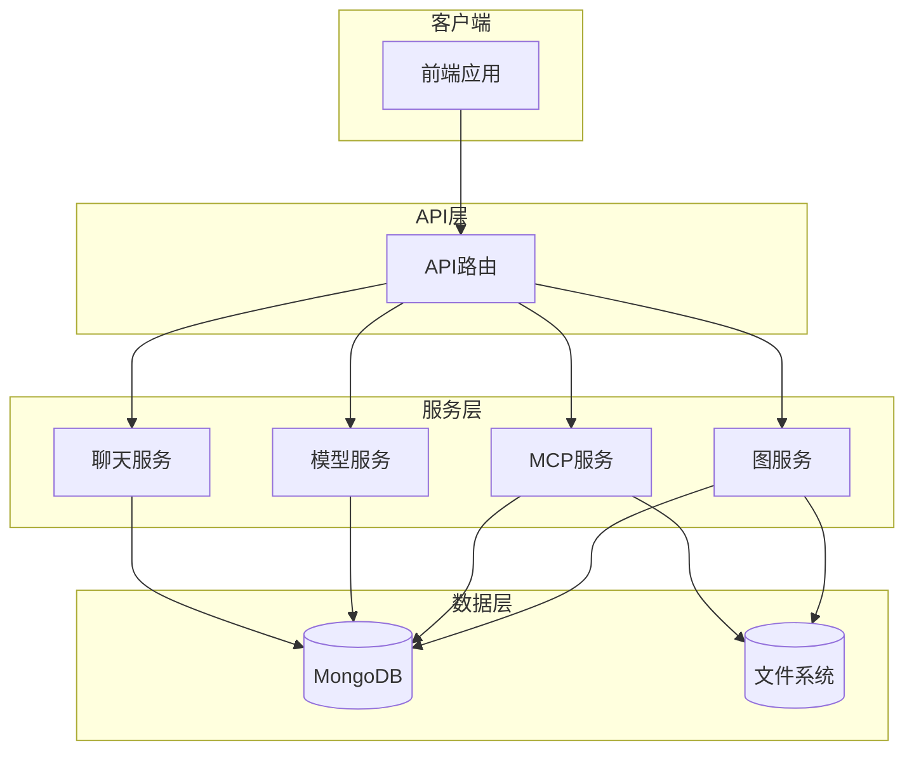
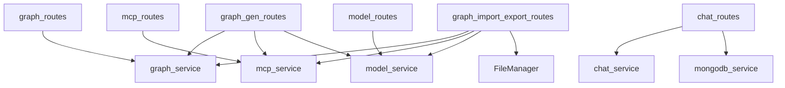

# API路由层

<cite>
**本文档中引用的文件**   
- [graph_routes.py](file://mag/app/api/graph_routes.py)
- [mcp_routes.py](file://mag/app/api/mcp_routes.py)
- [model_routes.py](file://mag/app/api/model_routes.py)
- [chat_routes.py](file://mag/app/api/chat_routes.py)
- [system_routes.py](file://mag/app/api/system_routes.py)
- [graph_gen_routes.py](file://mag/app/api/graph_gen_routes.py)
- [graph_import_export_routes.py](file://mag/app/api/graph_import_export_routes.py)
- [routes.py](file://mag/app/api/routes.py)
</cite>

## 目录
1. [简介](#简介)
2. [项目结构](#项目结构)
3. [核心组件](#核心组件)
4. [架构概述](#架构概述)
5. [详细组件分析](#详细组件分析)
6. [依赖分析](#依赖分析)
7. [性能考虑](#性能考虑)
8. [故障排除指南](#故障排除指南)
9. [结论](#结论)
10. [附录](#附录)（如有必要）

## 简介
本文档系统性地介绍了MAG（MCP Agent Graph）系统的后端API路由层，涵盖图管理、MCP管理、模型管理、聊天系统、系统控制、图生成及图导入导出等核心功能模块。文档详细说明了每个API端点的功能、HTTP方法、URL路径、请求参数、请求体结构、响应格式及错误码，并提供了curl调用示例和Python requests代码片段。同时，文档解释了API如何与下层服务层交互，以及输入验证和输出序列化的处理流程，特别说明了图生成和导出等复杂操作的异步API设计模式。

## 项目结构
MAG系统的API路由层采用模块化设计，所有路由定义位于`mag/app/api/`目录下，通过主路由文件`routes.py`进行统一聚合。每个功能模块拥有独立的路由文件，实现了清晰的职责分离。



**图来源**
- [routes.py](file://mag/app/api/routes.py#L1-L22)

**本节来源**
- [routes.py](file://mag/app/api/routes.py#L1-L22)

## 核心组件
API路由层是MAG系统的入口，负责接收HTTP请求，进行输入验证，调用下层服务（Service Layer）处理业务逻辑，并将结果序列化为HTTP响应返回。它通过FastAPI框架实现，利用其强大的类型提示和自动文档生成功能，确保了API的健壮性和可维护性。

**本节来源**
- [graph_routes.py](file://mag/app/api/graph_routes.py#L1-L340)
- [mcp_routes.py](file://mag/app/api/mcp_routes.py#L1-L600)

## 架构概述
MAG系统的API架构遵循分层设计原则，从上至下分为路由层（API Layer）、服务层（Service Layer）和数据层（Data Layer）。API路由层作为最上层，直接与客户端（前端或外部调用者）交互。



**图来源**
- [graph_routes.py](file://mag/app/api/graph_routes.py#L1-L340)
- [mcp_routes.py](file://mag/app/api/mcp_routes.py#L1-L600)
- [model_routes.py](file://mag/app/api/model_routes.py#L1-L153)

## 详细组件分析
本节将按功能模块对API路由层进行详细分析。

### 图管理分析
图管理模块提供对图（Graph）的增删改查（CRUD）操作。

#### 图管理API端点
| 功能 | HTTP方法 | URL路径 | 请求体 | 响应格式 | 错误码 |
| :--- | :--- | :--- | :--- | :--- | :--- |
| 获取所有图列表 | `GET` | `/graphs` | 无 | `List[str]` | `500` |
| 获取特定图配置 | `GET` | `/graphs/{graph_name}` | 无 | `Dict[str, Any]` | `404`, `500` |
| 创建/更新图 | `POST` | `/graphs` | `GraphConfig` | `Dict[str, Any]` | `400`, `500` |
| 删除图 | `DELETE` | `/graphs/{graph_name}` | 无 | `Dict[str, Any]` | `404`, `500` |
| 重命名图 | `PUT` | `/graphs/{old_name}/rename/{new_name}` | 无 | `Dict[str, Any]` | `400`, `404`, `500` |
| 获取图README | `GET` | `/graphs/{graph_name}/readme` | 无 | `Dict[str, Any]` | `404`, `500` |
| 生成MCP脚本 | `GET` | `/graphs/{graph_name}/generate_mcp` | 无 | `Dict[str, Any]` | `404`, `500` |

**curl示例：创建图**
```bash
curl -X POST http://localhost:8000/graphs \
  -H "Content-Type: application/json" \
  -d '{
    "name": "my_graph",
    "description": "A test graph",
    "nodes": []
  }'
```

**Python requests示例：获取所有图**
```python
import requests
response = requests.get("http://localhost:8000/graphs")
print(response.json())
```

**本节来源**
- [graph_routes.py](file://mag/app/api/graph_routes.py#L1-L340)

### MCP管理分析
MCP管理模块负责MCP（Model Control Protocol）服务器的配置、连接、状态监控和工具管理。

#### MCP管理API端点
| 功能 | HTTP方法 | URL路径 | 请求体 | 响应格式 | 错误码 |
| :--- | :--- | :--- | :--- | :--- | :--- |
| 获取MCP配置 | `GET` | `/mcp/config` | 无 | `MCPConfig` | `500` |
| 更新MCP配置 | `POST` | `/mcp/config` | `MCPConfig` | `Dict[str, Dict[str, Any]]` | `500` |
| 获取MCP状态 | `GET` | `/mcp/status` | 无 | `Dict[str, Dict[str, Any]]` | `500` |
| 添加MCP服务器 | `POST` | `/mcp/add` | `Dict[str, Any]` | `Dict[str, Any]` | `500` |
| 批量删除MCP服务器 | `POST` | `/mcp/remove` | `List[str]` | `Dict[str, Any]` | `500` |
| 连接MCP服务器 | `POST` | `/mcp/connect/{server_name}` | 无 | `Dict[str, Any]` | `400`, `404`, `500` |
| 断开MCP服务器连接 | `POST` | `/mcp/disconnect/{server_name}` | 无 | `Dict[str, Any]` | `404`, `500` |
| 获取所有MCP工具 | `GET` | `/mcp/tools` | 无 | `Dict[str, List[Dict[str, Any]]]` | `500` |
| 测试MCP工具 | `POST` | `/mcp/test-tool` | `MCPToolTestRequest` | `MCPToolTestResponse` | `500` |
| AI生成MCP工具 | `POST` | `/mcp/generate` | `MCPGenerationRequest` | `StreamingResponse` | `400`, `404`, `500` |
| 注册MCP工具 | `POST` | `/mcp/register-tool` | `MCPToolRegistration` | `Dict[str, Any]` | `409`, `500` |
| 列出AI生成的MCP工具 | `GET` | `/mcp/ai-tools` | 无 | `List[str]` | `500` |

**curl示例：连接所有MCP服务器**
```bash
curl -X POST http://localhost:8000/mcp/connect/all
```

**Python requests示例：获取MCP状态**
```python
import requests
response = requests.get("http://localhost:8000/mcp/status")
print(response.json())
```

**本节来源**
- [mcp_routes.py](file://mag/app/api/mcp_routes.py#L1-L600)

### 模型管理分析
模型管理模块提供对AI模型配置的增删改查操作。

#### 模型管理API端点
| 功能 | HTTP方法 | URL路径 | 请求体 | 响应格式 | 错误码 |
| :--- | :--- | :--- | :--- | :--- | :--- |
| 获取所有模型 | `GET` | `/models` | 无 | `List[Dict[str, Any]]` | `500` |
| 获取特定模型（用于编辑） | `GET` | `/models/{model_name}` | 无 | `Dict[str, Any]` | `404`, `500` |
| 添加模型 | `POST` | `/models` | `ModelConfig` | `Dict[str, Any]` | `400`, `500` |
| 更新模型 | `PUT` | `/models/{model_name}` | `ModelConfig` | `Dict[str, Any]` | `404`, `500` |
| 删除模型 | `DELETE` | `/models/{model_name}` | 无 | `Dict[str, Any]` | `404`, `500` |

**curl示例：添加模型**
```bash
curl -X POST http://localhost:8000/models \
  -H "Content-Type: application/json" \
  -d '{
    "name": "gpt-4",
    "base_url": "https://api.openai.com/v1",
    "api_key": "your-api-key"
  }'
```

**Python requests示例：删除模型**
```python
import requests
response = requests.delete("http://localhost:8000/models/gpt-4")
print(response.json())
```

**本节来源**
- [model_routes.py](file://mag/app/api/model_routes.py#L1-L153)

### 聊天系统分析
聊天系统模块提供对话管理、聊天补全和对话压缩功能。

#### 聊天系统API端点
| 功能 | HTTP方法 | URL路径 | 请求体 | 响应格式 | 错误码 |
| :--- | :--- | :--- | :--- | :--- | :--- |
| 聊天补全 | `POST` | `/chat/completions` | `ChatCompletionRequest` | `StreamingResponse` 或 `JSON` | `400`, `500` |
| 获取对话列表 | `GET` | `/chat/conversations` | 无 | `ConversationListResponse` | `500` |
| 获取对话详情 | `GET` | `/chat/conversations/{conversation_id}` | 无 | `ConversationDetailResponse` | `404`, `500` |
| 更新对话状态 | `PUT` | `/chat/conversations/{conversation_id}/status` | `UpdateConversationStatusRequest` | `Dict[str, Any]` | `404`, `500` |
| 永久删除对话 | `DELETE` | `/chat/conversations/{conversation_id}/permanent` | 无 | `Dict[str, Any]` | `403`, `404`, `500` |
| 更新对话标题 | `PUT` | `/chat/conversations/{conversation_id}/title` | `UpdateConversationTitleRequest` | `Dict[str, Any]` | `400`, `404`, `500` |
| 更新对话标签 | `PUT` | `/chat/conversations/{conversation_id}/tags` | `UpdateConversationTagsRequest` | `Dict[str, Any]` | `404`, `500` |
| 压缩对话 | `POST` | `/chat/conversations/{conversation_id}/compact` | `ConversationCompactRequest` | `ConversationCompactResponse` | `400`, `403`, `404`, `500` |

**curl示例：流式聊天**
```bash
curl -X POST http://localhost:8000/chat/completions \
  -H "Content-Type: application/json" \
  -d '{
    "user_prompt": "Hello",
    "model_name": "gpt-3.5-turbo",
    "stream": true
  }'
```

**Python requests示例：获取对话列表**
```python
import requests
response = requests.get("http://localhost:8000/chat/conversations")
print(response.json())
```

**本节来源**
- [chat_routes.py](file://mag/app/api/chat_routes.py#L1-L450)

### 系统控制分析
系统控制模块提供服务级别的控制功能。

#### 系统控制API端点
| 功能 | HTTP方法 | URL路径 | 请求体 | 响应格式 | 错误码 |
| :--- | :--- | :--- | :--- | :--- | :--- |
| 优雅关闭服务 | `POST` | `/system/shutdown` | 无 | `Dict[str, Any]` | `500` |

**curl示例：关闭服务**
```bash
curl -X POST http://localhost:8000/system/shutdown
```

**本节来源**
- [system_routes.py](file://mag/app/api/system_routes.py#L1-L63)

### 图生成分析
图生成模块提供基于AI的图生成和优化功能，采用流式SSE响应。

#### 图生成API端点
| 功能 | HTTP方法 | URL路径 | 请求体 | 响应格式 | 错误码 |
| :--- | :--- | :--- | :--- | :--- | :--- |
| 获取提示词模板 | `GET` | `/prompt-template` | 无 | `Dict[str, str]` | `404`, `500` |
| 获取优化提示词模板 | `GET` | `/optimize-prompt-template` | 无 | `Dict[str, str]` | `404`, `500` |
| AI生成图 | `POST` | `/graphs/generate` | `GraphGenerationRequest` | `StreamingResponse` | `400`, `404`, `500` |

**curl示例：AI生成图**
```bash
curl -X POST http://localhost:8000/graphs/generate \
  -H "Content-Type: application/json" \
  -d '{
    "requirement": "创建一个天气查询图",
    "model_name": "gpt-4"
  }'
```

**本节来源**
- [graph_gen_routes.py](file://mag/app/api/graph_gen_routes.py#L1-L302)

### 图导入导出分析
图导入导出模块提供图配置及相关组件的打包和解包功能。

#### 图导入导出API端点
| 功能 | HTTP方法 | URL路径 | 请求体 | 响应格式 | 错误码 |
| :--- | :--- | :--- | :--- | :--- | :--- |
| 从文件路径导入图 | `POST` | `/graphs/import` | `GraphFilePath` | `Dict[str, Any]` | `400`, `404`, `409`, `500` |
| 从ZIP包导入图 | `POST` | `/graphs/import_package` | `GraphFilePath` | `Dict[str, Any]` | `400`, `404`, `409`, `500` |
| 从上传文件导入图 | `POST` | `/graphs/import_from_file` | `multipart/form-data` | `Dict[str, Any]` | `400`, `500` |
| 从上传ZIP包导入图 | `POST` | `/graphs/import_package_from_file` | `multipart/form-data` | `Dict[str, Any]` | `400`, `500` |
| 导出图 | `GET` | `/graphs/{graph_name}/export` | 无 | `Dict[str, Any]` | `404`, `500` |

**curl示例：导出图**
```bash
curl -X GET http://localhost:8000/graphs/my_graph/export
```

**Python requests示例：从文件导入图**
```python
import requests
files = {'file': open('my_graph.json', 'rb')}
response = requests.post("http://localhost:8000/graphs/import_from_file", files=files)
print(response.json())
```

**本节来源**
- [graph_import_export_routes.py](file://mag/app/api/graph_import_export_routes.py#L1-L590)

## 依赖分析
API路由层与下层服务层紧密耦合，每个路由函数都依赖于对应的服务实例来执行核心业务逻辑。这种设计实现了关注点分离，路由层专注于HTTP协议处理，而服务层专注于领域逻辑。



**图来源**
- [graph_routes.py](file://mag/app/api/graph_routes.py#L1-L340)
- [mcp_routes.py](file://mag/app/api/mcp_routes.py#L1-L600)
- [model_routes.py](file://mag/app/api/model_routes.py#L1-L153)
- [chat_routes.py](file://mag/app/api/chat_routes.py#L1-L450)
- [graph_gen_routes.py](file://mag/app/api/graph_gen_routes.py#L1-L302)
- [graph_import_export_routes.py](file://mag/app/api/graph_import_export_routes.py#L1-L590)

**本节来源**
- [graph_routes.py](file://mag/app/api/graph_routes.py#L1-L340)
- [mcp_routes.py](file://mag/app/api/mcp_routes.py#L1-L600)
- [model_routes.py](file://mag/app/api/model_routes.py#L1-L153)
- [chat_routes.py](file://mag/app/api/chat_routes.py#L1-L450)
- [graph_gen_routes.py](file://mag/app/api/graph_gen_routes.py#L1-L302)
- [graph_import_export_routes.py](file://mag/app/api/graph_import_export_routes.py#L1-L590)

## 性能考虑
API路由层的设计充分考虑了性能因素。对于耗时较长的操作（如AI生成图、图执行），采用了流式SSE（Server-Sent Events）响应模式，避免了长时间的HTTP连接挂起，提高了系统的响应性和可扩展性。此外，所有API端点都实现了适当的错误处理和日志记录，便于性能监控和问题排查。

## 故障排除指南
- **404错误**：检查URL路径是否正确，特别是路径参数（如`{graph_name}`）是否已正确替换。
- **400错误**：检查请求体是否符合API定义的Schema，特别是必填字段。
- **500错误**：查看服务端日志（`logger`）以获取详细的错误信息。
- **流式响应中断**：检查网络连接，并确保客户端正确处理SSE事件。
- **导入/导出失败**：确认文件路径有效，文件格式正确（JSON或ZIP），并检查文件权限。

**本节来源**
- [graph_routes.py](file://mag/app/api/graph_routes.py#L1-L340)
- [mcp_routes.py](file://mag/app/api/mcp_routes.py#L1-L600)
- [model_routes.py](file://mag/app/api/model_routes.py#L1-L153)
- [chat_routes.py](file://mag/app/api/chat_routes.py#L1-L450)
- [graph_gen_routes.py](file://mag/app/api/graph_gen_routes.py#L1-L302)
- [graph_import_export_routes.py](file://mag/app/api/graph_import_export_routes.py#L1-L590)

## 结论
MAG系统的API路由层设计清晰、模块化程度高，通过FastAPI框架提供了强大、健壮且易于使用的RESTful接口。它有效地将HTTP请求与后端服务解耦，支持了从基础的CRUD操作到复杂的AI生成和流式处理等多种功能。异步SSE模式的引入，为处理长时间运行的任务提供了优雅的解决方案，确保了良好的用户体验。