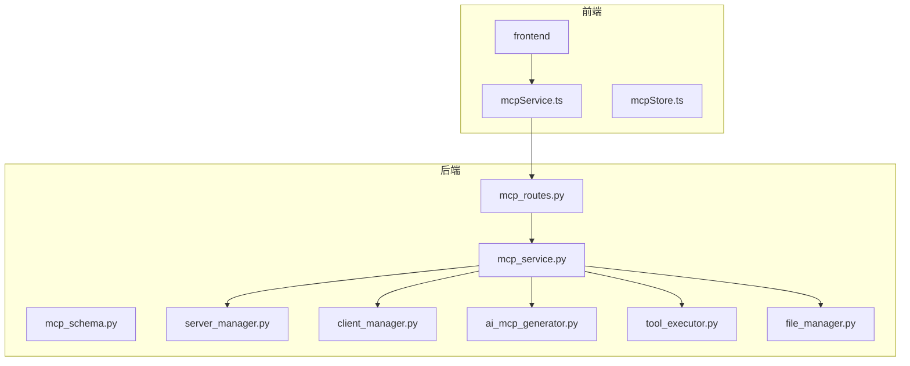
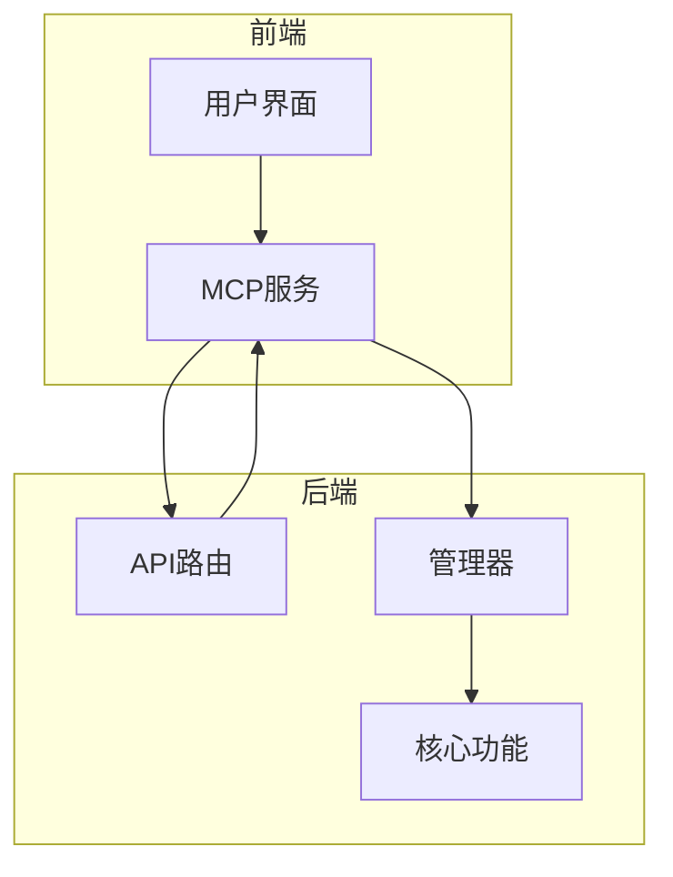
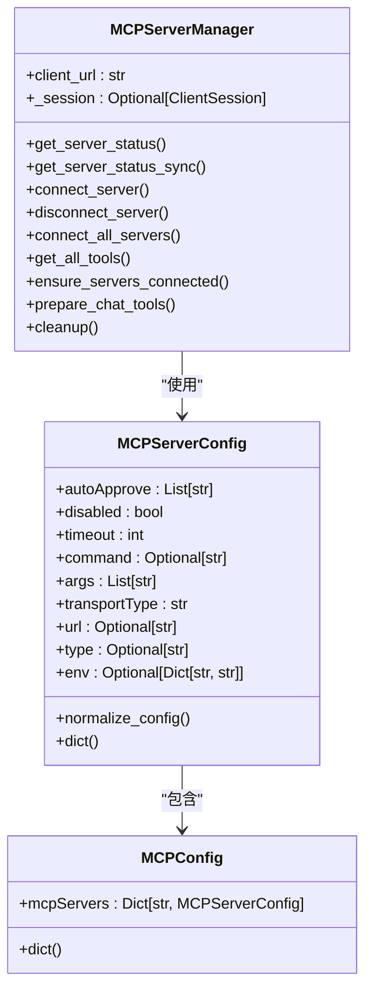
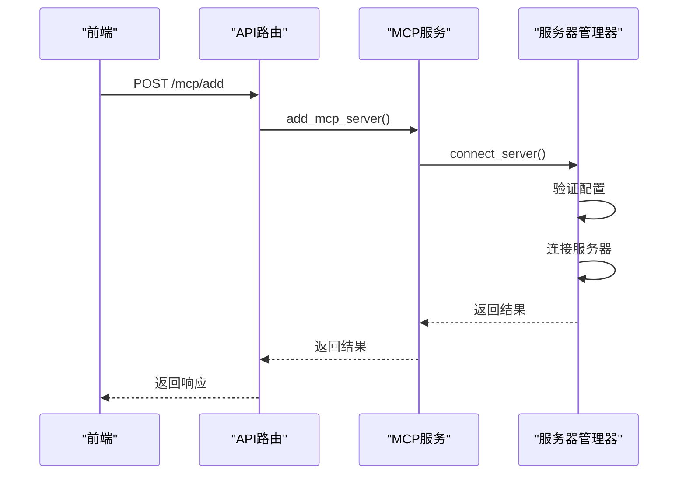
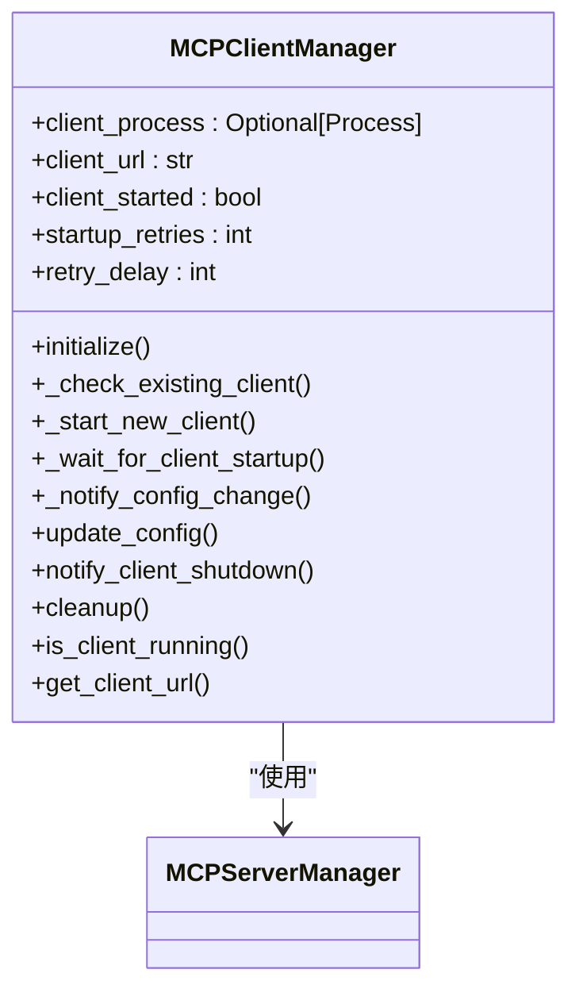
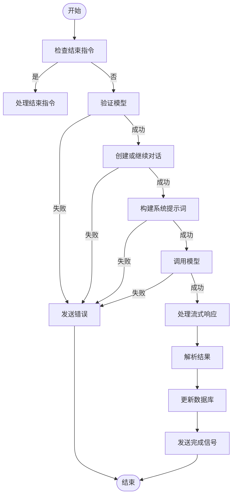
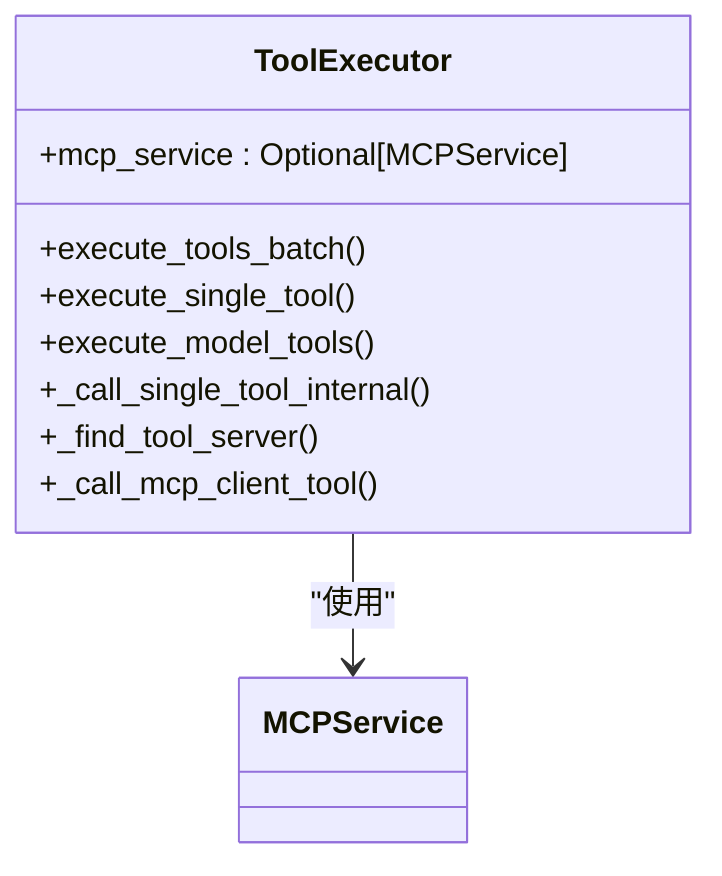
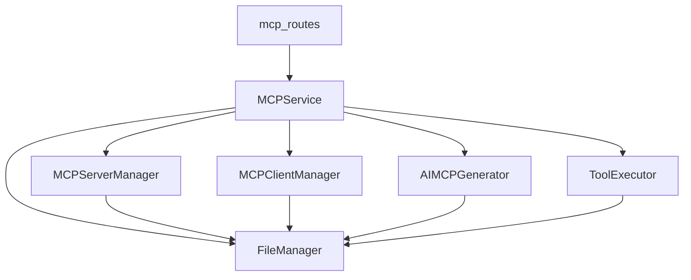

# MCP管理API

<cite>
**本文档引用的文件**   
- [mcp_routes.py](file://mag/app/api/mcp_routes.py)
- [mcp_schema.py](file://mag/app/models/mcp_schema.py)
- [mcp_service.py](file://mag/app/services/mcp_service.py)
- [server_manager.py](file://mag/app/services/mcp/server_manager.py)
- [client_manager.py](file://mag/app/services/mcp/client_manager.py)
- [ai_mcp_generator.py](file://mag/app/services/mcp/ai_mcp_generator.py)
- [tool_executor.py](file://mag/app/services/mcp/tool_executor.py)
- [file_manager.py](file://mag/app/core/file_manager.py)
- [mcpService.ts](file://frontend/src/services/mcpService.ts)
- [mcpStore.ts](file://frontend/src/store/mcpStore.ts)
</cite>

## 目录
1. [简介](#简介)
2. [项目结构](#项目结构)
3. [核心组件](#核心组件)
4. [架构概述](#架构概述)
5. [详细组件分析](#详细组件分析)
6. [依赖分析](#依赖分析)
7. [性能考虑](#性能考虑)
8. [故障排除指南](#故障排除指南)
9. [结论](#结论)

## 简介
本文档详细介绍了MCP管理API，涵盖了MCP服务器的注册、连接、断开、删除，以及工具列表获取、工具调用等接口。文档详细描述了每个端点的HTTP方法、路径、请求/响应模型（基于mcp_schema.MCPServerConfig），包括POST /mcp/servers连接服务器和GET /mcp/servers/{server_id}/tools获取工具列表等关键接口。提供了实际调用示例，展示如何通过API注册并测试一个MCP服务器。解释了该路由如何与mcp_service中的server_manager和client_manager交互，处理AI生成MCP工具的流程（ai_mcp_generator.py）。说明了错误处理机制，如连接超时、认证失败等场景的HTTP状态码返回策略。

## 项目结构
项目结构分为前端和后端两大部分。前端位于`frontend`目录，包含React组件、服务、存储和类型定义。后端位于`mag`目录，包含API路由、模型定义、服务实现和核心功能模块。

**图源**
- [mcp_routes.py](file://mag/app/api/mcp_routes.py)
- [mcp_service.py](file://mag/app/services/mcp_service.py)
- [mcpService.ts](file://frontend/src/services/mcpService.ts)

**章节源**
- [mcp_routes.py](file://mag/app/api/mcp_routes.py)
- [mcpService.ts](file://frontend/src/services/mcpService.ts)

## 核心组件
核心组件包括MCP服务器管理、客户端管理、AI生成器和工具执行器。这些组件协同工作，提供完整的MCP管理功能。

**章节源**
- [mcp_service.py](file://mag/app/services/mcp_service.py)
- [server_manager.py](file://mag/app/services/mcp/server_manager.py)
- [client_manager.py](file://mag/app/services/mcp/client_manager.py)
- [ai_mcp_generator.py](file://mag/app/services/mcp/ai_mcp_generator.py)
- [tool_executor.py](file://mag/app/services/mcp/tool_executor.py)

## 架构概述
系统架构采用分层设计，前端通过API与后端通信，后端各服务模块通过协调者模式进行交互。

**图源**
- [mcp_service.py](file://mag/app/services/mcp_service.py)
- [mcp_routes.py](file://mag/app/api/mcp_routes.py)

## 详细组件分析
### MCP服务器管理分析
MCP服务器管理组件负责服务器的生命周期管理，包括添加、删除、连接和断开连接。

#### 类图

**图源**
- [mcp_schema.py](file://mag/app/models/mcp_schema.py)
- [server_manager.py](file://mag/app/services/mcp/server_manager.py)

#### 序列图

**图源**
- [mcp_routes.py](file://mag/app/api/mcp_routes.py)
- [mcp_service.py](file://mag/app/services/mcp_service.py)
- [server_manager.py](file://mag/app/services/mcp/server_manager.py)

### 客户端管理分析
客户端管理组件负责MCP客户端进程的生命周期管理，包括启动、停止和状态检查。

#### 类图

**图源**
- [client_manager.py](file://mag/app/services/mcp/client_manager.py)
- [server_manager.py](file://mag/app/services/mcp/server_manager.py)

### AI生成器分析
AI生成器组件负责通过AI生成MCP工具，包括流式生成、模板管理和结果解析。

#### 流程图

**图源**
- [ai_mcp_generator.py](file://mag/app/services/mcp/ai_mcp_generator.py)

### 工具执行器分析
工具执行器组件负责执行MCP工具调用，包括单个工具执行和批量执行。

#### 类图

**图源**
- [tool_executor.py](file://mag/app/services/mcp/tool_executor.py)
- [mcp_service.py](file://mag/app/services/mcp_service.py)

## 依赖分析
系统各组件之间存在明确的依赖关系，通过协调者模式进行交互。

**图源**
- [mcp_service.py](file://mag/app/services/mcp_service.py)
- [server_manager.py](file://mag/app/services/mcp/server_manager.py)
- [client_manager.py](file://mag/app/services/mcp/client_manager.py)
- [ai_mcp_generator.py](file://mag/app/services/mcp/ai_mcp_generator.py)
- [tool_executor.py](file://mag/app/services/mcp/tool_executor.py)
- [file_manager.py](file://mag/app/core/file_manager.py)

**章节源**
- [mcp_service.py](file://mag/app/services/mcp_service.py)
- [mcp_routes.py](file://mag/app/api/mcp_routes.py)

## 性能考虑
系统在设计时考虑了性能优化，包括异步处理、连接池和缓存机制。服务器管理器使用aiohttp会话池来提高HTTP请求性能，客户端管理器使用进程管理来确保客户端的稳定运行。

## 故障排除指南
### 连接问题
- **问题**: 无法连接到MCP客户端
- **解决方案**: 检查客户端进程是否已启动，查看日志文件`mcp_client_stdout.log`和`mcp_client_stderr.log`

### 配置问题
- **问题**: 配置更新后未生效
- **解决方案**: 确保调用`_notify_config_change`方法通知客户端重新加载配置

### 工具执行问题
- **问题**: 工具调用失败
- **解决方案**: 检查服务器是否已连接，验证工具参数是否正确

**章节源**
- [client_manager.py](file://mag/app/services/mcp/client_manager.py)
- [server_manager.py](file://mag/app/services/mcp/server_manager.py)
- [tool_executor.py](file://mag/app/services/mcp/tool_executor.py)

## 结论
MCP管理API提供了一套完整的MCP服务器管理功能，通过清晰的分层架构和模块化设计，实现了高内聚低耦合的系统结构。各组件通过协调者模式进行交互，确保了系统的可维护性和可扩展性。