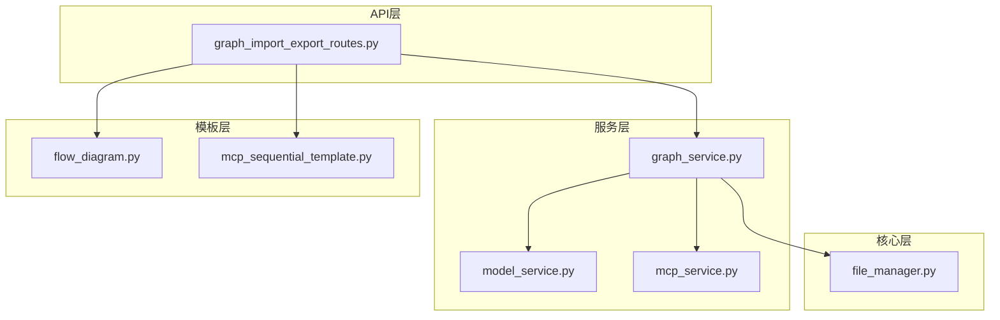

# 图导入导出API

<cite>
**本文档引用的文件**
- [graph_import_export_routes.py](file://mag/app/api/graph_import_export_routes.py)
- [graph_service.py](file://mag/app/services/graph_service.py)
- [file_manager.py](file://mag/app/core/file_manager.py)
- [FlowDiagram.py](file://mag/app/templates/flow_diagram.py)
</cite>

## 目录
1. [简介](#简介)
2. [项目结构](#项目结构)
3. [核心组件](#核心组件)
4. [架构概述](#架构概述)
5. [详细组件分析](#详细组件分析)
6. [依赖分析](#依赖分析)
7. [性能考虑](#性能考虑)
8. [故障排除指南](#故障排除指南)
9. [结论](#结论)

## 简介
本文档详细描述了图导入导出API的功能，重点涵盖将Agent图导出为MCP服务（`/graph-export/export-as-mcp`）和从外部导入图配置（`/graph-import/import`）的核心功能。文档说明了导出为MCP服务的完整流程，包括生成符合MCP协议的服务器代码、工具定义和配置文件。同时，文档解释了导入功能如何解析JSON格式的图配置并验证其完整性。通过使用示例，展示了如何将复杂的Agent工作流导出为可独立部署的MCP微服务。此外，文档还阐明了该API如何与`file_manager`和`graph_manager`协作，处理文件的读写和路径管理，并强调了此功能在Agent共享和复用中的关键作用。

## 项目结构
图导入导出功能主要位于`mag/app/api/`目录下的`graph_import_export_routes.py`文件中，该文件定义了所有相关的RESTful API端点。业务逻辑由`mag/app/services/graph_service.py`中的`GraphService`类处理，而文件操作则由`mag/app/core/file_manager.py`模块负责。模板文件（如MCP服务器代码模板）存储在`mag/app/templates/`目录中。整个功能模块与系统的其他部分（如模型管理、MCP服务管理）紧密集成，形成了一个完整的Agent工作流共享解决方案。

**Diagram sources**
- [graph_import_export_routes.py](file://mag/app/api/graph_import_export_routes.py#L1-L589)
- [graph_service.py](file://mag/app/services/graph_service.py#L1-L221)
- [file_manager.py](file://mag/app/core/file_manager.py)

**Section sources**
- [graph_import_export_routes.py](file://mag/app/api/graph_import_export_routes.py#L1-L589)
- [graph_service.py](file://mag/app/services/graph_service.py#L1-L221)

## 核心组件
图导入导出API的核心功能由两个主要部分构成：导入（Import）和导出（Export）。导入功能通过`import_graph`和`import_graph_package`等端点实现，负责解析外部提供的JSON或ZIP包，并将其安全地集成到系统中。导出功能通过`export_graph`端点实现，能够将系统内的Agent图及其所有相关资源（如提示词、配置、MCP工具）打包成一个可移植的ZIP包。`GraphService`类提供了`validate_graph`和`save_graph`等关键方法，确保了图配置的完整性和一致性。`FileManager`则作为底层文件操作的统一接口，管理着所有与Agent相关的文件和目录。

**Section sources**
- [graph_import_export_routes.py](file://mag/app/api/graph_import_export_routes.py#L1-L589)
- [graph_service.py](file://mag/app/services/graph_service.py#L1-L221)

## 架构概述
图导入导出API的架构遵循清晰的分层模式。最上层是FastAPI路由层，负责接收HTTP请求并进行初步的参数验证。中间是服务层（`GraphService`），它封装了业务逻辑，协调不同模块之间的交互。最底层是核心工具层（`FileManager`和`FlowDiagram`），提供具体的文件操作和内容生成能力。当执行导出操作时，API会