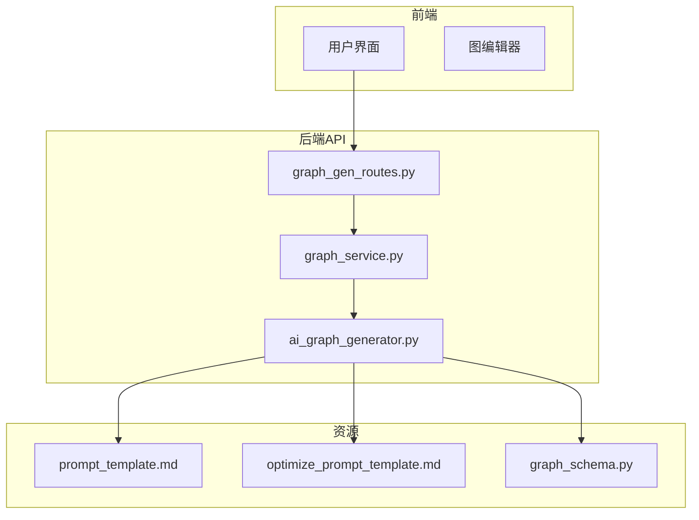
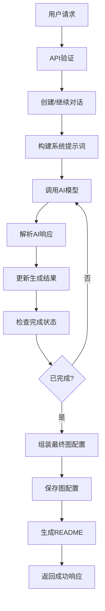
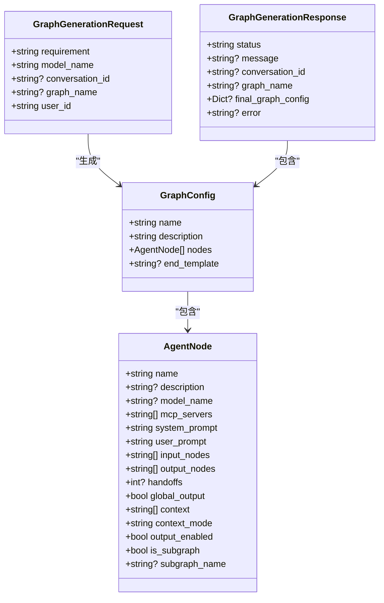
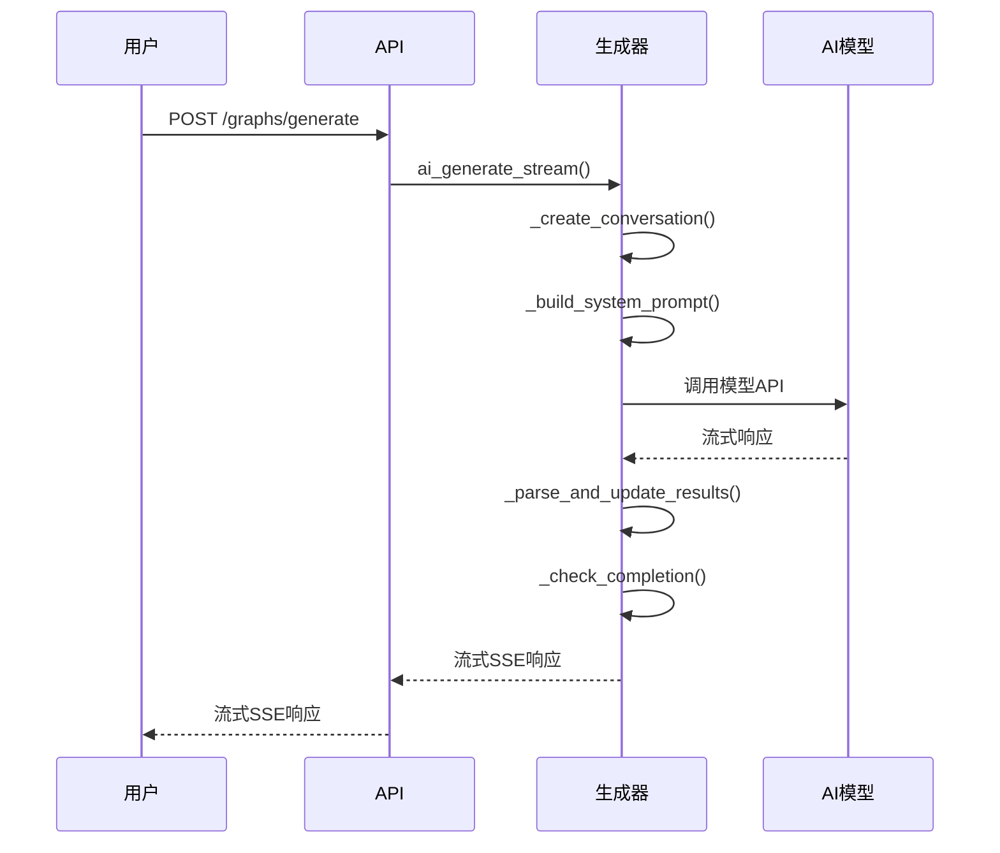
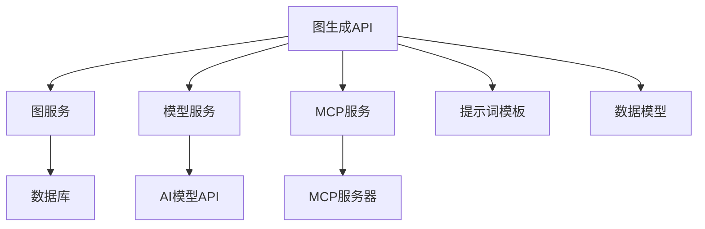

# 图生成API

<cite>
**本文档引用的文件**
- [graph_gen_routes.py](file://mag/app/api/graph_gen_routes.py)
- [ai_graph_generator.py](file://mag/app/services/graph/ai_graph_generator.py)
- [prompt_template.md](file://mag/app/templates/prompt_template.md)
- [optimize_prompt_template.md](file://mag/app/templates/optimize_prompt_template.md)
- [graph_schema.py](file://mag/app/models/graph_schema.py)
</cite>

## 目录
1. [简介](#简介)
2. [项目结构](#项目结构)
3. [核心组件](#核心组件)
4. [架构概述](#架构概述)
5. [详细组件分析](#详细组件分析)
6. [依赖分析](#依赖分析)
7. [性能考虑](#性能考虑)
8. [故障排除指南](#故障排除指南)
9. [结论](#结论)
10. [附录](#附录)（如有必要）

## 简介
本文档详细说明了图生成API的功能，重点描述了如何通过自然语言需求自动生成Agent工作流图。该API实现了从需求到Agent的一键转换，大大降低了开发门槛。文档将深入解析POST /graph-gen/generate端点的工作机制，包括输入格式、可选参数和返回结构。同时，将解释API如何调用AI模型，结合提示词模板生成有效的图配置，并提供完整的错误处理机制。

## 项目结构
图生成API是MAG（MCP Agent Graph）系统的核心功能之一，位于后端服务的API层。该功能通过多层服务协作，将用户的自然语言需求转换为可执行的Agent工作流图。



**图来源**
- [graph_gen_routes.py](file://mag/app/api/graph_gen_routes.py)
- [ai_graph_generator.py](file://mag/app/services/graph/ai_graph_generator.py)
- [prompt_template.md](file://mag/app/templates/prompt_template.md)

**节来源**
- [graph_gen_routes.py](file://mag/app/api/graph_gen_routes.py#L1-L301)
- [ai_graph_generator.py](file://mag/app/services/graph/ai_graph_generator.py#L1-L587)

## 核心组件
图生成API的核心在于将自然语言需求转换为结构化的Agent工作流图。这一过程涉及多个关键组件的协同工作，包括API端点、AI生成器、提示词模板和数据模型。API通过流式SSE响应，实时返回生成过程中的各个阶段信息，使用户能够清晰地了解生成进度。

**节来源**
- [graph_gen_routes.py](file://mag/app/api/graph_gen_routes.py#L201-L271)
- [ai_graph_generator.py](file://mag/app/services/graph/ai_graph_generator.py#L63-L89)

## 架构概述
图生成API采用分层架构设计，从接收用户请求到最终生成图配置，每个层次都有明确的职责。API层负责请求验证和响应生成，服务层协调业务逻辑，生成器层执行核心的AI生成任务，而模板和数据模型层提供必要的配置和结构定义。



**图来源**
- [graph_gen_routes.py](file://mag/app/api/graph_gen_routes.py#L201-L271)
- [ai_graph_generator.py](file://mag/app/services/graph/ai_graph_generator.py#L326-L362)

## 详细组件分析
### 图生成请求分析
图生成API通过POST /graphs/generate端点接收用户请求。请求体必须包含用户需求和模型名称，还可以选择性地提供对话ID和图名称。API首先验证基本参数，然后调用图服务进行AI生成。



**图来源**
- [graph_schema.py](file://mag/app/models/graph_schema.py#L1-L117)
- [graph_gen_routes.py](file://mag/app/api/graph_gen_routes.py#L201-L271)

**节来源**
- [graph_schema.py](file://mag/app/models/graph_schema.py#L1-L117)
- [graph_gen_routes.py](file://mag/app/api/graph_gen_routes.py#L201-L271)

### AI图生成器分析
AI图生成器是图生成API的核心引擎，负责与AI模型进行多轮交互，逐步构建图配置。生成器通过创建对话上下文，将用户需求和系统提示词传递给AI模型，并解析模型的响应，逐步完善图的各个组成部分。



**图来源**
- [ai_graph_generator.py](file://mag/app/services/graph/ai_graph_generator.py#L1-L587)
- [graph_gen_routes.py](file://mag/app/api/graph_gen_routes.py#L201-L271)

**节来源**
- [ai_graph_generator.py](file://mag/app/services/graph/ai_graph_generator.py#L1-L587)
- [graph_gen_routes.py](file://mag/app/api/graph_gen_routes.py#L201-L271)

### 提示词模板分析
提示词模板是指导AI模型生成有效图配置的关键。系统提供了两个主要模板：prompt_template.md用于新图生成，optimize_prompt_template.md用于图优化。这些模板包含了详细的节点参数规范、可用工具和模型信息。

```mermaid
flowchart TD
Start([开始]) --> LoadTemplate["加载提示词模板"]
LoadTemplate --> GetTools["获取可用MCP工具"]
GetTools --> GetModels["获取可用模型"]
GetModels --> ReplacePlaceholders["替换模板占位符"]
ReplacePlaceholders --> {是否提供图名称?}
{是否提供图名称?} --> |是| GetGraphConfig["获取图配置"]
GetGraphConfig --> EmbedConfig["嵌入图配置"]
EmbedConfig --> ReturnTemplate["返回优化模板"]
{是否提供图名称?} --> |否| ReturnBasic["返回基础模板"]
ReturnBasic --> End([结束])
ReturnTemplate --> End
```

**图来源**
- [prompt_template.md](file://mag/app/templates/prompt_template.md#L1-L153)
- [optimize_prompt_template.md](file://mag/app/templates/optimize_prompt_template.md#L1-L92)
- [graph_gen_routes.py](file://mag/app/api/graph_gen_routes.py#L1-L301)

**节来源**
- [prompt_template.md](file://mag/app/templates/prompt_template.md#L1-L153)
- [optimize_prompt_template.md](file://mag/app/templates/optimize_prompt_template.md#L1-L92)
- [graph_gen_routes.py](file://mag/app/api/graph_gen_routes.py#L1-L301)

## 依赖分析
图生成API依赖于多个内部和外部组件。内部依赖包括图服务、模型服务和MCP服务，外部依赖则包括AI模型API和数据库服务。这些依赖关系确保了API能够获取必要的资源信息，并将生成结果持久化存储。



**图来源**
- [graph_gen_routes.py](file://mag/app/api/graph_gen_routes.py#L1-L301)
- [ai_graph_generator.py](file://mag/app/services/graph/ai_graph_generator.py#L1-L587)

**节来源**
- [graph_gen_routes.py](file://mag/app/api/graph_gen_routes.py#L1-L301)
- [ai_graph_generator.py](file://mag/app/services/graph/ai_graph_generator.py#L1-L587)

## 性能考虑
图生成API采用流式SSE响应，避免了长时间等待和超时问题。通过对话ID机制，支持中断后继续生成，提高了用户体验。同时，系统对生成过程进行了详细的日志记录，便于性能监控和问题排查。

## 故障排除指南
图生成API提供了完善的错误处理机制。当生成失败时，API会返回详细的错误信息，包括错误类型和消息。常见错误包括用户需求为空、模型不存在、对话创建失败等。系统还提供了完成状态检查，确保生成的图配置完整有效。

**节来源**
- [graph_gen_routes.py](file://mag/app/api/graph_gen_routes.py#L201-L271)
- [ai_graph_generator.py](file://mag/app/services/graph/ai_graph_generator.py#L238-L268)

## 结论
图生成API成功实现了从自然语言需求到Agent工作流图的一键转换。通过精心设计的提示词模板和多轮交互机制，系统能够生成结构完整、配置合理的图配置。这一功能大大降低了Agent开发的门槛，使用户能够快速创建复杂的智能体工作流。

## 附录
### 示例：新闻摘要Agent生成过程
1. **用户需求**："创建一个新闻摘要Agent，能够从网络搜索最新新闻，生成摘要，并保存为Markdown文件"
2. **API调用**：POST /graphs/generate，包含需求和模型名称
3. **生成过程**：
   - AI分析需求，制定实施计划
   - 定义图名称和描述
   - 创建搜索节点，配置搜索服务
   - 创建摘要节点，配置大模型
   - 创建保存节点，配置保存格式
   - 完善输出模板
4. **最终结果**：生成包含三个节点的完整工作流图，可直接执行