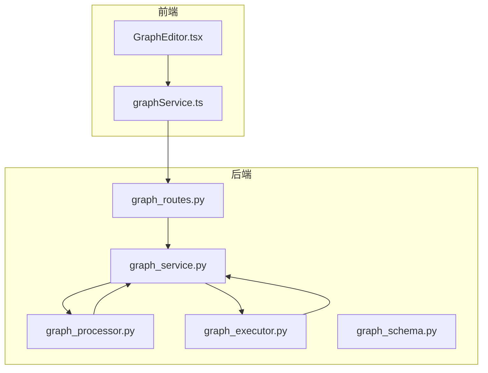
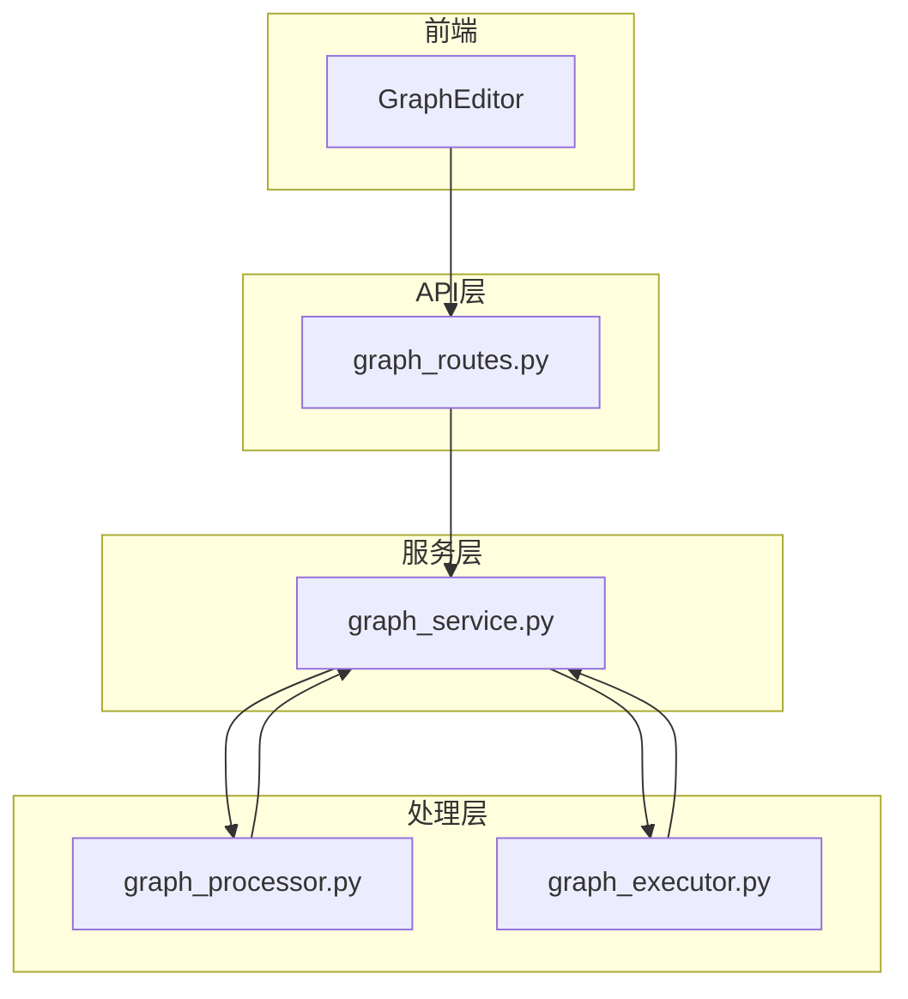
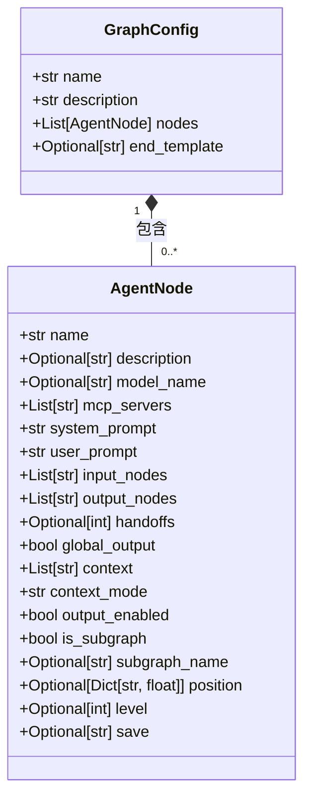
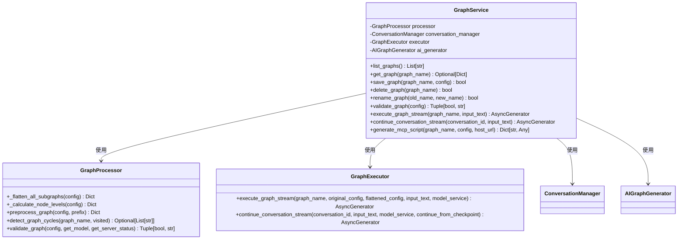
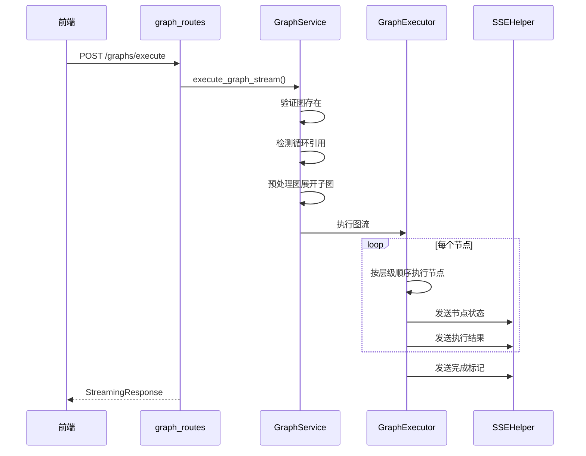
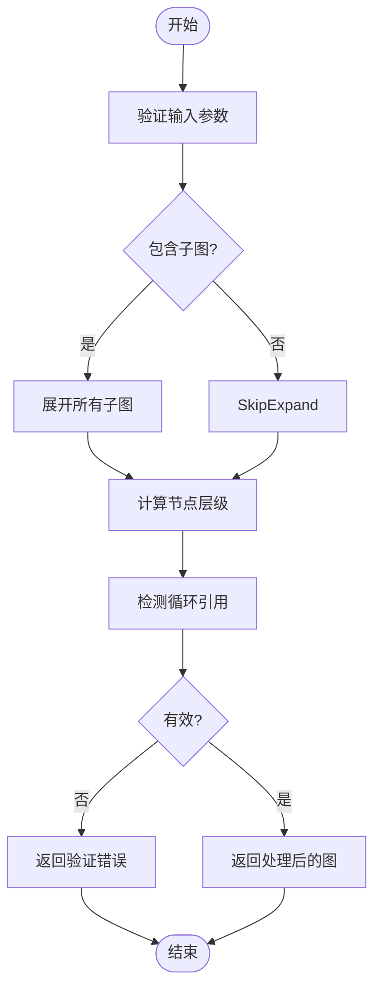
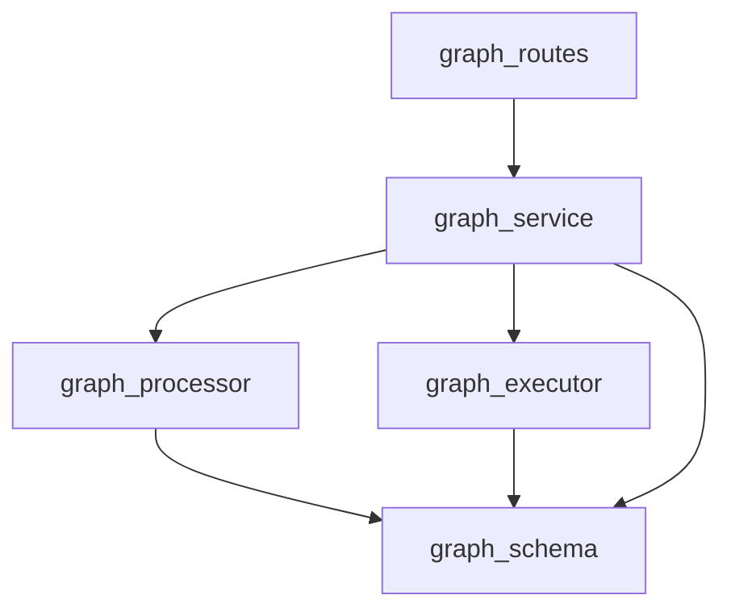

# 图管理API

<cite>
**本文档中引用的文件**  
- [graph_routes.py](file://mag/app/api/graph_routes.py)
- [graph_schema.py](file://mag/app/models/graph_schema.py)
- [graph_service.py](file://mag/app/services/graph_service.py)
- [graph_processor.py](file://mag/app/services/graph/graph_processor.py)
- [graph_executor.py](file://mag/app/services/graph/graph_executor.py)
</cite>

## 目录
1. [简介](#简介)
2. [项目结构](#项目结构)
3. [核心组件](#核心组件)
4. [架构概览](#架构概览)
5. [详细组件分析](#详细组件分析)
6. [依赖分析](#依赖分析)
7. [性能考虑](#性能考虑)
8. [故障排除指南](#故障排除指南)
9. [结论](#结论)

## 简介
本文档详细描述了图管理API，涵盖图的创建、读取、更新、删除（CRUD）操作，图执行控制，状态获取，以及与前端组件的交互流程。重点说明了API端点的设计、请求/响应结构、错误处理机制、异步执行流和SSE事件集成方式。

## 项目结构
图管理功能分布在后端Python FastAPI服务和前端React应用中。后端API路由定义在`graph_routes.py`中，核心业务逻辑由`graph_service.py`协调，图结构处理由`graph_processor.py`实现，执行逻辑在`graph_executor.py`中。模型定义位于`graph_schema.py`。前端通过`graphService.ts`调用这些API，并在`GraphEditor.tsx`中提供可视化编辑界面。

**Diagram sources**  
- [graph_routes.py](file://mag/app/api/graph_routes.py#L1-L340)
- [graph_service.py](file://mag/app/services/graph_service.py#L1-L220)
- [graph_processor.py](file://mag/app/services/graph/graph_processor.py#L1-L553)
- [graph_executor.py](file://mag/app/services/graph/graph_executor.py)

**Section sources**
- [graph_routes.py](file://mag/app/api/graph_routes.py#L1-L340)
- [graph_service.py](file://mag/app/services/graph_service.py#L1-L220)

## 核心组件
图管理API的核心组件包括图配置模型（GraphConfig）、图服务（GraphService）、图处理器（GraphProcessor）和图执行器（GraphExecutor）。这些组件协同工作，实现图的持久化、验证、预处理和流式执行。

**Section sources**
- [graph_schema.py](file://mag/app/models/graph_schema.py#L1-L116)
- [graph_service.py](file://mag/app/services/graph_service.py#L1-L220)
- [graph_processor.py](file://mag/app/services/graph/graph_processor.py#L1-L553)
- [graph_executor.py](file://mag/app/services/graph/graph_executor.py)

## 架构概览
图管理API采用分层架构，前端通过HTTP请求与后端FastAPI路由交互。路由层调用图服务进行业务处理，图服务协调图处理器进行图结构分析和预处理，以及图执行器进行实际执行。执行结果通过SSE流式返回给前端。

**Diagram sources**  
- [graph_routes.py](file://mag/app/api/graph_routes.py#L1-L340)
- [graph_service.py](file://mag/app/services/graph_service.py#L1-L220)
- [graph_processor.py](file://mag/app/services/graph/graph_processor.py#L1-L553)
- [graph_executor.py](file://mag/app/services/graph/graph_executor.py)

## 详细组件分析

### 图配置模型分析
`GraphConfig`模型定义了图的结构，包含图名称、描述和节点列表。每个节点（AgentNode）包含模型、MCP服务器、提示词、输入/输出连接等配置。

**Diagram sources**  
- [graph_schema.py](file://mag/app/models/graph_schema.py#L1-L116)

**Section sources**
- [graph_schema.py](file://mag/app/models/graph_schema.py#L1-L116)

### 图服务分析
`GraphService`是图管理的核心服务类，负责协调图的CRUD操作、执行和会话管理。它初始化`GraphProcessor`和`GraphExecutor`，并提供统一的接口。

**Diagram sources**  
- [graph_service.py](file://mag/app/services/graph_service.py#L1-L220)
- [graph_processor.py](file://mag/app/services/graph/graph_processor.py#L1-L553)
- [graph_executor.py](file://mag/app/services/graph/graph_executor.py)

**Section sources**
- [graph_service.py](file://mag/app/services/graph_service.py#L1-L220)

### 图执行流程分析
图执行采用流式响应，通过SSE将执行过程中的状态和结果实时推送给前端。执行流程包括图验证、子图展开、层级计算和节点顺序执行。

**Diagram sources**  
- [graph_routes.py](file://mag/app/api/graph_routes.py#L285-L340)
- [graph_service.py](file://mag/app/services/graph_service.py#L145-L185)
- [graph_executor.py](file://mag/app/services/graph/graph_executor.py)

**Section sources**
- [graph_routes.py](file://mag/app/api/graph_routes.py#L285-L340)
- [graph_service.py](file://mag/app/services/graph_service.py#L145-L185)

### 图处理器分析
`GraphProcessor`负责图的结构处理，包括子图展开、层级计算、循环检测和配置验证。它确保图结构的正确性和可执行性。

**Diagram sources**  
- [graph_processor.py](file://mag/app/services/graph/graph_processor.py#L1-L553)

**Section sources**
- [graph_processor.py](file://mag/app/services/graph/graph_processor.py#L1-L553)

## 依赖分析
图管理模块的依赖关系清晰，`graph_routes.py`依赖`graph_service.py`，而`graph_service.py`依赖`graph_processor.py`和`graph_executor.py`。`graph_processor.py`和`graph_executor.py`都依赖`graph_schema.py`中的数据模型。

**Diagram sources**  
- [graph_routes.py](file://mag/app/api/graph_routes.py#L1-L340)
- [graph_service.py](file://mag/app/services/graph_service.py#L1-L220)
- [graph_processor.py](file://mag/app/services/graph/graph_processor.py#L1-L553)
- [graph_executor.py](file://mag/app/services/graph/graph_executor.py)
- [graph_schema.py](file://mag/app/models/graph_schema.py#L1-L116)

**Section sources**
- [graph_routes.py](file://mag/app/api/graph_routes.py#L1-L340)
- [graph_service.py](file://mag/app/services/graph_service.py#L1-L220)

## 性能考虑
图管理API在处理复杂图时需考虑性能。子图展开和层级计算的时间复杂度与节点数量相关。建议对大型图进行分页加载，并在执行前进行预验证以减少运行时错误。SSE流式传输避免了大响应的内存压力。

## 故障排除指南
常见问题包括图配置验证失败、循环引用、MCP服务器未连接等。可通过检查`graph_schema.py`中的验证规则、使用`detect_graph_cycles`方法检测循环、确认MCP服务器状态来排查。执行日志记录在`graph_executor.py`中，可用于调试执行流程。

**Section sources**
- [graph_schema.py](file://mag/app/models/graph_schema.py#L1-L116)
- [graph_processor.py](file://mag/app/services/graph/graph_processor.py#L1-L553)
- [graph_executor.py](file://mag/app/services/graph/graph_executor.py)

## 结论
图管理API提供了完整的图生命周期管理功能，从CRUD操作到流式执行，形成了一个强大且灵活的系统。通过清晰的分层架构和模块化设计，系统易于维护和扩展。前端与后端通过定义良好的API接口和SSE事件流实现了高效的交互。