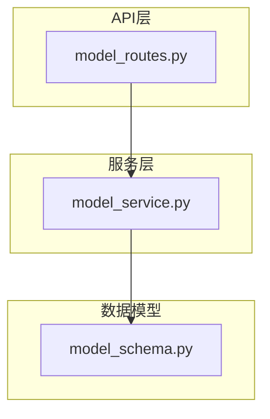
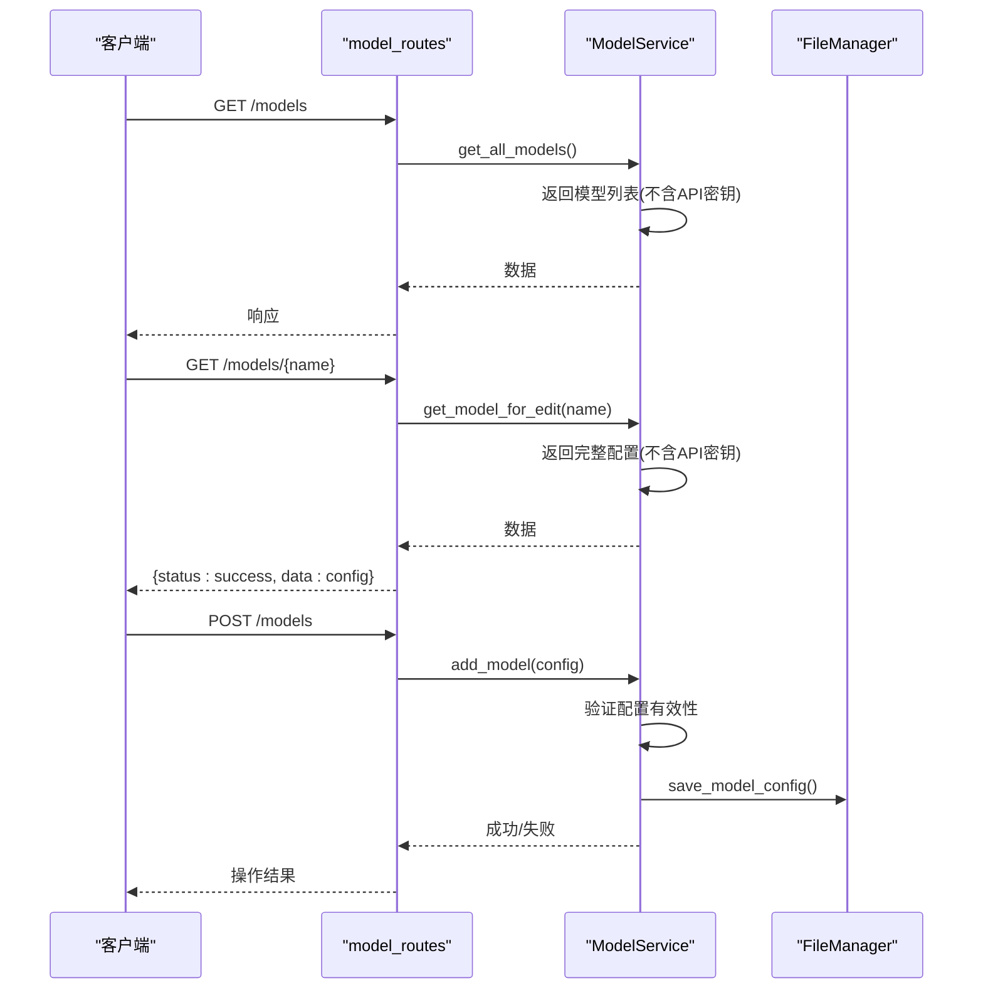
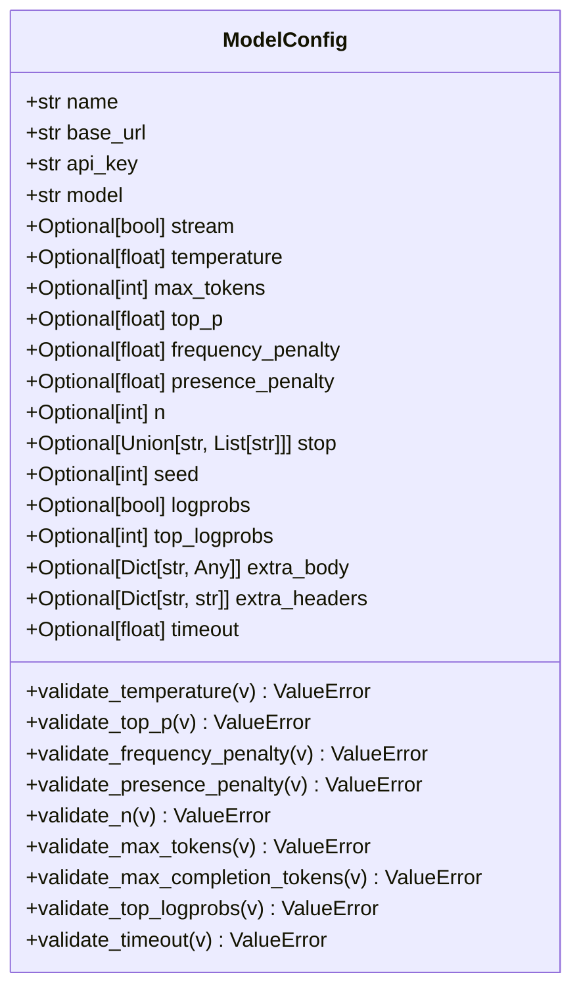
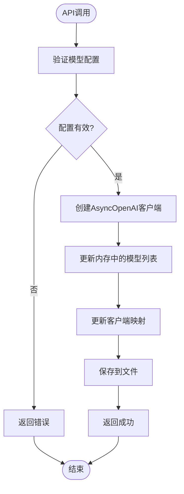
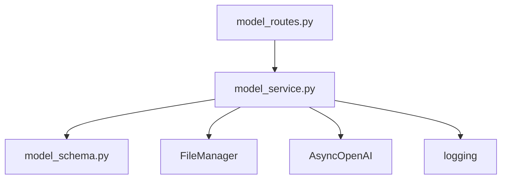

# 模型管理API

<cite>
**本文档引用的文件**  
- [model_routes.py](file://mag/app/api/model_routes.py)
- [model_service.py](file://mag/app/services/model_service.py)
- [model_schema.py](file://mag/app/models/model_schema.py)
</cite>

## 目录
1. [简介](#简介)
2. [项目结构](#项目结构)
3. [核心组件](#核心组件)
4. [架构概览](#架构概览)
5. [详细组件分析](#详细组件分析)
6. [依赖分析](#依赖分析)
7. [性能考虑](#性能考虑)
8. [故障排除指南](#故障排除指南)
9. [结论](#结论)

## 简介
本API提供对大语言模型配置的完整管理功能，包括获取、创建、更新和删除模型。系统通过安全机制处理API密钥，确保敏感信息仅在编辑场景下返回加密版本。模型配置被图节点和聊天系统广泛引用，作为执行AI任务的基础。所有操作均持久化到文件系统，并实时同步到运行时环境。

## 项目结构
模型管理功能分布在API路由、服务层和数据模型三个主要模块中，形成清晰的分层架构。



**Diagram sources **  
- [model_routes.py](file://mag/app/api/model_routes.py#L1-L152)
- [model_service.py](file://mag/app/services/model_service.py#L1-L400)
- [model_schema.py](file://mag/app/models/model_schema.py#L1-L88)

**Section sources**
- [model_routes.py](file://mag/app/api/model_routes.py#L1-L152)
- [model_service.py](file://mag/app/services/model_service.py#L1-L400)
- [model_schema.py](file://mag/app/models/model_schema.py#L1-L88)

## 核心组件
包含三个核心组件：`ModelConfig` 定义了模型的完整配置结构；`ModelService` 提供模型的增删改查和客户端管理；`model_routes` 实现RESTful API端点。服务层与文件管理系统集成，确保配置持久化。

**Section sources**
- [model_schema.py](file://mag/app/models/model_schema.py#L1-L88)
- [model_service.py](file://mag/app/services/model_service.py#L1-L400)
- [model_routes.py](file://mag/app/api/model_routes.py#L1-L152)

## 架构概览
系统采用分层架构，API路由接收请求后委托给模型服务，服务层操作内存中的模型列表并同步到文件存储。



**Diagram sources **
- [model_routes.py](file://mag/app/api/model_routes.py#L15-L152)
- [model_service.py](file://mag/app/services/model_service.py#L50-L350)

## 详细组件分析

### 模型配置分析
`ModelConfig` 类使用Pydantic定义了完整的模型配置结构，包含必填和可选参数。



**Diagram sources **
- [model_schema.py](file://mag/app/models/model_schema.py#L5-L88)

**Section sources**
- [model_schema.py](file://mag/app/models/model_schema.py#L5-L88)

### 模型服务分析
`ModelService` 类管理所有模型的生命周期，包括客户端初始化、配置验证和持久化。

#### 服务交互流程


**Diagram sources **
- [model_service.py](file://mag/app/services/model_service.py#L50-L350)

**Section sources**
- [model_service.py](file://mag/app/services/model_service.py#L50-L350)

### API路由分析
路由层实现五个RESTful端点，统一处理异常并记录日志。

#### 端点调用流程
```mermaid
flowchart TD
A[HTTP请求] --> B{方法/路径}
B --> |GET /models| C[get_all_models]
B --> |GET /models/{name}| D[get_model_for_edit]
B --> |POST /models| E[add_model]
B --> |PUT /models/{name}| F[update_model]
B --> |DELETE /models/{name}| G[delete_model]
C --> H[返回模型列表]
D --> I[返回编辑配置]
E --> J[验证并添加]
F --> K[验证并更新]
G --> L[验证并删除]
H --> M[HTTP响应]
I --> M
J --> M
K --> M
L --> M
```

**Diagram sources **
- [model_routes.py](file://mag/app/api/model_routes.py#L15-L152)

**Section sources**
- [model_routes.py](file://mag/app/api/model_routes.py#L15-L152)

## 依赖分析
模型管理模块依赖于文件管理系统进行持久化，并使用OpenAI异步客户端进行API调用验证。



**Diagram sources **
- [model_routes.py](file://mag/app/api/model_routes.py#L1-L152)
- [model_service.py](file://mag/app/services/model_service.py#L1-L400)

**Section sources**
- [model_routes.py](file://mag/app/api/model_routes.py#L1-L152)
- [model_service.py](file://mag/app/services/model_service.py#L1-L400)

## 性能考虑
服务在初始化时加载所有模型配置并创建客户端实例，避免每次调用时重复初始化。API密钥不包含在常规响应中，减少数据传输量。流式响应支持提高大模型输出的用户体验。

## 故障排除指南
常见问题包括模型配置验证失败、API密钥错误和文件读写权限问题。服务层记录详细日志，帮助诊断客户端初始化和配置保存过程中的异常。

**Section sources**
- [model_service.py](file://mag/app/services/model_service.py#L50-L350)
- [model_routes.py](file://mag/app/api/model_routes.py#L15-L152)

## 结论
该模型管理API提供了安全、可靠的模型配置管理功能，通过分层架构实现了关注点分离。配置验证机制确保了数据完整性，而加密密钥的安全处理保护了敏感信息。系统设计支持动态模型管理，为图节点和聊天系统提供灵活的AI能力基础。