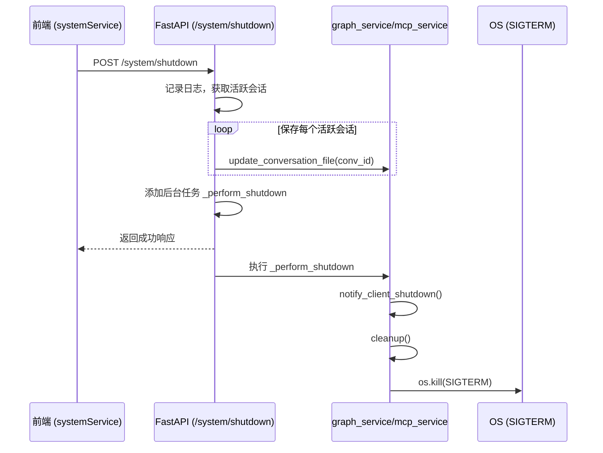

# 系统控制API

<cite>
**本文档引用的文件**  
- [system_routes.py](file://mag/app/api/system_routes.py#L1-L62)
- [systemService.ts](file://frontend/src/services/systemService.ts#L1-L11)
- [ServerStatusIndicator.tsx](file://frontend/src/components/graph-editor/ServerStatusIndicator.tsx#L1-L45)
- [routes.py](file://mag/app/api/routes.py#L1-L21)
- [main.py](file://mag/main.py#L1-L88)
</cite>

## 目录
1. [简介](#简介)
2. [系统控制端点概览](#系统控制端点概览)
3. [关闭服务器接口 (/system/shutdown)](#关闭服务器接口-systemshutdown)
4. [前端服务调用与状态指示](#前端服务调用与状态指示)
5. [运维集成与使用场景](#运维集成与使用场景)
6. [安全与资源清理机制](#安全与资源清理机制)
7. [结论](#结论)

## 简介
本系统控制API为MAG（MCP Agent Graph）平台提供关键的系统级操作接口，支持获取系统信息、健康检查和安全关闭服务器等核心运维功能。这些接口在部署、监控和维护系统稳定性方面起着至关重要的作用。本文档重点分析 `/system/shutdown` 接口的实现机制，说明其如何安全终止FastAPI应用并清理相关资源，并介绍前端组件如何调用这些API以实现系统状态可视化。

## 系统控制端点概览
MAG平台通过 `system_routes.py` 模块暴露系统级控制接口，所有接口均挂载于 `/system` 路径下。主路由文件 `routes.py` 将 `system_router` 注册至应用，使这些接口可通过 `/api/system/*` 访问。目前实现的核心端点包括：
- `GET /system/info`：获取系统基本信息
- `GET /system/health`：健康检查接口，用于Kubernetes等容器编排系统的探针集成
- `POST /system/shutdown`：触发系统优雅关闭流程

这些接口为自动化运维、容器化部署和系统监控提供了标准化的控制通道。

**Section sources**
- [system_routes.py](file://mag/app/api/system_routes.py#L1-L62)
- [routes.py](file://mag/app/api/routes.py#L1-L21)

## 关闭服务器接口 (/system/shutdown)
`/system/shutdown` 是一个POST接口，用于启动系统的优雅关闭流程。该接口设计确保在终止服务前完成必要的资源清理和状态持久化。

### 接口行为
当接收到关闭请求时，系统执行以下步骤：
1. **日志记录**：记录关闭请求的接收。
2. **会话保存**：遍历所有活跃会话（`graph_service.active_conversations`），调用 `update_conversation_file` 将当前会话状态持久化到文件系统，防止数据丢失。
3. **异步关闭任务**：将实际的关闭操作 `_perform_shutdown` 作为后台任务提交，立即向客户端返回响应，避免请求超时。
4. **响应返回**：返回JSON格式的成功响应，包含状态、消息及活跃会话数量。

### 预期响应格式
成功响应示例：
```json
{
  "status": "success",
  "message": "服务关闭过程已启动",
  "active_sessions": 2
}
```
若关闭流程启动失败，则返回500错误及详细信息。

### 安全考虑
该接口未在代码中显式添加身份验证或访问控制，因此在生产环境中应通过反向代理（如Nginx）或API网关配置访问策略，仅允许受信任的运维系统或管理员调用，防止未授权的系统关闭。



**Diagram sources**
- [system_routes.py](file://mag/app/api/system_routes.py#L1-L62)

**Section sources**
- [system_routes.py](file://mag/app/api/system_routes.py#L1-L62)

## 前端服务调用与状态指示
前端通过 `systemService.ts` 中的 `shutdownSystem` 函数调用 `/system/shutdown` 接口。该函数使用封装的 `api` 实例发送POST请求，并处理可能的网络错误。

### 前端状态指示器
`ServerStatusIndicator.tsx` 组件用于在图形编辑器界面中显示MCP服务器的连接状态。虽然该组件不直接调用系统控制API，但它体现了前端如何感知后端服务状态：
- 当无MCP服务器连接时，显示黄色警告标签，提示用户前往MCP管理页面进行配置和连接。
- 该组件依赖 `mcpStore` 中的状态，通过 `useMCPStore` Hook 订阅状态变化。

此设计模式可扩展至系统健康状态的显示，例如集成 `/system/health` 接口来指示整个MAG服务的运行状况。

**Section sources**
- [systemService.ts](file://frontend/src/services/systemService.ts#L1-L11)
- [ServerStatusIndicator.tsx](file://frontend/src/components/graph-editor/ServerStatusIndicator.tsx#L1-L45)

## 运维集成与使用场景
### Kubernetes探针集成
`/system/health` 接口是实现Kubernetes存活（liveness）和就绪（readiness）探针的理想选择。通过定期调用此接口，Kubernetes可以自动检测应用的健康状况，并在应用无响应时重启Pod，确保服务的高可用性。

### 自动化部署流水线
在CI/CD流水线中，`/system/shutdown` 可用于在部署新版本前安全地终止旧实例。配合滚动更新或蓝绿部署策略，可以实现零停机更新。新版本应用启动后，Kubernetes会自动将其加入服务网格。

### 紧急维护
在需要进行紧急维护或系统升级时，运维人员可通过调用 `/system/shutdown` API，确保所有活跃会话被正确保存，MCP客户端被优雅通知，然后安全地终止进程。

## 安全与资源清理机制
`/system/shutdown` 接口的设计体现了“优雅关闭”的原则：
1. **资源清理**：通过 `mcp_service.cleanup()` 方法清理MCP客户端资源。`notify_client_shutdown()` 允许客户端在断开前执行清理逻辑。
2. **进程终止**：最终通过 `os.kill(os.getpid(), signal.SIGTERM)` 向自身进程发送SIGTERM信号。这符合容器化环境的标准，允许进程在接收到信号后执行清理代码，而不是被立即强制终止（SIGKILL）。
3. **异步执行**：使用 `BackgroundTasks` 确保关闭逻辑在返回响应后继续执行，保证了API调用的及时响应。

此机制确保了数据一致性（会话保存）和服务依赖的有序关闭（MCP客户端清理）。

**Section sources**
- [system_routes.py](file://mag/app/api/system_routes.py#L1-L62)
- [main.py](file://mag/main.py#L1-L88)

## 结论
MAG平台的系统控制API为运维管理提供了强大而安全的工具。`/system/shutdown` 接口通过保存会话、清理资源和异步终止进程，实现了服务的优雅关闭。前端通过 `systemService` 调用这些API，并可通过类似 `ServerStatusIndicator` 的组件构建丰富的状态可视化界面。为了生产环境的安全，建议为这些控制接口添加适当的访问控制。这些API的集成对于实现自动化运维、高可用部署和系统稳定性至关重要。