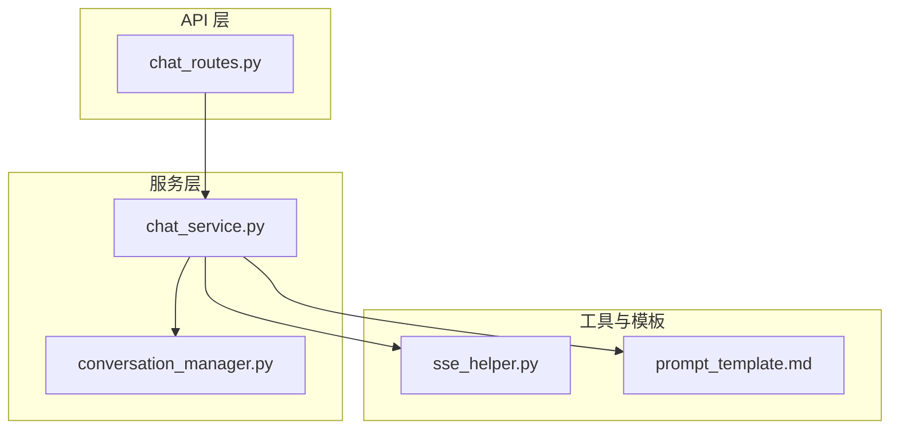
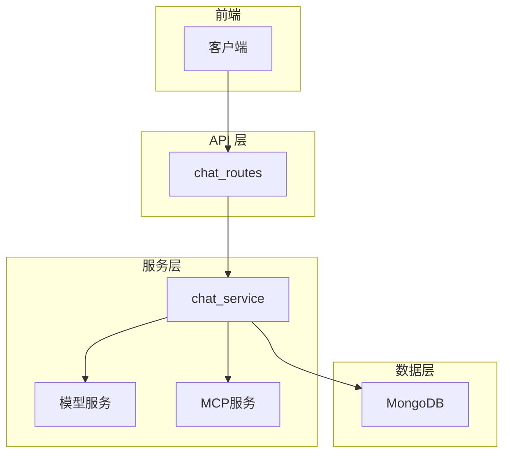
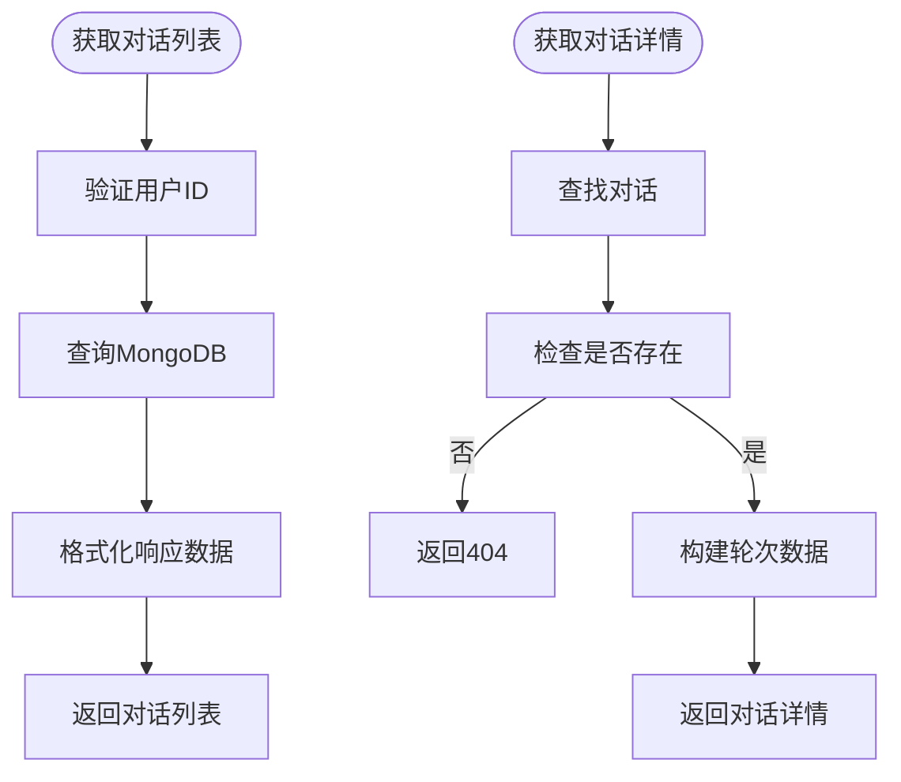
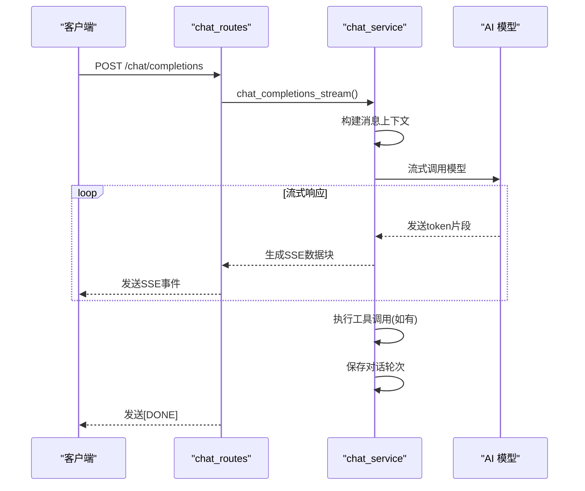
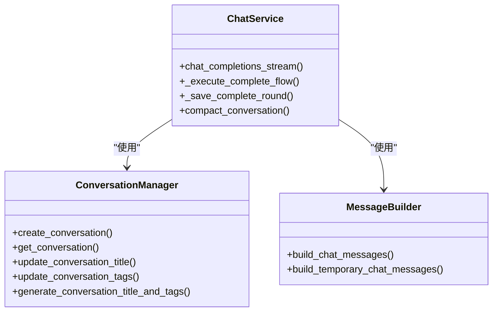
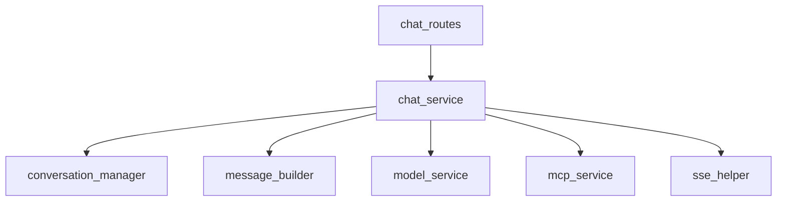

# 聊天系统API

<cite>
**本文档中引用的文件**
- [chat_routes.py](file://mag/app/api/chat_routes.py)
- [chat_service.py](file://mag/app/services/chat_service.py)
- [conversation_manager.py](file://mag/app/services/docdb/conversation_manager.py)
- [prompt_template.md](file://mag/app/templates/prompt_template.md)
- [sse_helper.py](file://mag/app/utils/sse_helper.py)
</cite>

## 目录
1. [简介](#简介)
2. [项目结构](#项目结构)
3. [核心组件](#核心组件)
4. [架构概述](#架构概述)
5. [详细组件分析](#详细组件分析)
6. [依赖分析](#依赖分析)
7. [性能考虑](#性能考虑)
8. [故障排除指南](#故障排除指南)
9. [结论](#结论)

## 简介
本API文档详细描述了聊天系统的核心功能，涵盖对话管理的全部端点。系统支持创建会话、发送消息、获取会话列表与历史、更新会话元数据以及删除会话等操作。特别地，系统通过SSE（服务器发送事件）实现AI回复的实时流式传输，确保前端能够即时接收模型生成的token。文档重点说明了`/chat/completions`端点的工作机制，包括如何处理用户输入、调用底层AI服务以及逐步发送token的实现方式。此外，还解释了该路由与`chat_service`和`conversation_manager`服务的集成逻辑，以及如何利用`prompt_template.md`中的模板构建上下文。

## 项目结构
聊天系统API位于`mag/app/api/`目录下，主要由`chat_routes.py`文件提供HTTP接口。业务逻辑由`chat_service.py`实现，数据持久化通过`mongodb_service`完成，而对话管理功能则由`docdb/conversation_manager.py`负责。提示词模板定义在`templates/prompt_template.md`中，SSE流式响应的支持由`utils/sse_helper.py`提供。

**Diagram sources**
- [chat_routes.py](file://mag/app/api/chat_routes.py#L1-L50)
- [chat_service.py](file://mag/app/services/chat_service.py#L1-L30)
- [conversation_manager.py](file://mag/app/services/docdb/conversation_manager.py#L1-L20)
- [sse_helper.py](file://mag/app/utils/sse_helper.py#L1-L10)
- [prompt_template.md](file://mag/app/templates/prompt_template.md#L1-L10)

**Section sources**
- [chat_routes.py](file://mag/app/api/chat_routes.py#L1-L50)
- [chat_service.py](file://mag/app/services/chat_service.py#L1-L30)

## 核心组件
核心组件包括处理HTTP请求的`chat_routes`、执行聊天逻辑的`chat_service`、管理对话生命周期的`conversation_manager`、支持流式响应的`sse_helper`以及定义交互行为的`prompt_template`。这些组件协同工作，实现了完整的聊天功能。

**Section sources**
- [chat_routes.py](file://mag/app/api/chat_routes.py#L25-L100)
- [chat_service.py](file://mag/app/services/chat_service.py#L15-L80)
- [conversation_manager.py](file://mag/app/services/docdb/conversation_manager.py#L10-L50)

## 架构概述
系统采用分层架构，API层接收客户端请求，服务层处理业务逻辑，数据访问层与MongoDB交互。`chat_service`作为核心服务，协调消息构建、模型调用、工具执行和结果保存。SSE流式响应确保了AI回复的低延迟传输。

**Diagram sources**
- [chat_routes.py](file://mag/app/api/chat_routes.py#L10-L30)
- [chat_service.py](file://mag/app/services/chat_service.py#L20-L50)

## 详细组件分析

### 对话管理端点分析
`chat_routes.py`中的端点提供了完整的对话管理功能，包括创建、读取、更新和删除操作。

#### 对话列表与详情获取

**Diagram sources**
- [chat_routes.py](file://mag/app/api/chat_routes.py#L100-L200)

#### 会话流式响应机制

**Diagram sources**
- [chat_routes.py](file://mag/app/api/chat_routes.py#L50-L90)
- [chat_service.py](file://mag/app/services/chat_service.py#L50-L150)

### 消息流与SSE实现
系统通过SSE实现AI回复的实时流式传输。当客户端请求`/chat/completions`且`stream=true`时，服务器返回`text/event-stream`类型的响应。`chat_service.chat_completions_stream`方法创建一个异步生成器，逐个yield模型返回的token。`sse_helper.py`确保了SSE协议的正确实现，包括适当的HTTP头设置和数据格式。

**Section sources**
- [chat_routes.py](file://mag/app/api/chat_routes.py#L50-L90)
- [chat_service.py](file://mag/app/services/chat_service.py#L50-L150)
- [sse_helper.py](file://mag/app/utils/sse_helper.py#L1-L20)

### 前端调用示例
前端使用`EventSource`或`fetch` API接收流式响应。对于`fetch`，需处理`ReadableStream`并逐块读取数据。每个SSE事件包含一个JSON格式的数据块，客户端需解析并累积内容，直到收到`[DONE]`信号。

**Section sources**
- [chat_routes.py](file://mag/app/api/chat_routes.py#L50-L90)

### 与核心服务的集成
`/chat/completions`端点深度集成`chat_service`和`conversation_manager`。`chat_service`负责协调整个聊天流程，包括消息构建、模型调用和工具执行。`conversation_manager`则管理对话的元数据，如标题、标签和状态。当新对话的第一轮完成时，系统会自动调用`generate_conversation_title_and_tags`方法，基于初始对话内容生成合适的标题和标签。

**Diagram sources**
- [chat_service.py](file://mag/app/services/chat_service.py#L10-L40)
- [conversation_manager.py](file://mag/app/services/docdb/conversation_manager.py#L10-L40)

### 提示词模板的使用
系统利用`prompt_template.md`中的模板构建上下文。当需要生成对话标题和标签时，系统根据内容语言选择相应的提示词模板（如`get_title_prompt`），然后填充用户消息和助手回复的内容，最后调用模型生成结构化的标题和标签。这种机制确保了生成内容的一致性和专业性。

**Section sources**
- [prompt_template.md](file://mag/app/templates/prompt_template.md#L1-L150)
- [conversation_manager.py](file://mag/app/services/docdb/conversation_manager.py#L200-L250)

## 依赖分析
系统组件间存在清晰的依赖关系。`chat_routes`依赖`chat_service`处理业务逻辑，`chat_service`进一步依赖`conversation_manager`进行对话管理，并通过`message_builder`构建消息。模型调用依赖`model_service`，工具执行依赖`mcp_service`。这种分层依赖确保了系统的模块化和可维护性。

**Diagram sources**
- [chat_routes.py](file://mag/app/api/chat_routes.py#L1-L20)
- [chat_service.py](file://mag/app/services/chat_service.py#L1-L30)

**Section sources**
- [chat_routes.py](file://mag/app/api/chat_routes.py#L1-L20)
- [chat_service.py](file://mag/app/services/chat_service.py#L1-L30)

## 性能考虑
系统在设计时考虑了性能因素。流式响应减少了用户等待时间，工具调用批处理提高了效率。对话压缩功能（`compact_conversation`）通过总结长内容来控制token使用量。数据库操作经过优化，如批量更新和索引使用，确保了高并发下的响应速度。

## 故障排除指南
常见问题包括模型调用失败、SSE连接中断和对话保存错误。日志记录在`logger`中，可通过查看相关服务的日志定位问题。对于SSE问题，检查HTTP头是否正确设置；对于模型调用失败，验证模型配置和API密钥；对于数据保存问题，检查MongoDB连接和文档结构。

**Section sources**
- [chat_service.py](file://mag/app/services/chat_service.py#L1-L20)
- [conversation_manager.py](file://mag/app/services/docdb/conversation_manager.py#L1-L20)

## 结论
聊天系统API提供了一套完整的对话管理解决方案，通过SSE实现实时流式响应，结合模块化的服务架构和智能的上下文构建，为用户提供流畅的交互体验。系统的可扩展设计允许轻松集成新的模型和工具，满足不断变化的需求。