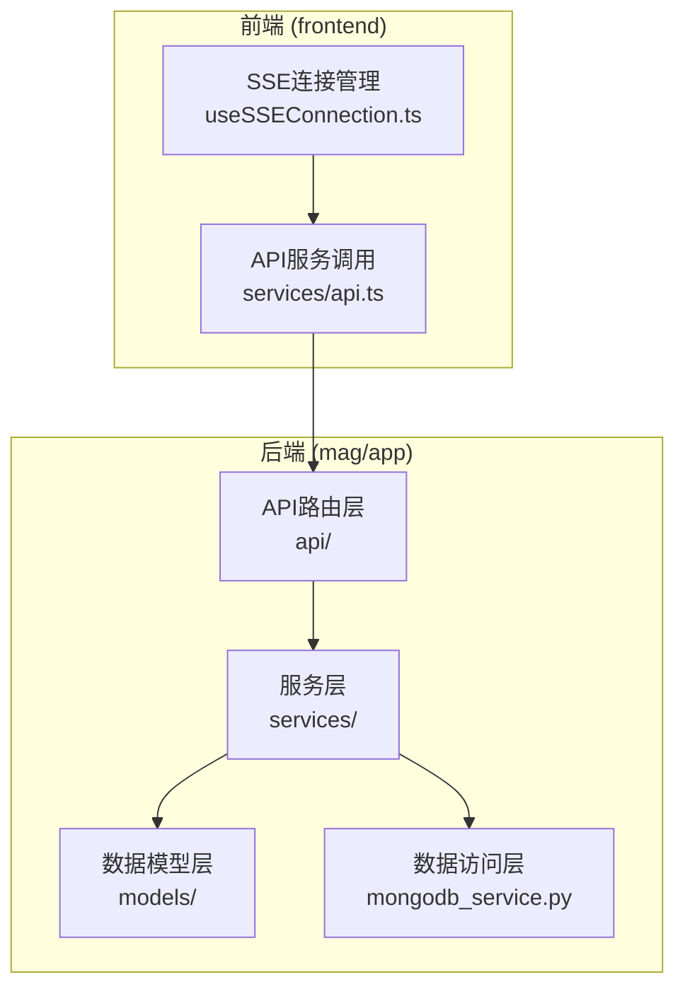
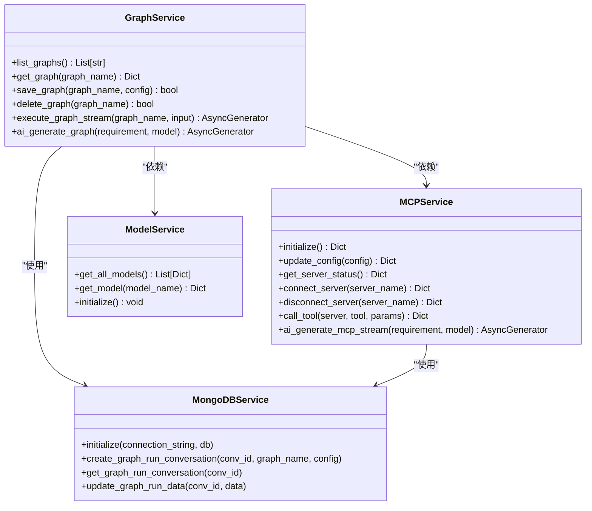
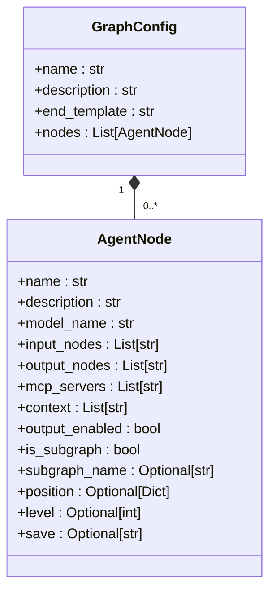
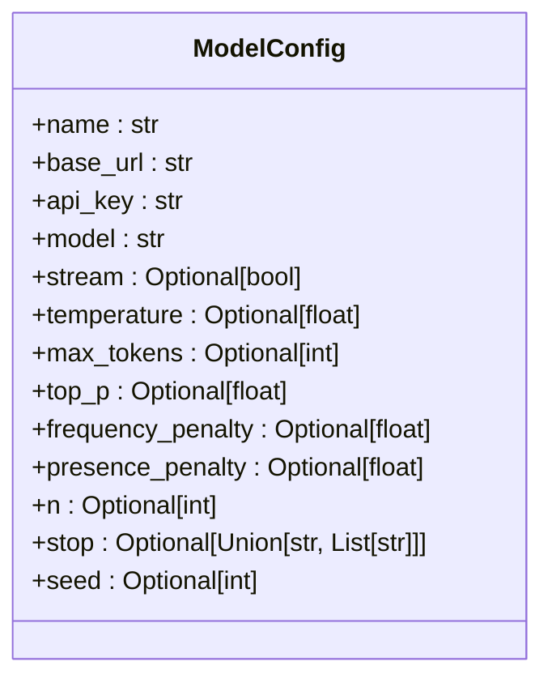
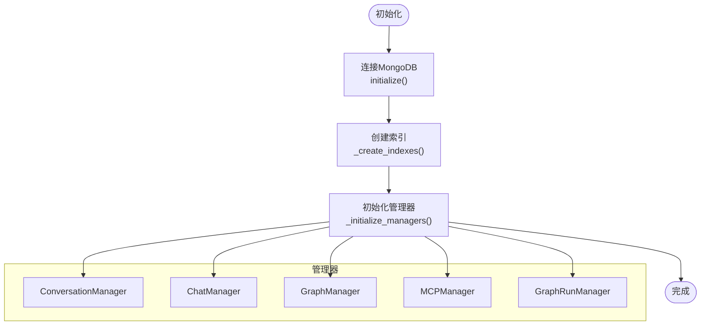
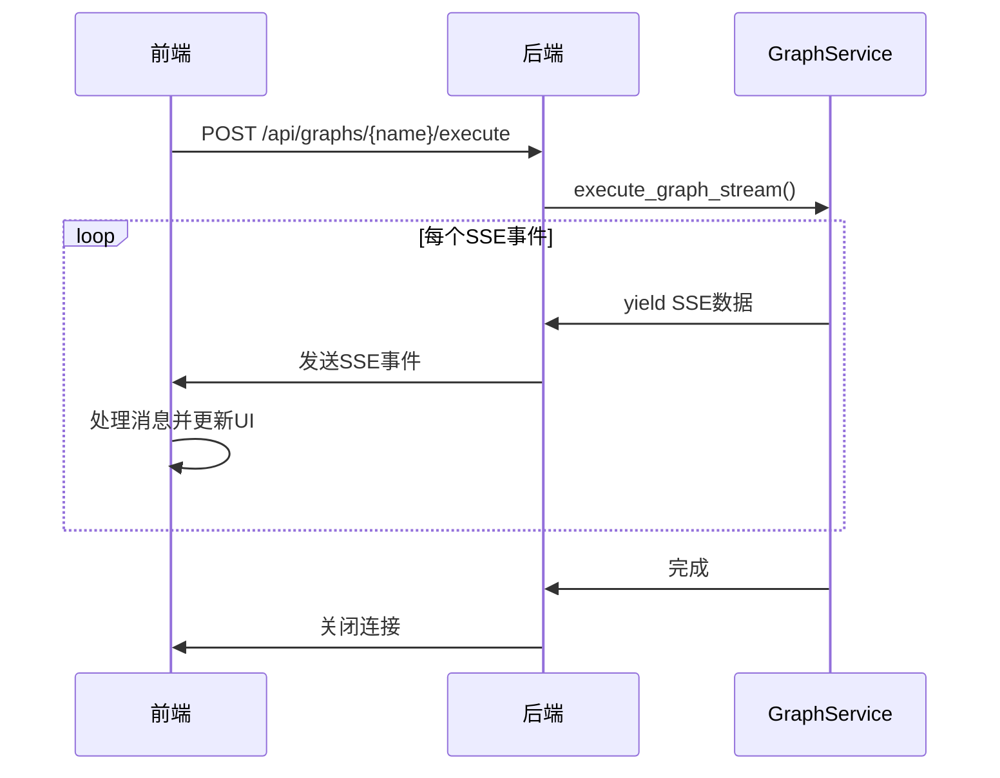
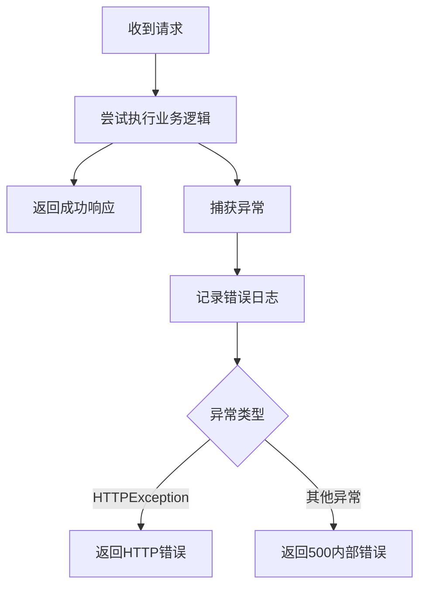

# 后端服务

<cite>
**本文档中引用的文件**  
- [main.py](file://mag/main.py)
- [routes.py](file://mag/app/api/routes.py)
- [graph_routes.py](file://mag/app/api/graph_routes.py)
- [mcp_routes.py](file://mag/app/api/mcp_routes.py)
- [model_routes.py](file://mag/app/api/model_routes.py)
- [graph_service.py](file://mag/app/services/graph_service.py)
- [mcp_service.py](file://mag/app/services/mcp_service.py)
- [model_service.py](file://mag/app/services/model_service.py)
- [mongodb_service.py](file://mag/app/services/mongodb_service.py)
- [graph_schema.py](file://mag/app/models/graph_schema.py)
- [mcp_schema.py](file://mag/app/models/mcp_schema.py)
- [model_schema.py](file://mag/app/models/model_schema.py)
- [useSSEConnection.ts](file://frontend/src/hooks/useSSEConnection.ts)
</cite>

## 目录
1. [简介](#简介)
2. [项目结构](#项目结构)
3. [API路由层](#api路由层)
4. [服务层](#服务层)
5. [数据模型层](#数据模型层)
6. [数据访问层](#数据访问层)
7. [关键服务详解](#关键服务详解)
8. [异步任务与SSE通信](#异步任务与sse通信)
9. [API调用示例](#api调用示例)
10. [错误处理机制](#错误处理机制)

## 简介
本项目是一个基于FastAPI的后端服务，旨在通过MCP（Model Control Protocol）和图结构构建智能Agent系统。系统支持图的创建、执行、导入导出，以及MCP服务器的动态管理。前端通过SSE（Server-Sent Events）与后端进行实时通信，实现流式响应。后端采用分层架构，包括API路由层、服务层、数据模型层和数据访问层，确保代码的可维护性和扩展性。

## 项目结构
项目采用模块化设计，主要分为`frontend`（前端）和`mag`（后端）两个部分。后端核心位于`mag/app`目录下，包含`api`（API路由）、`services`（业务逻辑）、`models`（数据模型）、`core`（核心工具）和`utils`（辅助工具）等模块。数据持久化通过MongoDB实现，由`mongodb_service.py`统一管理。



**图来源**  
- [main.py](file://mag/main.py)
- [routes.py](file://mag/app/api/routes.py)
- [mongodb_service.py](file://mag/app/services/mongodb_service.py)

## API路由层
API路由层基于FastAPI框架，通过主路由器`routes.py`聚合多个子路由模块，实现RESTful API设计。所有API均以`/api`为前缀，支持图管理、MCP服务、模型配置、系统状态等核心功能。

```mermaid
graph TD
A[/api] --> B[/api/graphs]
A --> C[/api/mcp]
A --> D[/api/models]
A --> E[/api/chat]
A --> F[/api/system]
B --> B1[GET /graphs]
B --> B2[POST /graphs]
B --> B3[PUT /graphs/{old_name}/rename/{new_name}]
B --> B4[DELETE /graphs/{graph_name}]
C --> C1[POST /mcp/config]
C --> C2[GET /mcp/status]
C --> C3[POST /mcp/connect/{server_name}]
C --> C4[POST /mcp/disconnect/{server_name}]
```

**图来源**  
- [routes.py](file://mag/app/api/routes.py)
- [graph_routes.py](file://mag/app/api/graph_routes.py)
- [mcp_routes.py](file://mag/app/api/mcp_routes.py)

**本节来源**  
- [routes.py](file://mag/app/api/routes.py#L1-L21)

## 服务层
服务层是业务逻辑的核心，封装了图服务、MCP服务、模型服务和MongoDB服务。各服务通过依赖注入和单例模式协调工作，确保系统状态的一致性。



**图来源**  
- [graph_service.py](file://mag/app/services/graph_service.py#L1-L220)
- [mcp_service.py](file://mag/app/services/mcp_service.py#L1-L154)
- [model_service.py](file://mag/app/services/model_service.py)
- [mongodb_service.py](file://mag/app/services/mongodb_service.py#L1-L140)

## 数据模型层
数据模型层使用Pydantic定义数据结构和验证规则，确保数据的完整性和一致性。主要模型包括`GraphConfig`、`MCPServerConfig`和`ModelConfig`。

### GraphConfig 模型


**验证规则**：
- `name`：不能为空，不能包含 `/`, `\`, `.` 等特殊字符
- `model_name`：普通节点必须指定模型名称
- `subgraph_name`：子图节点必须指定子图名称

**图来源**  
- [graph_schema.py](file://mag/app/models/graph_schema.py#L17-L43)

### ModelConfig 模型


**验证规则**：
- `temperature`：范围 0.0-2.0
- `top_p`：范围 0.0-1.0
- `frequency_penalty` 和 `presence_penalty`：范围 -2.0-2.0
- `n` 和 `max_tokens`：必须大于0

**图来源**  
- [model_schema.py](file://mag/app/models/model_schema.py#L0-L21)
- [model_schema.py](file://mag/app/models/model_schema.py#L48-L88)

## 数据访问层
数据访问层由`mongodb_service.py`实现，基于Motor（异步MongoDB驱动）进行数据库操作。服务初始化时建立连接，并为不同数据类型创建索引，确保查询效率。



**图来源**  
- [mongodb_service.py](file://mag/app/services/mongodb_service.py#L0-L140)
- [docdb/__init__.py](file://mag/app/services/docdb/__init__.py#L0-L17)

## 关键服务详解

### 图服务（graph_service）
`GraphService`负责图的全生命周期管理，包括创建、执行、AI生成和MCP脚本生成。核心功能如下：
- **图执行**：`execute_graph_stream`方法支持流式执行，通过SSE实时返回结果。
- **AI生成图**：`ai_generate_graph`方法调用大模型根据需求生成图结构。
- **MCP脚本生成**：`generate_mcp_script`方法基于模板生成可执行的MCP服务器脚本。

**本节来源**  
- [graph_service.py](file://mag/app/services/graph_service.py#L1-L220)

### MCP服务（mcp_service）
`MCPService`是MCP生态的协调者，管理客户端进程、服务器连接和工具调用。
- **初始化**：`initialize`方法启动MCP客户端进程。
- **服务器管理**：`connect_server`和`disconnect_server`方法控制服务器连接状态。
- **AI生成MCP**：`ai_generate_mcp_stream`方法支持流式生成MCP工具配置。

**本节来源**  
- [mcp_service.py](file://mag/app/services/mcp_service.py#L1-L154)

## 异步任务与SSE通信
系统通过SSE实现服务器到客户端的实时通信，支持流式响应和状态更新。前端使用`useSSEConnection` Hook管理连接，后端通过`execute_graph_stream`等方法生成SSE事件流。



**图来源**  
- [graph_service.py](file://mag/app/services/graph_service.py#L1-L220)
- [useSSEConnection.ts](file://frontend/src/hooks/useSSEConnection.ts#L0-L43)

## API调用示例
### 创建图
```http
POST /api/graphs
Content-Type: application/json

{
  "name": "test_graph",
  "description": "测试图",
  "nodes": [
    {
      "name": "node1",
      "model_name": "gpt-4",
      "input_nodes": ["start"],
      "output_nodes": ["end"]
    }
  ]
}
```

### 执行图（SSE）
```http
GET /api/graphs/test_graph/execute?input=hello
Accept: text/event-stream
```

### 更新MCP配置
```http
POST /api/mcp/config
Content-Type: application/json

{
  "mcpServers": {
    "server1": {
      "url": "http://localhost:8080",
      "transportType": "sse"
    }
  }
}
```

## 错误处理机制
系统采用分层错误处理策略：
1. **FastAPI异常处理**：全局`generic_exception_handler`捕获未处理异常，返回500错误。
2. **HTTPException**：在路由层显式抛出，返回特定状态码和错误信息。
3. **日志记录**：所有关键操作和错误均通过`logging`模块记录，便于调试。



**本节来源**  
- [main.py](file://mag/main.py#L1-L119)
- [graph_routes.py](file://mag/app/api/graph_routes.py#L173-L212)
- [mcp_routes.py](file://mag/app/api/mcp_routes.py#L39-L74)