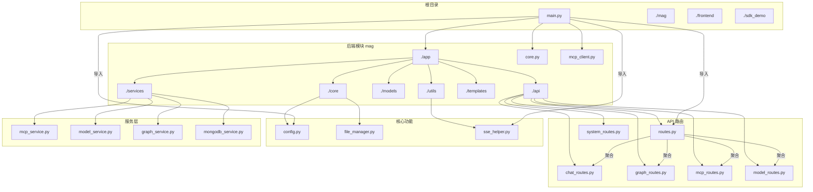
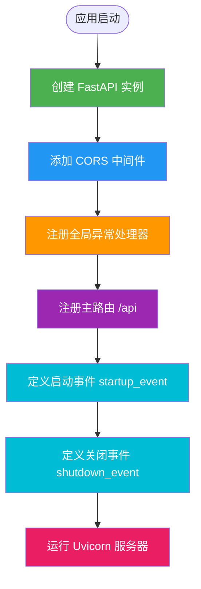
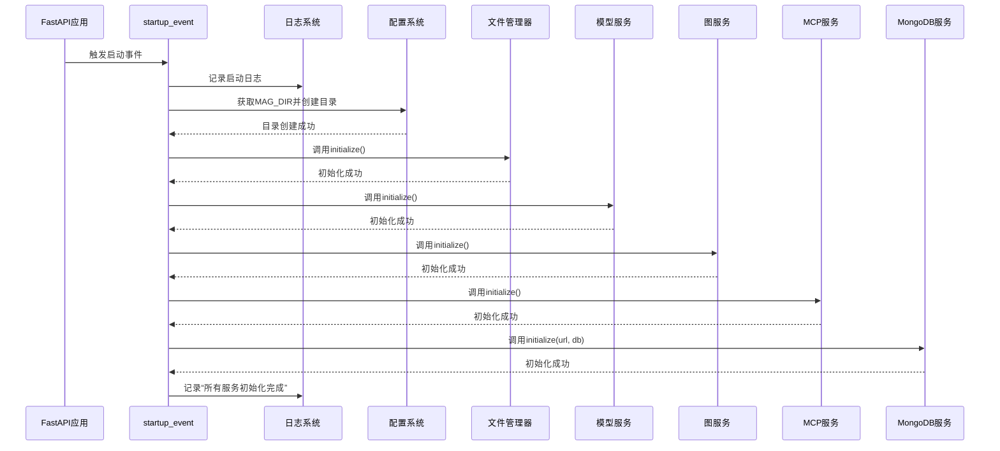
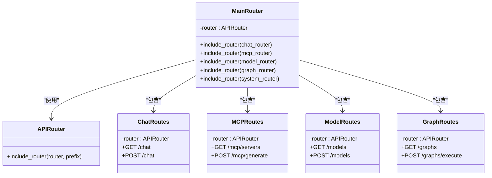
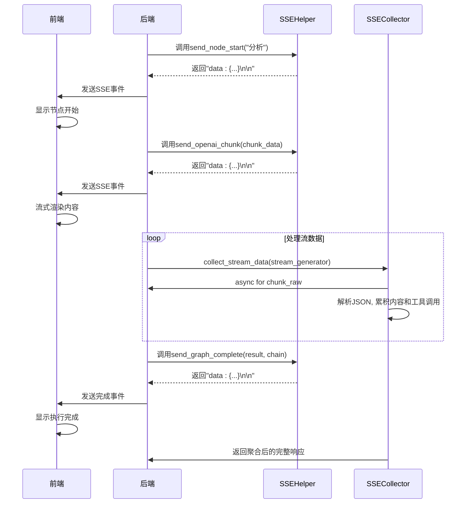
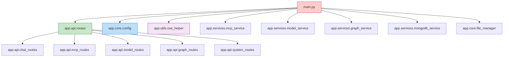

# 后端架构设计

<cite>
**本文档中引用的文件**  
- [main.py](file://mag/main.py)
- [routes.py](file://mag/app/api/routes.py)
- [config.py](file://mag/app/core/config.py)
- [sse_helper.py](file://mag/app/utils/sse_helper.py)
</cite>

## 目录
1. [简介](#简介)
2. [项目结构](#项目结构)
3. [核心组件](#核心组件)
4. [架构概览](#架构概览)
5. [详细组件分析](#详细组件分析)
6. [依赖分析](#依赖分析)
7. [性能考虑](#性能考虑)
8. [故障排除指南](#故障排除指南)
9. [结论](#结论)

## 简介
本项目是一个基于 FastAPI 构建的后端服务，名为 MAG（MCP Agent Graph），旨在通过 MCP（Model Control Protocol）与图结构结合的方式构建智能 Agent 系统。系统采用模块化设计，支持异步处理、服务热启动/关闭、SSE 实时通信，并通过分层路由机制组织 API 接口。本文档将深入解析其架构设计、初始化流程、配置管理、实时通信机制及关键架构决策。

## 项目结构



**Diagram sources**  
- [main.py](file://mag/main.py#L1-L120)
- [routes.py](file://mag/app/api/routes.py#L1-L22)
- [config.py](file://mag/app/core/config.py#L1-L102)
- [sse_helper.py](file://mag/app/utils/sse_helper.py#L1-L400)

**Section sources**  
- [main.py](file://mag/main.py#L1-L120)
- [routes.py](file://mag/app/api/routes.py#L1-L22)

## 核心组件

系统由四大核心模块构成：FastAPI 应用入口、API 路由聚合器、全局配置管理器和 SSE 实时通信辅助工具。`main.py` 负责应用初始化与生命周期管理；`routes.py` 实现路由的集中注册；`config.py` 提供跨模块的配置访问；`sse_helper.py` 支持流式响应的生成与消费。

**Section sources**  
- [main.py](file://mag/main.py#L1-L120)
- [routes.py](file://mag/app/api/routes.py#L1-L22)
- [config.py](file://mag/app/core/config.py#L1-L102)
- [sse_helper.py](file://mag/app/utils/sse_helper.py#L1-L400)

## 架构概览

```mermaid
graph TB
Client[前端客户端] --> |HTTP/SSE| API[FastAPI 服务器]
API --> |启动事件| Startup[Startup Event]
Startup --> Config[加载配置 settings]
Startup --> Dir[创建目录 ensure_directories]
Startup --> File[初始化文件系统 FileManager]
Startup --> Model[初始化模型服务 model_service]
Startup --> Graph[初始化图服务 graph_service]
Startup --> MCP[初始化 MCP 服务 mcp_service]
Startup --> DB[初始化 MongoDB 服务 mongodb_service]
API --> |路由分发| Router[主路由器 /api]
Router --> Chat[chat_routes]
Router --> Graph[graph_routes]
Router --> MCP[mcp_routes]
Router --> Model[model_routes]
Router --> System[system_routes]
API --> |SSE 流| SSE[SSEHelper]
SSE < --> |格式化| Stream[流式数据]
Stream --> Collector[SSECollector/TrajectoryCollector]
Collector --> Response[聚合响应]
style Startup fill:#e1f5fe,stroke:#039be5
style Config fill:#e8f5e8,stroke:#2e7d32
style Router fill:#fff3e0,stroke:#f57c00
style SSE fill:#fce4ec,stroke:#c2185b
```

**Diagram sources**  
- [main.py](file://mag/main.py#L44-L88)
- [routes.py](file://mag/app/api/routes.py#L1-L22)
- [config.py](file://mag/app/core/config.py#L1-L102)
- [sse_helper.py](file://mag/app/utils/sse_helper.py#L1-L400)

## 详细组件分析

### FastAPI 初始化与启动流程

`main.py` 是应用的入口点，负责创建 FastAPI 实例、配置中间件、注册全局异常处理器、聚合 API 路由，并定义启动与关闭事件。

#### 初始化与中间件配置
FastAPI 实例通过 `FastAPI()` 构造函数创建，包含标题、描述和版本信息。系统配置了 CORS 中间件，允许所有来源、方法和头部，支持凭据，适用于开发环境。



**Diagram sources**  
- [main.py](file://mag/main.py#L25-L47)

#### 启动与关闭事件
系统通过 `@app.on_event("startup")` 和 `@app.on_event("shutdown")` 定义了应用生命周期钩子。

- **启动流程**：确保配置目录存在 → 初始化文件管理器 → 初始化模型服务 → 初始化图服务 → 初始化 MCP 服务 → 初始化 MongoDB 服务。
- **关闭流程**：清理 MCP 服务资源。

该设计确保了服务间的依赖顺序和资源的正确释放。



**Diagram sources**  
- [main.py](file://mag/main.py#L44-L88)

**Section sources**  
- [main.py](file://mag/main.py#L44-L88)

### API 路由聚合机制

`routes.py` 采用聚合模式管理所有 API 子路由，实现了清晰的职责分离和集中式路由注册。

#### 路由聚合逻辑
该文件导入所有子路由模块（如 `chat_routes`, `mcp_routes` 等），并使用 `APIRouter.include_router()` 将它们挂载到主路由器上。主路由器在 `main.py` 中被注册到 `/api` 前缀下，形成统一的 API 入口。



**Diagram sources**  
- [routes.py](file://mag/app/api/routes.py#L1-L22)

**Section sources**  
- [routes.py](file://mag/app/api/routes.py#L1-L22)

### 配置管理模块

`config.py` 实现了一个基于 `Settings` 类的全局配置系统，通过环境变量和默认值提供灵活的配置能力。

#### 配置加载与目录管理
系统优先从 `docker/mongo/.env` 文件加载环境变量，若不存在则使用默认值。`Settings` 类通过 `@property` 方法动态计算关键目录路径（如 `.mag` 主目录、`agent`、`conversation` 等），并提供 `ensure_directories()` 方法确保这些目录在启动时被创建。

```mermaid
flowchart TD
A[加载配置] --> B{.env文件存在?}
B --> |是| C[从.docker_env_path加载环境变量]
B --> |否| D[使用默认环境变量]
C --> E[创建Settings实例]
D --> E
E --> F[通过@property计算MAG_DIR等路径]
F --> G[调用ensure_directories()]
G --> H[创建所有必要目录]
H --> I[提供全局settings实例]
```

**Diagram sources**  
- [config.py](file://mag/app/core/config.py#L1-L102)

**Section sources**  
- [config.py](file://mag/app/core/config.py#L1-L102)

### SSE 实时通信机制

`sse_helper.py` 提供了一套完整的 Server-Sent Events (SSE) 解决方案，支持流式数据的生成、发送与聚合。

#### SSE 事件类型与生成
`SSEHelper` 类提供了多种静态方法来生成标准化的 SSE 消息：
- `send_node_start/end`: 标记图中节点的执行开始与结束。
- `send_graph_complete`: 发送图执行完成的最终结果。
- `send_error`: 发送错误信息。
- `send_openai_chunk`: 发送符合 OpenAI 格式的流式数据块。
- `send_tool_message`: 发送工具调用结果。

#### 流式数据聚合
`SSECollector` 和 `TrajectoryCollector` 类用于将流式 SSE 数据重新聚合为完整的非流式响应。它们通过异步迭代器消费流数据，累积内容、工具调用、token 使用量等信息，最终构建出一个包含完整对话轨迹的 JSON 响应，满足不同前端需求。



**Diagram sources**  
- [sse_helper.py](file://mag/app/utils/sse_helper.py#L1-L400)

**Section sources**  
- [sse_helper.py](file://mag/app/utils/sse_helper.py#L1-L400)

## 依赖分析



**Diagram sources**  
- [main.py](file://mag/main.py#L1-L120)
- [routes.py](file://mag/app/api/routes.py#L1-L22)

**Section sources**  
- [main.py](file://mag/main.py#L1-L120)
- [routes.py](file://mag/app/api/routes.py#L1-L22)

## 性能考虑
系统采用异步初始化（`await`）确保服务启动的可靠性。SSE 机制避免了轮询，降低了客户端延迟和服务器负载。通过 `ensure_directories()` 预创建目录，减少了运行时的 I/O 开销。全局配置单例（`settings`）避免了重复的环境变量读取。

## 故障排除指南
- **服务启动失败**：检查日志中 `初始化时出错` 的堆栈信息，确认 MongoDB 是否运行，`.env` 文件配置是否正确。
- **SSE 连接中断**：检查后端是否抛出未处理异常，前端 `useSSEConnection` 钩子是否正确处理 `onError`。
- **路由404**：确认 `routes.py` 是否正确导入并注册了对应的子路由模块。
- **配置未生效**：确认 `docker/mongo/.env` 文件是否存在且格式正确，或环境变量是否已正确设置。

**Section sources**  
- [main.py](file://mag/main.py#L44-L88)
- [frontend/src/hooks/useSSEConnection.ts](file://frontend/src/hooks/useSSEConnection.ts#L1-L43)

## 结论
该后端架构设计清晰、模块化程度高。选择 FastAPI 获得了高性能的异步支持和自动生成的 API 文档。分层设计（API、Service、Core）提升了代码的可维护性和可测试性。SSE 机制为实时交互提供了高效解决方案。整体架构平衡了开发效率、可扩展性和健壮性，为构建复杂的 Agent 系统奠定了坚实基础。