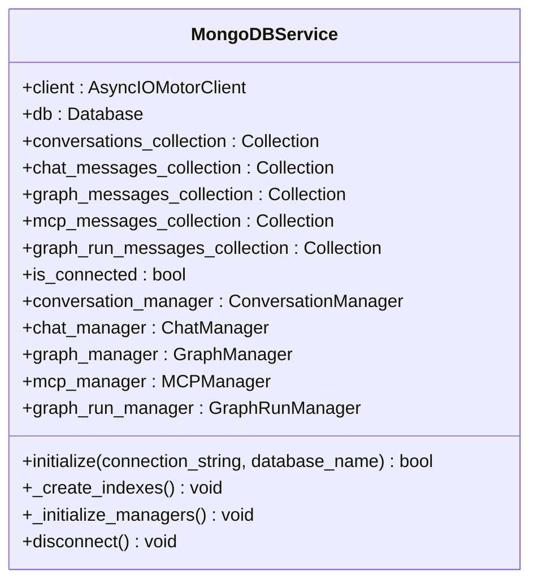
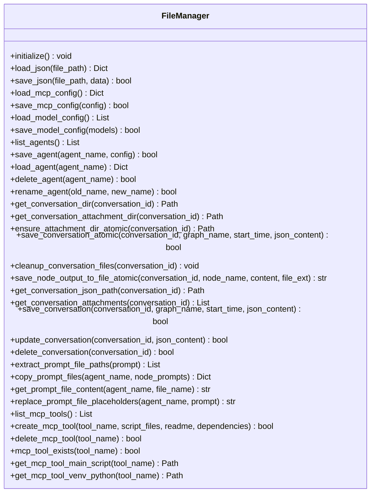

# 数据访问与持久化

<cite>
**本文档引用的文件**   
- [mongodb_service.py](file://mag/app/services/mongodb_service.py)
- [graph_manager.py](file://mag/app/services/docdb/graph_manager.py)
- [mcp_manager.py](file://mag/app/services/docdb/mcp_manager.py)
- [file_manager.py](file://mag/app/core/file_manager.py)
- [conversation_manager.py](file://mag/app/services/docdb/conversation_manager.py)
- [chat_manager.py](file://mag/app/services/docdb/chat_manager.py)
- [graph_run_manager.py](file://mag/app/services/docdb/graph_run_manager.py)
</cite>

## 目录
1. [MongoDB服务初始化](#mongodb服务初始化)
2. [数据实体管理器](#数据实体管理器)
3. [文件存储与管理](#文件存储与管理)
4. [数据访问模式](#数据访问模式)
5. [性能优化与调优](#性能优化与调优)
6. [数据一致性与并发处理](#数据一致性与并发处理)

## MongoDB服务初始化

`MongoDBService` 类负责管理整个应用的MongoDB连接和数据库操作。其初始化过程通过 `initialize` 方法完成，该方法接收连接字符串和数据库名称作为参数。

在初始化过程中，系统会创建一个 `AsyncIOMotorClient` 实例，该实例配置了5秒的服务器选择、连接和套接字超时，以确保连接的稳定性和响应性。连接建立后，服务会为不同的数据实体分配相应的集合（Collection），包括 `conversations`（对话）、`chat`（聊天消息）、`graph_gen`（图生成）、`mcp_gen`（MCP生成）和 `graph_run`（图运行）。

**图源**
- [mongodb_service.py](file://mag/app/services/mongodb_service.py#L12-L420)

**节源**
- [mongodb_service.py](file://mag/app/services/mongodb_service.py#L12-L420)

## 数据实体管理器

系统通过一系列管理器类来实现对特定数据实体的CRUD操作，这些管理器均位于 `docdb` 目录下，每个管理器负责一个特定的数据集合。

### 对话管理器

`ConversationManager` 是所有对话类型的基础管理器，负责 `conversations` 集合的通用操作。它管理对话的基本信息，如用户ID、对话类型、创建时间、更新时间、轮次计数、token使用量、状态和标签等。该管理器提供了创建、获取、更新和删除对话的功能，并支持通过聚合管道获取用户的对话统计信息。

### 聊天消息管理器

`ChatManager` 专门负责 `chat_messages` 集合的CRUD操作，管理聊天对话的完整消息历史。它采用轮次（rounds）结构来组织消息，每一轮包含一个或多个消息。该管理器还提供了对话压缩功能，支持两种压缩策略：暴力压缩（只保留system、user和最后一个assistant消息）和精确压缩（对超过阈值的tool消息内容进行总结）。

### 图生成管理器

`GraphManager` 负责 `graph_messages` 集合的管理，用于图生成对话。它继承了 `ConversationManager` 的功能，并扩展了对图生成特定数据的管理，如解析结果（analysis、todo、graph_name等）和最终图配置。该管理器支持对节点的增删改操作，并在添加assistant消息时自动检查并生成对话标题和标签。

### MCP生成管理器

`MCPManager` 管理 `mcp_messages` 集合，用于MCP生成对话。与 `GraphManager` 类似，它也支持对解析结果的管理，但其关注点在于脚本文件的管理，包括文件的增删改。该管理器能够处理脚本文件的合并和删除逻辑，确保MCP工具的配置始终保持最新。

### 图运行管理器

`GraphRunManager` 负责 `graph_run_messages_collection` 集合的管理，用于图运行对话。它存储了图运行的详细数据，包括输入、全局输出、最终结果、执行链和handoffs状态等。该管理器支持对这些数据的实时更新，确保图运行过程中的状态能够被准确记录。

```mermaid
classDiagram
class ConversationManager {
+db : Database
+conversations_collection : Collection
+create_conversation(conversation_id, conversation_type, user_id, title, tags) bool
+get_conversation(conversation_id) Dict
+update_conversation_round_count(conversation_id, increment) bool
+generate_conversation_title_and_tags(conversation_id, messages, model_config) bool
+update_conversation_title_and_tags(conversation_id, title, tags) bool
+update_conversation_token_usage(conversation_id, prompt_tokens, completion_tokens) bool
+list_conversations(user_id, conversation_type, limit, skip) List
+update_conversation_status(conversation_id, status, user_id) bool
+permanently_delete_conversation(conversation_id) bool
+get_conversation_stats(user_id, conversation_type) Dict
}
class ChatManager {
+db : Database
+chat_messages_collection : Collection
+create_chat_messages_document(conversation_id) bool
+get_chat_messages(conversation_id) Dict
+add_round_to_chat(conversation_id, round_number, messages) bool
+get_chat_round_count(conversation_id) int
+get_chat_first_round_messages(conversation_id) List
+compact_chat_messages(conversation_id, compact_type, compact_threshold, summarize_callback) Dict
+delete_chat_messages(conversation_id) bool
}
class GraphManager {
+db : Database
+graph_messages_collection : Collection
+conversation_manager : ConversationManager
+create_graph_generation_conversation(conversation_id, user_id) bool
+get_graph_generation_conversation(conversation_id) Dict
+add_message_to_graph_generation(conversation_id, message, model_name) bool
+update_graph_generation_parsed_results(conversation_id, parsed_results) bool
+update_graph_generation_token_usage(conversation_id, prompt_tokens, completion_tokens) bool
+update_graph_generation_final_config(conversation_id, final_graph_config) bool
+get_graph_generation_messages_only(conversation_id) Dict
+delete_graph_generation_messages(conversation_id) bool
}
class MCPManager {
+db : Database
+mcp_messages_collection : Collection
+conversation_manager : ConversationManager
+create_mcp_generation_conversation(conversation_id, user_id) bool
+get_mcp_generation_conversation(conversation_id) Dict
+add_message_to_mcp_generation(conversation_id, message, model_name) bool
+update_mcp_generation_parsed_results(conversation_id, parsed_results) bool
+update_mcp_generation_token_usage(conversation_id, prompt_tokens, completion_tokens) bool
+get_mcp_generation_messages_only(conversation_id) Dict
+delete_mcp_generation_messages(conversation_id) bool
}
class GraphRunManager {
+db : Database
+graph_run_messages_collection : Collection
+conversation_manager : ConversationManager
+create_graph_run_conversation(conversation_id, graph_name, graph_config, user_id) bool
+get_graph_run_conversation(conversation_id) Dict
+update_graph_run_data(conversation_id, update_data) bool
+add_round_to_graph_run(conversation_id, round_data) bool
+update_global_outputs(conversation_id, node_name, output) bool
+update_handoffs_status(conversation_id, node_name, handoffs_data) bool
+update_execution_chain(conversation_id, execution_chain) bool
+update_final_result(conversation_id, final_result) bool
+delete_graph_run_messages(conversation_id) bool
+get_graph_run_messages_only(conversation_id) Dict
}
ConversationManager <|-- ChatManager
ConversationManager <|-- GraphManager
ConversationManager <|-- MCPManager
ConversationManager <|-- GraphRunManager
```

**图源**
- [conversation_manager.py](file://mag/app/services/docdb/conversation_manager.py#L10-L437)
- [chat_manager.py](file://mag/app/services/docdb/chat_manager.py#L10-L302)
- [graph_manager.py](file://mag/app/services/docdb/graph_manager.py#L10-L435)
- [mcp_manager.py](file://mag/app/services/docdb/mcp_manager.py#L10-L362)
- [graph_run_manager.py](file://mag/app/services/docdb/graph_run_manager.py#L10-L214)

**节源**
- [conversation_manager.py](file://mag/app/services/docdb/conversation_manager.py#L10-L437)
- [chat_manager.py](file://mag/app/services/docdb/chat_manager.py#L10-L302)
- [graph_manager.py](file://mag/app/services/docdb/graph_manager.py#L10-L435)
- [mcp_manager.py](file://mag/app/services/docdb/mcp_manager.py#L10-L362)
- [graph_run_manager.py](file://mag/app/services/docdb/graph_run_manager.py#L10-L214)

## 文件存储与管理

`FileManager` 类负责处理MAG系统的文件操作，包括MCP配置、模型配置、Agent配置和会话文件的管理。该类提供了加载和保存JSON配置文件的功能，并确保必要的目录和文件在系统启动时存在。

对于会话文件管理，`FileManager` 提供了创建、更新和删除会话目录的功能。每个会话目录包含一个JSON文件和一个 `attachment` 子目录，用于存储会话相关的附件。该类还实现了原子性的文件操作，以避免并发冲突，确保数据的完整性。

**图源**
- [file_manager.py](file://mag/app/core/file_manager.py#L10-L720)

**节源**
- [file_manager.py](file://mag/app/core/file_manager.py#L10-L720)

## 数据访问模式

系统采用了多种数据访问模式来优化数据存储和检索效率。

### 图结构的嵌套文档存储

对于图生成和MCP生成对话，系统采用了嵌套文档的存储模式。每个对话文档包含一个 `rounds` 数组，数组中的每个元素代表一轮对话，包含该轮的所有消息。这种模式减少了文档间的关联查询，提高了读取效率，特别适合于需要频繁访问完整对话历史的场景。

### 会话记录的时间序列优化

对于图运行对话，系统采用了时间序列优化的存储模式。每个图运行文档包含一个 `rounds` 数组，用于存储每一轮的执行结果，以及 `execution_chain` 数组，用于记录执行链。这种模式使得图运行过程中的状态变化能够被高效地记录和查询，支持对执行过程的回溯和分析。

## 性能优化与调优

### 索引策略

系统在初始化时会创建一系列索引，以优化查询性能。在 `conversations` 集合上，创建了复合索引 `("user_id", "type", "created_at")`，用于快速查询特定用户的特定类型对话；创建了 `("status", 1)` 索引，用于过滤不同状态的对话；创建了 `("updated_at", -1)` 索引，用于按更新时间排序。在其他集合上，均创建了 `("conversation_id", 1)` 索引，用于快速定位特定对话的数据。

### 读写关注级别设置

系统使用异步MongoDB客户端 `AsyncIOMotorClient`，并配置了合理的超时参数，以确保在高并发场景下的稳定性和响应性。通过设置 `serverSelectionTimeoutMS`、`connectTimeoutMS` 和 `socketTimeoutMS` 为5000毫秒，系统能够在连接失败时快速失败，避免长时间阻塞。

## 数据一致性与并发处理

### 数据一致性保障机制

系统通过事务和原子操作来保障数据一致性。在创建会话时，`FileManager` 使用临时目录和原子重命名的方式，确保会话目录的创建是原子的，避免并发创建时的冲突。在更新数据时，各管理器类均使用MongoDB的原子更新操作，如 `$set`、`$push` 和 `$inc`，确保数据更新的原子性和一致性。

### 潜在的并发问题处理

系统通过多种机制处理潜在的并发问题。在文件操作中，使用 `mkdir(parents=True, exist_ok=True)` 和 `shutil.move` 等原子操作，避免目录创建和文件移动时的竞态条件。在数据库操作中，利用MongoDB的文档级锁定机制，确保对同一文档的并发更新不会导致数据损坏。此外，系统还通过日志记录和错误处理，及时发现和处理并发操作中可能出现的问题。

**节源**
- [mongodb_service.py](file://mag/app/services/mongodb_service.py#L12-L420)
- [graph_manager.py](file://mag/app/services/docdb/graph_manager.py#L10-L435)
- [mcp_manager.py](file://mag/app/services/docdb/mcp_manager.py#L10-L362)
- [file_manager.py](file://mag/app/core/file_manager.py#L10-L720)
- [conversation_manager.py](file://mag/app/services/docdb/conversation_manager.py#L10-L437)
- [chat_manager.py](file://mag/app/services/docdb/chat_manager.py#L10-L302)
- [graph_run_manager.py](file://mag/app/services/docdb/graph_run_manager.py#L10-L214)