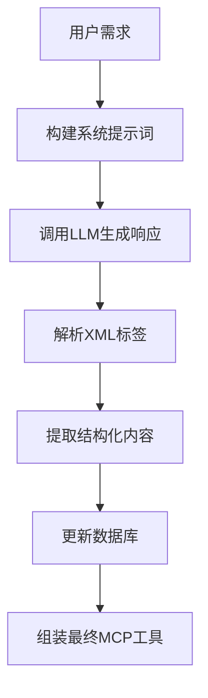
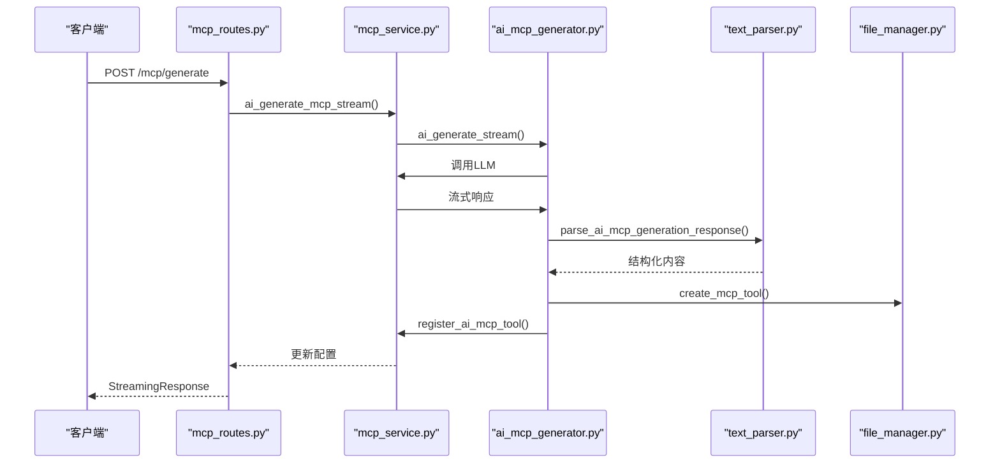
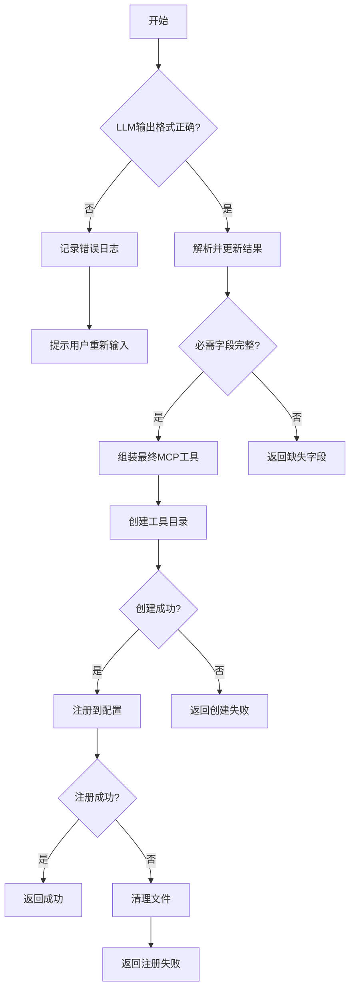

# AI生成MCP工具

<cite>
**本文档引用的文件**   
- [ai_mcp_generator.py](file://mag/app/services/mcp/ai_mcp_generator.py)
- [mcp_generator_template.md](file://mag/app/templates/mcp_generator_template.md)
- [mcp_routes.py](file://mag/app/api/mcp_routes.py)
- [text_parser.py](file://mag/app/utils/text_parser.py)
- [mcp_schema.py](file://mag/app/models/mcp_schema.py)
- [file_manager.py](file://mag/app/core/file_manager.py)
</cite>

## 目录
1. [简介](#简介)
2. [核心功能实现](#核心功能实现)
3. [提示词模板与语义提取](#提示词模板与语义提取)
4. [JSON Schema校验与结构化输出](#json-schema校验与结构化输出)
5. [API端点集成](#api端点集成)
6. [完整请求/响应示例](#完整请求响应示例)
7. [错误处理机制](#错误处理机制)
8. [优化方向与模型微调](#优化方向与模型微调)

## 简介
AI生成MCP工具功能旨在通过自然语言描述，利用大语言模型（LLM）自动生成符合MCP协议规范的工具定义。该功能通过`ai_mcp_generator.py`模块实现，结合`mcp_generator_template.md`提示词模板，将用户需求转化为结构化的MCP工具定义JSON。系统通过JSON Schema校验确保输出的合法性，并通过`mcp_routes.py`中的API端点提供流式SSE响应。此功能简化了MCP工具的开发流程，使非技术用户也能快速创建和部署自定义工具。

## 核心功能实现

`ai_mcp_generator.py`模块中的`AIMCPGenerator`类负责实现AI生成MCP工具的核心逻辑。该类通过多轮交互式生成，将用户需求转化为MCP工具定义。主要功能包括：

- **流式生成**：`ai_generate_stream`方法提供流式SSE响应，允许客户端实时接收生成内容。
- **对话管理**：支持创建和继续对话，通过`conversation_id`管理会话状态。
- **模型调用**：集成`model_service`，调用指定模型进行生成。
- **结果解析**：使用`text_parser.py`中的`parse_ai_mcp_generation_response`函数解析LLM输出，提取结构化内容。
- **最终组装**：`_assemble_final_mcp`方法将解析结果组装为最终的MCP工具，包括创建工具目录、生成文件、安装依赖和注册到系统配置。

**Section sources**
- [ai_mcp_generator.py](file://mag/app/services/mcp/ai_mcp_generator.py#L1-L619)

## 提示词模板与语义提取

`mcp_generator_template.md`是AI生成MCP工具的核心提示词模板，它定义了LLM生成MCP工具的上下文和格式。模板通过XML标签引导LLM输出结构化内容，确保生成的工具符合MCP协议规范。

### 模板结构
模板包含以下关键部分：
- **概述**：定义LLM的角色为MCP服务器开发助手。
- **开发环境信息**：动态插入现有工具列表，避免功能重复。
- **FastMCP开发指南**：提供基础服务器模板和代码质量要求。
- **建议的开发流程**：指导LLM按需求分析、架构设计、核心实现和文档完善四个阶段生成工具。
- **可用的XML标签**：定义用于输出不同类型内容的标签，如`<analysis>`、`<todo>`、`<script_file>`等。

### 语义提取
LLM根据模板生成包含XML标签的响应，`text_parser.py`中的解析函数提取这些标签内容：
- `extract_analysis_content`：提取`<analysis>`标签中的需求分析。
- `extract_todo_content`：提取`<todo>`标签中的开发计划。
- `extract_script_file_content`：提取`<script_file>`标签中的脚本文件。
- `extract_dependencies_content`：提取`<dependencies>`标签中的项目依赖。
- `extract_readme_content`：提取`<readme>`标签中的项目文档。



**Diagram sources**
- [mcp_generator_template.md](file://mag/app/templates/mcp_generator_template.md#L0-L162)
- [text_parser.py](file://mag/app/utils/text_parser.py#L561-L611)

**Section sources**
- [mcp_generator_template.md](file://mag/app/templates/mcp_generator_template.md#L0-L162)
- [text_parser.py](file://mag/app/utils/text_parser.py#L561-L611)

## JSON Schema校验与结构化输出

系统使用Pydantic的`BaseModel`进行JSON Schema校验，确保MCP工具定义的结构合法性。`mcp_schema.py`中定义了`MCPServerConfig`和`MCPConfig`模型，用于验证和规范化MCP配置。

### 校验机制
- **字段验证**：`MCPServerConfig`模型定义了`autoApprove`、`disabled`、`timeout`等字段的默认值和描述。
- **根验证器**：`normalize_config`方法处理`type`字段转换和字段验证，确保`transportType`的正确性。
- **字典方法**：`dict`方法根据`transportType`过滤字段，例如`stdio`类型移除`url`字段，`sse`类型移除`command`和`args`字段。

### 结构化输出
生成的MCP工具定义必须包含以下字段：
- `analysis`：需求分析。
- `todo`：开发计划。
- `folder_name`：工具文件夹名称。
- `script_files`：脚本文件字典。
- `dependencies`：项目依赖。
- `readme`：项目文档。

```mermaid
erDiagram
MCPServerConfig {
List[str] autoApprove PK
bool disabled
int timeout
str command
List[str] args
str transportType
str url
Dict[str, str] env
}
MCPConfig {
Dict[str, MCPServerConfig] mcpServers
}
MCPServerConfig ||--o{ MCPConfig : "包含"
```

**Diagram sources**
- [mcp_schema.py](file://mag/app/models/mcp_schema.py#L0-L128)

**Section sources**
- [mcp_schema.py](file://mag/app/models/mcp_schema.py#L0-L128)

## API端点集成

`mcp_routes.py`中的API端点将`ai_mcp_generator.py`的功能暴露给外部系统。主要端点包括：

- **获取提示词模板**：`GET /mcp/ai-generator-template`返回`mcp_generator_template.md`的内容，供客户端使用。
- **生成MCP工具**：`POST /mcp/generate`接收`MCPGenerationRequest`，调用`mcp_service.ai_generate_mcp_stream`生成MCP工具。
- **注册MCP工具**：`POST /mcp/register-tool`接收`MCPToolRegistration`，调用`FileManager.create_mcp_tool`和`mcp_service.register_ai_mcp_tool`注册工具。
- **列出AI生成的工具**：`GET /mcp/ai-tools`返回所有AI生成的MCP工具列表。



**Diagram sources**
- [mcp_routes.py](file://mag/app/api/mcp_routes.py#L0-L600)

**Section sources**
- [mcp_routes.py](file://mag/app/api/mcp_routes.py#L0-L600)

## 完整请求/响应示例

以下示例展示从输入“创建一个查询天气的工具”到输出完整MCP工具定义的全过程。

### 请求
```json
{
  "requirement": "创建一个查询天气的工具",
  "model_name": "gpt-4-turbo",
  "conversation_id": "mcp_1234567890abcdef"
}
```

### 响应流
```text
data: {"id":"chatcmpl-123","object":"chat.completion.chunk","created":1730000000,"model":"gpt-4-turbo","choices":[{"index":0,"delta":{"role":"assistant"},"finish_reason":null}]}
data: {"id":"chatcmpl-123","object":"chat.completion.chunk","created":1730000000,"model":"gpt-4-turbo","choices":[{"index":0,"delta":{"content":"好的，我将为您创建一个查询天气的工具。首先，我需要进行需求分析。\n\n<analysis>\n用户需要一个能够查询天气的工具。这个工具应该能够根据用户提供的城市名称，查询该城市的当前天气状况。功能包括：\n- 接收城市名称作为输入\n- 调用天气API获取天气数据\n- 返回天气状况、温度、湿度等信息\n- 处理API调用错误和城市不存在的情况\n</analysis>\n\n接下来，我将制定开发计划。\n\n<todo>\n1. 设计工具接口\n   - 工具名称：get_weather\n   - 参数：city (字符串，城市名称)\n   - 返回值：包含天气信息的字典\n\n2. 实现工具逻辑\n   - 使用requests库调用天气API\n   - 解析API响应\n   - 处理错误情况\n\n3. 创建主服务器脚本\n   - 使用FastMCP框架\n   - 定义get_weather工具\n   - 运行服务器\n\n4. 编写文档和依赖\n   - 创建README.md\n   - 指定依赖：fastmcp, requests\n</todo>\n\n现在，我将实现核心代码。\n\n<script_file name=\"main.py\">\nfrom fastmcp import FastMCP\nimport requests\n\n# 创建服务器实例\nmcp = FastMCP(\n    name=\"WeatherServer\",\n    instructions=\"查询指定城市的天气状况\"\n)\n\n# 定义工具\n@mcp.tool()\ndef get_weather(city: str) -> dict:\n    \"\"\"查询指定城市的天气状况\"\"\"\n    try:\n        # 调用天气API\n        response = requests.get(f\"http://api.weather.com/v1/weather?city={city}\")\n        response.raise_for_status()\n        data = response.json()\n        \n        # 提取天气信息\n        weather_info = {\n            \"city\": city,\n            \"condition\": data.get(\"condition\", \"未知\"),\n            \"temperature\": data.get(\"temperature\", \"未知\"),\n            \"humidity\": data.get(\"humidity\", \"未知\")\n        }\n        return weather_info\n    except requests.RequestException as e:\n        return {\"error\": f\"无法获取天气数据: {str(e)}\"}\n    except Exception as e:\n        return {\"error\": f\"处理天气数据时出错: {str(e)}\"}\n\nif __name__ == \"__main__\":\n    # 运行MCP server\n    mcp.run()\n</script_file>\n\n<folder_name>\nweather_tool\n</folder_name>\n\n<dependencies>\nfastmcp\nrequests\n</dependencies>\n\n<readme>\n# Weather Tool\n\n一个查询天气的MCP工具。\n\n## 安装\n```bash\nuv add fastmcp requests\n```\n\n## 运行\n```bash\npython main.py\n```\n\n## 功能\n- 查询指定城市的天气状况\n- 返回天气状况、温度、湿度等信息\n</readme>"},"finish_reason":null}]}
data: [DONE]
```

### 最终MCP工具定义
```json
{
  "analysis": "用户需要一个能够查询天气的工具。这个工具应该能够根据用户提供的城市名称，查询该城市的当前天气状况。功能包括：\n- 接收城市名称作为输入\n- 调用天气API获取天气数据\n- 返回天气状况、温度、湿度等信息\n- 处理API调用错误和城市不存在的情况",
  "todo": "1. 设计工具接口\n   - 工具名称：get_weather\n   - 参数：city (字符串，城市名称)\n   - 返回值：包含天气信息的字典\n\n2. 实现工具逻辑\n   - 使用requests库调用天气API\n   - 解析API响应\n   - 处理错误情况\n\n3. 创建主服务器脚本\n   - 使用FastMCP框架\n   - 定义get_weather工具\n   - 运行服务器\n\n4. 编写文档和依赖\n   - 创建README.md\n   - 指定依赖：fastmcp, requests",
  "folder_name": "weather_tool",
  "script_files": {
    "main.py": "from fastmcp import FastMCP\nimport requests\n\n# 创建服务器实例\nmcp = FastMCP(\n    name=\"WeatherServer\",\n    instructions=\"查询指定城市的天气状况\"\n)\n\n# 定义工具\n@mcp.tool()\ndef get_weather(city: str) -> dict:\n    \"\"\"查询指定城市的天气状况\"\"\"\n    try:\n        # 调用天气API\n        response = requests.get(f\"http://api.weather.com/v1/weather?city={city}\")\n        response.raise_for_status()\n        data = response.json()\n        \n        # 提取天气信息\n        weather_info = {\n            \"city\": city,\n            \"condition\": data.get(\"condition\", \"未知\"),\n            \"temperature\": data.get(\"temperature\", \"未知\"),\n            \"humidity\": data.get(\"humidity\", \"未知\")\n        }\n        return weather_info\n    except requests.RequestException as e:\n        return {\"error\": f\"无法获取天气数据: {str(e)}\"}\n    except Exception as e:\n        return {\"error\": f\"处理天气数据时出错: {str(e)}\"}\n\nif __name__ == \"__main__\":\n    # 运行MCP server\n    mcp.run()"
  },
  "dependencies": "fastmcp\nrequests",
  "readme": "# Weather Tool\n\n一个查询天气的MCP工具。\n\n## 安装\n```bash\nuv add fastmcp requests\n```\n\n## 运行\n```bash\npython main.py\n```\n\n## 功能\n- 查询指定城市的天气状况\n- 返回天气状况、温度、湿度等信息"
}
```

**Section sources**
- [ai_mcp_generator.py](file://mag/app/services/mcp/ai_mcp_generator.py#L1-L619)
- [mcp_generator_template.md](file://mag/app/templates/mcp_generator_template.md#L0-L162)
- [text_parser.py](file://mag/app/utils/text_parser.py#L561-L611)

## 错误处理机制

系统实现了多层次的错误处理机制，以应对LLM输出格式错误或字段缺失的情况。

### LLM输出错误处理
- **格式错误**：`parse_ai_mcp_generation_response`函数捕获`JSONDecodeError`，记录错误日志并返回`None`。
- **字段缺失**：`_check_completion`方法检查必需字段（`analysis`、`todo`、`folder_name`、`script_files`、`dependencies`、`readme`），返回缺失字段列表。
- **恢复策略**：如果LLM输出格式错误，系统会记录原始响应，并提示用户重新输入需求。

### 系统错误处理
- **模型错误**：`ai_generate_stream`方法验证模型是否存在，如果不存在，返回`model_error`。
- **数据库错误**：`_create_conversation`和`_continue_conversation`方法处理数据库操作失败，返回`database_error`。
- **注册失败**：`_assemble_final_mcp`方法在注册失败时清理已创建的文件，避免残留。



**Diagram sources**
- [ai_mcp_generator.py](file://mag/app/services/mcp/ai_mcp_generator.py#L1-L619)
- [text_parser.py](file://mag/app/utils/text_parser.py#L561-L611)

**Section sources**
- [ai_mcp_generator.py](file://mag/app/services/mcp/ai_mcp_generator.py#L1-L619)
- [text_parser.py](file://mag/app/utils/text_parser.py#L561-L611)

## 优化方向与模型微调

### 提示词优化方向
- **增强上下文**：在提示词中加入更多现有工具的详细信息，帮助LLM更好地避免功能重复。
- **细化开发流程**：将开发流程分解为更详细的步骤，例如增加“API选择”和“错误处理设计”阶段。
- **示例引导**：在模板中加入更多代码示例，引导LLM生成更高质量的代码。

### 模型微调潜力
- **领域微调**：使用MCP工具开发相关的数据集对LLM进行微调，提高生成代码的准确性和规范性。
- **多轮对话优化**：微调模型以更好地处理多轮交互，根据用户反馈调整生成内容。
- **错误恢复**：训练模型识别和纠正自身生成的错误，提高输出的可靠性。

**Section sources**
- [mcp_generator_template.md](file://mag/app/templates/mcp_generator_template.md#L0-L162)
- [ai_mcp_generator.py](file://mag/app/services/mcp/ai_mcp_generator.py#L1-L619)