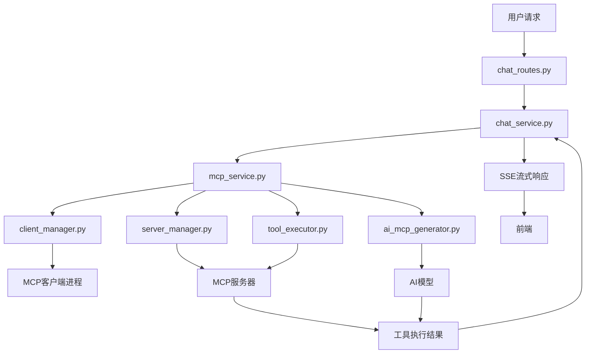
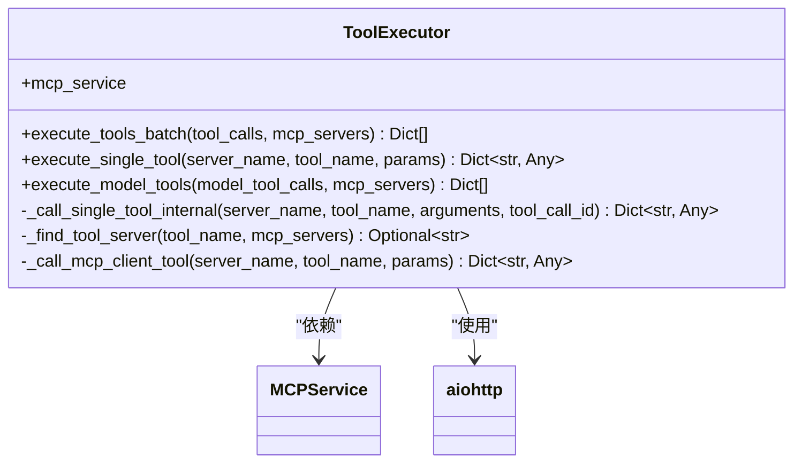
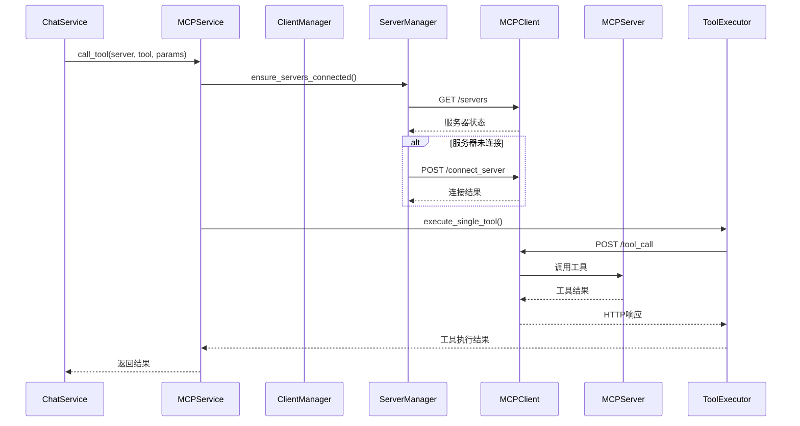
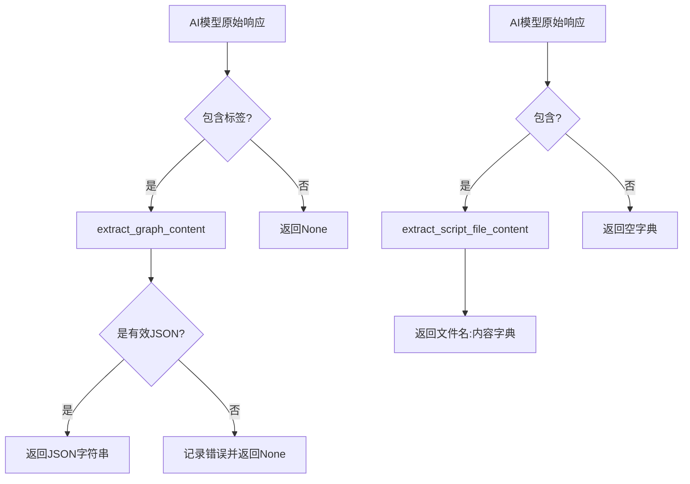
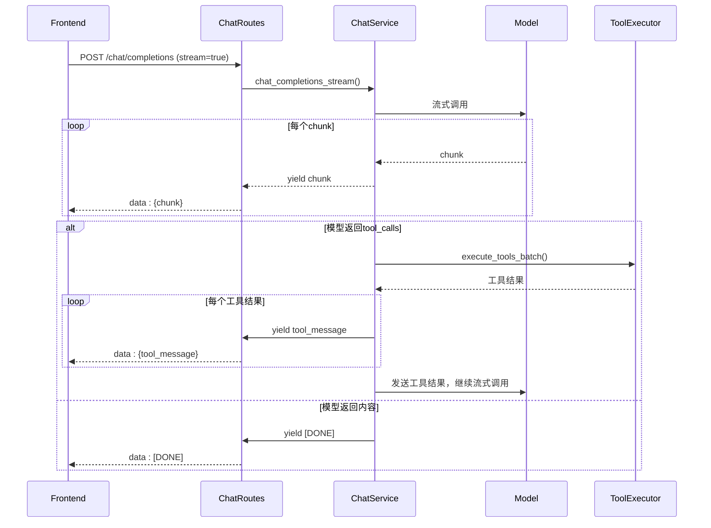

# MCP工具执行

<cite>
**本文档引用的文件**   
- [tool_executor.py](file://mag/app/services/mcp/tool_executor.py)
- [client_manager.py](file://mag/app/services/mcp/client_manager.py)
- [text_parser.py](file://mag/app/utils/text_parser.py)
- [server_manager.py](file://mag/app/services/mcp/server_manager.py)
- [mcp_service.py](file://mag/app/services/mcp_service.py)
- [ai_mcp_generator.py](file://mag/app/services/mcp/ai_mcp_generator.py)
- [sse_helper.py](file://mag/app/utils/sse_helper.py)
- [chat_routes.py](file://mag/app/api/chat_routes.py)
- [chat_service.py](file://mag/app/services/chat_service.py)
</cite>

## 目录
1. [引言](#引言)
2. [核心组件与执行流程](#核心组件与执行流程)
3. [工具执行器详解](#工具执行器详解)
4. [客户端与服务器管理](#客户端与服务器管理)
5. [动态参数解析与上下文注入](#动态参数解析与上下文注入)
6. [流式响应处理与SSE机制](#流式响应处理与sse机制)
7. [输入输出校验与权限控制](#输入输出校验与权限控制)
8. [容错处理与异常恢复](#容错处理与异常恢复)
9. [执行链路监控与性能指标](#执行链路监控与性能指标)
10. [结论](#结论)

## 引言

MCP（Model Control Protocol）工具执行系统是本项目的核心功能模块，负责协调AI模型与外部工具之间的交互。该系统通过一个复杂的执行链路，实现了从用户请求到工具调用再到结果返回的完整闭环。其主要职责包括解析运行时参数、验证工具签名、安全调用远程MCP工具、处理流式响应（SSE）或同步返回结果。系统设计了严格的输入输出校验机制和针对敏感操作的权限控制策略，确保了执行过程的安全性与可靠性。此外，系统还集成了动态参数替换与上下文注入功能，以支持更灵活的交互模式。本文档将深入剖析该系统的内部工作原理，为开发者提供一份详尽的技术参考。

## 核心组件与执行流程

MCP工具执行系统由多个协同工作的核心组件构成，形成了一个清晰的执行流程。当用户发起一个包含工具调用的请求时，该请求首先通过`chat_routes.py`中的API路由被接收。随后，`chat_service.py`中的`ChatService`类负责处理该请求，它会调用`mcp_service.py`中的全局`mcp_service`实例来协调整个执行过程。`mcp_service`作为协调者，会利用`client_manager.py`中的`MCPClientManager`确保MCP客户端进程处于运行状态，并通过`server_manager.py`中的`MCPServerManager`来管理与各个MCP服务器的连接。最终，具体的工具调用任务由`tool_executor.py`中的`ToolExecutor`类执行，它负责解析参数、查找目标服务器并发起调用。对于需要AI生成的MCP工具，`ai_mcp_generator.py`中的`AIMCPGenerator`类会介入，利用大模型动态生成工具配置并注册到系统中。整个流程体现了高内聚、低耦合的设计原则。

**图表来源**
- [chat_routes.py](file://mag/app/api/chat_routes.py#L1-L50)
- [chat_service.py](file://mag/app/services/chat_service.py#L1-L50)
- [mcp_service.py](file://mag/app/services/mcp_service.py#L1-L50)

**本节来源**
- [chat_routes.py](file://mag/app/api/chat_routes.py#L1-L50)
- [chat_service.py](file://mag/app/services/chat_service.py#L1-L50)
- [mcp_service.py](file://mag/app/services/mcp_service.py#L1-L50)

## 工具执行器详解

`tool_executor.py`是MCP工具执行的核心，它定义了`ToolExecutor`类，提供了批量执行、单个执行和模型工具执行等多种接口。`execute_tools_batch`方法是批量执行的入口，它接收一个工具调用列表和服务器列表，为每个调用创建异步任务，并通过`asyncio.gather`并发执行。在执行前，它会调用`_find_tool_server`方法，根据工具名称在所有已连接的服务器中查找其归属服务器。`execute_single_tool`方法是执行单个工具的主逻辑，它首先检查目标服务器的连接状态，若未连接则尝试自动连接，然后调用`_call_mcp_client_tool`方法向MCP客户端发起HTTP POST请求。`_call_mcp_client_tool`方法通过`aiohttp`库与运行在`http://127.0.0.1:8765`的MCP客户端通信，传递服务器名、工具名和参数。整个执行过程被包裹在异常处理中，任何错误都会被捕获并以结构化的错误信息返回，确保了上层调用的稳定性。

**图表来源**
- [tool_executor.py](file://mag/app/services/mcp/tool_executor.py#L1-L209)

**本节来源**
- [tool_executor.py](file://mag/app/services/mcp/tool_executor.py#L1-L209)

## 客户端与服务器管理

MCP工具的执行依赖于一个本地运行的MCP客户端进程和一个或多个远程MCP服务器。`client_manager.py`中的`MCPClientManager`类负责客户端进程的生命周期管理。`initialize`方法是入口，它首先检查是否已有客户端在运行，若无则通过`subprocess.Popen`启动`mcp_client.py`脚本。启动后，它会轮询客户端的健康检查端点`/`，直到客户端响应成功。`update_config`方法用于更新MCP配置，它会先将配置保存到文件，然后通过`_notify_config_change`方法向客户端的`/load_config`端点发送POST请求，通知其重新加载配置。`server_manager.py`中的`MCPServerManager`类则负责与MCP客户端通信，管理服务器连接。`connect_server`方法向客户端的`/connect_server`端点发送请求，以建立与特定MCP服务器的连接。`get_all_tools`方法则从客户端的`/tools`端点获取所有已注册工具的元信息，这对于工具发现和参数验证至关重要。

**图表来源**
- [client_manager.py](file://mag/app/services/mcp/client_manager.py#L1-L273)
- [server_manager.py](file://mag/app/services/mcp/server_manager.py#L1-L267)
- [tool_executor.py](file://mag/app/services/mcp/tool_executor.py#L1-L209)

**本节来源**
- [client_manager.py](file://mag/app/services/mcp/client_manager.py#L1-L273)
- [server_manager.py](file://mag/app/services/mcp/server_manager.py#L1-L267)

## 动态参数解析与上下文注入

`text_parser.py`模块提供了强大的文本解析功能，用于实现动态参数替换与上下文注入。该模块定义了一系列以`extract_`开头的函数，如`extract_graph_content`、`extract_analysis_content`等，它们使用正则表达式从AI模型的响应文本中提取特定标签（如`<graph>`、`<analysis>`）内的内容。这些函数是实现上下文注入的基础。例如，`parse_ai_generation_response`函数会调用多个`extract_`函数，将AI生成的图配置、分析内容等结构化信息从原始文本中分离出来。`parse_ai_mcp_generation_response`函数则更为复杂，它能提取脚本文件、依赖关系、README等内容，为AI生成MCP工具提供了完整的数据支持。这些解析出的数据随后被`ai_mcp_generator.py`中的`_parse_and_update_results`方法保存到数据库，实现了从非结构化文本到结构化数据的转换，从而完成了上下文的注入。

**图表来源**
- [text_parser.py](file://mag/app/utils/text_parser.py#L1-L611)

**本节来源**
- [text_parser.py](file://mag/app/utils/text_parser.py#L1-L611)

## 流式响应处理与SSE机制

系统通过Server-Sent Events (SSE) 实现了流式响应，为用户提供即时的反馈。`sse_helper.py`模块是这一机制的核心，它定义了`SSEHelper`和`SSECollector`两个类。`SSEHelper`提供了`format_sse_data`和`format_done`等静态方法，用于将数据格式化为SSE协议要求的`data: ...`和`[DONE]`格式。`send_openai_chunk`方法用于转发来自AI模型的流式chunk，而`send_tool_message`方法则用于发送工具执行结果。`chat_service.py`中的`_execute_complete_flow`方法是流式处理的主循环，它在调用AI模型的流式接口后，直接将每个接收到的chunk通过`yield`发送给前端。当模型返回工具调用时，系统会执行工具，然后调用`SSEHelper.send_tool_message`将结果作为SSE消息发送出去，从而实现了工具调用结果的实时推送。`SSECollector`类则用于非流式场景，它收集所有流式数据，最终构建成一个完整的JSON响应。

**图表来源**
- [sse_helper.py](file://mag/app/utils/sse_helper.py#L1-L399)
- [chat_service.py](file://mag/app/services/chat_service.py#L1-L446)
- [chat_routes.py](file://mag/app/api/chat_routes.py#L1-L449)

**本节来源**
- [sse_helper.py](file://mag/app/utils/sse_helper.py#L1-L399)
- [chat_service.py](file://mag/app/services/chat_service.py#L1-L446)

## 输入输出校验与权限控制

系统在执行前后实施了严格的输入输出校验和权限控制。在输入校验方面，`tool_executor.py`中的`execute_tools_batch`方法在执行前会尝试将工具参数字符串`arguments_str`解析为JSON对象，如果解析失败，则会立即返回一个包含错误信息的结果，防止无效参数被传递。`_find_tool_server`方法在调用前会验证工具名称是否存在于已连接的服务器中，避免了对不存在工具的调用。在权限控制方面，系统通过`client_manager.py`和`server_manager.py`的组合来实现。`MCPClientManager`负责客户端进程的启动和配置更新，这通常需要文件系统的写权限。`MCPServerManager`的`connect_server`方法则需要与MCP客户端通信，这依赖于客户端的运行状态。对于敏感操作，如`cleanup`方法中的进程终止，系统会记录详细的日志，并在Windows和Linux上使用不同的信号量（`CTRL_BREAK_EVENT`和`SIGTERM`）来确保优雅关闭，体现了对系统安全的重视。

**本节来源**
- [tool_executor.py](file://mag/app/services/mcp/tool_executor.py#L1-L209)
- [client_manager.py](file://mag/app/services/mcp/client_manager.py#L1-L273)
- [server_manager.py](file://mag/app/services/mcp/server_manager.py#L1-L267)

## 容错处理与异常恢复

系统设计了多层次的容错处理机制，以应对工具执行超时、服务不可用、响应格式错误等常见问题。在`tool_executor.py`中，`_call_mcp_client_tool`方法被包裹在`try-except`块中，捕获所有异常，并将异常信息转换为结构化的错误字典返回，避免了异常向上层蔓延。`execute_tools_batch`方法使用`asyncio.gather(..., return_exceptions=True)`来并发执行任务，即使某个任务失败，其他任务仍能继续执行，保证了整体流程的健壮性。在`client_manager.py`中，`_wait_for_client_startup`方法实现了重试机制，在启动客户端后会进行10次轮询，每次间隔2秒，以应对客户端启动较慢的情况。`server_manager.py`中的`connect_server`方法在连接失败时也会返回详细的错误信息。对于响应格式错误，`text_parser.py`中的解析函数在`json.loads`调用时都使用了`try-except`，确保了即使AI返回了格式错误的JSON，系统也能优雅地处理并记录错误，而不是崩溃。

**本节来源**
- [tool_executor.py](file://mag/app/services/mcp/tool_executor.py#L1-L209)
- [client_manager.py](file://mag/app/services/mcp/client_manager.py#L1-L273)
- [server_manager.py](file://mag/app/services/mcp/server_manager.py#L1-L267)
- [text_parser.py](file://mag/app/utils/text_parser.py#L1-L611)

## 执行链路监控与性能指标

系统通过日志记录和token使用量统计实现了执行链路的监控与性能指标采集。`logging`模块被广泛应用于各个组件，`logger.info`、`logger.warning`和`logger.error`被用来记录关键的执行步骤、警告和错误。例如，`chat_service.py`中的`_execute_complete_flow`方法会记录每一轮模型调用的开始、完成和token使用量，这对于性能分析和问题排查至关重要。`SSECollector`和`TrajectoryCollector`类会收集流式响应中的`usage`字段，该字段包含了`prompt_tokens`、`completion_tokens`和`total_tokens`，这些是衡量API成本和性能的核心指标。`chat_service.py`中的`_save_complete_round`方法会将每一轮的token使用量累加并更新到对话的总统计中，实现了长期的性能数据追踪。最佳实践是定期分析这些日志和指标，以优化模型调用策略、识别性能瓶颈并控制成本。

**本节来源**
- [chat_service.py](file://mag/app/services/chat_service.py#L1-L446)
- [sse_helper.py](file://mag/app/utils/sse_helper.py#L1-L399)

## 结论

本文档深入剖析了MCP工具执行系统的架构与实现。该系统通过`ToolExecutor`、`MCPClientManager`、`MCPServerManager`等核心组件的协同工作，构建了一个高效、安全、可靠的工具调用框架。它不仅支持同步和流式两种响应模式，还通过`text_parser.py`实现了强大的动态参数解析与上下文注入能力。系统内置了完善的输入输出校验、权限控制和多层次的容错处理机制，能够有效应对各种异常情况。通过详细的日志记录和token使用量统计，为执行链路的监控与性能优化提供了坚实的数据基础。总体而言，该系统设计精良，为AI与外部工具的集成提供了一个强大而灵活的解决方案。