# MCP服务

<cite>
**本文档引用的文件**   
- [mcp_service.py](file://mag/app/services/mcp_service.py)
- [ai_mcp_generator.py](file://mag/app/services/mcp/ai_mcp_generator.py)
- [server_manager.py](file://mag/app/services/mcp/server_manager.py)
- [client_manager.py](file://mag/app/services/mcp/client_manager.py)
- [tool_executor.py](file://mag/app/services/mcp/tool_executor.py)
- [mcp_manager.py](file://mag/app/services/docdb/mcp_manager.py)
- [file_manager.py](file://mag/app/core/file_manager.py)
- [config.py](file://mag/app/core/config.py)
- [mongodb_service.py](file://mag/app/services/mongodb_service.py)
</cite>

## 目录
1. [MCP服务概述](#mcp服务概述)
2. [核心组件与职责划分](#核心组件与职责划分)
3. [MCP服务统一管理](#mcp服务统一管理)
4. [AI生成MCP工具](#ai生成mcp工具)
5. [服务端与客户端连接管理](#服务端与客户端连接管理)
6. [外部工具安全执行](#外部工具安全执行)
7. [数据持久化交互](#数据持久化交互)
8. [MCP工具注册与调用流程](#mcp工具注册与调用流程)
9. [常见问题与解决方案](#常见问题与解决方案)
10. [安全最佳实践](#安全最佳实践)

## MCP服务概述

MCP（Model Control Protocol）服务模块是MAG系统的核心组件，负责统一管理MCP服务器的生命周期、工具调用和状态监控。该模块通过协调多个子组件，实现了从服务器注册、连接、状态监控到工具调用的完整流程。MCP服务作为协调者，整合了客户端管理、服务器管理、AI生成器和工具执行器等功能，为上层应用提供了统一的接口。

## 核心组件与职责划分

MCP服务模块由多个核心组件构成，每个组件负责特定的功能领域，通过清晰的职责划分实现了高内聚、低耦合的系统架构。

### MCP服务协调器

MCP服务协调器是整个模块的中枢，负责协调各个子组件的工作。它初始化并管理客户端管理器、服务器管理器、AI生成器和工具执行器等子模块，为外部提供统一的服务接口。

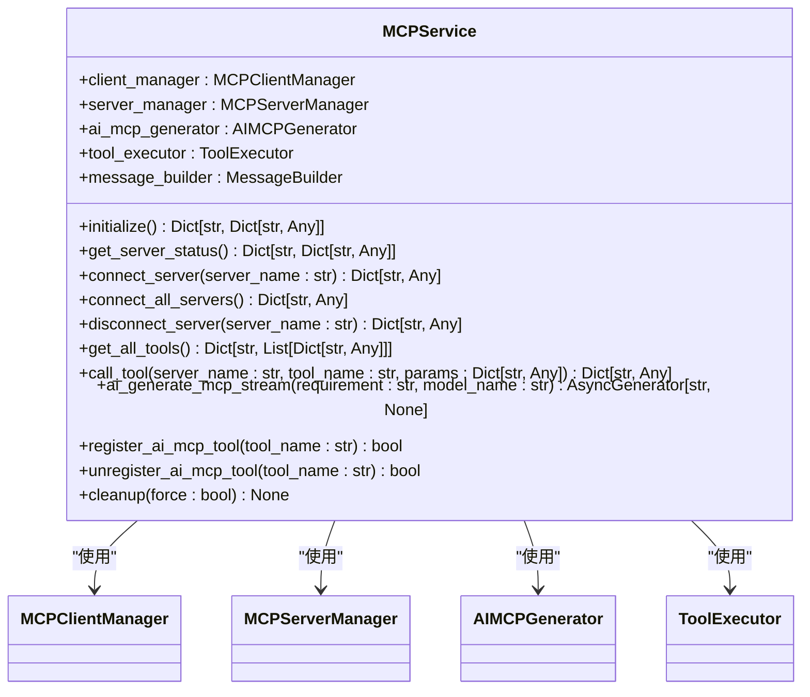
```mermaid
classDiagram
class MCPService {
+client_manager : MCPClientManager
+server_manager : MCPServerManager
+ai_mcp_generator : AIMCPGenerator
+tool_executor : ToolExecutor
+message_builder : MessageBuilder
+initialize() Dict[str, Dict[str, Any]]
+get_server_status() Dict[str, Dict[str, Any]]
+connect_server(server_name : str) Dict[str, Any]
+connect_all_servers() Dict[str, Any]
+disconnect_server(server_name : str) Dict[str, Any]
+get_all_tools() Dict[str, List[Dict[str, Any]]]
+call_tool(server_name : str, tool_name : str, params : Dict[str, Any]) Dict[str, Any]
+ai_generate_mcp_stream(requirement : str, model_name : str) AsyncGenerator[str, None]
+register_ai_mcp_tool(tool_name : str) bool
+unregister_ai_mcp_tool(tool_name : str) bool
+cleanup(force : bool) None
}
MCPService --> MCPClientManager : "使用"
MCPService --> MCPServerManager : "使用"
MCPService --> AIMCPGenerator : "使用"
MCPService --> ToolExecutor : "使用"
```

**Diagram sources**
- [mcp_service.py](file://mag/app/services/mcp_service.py#L1-L155)

**Section sources**
- [mcp_service.py](file://mag/app/services/mcp_service.py#L1-L155)

### AI MCP生成器

AI MCP生成器负责通过自然语言描述生成符合MCP协议的工具定义。它利用AI模型解析用户需求，生成相应的工具配置和代码，并通过JSON Schema验证机制确保生成内容的正确性。

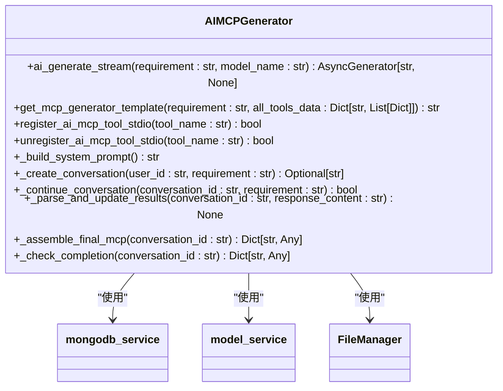
```mermaid
classDiagram
class AIMCPGenerator {
+ai_generate_stream(requirement : str, model_name : str) AsyncGenerator[str, None]
+get_mcp_generator_template(requirement : str, all_tools_data : Dict[str, List[Dict]]) str
+register_ai_mcp_tool_stdio(tool_name : str) bool
+unregister_ai_mcp_tool_stdio(tool_name : str) bool
+_build_system_prompt() str
+_create_conversation(user_id : str, requirement : str) Optional[str]
+_continue_conversation(conversation_id : str, requirement : str) bool
+_parse_and_update_results(conversation_id : str, response_content : str) None
+_assemble_final_mcp(conversation_id : str) Dict[str, Any]
+_check_completion(conversation_id : str) Dict[str, Any]
}
AIMCPGenerator --> mongodb_service : "使用"
AIMCPGenerator --> model_service : "使用"
AIMCPGenerator --> FileManager : "使用"
```

**Diagram sources**
- [ai_mcp_generator.py](file://mag/app/services/mcp/ai_mcp_generator.py#L1-L619)

**Section sources**
- [ai_mcp_generator.py](file://mag/app/services/mcp/ai_mcp_generator.py#L1-L619)

### 服务器管理器

服务器管理器专门负责MCP服务器的连接管理，包括获取服务器状态、连接和断开服务器、获取工具列表等操作。它通过HTTP API与MCP客户端进行通信，实现了对服务器状态的实时监控。

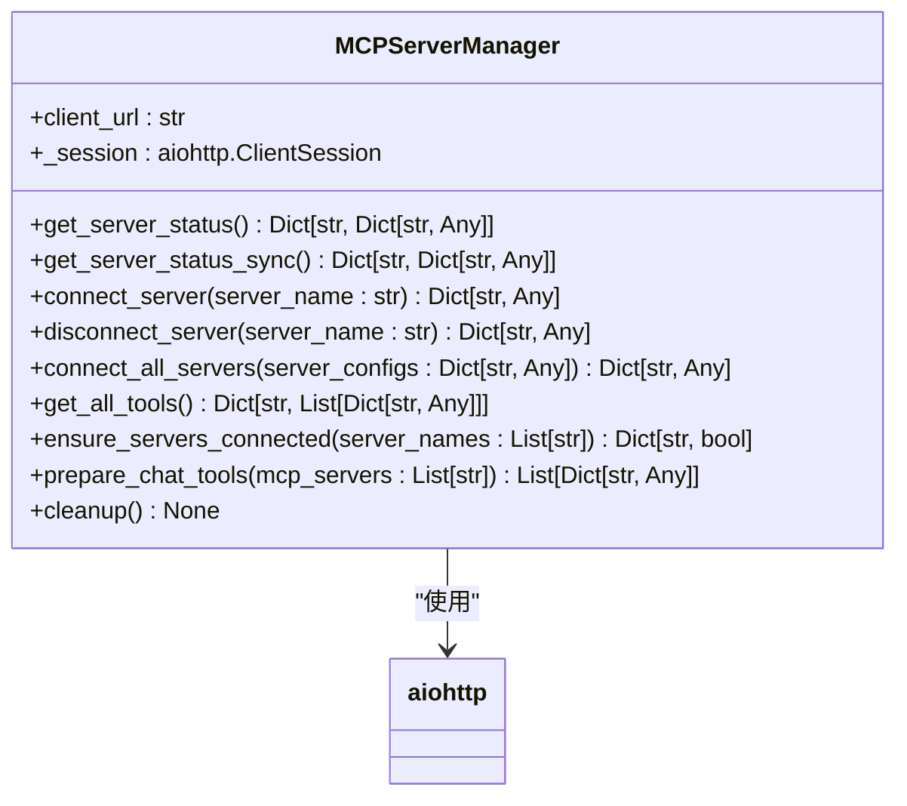
```mermaid
classDiagram
class MCPServerManager {
+client_url : str
+_session : aiohttp.ClientSession
+get_server_status() Dict[str, Dict[str, Any]]
+get_server_status_sync() Dict[str, Dict[str, Any]]
+connect_server(server_name : str) Dict[str, Any]
+disconnect_server(server_name : str) Dict[str, Any]
+connect_all_servers(server_configs : Dict[str, Any]) Dict[str, Any]
+get_all_tools() Dict[str, List[Dict[str, Any]]]
+ensure_servers_connected(server_names : List[str]) Dict[str, bool]
+prepare_chat_tools(mcp_servers : List[str]) List[Dict[str, Any]]
+cleanup() None
}
MCPServerManager --> aiohttp : "使用"
```

**Diagram sources**
- [server_manager.py](file://mag/app/services/mcp/server_manager.py#L1-L268)

**Section sources**
- [server_manager.py](file://mag/app/services/mcp/server_manager.py#L1-L268)

### 客户端管理器

客户端管理器负责MCP客户端进程的生命周期管理，包括启动、停止和监控客户端进程。它通过子进程管理机制确保MCP客户端的稳定运行，并提供了配置更新和优雅关闭等功能。

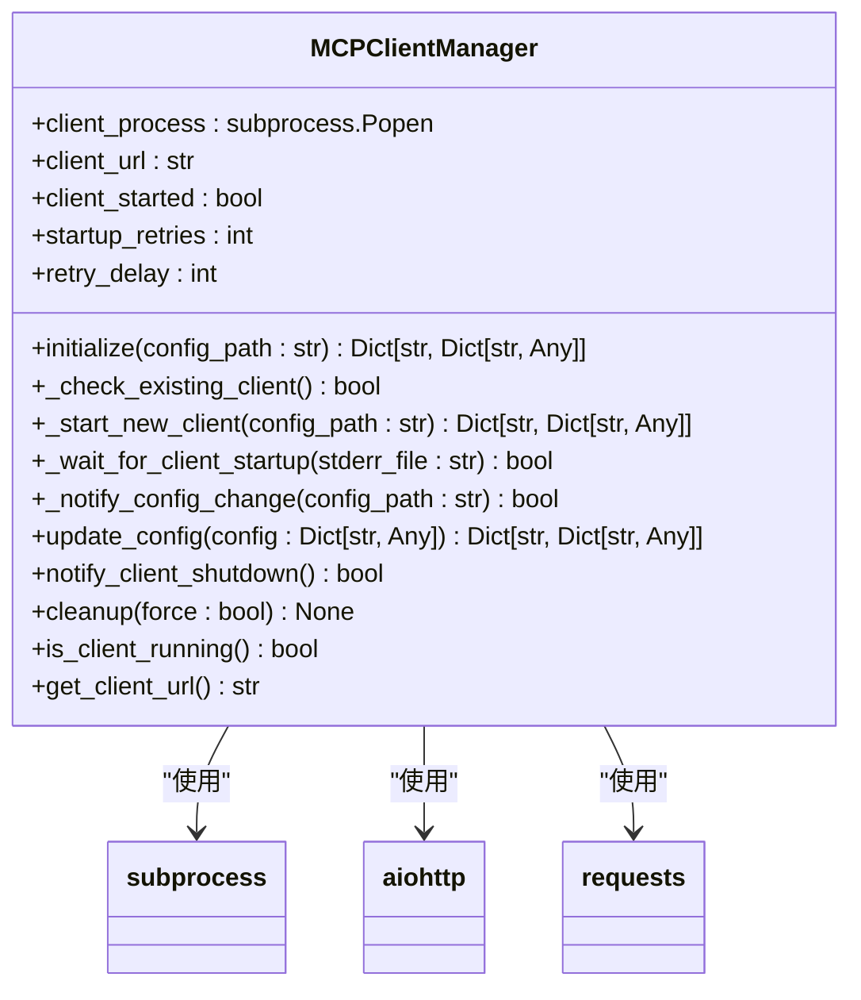
```mermaid
classDiagram
class MCPClientManager {
+client_process : subprocess.Popen
+client_url : str
+client_started : bool
+startup_retries : int
+retry_delay : int
+initialize(config_path : str) Dict[str, Dict[str, Any]]
+_check_existing_client() bool
+_start_new_client(config_path : str) Dict[str, Dict[str, Any]]
+_wait_for_client_startup(stderr_file : str) bool
+_notify_config_change(config_path : str) bool
+update_config(config : Dict[str, Any]) Dict[str, Dict[str, Any]]
+notify_client_shutdown() bool
+cleanup(force : bool) None
+is_client_running() bool
+get_client_url() str
}
MCPClientManager --> subprocess : "使用"
MCPClientManager --> aiohttp : "使用"
MCPClientManager --> requests : "使用"
```

**Diagram sources**
- [client_manager.py](file://mag/app/services/mcp/client_manager.py#L1-L274)

**Section sources**
- [client_manager.py](file://mag/app/services/mcp/client_manager.py#L1-L274)

### 工具执行器

工具执行器负责安全地执行外部工具调用，提供了批量执行、单个执行和模型工具执行等多种调用方式。它通过异步机制确保工具调用的高效性，并实现了错误处理和结果聚合功能。

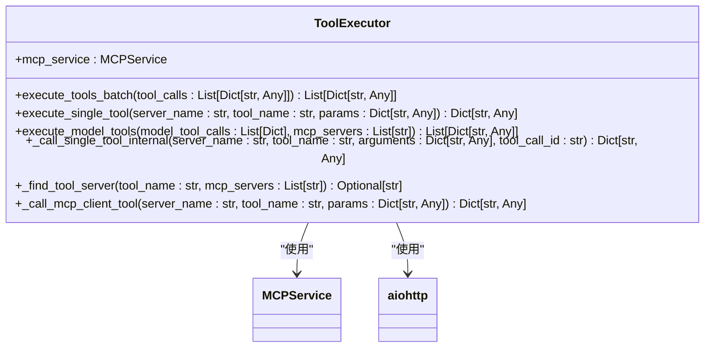
```mermaid
classDiagram
class ToolExecutor {
+mcp_service : MCPService
+execute_tools_batch(tool_calls : List[Dict[str, Any]]) List[Dict[str, Any]]
+execute_single_tool(server_name : str, tool_name : str, params : Dict[str, Any]) Dict[str, Any]
+execute_model_tools(model_tool_calls : List[Dict], mcp_servers : List[str]) List[Dict[str, Any]]
+_call_single_tool_internal(server_name : str, tool_name : str, arguments : Dict[str, Any], tool_call_id : str) Dict[str, Any]
+_find_tool_server(tool_name : str, mcp_servers : List[str]) Optional[str]
+_call_mcp_client_tool(server_name : str, tool_name : str, params : Dict[str, Any]) Dict[str, Any]
}
ToolExecutor --> MCPService : "使用"
ToolExecutor --> aiohttp : "使用"
```

**Diagram sources**
- [tool_executor.py](file://mag/app/services/mcp/tool_executor.py#L1-L210)

**Section sources**
- [tool_executor.py](file://mag/app/services/mcp/tool_executor.py#L1-L210)

## MCP服务统一管理

MCP服务作为协调者，通过整合各个子组件实现了对MCP服务器的统一管理。其核心功能包括服务器注册、连接、状态监控和工具调用。

### 服务器注册与初始化

MCP服务通过`initialize`方法启动客户端进程，这是所有操作的前提。该方法首先检查是否有现有客户端在运行，如果没有则启动新的客户端进程。

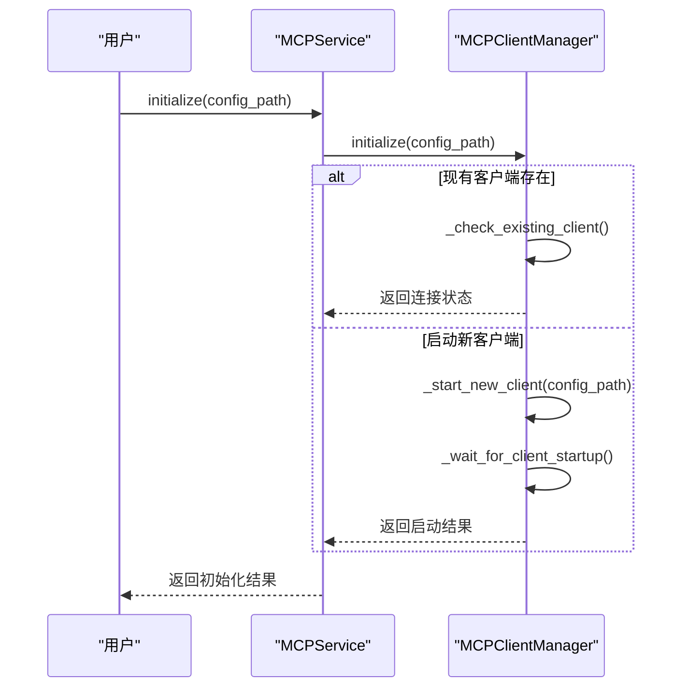
```mermaid
sequenceDiagram
participant User as "用户"
participant MCPService as "MCPService"
participant ClientManager as "MCPClientManager"
User->>MCPService : initialize(config_path)
MCPService->>ClientManager : initialize(config_path)
alt 现有客户端存在
ClientManager->>ClientManager : _check_existing_client()
ClientManager-->>MCPService : 返回连接状态
else 启动新客户端
ClientManager->>ClientManager : _start_new_client(config_path)
ClientManager->>ClientManager : _wait_for_client_startup()
ClientManager-->>MCPService : 返回启动结果
end
MCPService-->>User : 返回初始化结果
```

**Diagram sources**
- [mcp_service.py](file://mag/app/services/mcp_service.py#L25-L40)
- [client_manager.py](file://mag/app/services/mcp/client_manager.py#L25-L100)

**Section sources**
- [mcp_service.py](file://mag/app/services/mcp_service.py#L25-L40)
- [client_manager.py](file://mag/app/services/mcp/client_manager.py#L25-L100)

### 服务器连接与状态监控

MCP服务提供了连接单个服务器、连接所有服务器和获取服务器状态的功能。这些功能通过服务器管理器实现，确保了对服务器状态的实时监控。

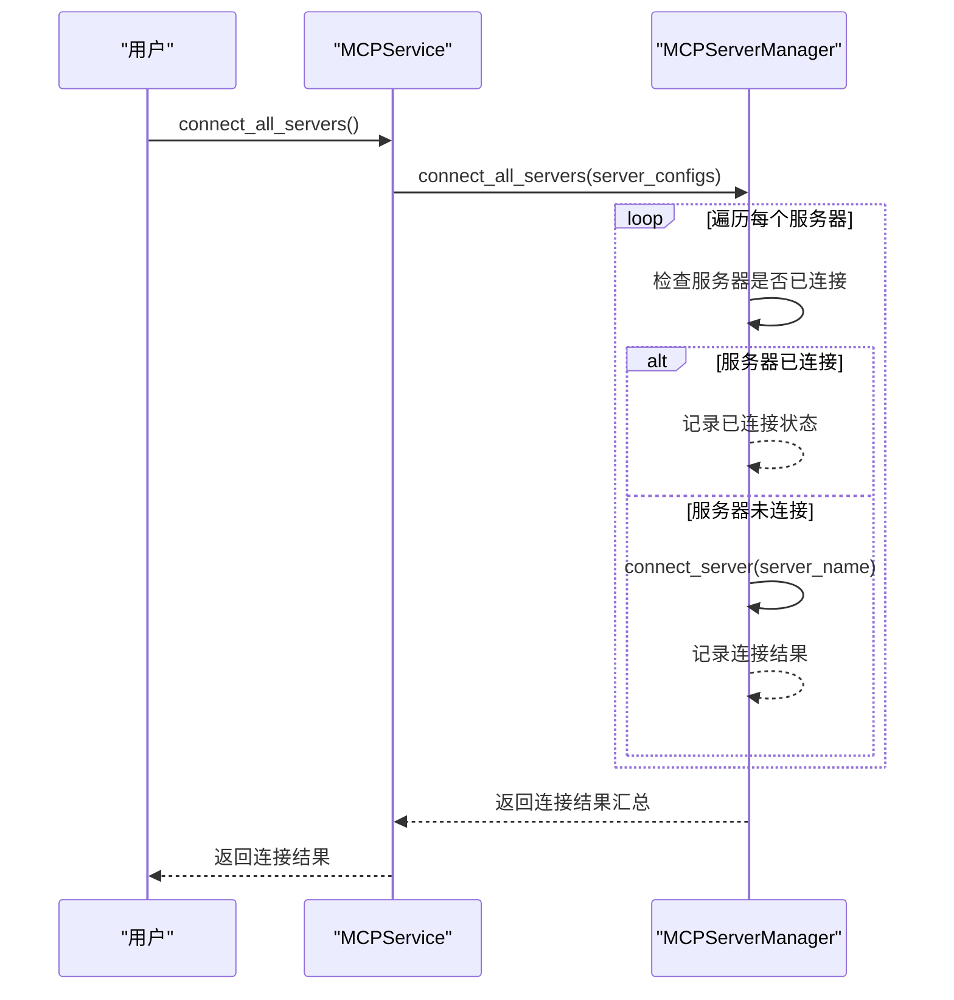
```mermaid
sequenceDiagram
participant User as "用户"
participant MCPService as "MCPService"
participant ServerManager as "MCPServerManager"
User->>MCPService : connect_all_servers()
MCPService->>ServerManager : connect_all_servers(server_configs)
loop 遍历每个服务器
ServerManager->>ServerManager : 检查服务器是否已连接
alt 服务器已连接
ServerManager-->>ServerManager : 记录已连接状态
else 服务器未连接
ServerManager->>ServerManager : connect_server(server_name)
ServerManager-->>ServerManager : 记录连接结果
end
end
ServerManager-->>MCPService : 返回连接结果汇总
MCPService-->>User : 返回连接结果
```

**Diagram sources**
- [mcp_service.py](file://mag/app/services/mcp_service.py#L75-L105)
- [server_manager.py](file://mag/app/services/mcp/server_manager.py#L100-L200)

**Section sources**
- [mcp_service.py](file://mag/app/services/mcp_service.py#L75-L105)
- [server_manager.py](file://mag/app/services/mcp/server_manager.py#L100-L200)

### 工具调用流程

MCP服务通过工具执行器实现工具调用，确保了调用过程的安全性和可靠性。调用流程包括服务器连接检查、工具查找和实际调用。

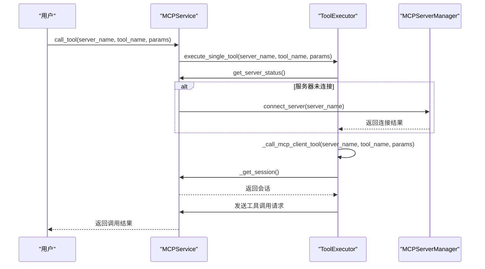
```mermaid
sequenceDiagram
participant User as "用户"
participant MCPService as "MCPService"
participant ToolExecutor as "ToolExecutor"
participant ServerManager as "MCPServerManager"
User->>MCPService : call_tool(server_name, tool_name, params)
MCPService->>ToolExecutor : execute_single_tool(server_name, tool_name, params)
ToolExecutor->>MCPService : get_server_status()
alt 服务器未连接
MCPService->>ServerManager : connect_server(server_name)
ServerManager-->>ToolExecutor : 返回连接结果
end
ToolExecutor->>ToolExecutor : _call_mcp_client_tool(server_name, tool_name, params)
ToolExecutor->>MCPService : _get_session()
MCPService-->>ToolExecutor : 返回会话
ToolExecutor->>MCPService : 发送工具调用请求
MCPService-->>User : 返回调用结果
```

**Diagram sources**
- [mcp_service.py](file://mag/app/services/mcp_service.py#L130-L145)
- [tool_executor.py](file://mag/app/services/mcp/tool_executor.py#L50-L100)

**Section sources**
- [mcp_service.py](file://mag/app/services/mcp_service.py#L130-L145)
- [tool_executor.py](file://mag/app/services/mcp/tool_executor.py#L50-L100)

## AI生成MCP工具

AI MCP生成器通过自然语言处理技术，将用户的需求描述转化为符合MCP协议的工具定义。这一过程涉及提示词工程设计、AI模型调用和JSON Schema验证等多个环节。

### 提示词工程设计

AI MCP生成器采用了精心设计的提示词模板，引导AI模型生成符合要求的MCP工具定义。模板中包含了现有工具列表，帮助AI理解上下文环境。

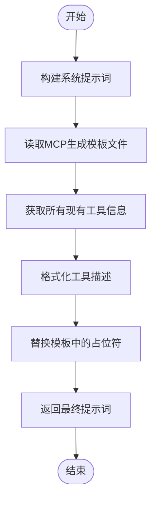
```mermaid
flowchart TD
Start([开始]) --> BuildPrompt["构建系统提示词"]
BuildPrompt --> ReadTemplate["读取MCP生成模板文件"]
ReadTemplate --> GetTools["获取所有现有工具信息"]
GetTools --> FormatTools["格式化工具描述"]
FormatTools --> ReplacePlaceholders["替换模板中的占位符"]
ReplacePlaceholders --> ReturnPrompt["返回最终提示词"]
ReturnPrompt --> End([结束])
```

**Diagram sources**
- [ai_mcp_generator.py](file://mag/app/services/mcp/ai_mcp_generator.py#L300-L350)

**Section sources**
- [ai_mcp_generator.py](file://mag/app/services/mcp/ai_mcp_generator.py#L300-L350)

### AI生成流程

AI生成MCP工具的流程是一个多轮交互过程，从创建对话开始，经过多轮AI生成，最终组装成完整的MCP工具。

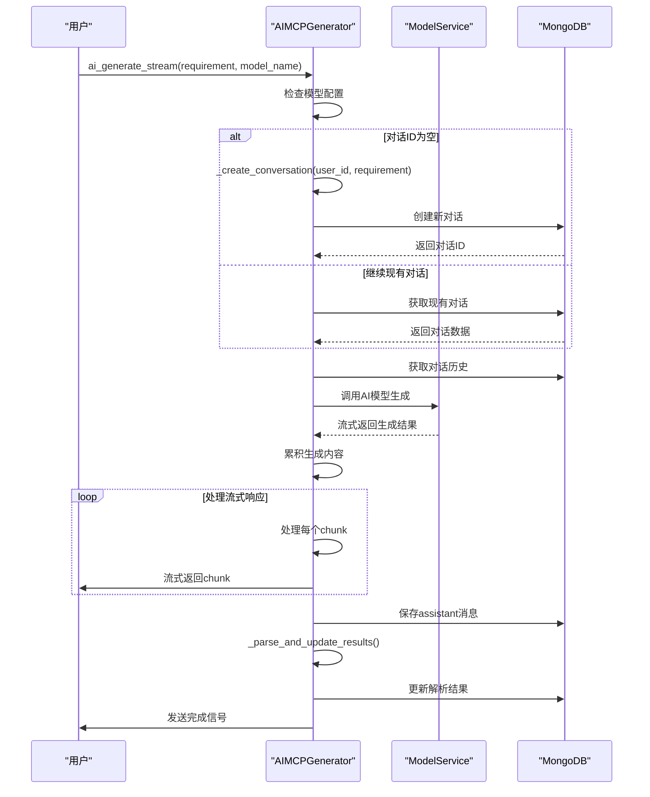
```mermaid
sequenceDiagram
participant User as "用户"
participant AIMCPGenerator as "AIMCPGenerator"
participant ModelService as "ModelService"
participant MongoDB as "MongoDB"
User->>AIMCPGenerator : ai_generate_stream(requirement, model_name)
AIMCPGenerator->>AIMCPGenerator : 检查模型配置
alt 对话ID为空
AIMCPGenerator->>AIMCPGenerator : _create_conversation(user_id, requirement)
AIMCPGenerator->>MongoDB : 创建新对话
MongoDB-->>AIMCPGenerator : 返回对话ID
else 继续现有对话
AIMCPGenerator->>MongoDB : 获取现有对话
MongoDB-->>AIMCPGenerator : 返回对话数据
end
AIMCPGenerator->>MongoDB : 获取对话历史
AIMCPGenerator->>ModelService : 调用AI模型生成
ModelService-->>AIMCPGenerator : 流式返回生成结果
AIMCPGenerator->>AIMCPGenerator : 累积生成内容
loop 处理流式响应
AIMCPGenerator->>AIMCPGenerator : 处理每个chunk
AIMCPGenerator->>User : 流式返回chunk
end
AIMCPGenerator->>MongoDB : 保存assistant消息
AIMCPGenerator->>AIMCPGenerator : _parse_and_update_results()
AIMCPGenerator->>MongoDB : 更新解析结果
AIMCPGenerator->>User : 发送完成信号
```

**Diagram sources**
- [ai_mcp_generator.py](file://mag/app/services/mcp/ai_mcp_generator.py#L50-L250)

**Section sources**
- [ai_mcp_generator.py](file://mag/app/services/mcp/ai_mcp_generator.py#L50-L250)

### JSON Schema验证机制

AI生成器通过解析和验证机制确保生成内容的正确性。它使用`parse_ai_mcp_generation_response`函数解析AI响应，并通过`_check_completion`方法验证是否完成了所有必需阶段。

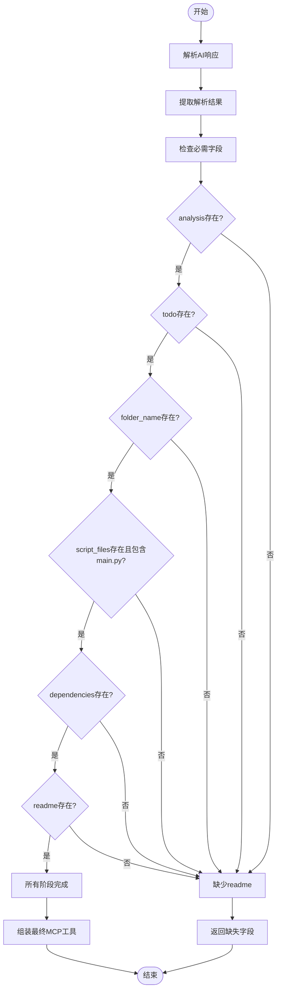
```mermaid
flowchart TD
Start([开始]) --> ParseResponse["解析AI响应"]
ParseResponse --> ExtractResults["提取解析结果"]
ExtractResults --> CheckRequired["检查必需字段"]
CheckRequired --> Analysis{"analysis存在?"}
Analysis --> |是| Todo{"todo存在?"}
Analysis --> |否| Missing["缺少analysis"]
Todo --> |是| Folder{"folder_name存在?"}
Todo --> |否| Missing["缺少todo"]
Folder --> |是| Script{"script_files存在且包含main.py?"}
Folder --> |否| Missing["缺少folder_name"]
Script --> |是| Dependencies{"dependencies存在?"}
Script --> |否| Missing["缺少script_files或main.py"]
Dependencies --> |是| Readme{"readme存在?"}
Dependencies --> |否| Missing["缺少dependencies"]
Readme --> |是| Completed["所有阶段完成"]
Readme --> |否| Missing["缺少readme"]
Completed --> Assemble["组装最终MCP工具"]
Missing --> Return["返回缺失字段"]
Assemble --> End([结束])
Return --> End
```

**Diagram sources**
- [ai_mcp_generator.py](file://mag/app/services/mcp/ai_mcp_generator.py#L400-L500)

**Section sources**
- [ai_mcp_generator.py](file://mag/app/services/mcp/ai_mcp_generator.py#L400-L500)

## 服务端与客户端连接管理

MCP服务通过客户端管理器和服务端管理器的协同工作，实现了对MCP客户端进程和服务器连接的全面管理。

### 客户端进程管理

客户端管理器负责MCP客户端进程的整个生命周期，从启动到停止，确保了客户端的稳定运行。

```mermaid
sequenceDiagram
participant User as "用户"
participant ClientManager as "MCPClientManager"
participant Process as "子进程"
User->>ClientManager : initialize(config_path)
ClientManager->>ClientManager : _check_existing_client()
alt 客户端已存在
ClientManager-->>User : 返回已连接状态
else 启动新客户端
ClientManager->>ClientManager : 构建启动命令
ClientManager->>ClientManager : 创建日志文件
ClientManager->>Process : 启动子进程
Process-->>ClientManager : 返回进程对象
ClientManager->>ClientManager : _wait_for_client_startup()
loop 等待客户端启动
ClientManager->>ClientManager : 等待2秒
ClientManager->>ClientManager : 检查客户端是否响应
alt 客户端响应
ClientManager-->>User : 返回启动成功
break
end
alt 进程已退出
ClientManager->>ClientManager : 读取错误日志
ClientManager-->>User : 返回启动失败
break
end
end
end
```

**Diagram sources**
- [client_manager.py](file://mag/app/services/mcp/client_manager.py#L25-L150)

**Section sources**
- [client_manager.py](file://mag/app/services/mcp/client_manager.py#L25-L150)

### 服务器连接管理

服务器管理器通过HTTP API与MCP客户端通信，实现了对服务器连接的精细化管理。

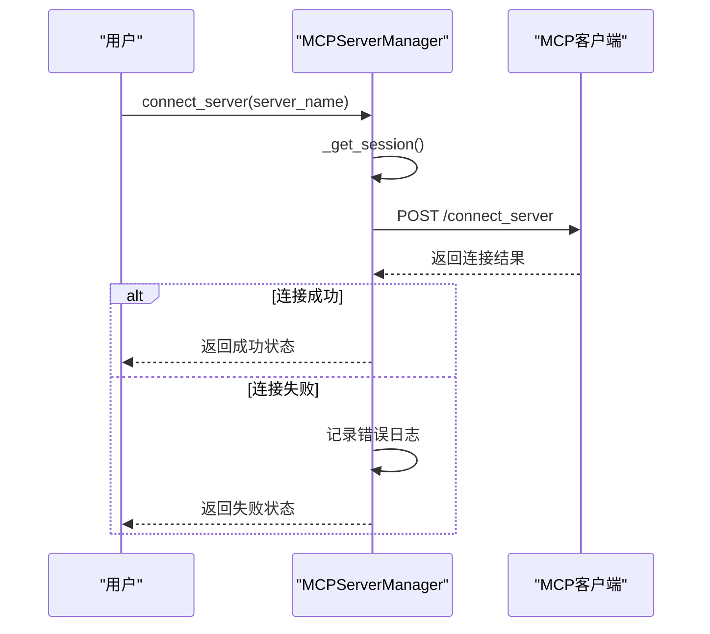
```mermaid
sequenceDiagram
participant User as "用户"
participant ServerManager as "MCPServerManager"
participant Client as "MCP客户端"
User->>ServerManager : connect_server(server_name)
ServerManager->>ServerManager : _get_session()
ServerManager->>Client : POST /connect_server
Client-->>ServerManager : 返回连接结果
alt 连接成功
ServerManager-->>User : 返回成功状态
else 连接失败
ServerManager->>ServerManager : 记录错误日志
ServerManager-->>User : 返回失败状态
end
```

**Diagram sources**
- [server_manager.py](file://mag/app/services/mcp/server_manager.py#L50-L80)

**Section sources**
- [server_manager.py](file://mag/app/services/mcp/server_manager.py#L50-L80)

## 外部工具安全执行

工具执行器通过多层次的安全机制，确保了外部工具调用的安全性。

### 批量执行与错误处理

工具执行器支持批量执行多个工具调用，并通过异步机制和错误处理确保执行的可靠性。

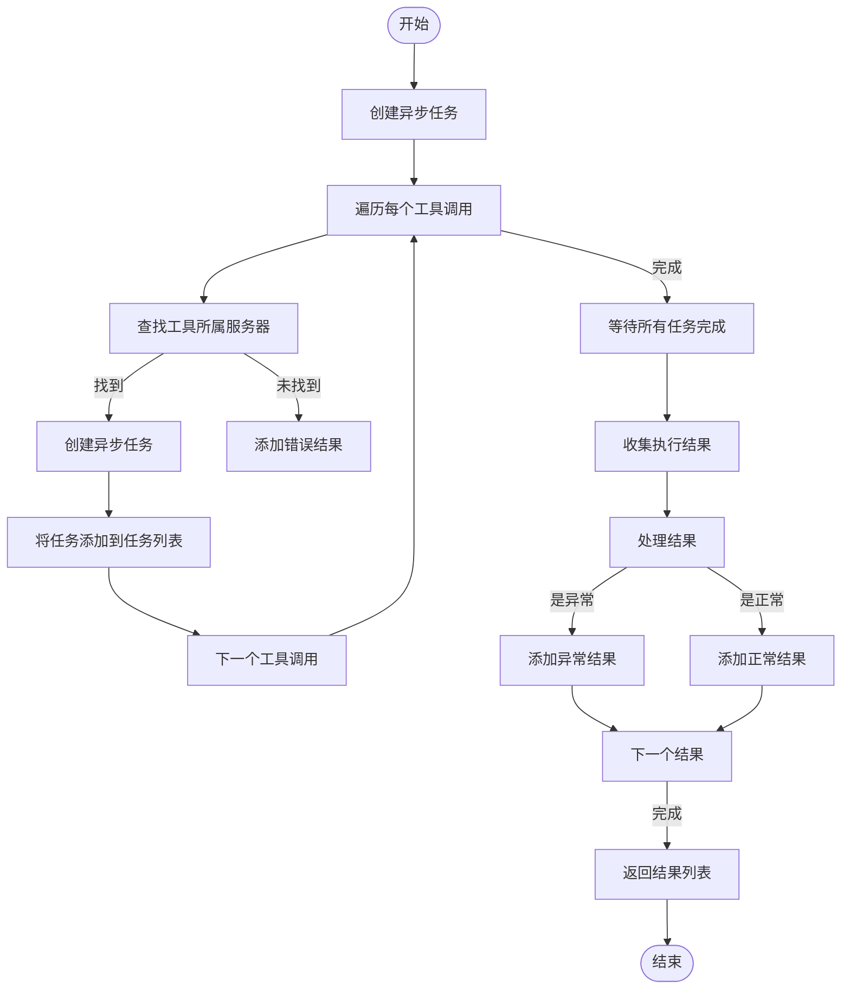
```mermaid
flowchart TD
Start([开始]) --> CreateTasks["创建异步任务"]
CreateTasks --> LoopToolCalls["遍历每个工具调用"]
LoopToolCalls --> FindServer["查找工具所属服务器"]
FindServer --> |找到| CreateTask["创建异步任务"]
FindServer --> |未找到| AddError["添加错误结果"]
CreateTask --> AddTask["将任务添加到任务列表"]
AddTask --> NextCall["下一个工具调用"]
NextCall --> LoopToolCalls
LoopToolCalls --> |完成| WaitTasks["等待所有任务完成"]
WaitTasks --> GatherResults["收集执行结果"]
GatherResults --> ProcessResults["处理结果"]
ProcessResults --> |是异常| AddException["添加异常结果"]
ProcessResults --> |是正常| AddResult["添加正常结果"]
AddException --> NextResult["下一个结果"]
AddResult --> NextResult
NextResult --> |完成| ReturnResults["返回结果列表"]
ReturnResults --> End([结束])
```

**Diagram sources**
- [tool_executor.py](file://mag/app/services/mcp/tool_executor.py#L10-L50)

**Section sources**
- [tool_executor.py](file://mag/app/services/mcp/tool_executor.py#L10-L50)

## 数据持久化交互

MCP服务通过`mcp_manager`与MongoDB数据库进行数据持久化交互，实现了MCP生成对话的完整生命周期管理。

### MCP生成对话管理

`mcp_manager`负责管理`mcp_messages`集合中的MCP生成对话，包括创建、读取、更新和删除操作。

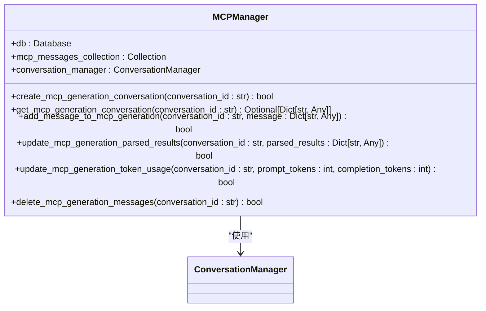
```mermaid
classDiagram
class MCPManager {
+db : Database
+mcp_messages_collection : Collection
+conversation_manager : ConversationManager
+create_mcp_generation_conversation(conversation_id : str) bool
+get_mcp_generation_conversation(conversation_id : str) Optional[Dict[str, Any]]
+add_message_to_mcp_generation(conversation_id : str, message : Dict[str, Any]) bool
+update_mcp_generation_parsed_results(conversation_id : str, parsed_results : Dict[str, Any]) bool
+update_mcp_generation_token_usage(conversation_id : str, prompt_tokens : int, completion_tokens : int) bool
+delete_mcp_generation_messages(conversation_id : str) bool
}
MCPManager --> ConversationManager : "使用"
```

**Diagram sources**
- [mcp_manager.py](file://mag/app/services/docdb/mcp_manager.py#L1-L50)

**Section sources**
- [mcp_manager.py](file://mag/app/services/docdb/mcp_manager.py#L1-L50)

### 数据交互流程

MCP服务与数据库的交互流程涵盖了从创建对话到更新解析结果的完整过程。

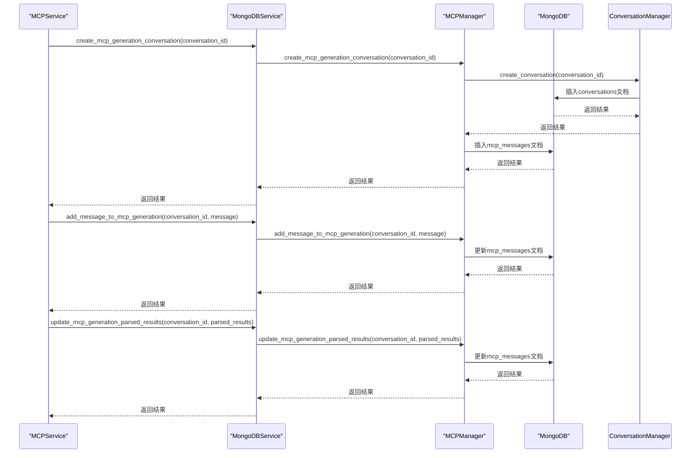
```mermaid
sequenceDiagram
participant MCPService as "MCPService"
participant MongoDBService as "MongoDBService"
participant MCPManager as "MCPManager"
participant DB as "MongoDB"
MCPService->>MongoDBService : create_mcp_generation_conversation(conversation_id)
MongoDBService->>MCPManager : create_mcp_generation_conversation(conversation_id)
MCPManager->>ConversationManager : create_conversation(conversation_id)
ConversationManager->>DB : 插入conversations文档
DB-->>ConversationManager : 返回结果
ConversationManager-->>MCPManager : 返回结果
MCPManager->>DB : 插入mcp_messages文档
DB-->>MCPManager : 返回结果
MCPManager-->>MongoDBService : 返回结果
MongoDBService-->>MCPService : 返回结果
MCPService->>MongoDBService : add_message_to_mcp_generation(conversation_id, message)
MongoDBService->>MCPManager : add_message_to_mcp_generation(conversation_id, message)
MCPManager->>DB : 更新mcp_messages文档
DB-->>MCPManager : 返回结果
MCPManager-->>MongoDBService : 返回结果
MongoDBService-->>MCPService : 返回结果
MCPService->>MongoDBService : update_mcp_generation_parsed_results(conversation_id, parsed_results)
MongoDBService->>MCPManager : update_mcp_generation_parsed_results(conversation_id, parsed_results)
MCPManager->>DB : 更新mcp_messages文档
DB-->>MCPManager : 返回结果
MCPManager-->>MongoDBService : 返回结果
MongoDBService-->>MCPService : 返回结果
```

**Diagram sources**
- [mcp_manager.py](file://mag/app/services/docdb/mcp_manager.py#L50-L200)
- [mongodb_service.py](file://mag/app/services/mongodb_service.py#L200-L300)

**Section sources**
- [mcp_manager.py](file://mag/app/services/docdb/mcp_manager.py#L50-L200)
- [mongodb_service.py](file://mag/app/services/mongodb_service.py#L200-L300)

## MCP工具注册与调用流程

MCP工具的注册与调用是一个完整的生命周期，从AI生成到最终执行。

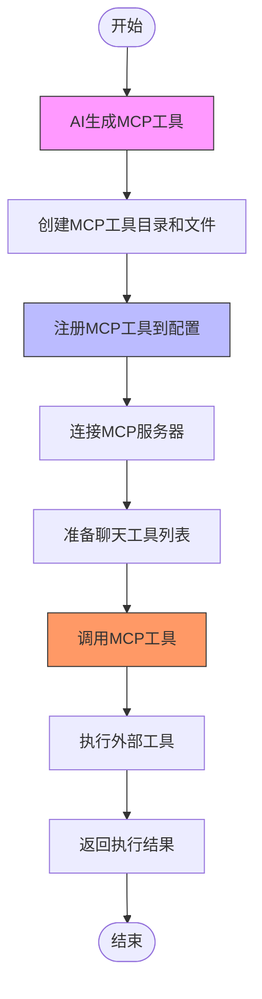
```mermaid
flowchart TD
Start([开始]) --> AIGenerate["AI生成MCP工具"]
AIGenerate --> CreateTool["创建MCP工具目录和文件"]
CreateTool --> RegisterTool["注册MCP工具到配置"]
RegisterTool --> ConnectServer["连接MCP服务器"]
ConnectServer --> PrepareTools["准备聊天工具列表"]
PrepareTools --> CallTool["调用MCP工具"]
CallTool --> ExecuteTool["执行外部工具"]
ExecuteTool --> ReturnResult["返回执行结果"]
ReturnResult --> End([结束])
style AIGenerate fill:#f9f,stroke:#333
style RegisterTool fill:#bbf,stroke:#333
style CallTool fill:#f96,stroke:#333
```

**Diagram sources**
- [ai_mcp_generator.py](file://mag/app/services/mcp/ai_mcp_generator.py#L500-L600)
- [file_manager.py](file://mag/app/core/file_manager.py#L500-L600)
- [mcp_service.py](file://mag/app/services/mcp_service.py#L130-L145)

**Section sources**
- [ai_mcp_generator.py](file://mag/app/services/mcp/ai_mcp_generator.py#L500-L600)
- [file_manager.py](file://mag/app/core/file_manager.py#L500-L600)
- [mcp_service.py](file://mag/app/services/mcp_service.py#L130-L145)

## 常见问题与解决方案

### 连接超时

当MCP客户端启动后无法在规定时间内响应时，会出现连接超时问题。

**解决方案**：
1. 检查`mcp_client_stdout.log`和`mcp_client_stderr.log`日志文件
2. 确认Python环境和依赖包是否正确安装
3. 检查端口8765是否被其他进程占用
4. 增加启动重试次数和等待时间

### 工具签名验证失败

当AI生成的MCP工具不符合预期格式时，会出现签名验证失败。

**解决方案**：
1. 检查AI生成的`folder_name`、`script_files`等必需字段
2. 确保`script_files`中包含`main.py`文件
3. 验证生成的JSON Schema是否符合要求
4. 检查提示词模板是否正确引导AI生成所需内容

## 安全最佳实践

### 服务隔离

通过为每个AI生成的MCP工具创建独立的虚拟环境，实现了服务隔离。

```python
# 使用uv工具创建虚拟环境
subprocess.run(["uv", "venv", str(tool_dir / ".venv")])
```

### 沙箱执行

通过限制工具执行的权限和资源，实现了沙箱执行。

```python
# 设置脚本文件权限
script_path.chmod(0o755)
```

**Section sources**
- [file_manager.py](file://mag/app/core/file_manager.py#L600-L700)