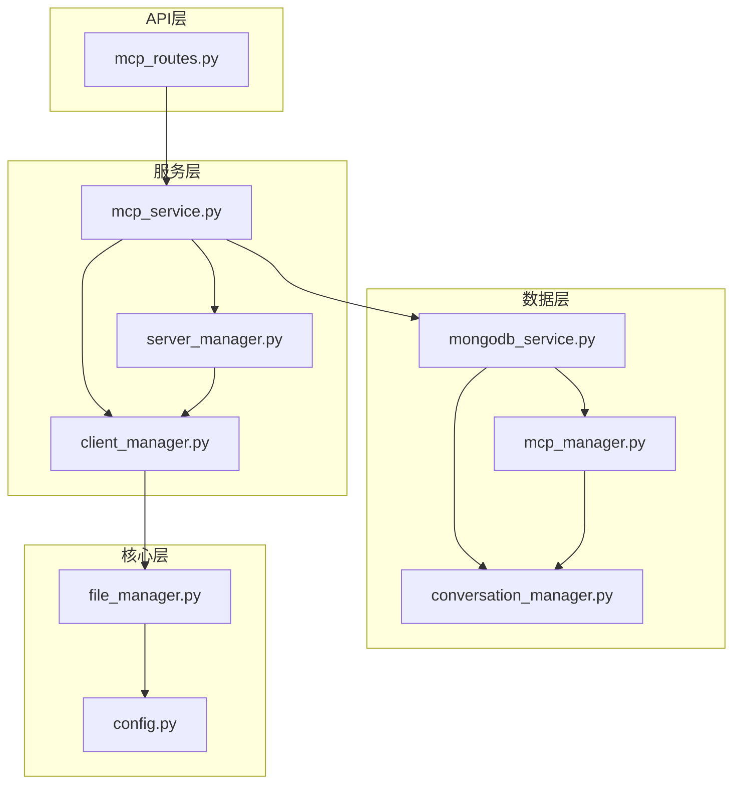
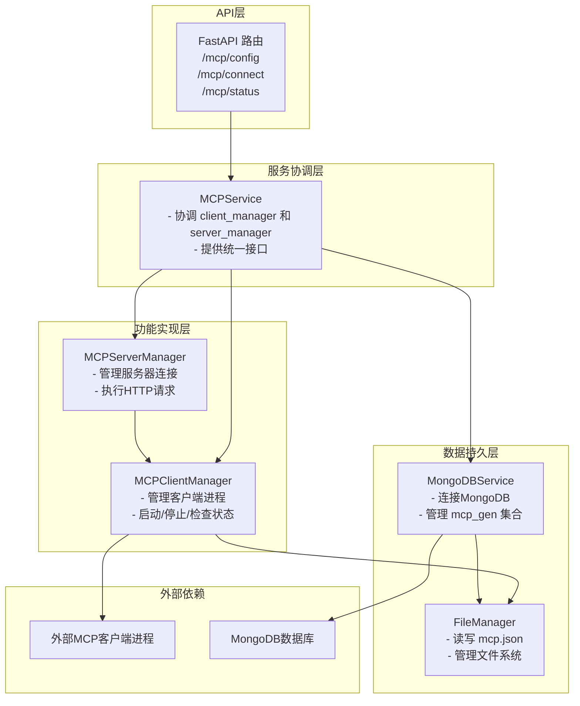
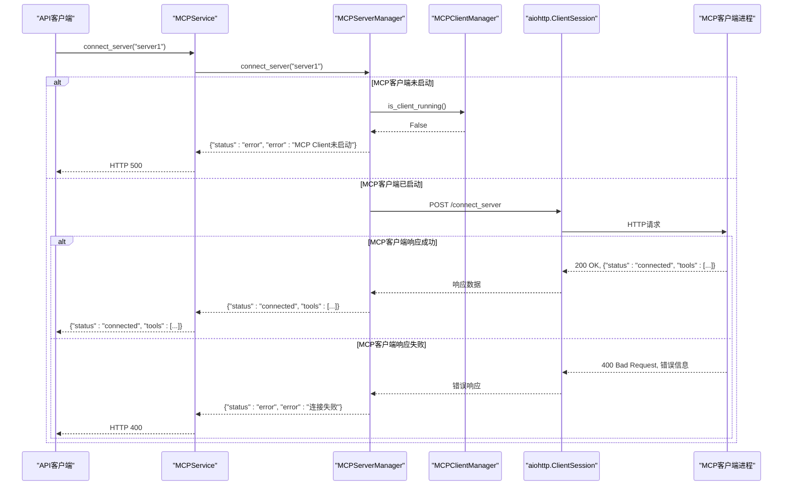
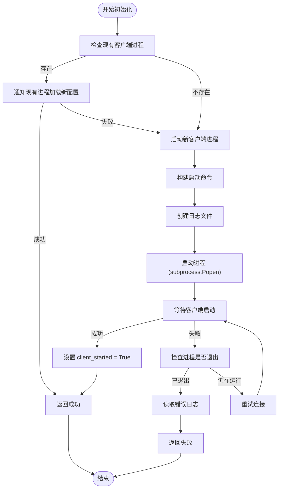
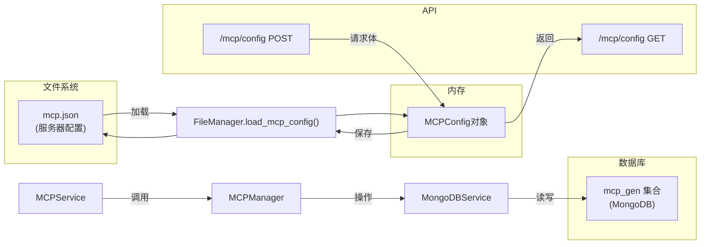
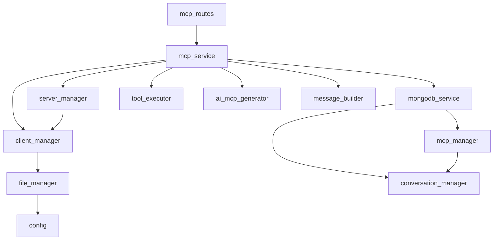

# MCP服务器管理

<cite>
**本文档引用的文件**
- [server_manager.py](file://mag/app/services/mcp/server_manager.py)
- [client_manager.py](file://mag/app/services/mcp/client_manager.py)
- [mcp_manager.py](file://mag/app/services/docdb/mcp_manager.py)
- [mcp_routes.py](file://mag/app/api/mcp_routes.py)
- [mcp_service.py](file://mag/app/services/mcp_service.py)
- [file_manager.py](file://mag/app/core/file_manager.py)
- [config.py](file://mag/app/core/config.py)
- [mongodb_service.py](file://mag/app/services/mongodb_service.py)
</cite>

## 目录
1. [引言](#引言)
2. [项目结构](#项目结构)
3. [核心组件](#核心组件)
4. [架构概述](#架构概述)
5. [详细组件分析](#详细组件分析)
6. [依赖分析](#依赖分析)
7. [性能考虑](#性能考虑)
8. [故障排除指南](#故障排除指南)
9. [结论](#结论)

## 引言
本文档全面阐述了MCP（Model Control Protocol）服务器的生命周期管理机制。系统通过`server_manager.py`处理MCP服务器的注册、启动、健康检查与状态同步，通过`client_manager.py`建立和维护与外部MCP服务器的HTTP/WebSocket连接池。文档详细描述了其与MongoDB中`mcp_manager`的交互，实现服务器配置的持久化存储与查询。同时，提供了服务器连接失败、心跳超时等异常场景的重连策略与日志追踪方法。结合API路由说明了`/list-servers`、`/connect`等端点的调用流程，并给出了高并发环境下连接管理的性能优化建议。

## 项目结构
MCP服务器管理系统是MAG（MCP Agent Graph）项目的核心组件，其代码结构遵循清晰的分层设计。系统主要由API路由、服务协调、客户端管理、服务器管理、文档数据库（DocDB）管理和核心配置等模块构成。



**图示来源**
- [mcp_routes.py](file://mag/app/api/mcp_routes.py)
- [mcp_service.py](file://mag/app/services/mcp_service.py)
- [client_manager.py](file://mag/app/services/mcp/client_manager.py)
- [server_manager.py](file://mag/app/services/mcp/server_manager.py)
- [mongodb_service.py](file://mag/app/services/mongodb_service.py)
- [mcp_manager.py](file://mag/app/services/docdb/mcp_manager.py)
- [conversation_manager.py](file://mag/app/services/docdb/conversation_manager.py)
- [file_manager.py](file://mag/app/core/file_manager.py)
- [config.py](file://mag/app/core/config.py)

**章节来源**
- [mcp_routes.py](file://mag/app/api/mcp_routes.py)
- [mcp_service.py](file://mag/app/services/mcp_service.py)
- [client_manager.py](file://mag/app/services/mcp/client_manager.py)
- [server_manager.py](file://mag/app/services/mcp/server_manager.py)
- [mongodb_service.py](file://mag/app/services/mongodb_service.py)
- [mcp_manager.py](file://mag/app/services/docdb/mcp_manager.py)
- [conversation_manager.py](file://mag/app/services/docdb/conversation_manager.py)
- [file_manager.py](file://mag/app/core/file_manager.py)
- [config.py](file://mag/app/core/config.py)

## 核心组件
本系统的核心组件包括`MCPServerManager`和`MCPClientManager`，它们分别负责MCP服务器的连接管理和客户端进程的生命周期管理。`MCPServerManager`通过HTTP客户端与MCP服务器进行通信，执行连接、断开、状态查询等操作。`MCPClientManager`则负责启动、监控和管理MCP客户端进程，确保其正常运行。这两个管理器通过`MCPService`进行协调，并与`FileManager`和`MongoDBService`交互，实现配置的持久化和状态的同步。

**章节来源**
- [server_manager.py](file://mag/app/services/mcp/server_manager.py)
- [client_manager.py](file://mag/app/services/mcp/client_manager.py)
- [mcp_service.py](file://mag/app/services/mcp_service.py)

## 架构概述
MCP服务器管理系统的整体架构是一个典型的分层架构，从上到下分为API层、服务协调层、功能实现层和数据持久层。



**图示来源**
- [mcp_routes.py](file://mag/app/api/mcp_routes.py)
- [mcp_service.py](file://mag/app/services/mcp_service.py)
- [client_manager.py](file://mag/app/services/mcp/client_manager.py)
- [server_manager.py](file://mag/app/services/mcp/server_manager.py)
- [file_manager.py](file://mag/app/core/file_manager.py)
- [mongodb_service.py](file://mag/app/services/mongodb_service.py)

## 详细组件分析

### MCP服务器管理器分析
`MCPServerManager`是专门负责与MCP服务器进行HTTP通信的核心类。它通过`aiohttp`库创建异步会话，与运行在`http://127.0.0.1:8765`的MCP客户端进行交互。

#### 类图
```mermaid
classDiagram
class MCPServerManager {
+client_url : str
-_session : ClientSession
+__init__(client_url : str)
+_get_session() ClientSession
+get_server_status() Dict[str, Dict[str, Any]]
+get_server_status_sync() Dict[str, Dict[str, Any]]
+connect_server(server_name : str) Dict[str, Any]
+disconnect_server(server_name : str) Dict[str, Any]
+connect_all_servers(server_configs : Dict[str, Any]) Dict[str, Any]
+get_all_tools() Dict[str, List[Dict[str, Any]]]
+ensure_servers_connected(server_names : List[str]) Dict[str, bool]
+prepare_chat_tools(mcp_servers : List[str]) List[Dict[str, Any]]
+cleanup() None
}
MCPServerManager --> "1" "aiohttp.ClientSession" : uses
MCPServerManager --> "1" "logging.Logger" : uses
```

**图示来源**
- [server_manager.py](file://mag/app/services/mcp/server_manager.py)

#### 连接流程序列图
当调用`connect_server`方法时，系统会执行以下流程：



**图示来源**
- [server_manager.py](file://mag/app/services/mcp/server_manager.py)
- [mcp_service.py](file://mag/app/services/mcp_service.py)
- [client_manager.py](file://mag/app/services/mcp/client_manager.py)

**章节来源**
- [server_manager.py](file://mag/app/services/mcp/server_manager.py)
- [mcp_service.py](file://mag/app/services/mcp_service.py)
- [client_manager.py](file://mag/app/services/mcp/client_manager.py)

### MCP客户端管理器分析
`MCPClientManager`负责MCP客户端进程的整个生命周期，包括启动、检查、通知和清理。

#### 类图
```mermaid
classDiagram
class MCPClientManager {
-client_process : subprocess.Popen
+client_url : str
-client_started : bool
+startup_retries : int
+retry_delay : int
+__init__()
+initialize(config_path : str) Dict[str, Dict[str, Any]]
+_check_existing_client() bool
+_start_new_client(config_path : str) Dict[str, Dict[str, Any]]
+_wait_for_client_startup(stderr_file : str) bool
+_notify_config_change(config_path : str) bool
+update_config(config : Dict[str, Any], config_path : str) Dict[str, Dict[str, Any]]
+notify_client_shutdown() bool
+cleanup(force : bool) None
+is_client_running() bool
+get_client_url() str
}
MCPClientManager --> "1" "subprocess.Popen" : manages
MCPClientManager --> "1" "aiohttp.ClientSession" : uses
MCPClientManager --> "1" "logging.Logger" : uses
MCPClientManager --> "1" "FileManager" : uses
MCPClientManager --> "1" "settings" : uses
```

**图示来源**
- [client_manager.py](file://mag/app/services/mcp/client_manager.py)

#### 客户端启动流程图


**图示来源**
- [client_manager.py](file://mag/app/services/mcp/client_manager.py)

**章节来源**
- [client_manager.py](file://mag/app/services/mcp/client_manager.py)

### 配置持久化与文档数据库交互
MCP服务器的配置通过`FileManager`持久化到`mcp.json`文件中，并通过`MongoDBService`和`MCPManager`与MongoDB数据库进行交互。

#### 数据流图


**图示来源**
- [file_manager.py](file://mag/app/core/file_manager.py)
- [mcp_manager.py](file://mag/app/services/docdb/mcp_manager.py)
- [mongodb_service.py](file://mag/app/services/mongodb_service.py)
- [mcp_routes.py](file://mag/app/api/mcp_routes.py)

**章节来源**
- [file_manager.py](file://mag/app/core/file_manager.py)
- [mcp_manager.py](file://mag/app/services/docdb/mcp_manager.py)
- [mongodb_service.py](file://mag/app/services/mongodb_service.py)

## 依赖分析
系统的依赖关系清晰地展示了各组件之间的调用和协作。



**图示来源**
- [mcp_routes.py](file://mag/app/api/mcp_routes.py)
- [mcp_service.py](file://mag/app/services/mcp_service.py)
- [client_manager.py](file://mag/app/services/mcp/client_manager.py)
- [server_manager.py](file://mag/app/services/mcp/server_manager.py)
- [mongodb_service.py](file://mag/app/services/mongodb_service.py)
- [mcp_manager.py](file://mag/app/services/docdb/mcp_manager.py)
- [conversation_manager.py](file://mag/app/services/docdb/conversation_manager.py)
- [file_manager.py](file://mag/app/core/file_manager.py)
- [config.py](file://mag/app/core/config.py)

**章节来源**
- [mcp_routes.py](file://mag/app/api/mcp_routes.py)
- [mcp_service.py](file://mag/app/services/mcp_service.py)
- [client_manager.py](file://mag/app/services/mcp/client_manager.py)
- [server_manager.py](file://mag/app/services/mcp/server_manager.py)
- [mongodb_service.py](file://mag/app/services/mongodb_service.py)
- [mcp_manager.py](file://mag/app/services/docdb/mcp_manager.py)
- [conversation_manager.py](file://mag/app/services/docdb/conversation_manager.py)
- [file_manager.py](file://mag/app/core/file_manager.py)
- [config.py](file://mag/app/core/config.py)

## 性能考虑
在高并发环境下，MCP服务器的连接管理需要考虑以下性能优化建议：

1.  **连接池复用**：`MCPServerManager`内部的`aiohttp.ClientSession`被设计为单例，避免了为每次请求创建新会话的开销，显著提升了HTTP通信的性能。
2.  **异步非阻塞**：所有核心操作（如连接、断开、获取状态）均使用`async/await`模式，确保了在处理大量并发请求时不会阻塞主线程。
3.  **批量操作**：`connect_all_servers`方法允许一次性连接所有配置的服务器，减少了与MCP客户端的HTTP往返次数。
4.  **缓存机制**：虽然当前实现中没有显式的缓存，但可以考虑在`MCPService`层缓存`get_server_status`的结果，以减少对后端的频繁查询。
5.  **资源清理**：`cleanup`方法确保了`ClientSession`和子进程的正确关闭，防止了资源泄漏。

[无来源，此部分为通用性能建议]

## 故障排除指南
当MCP服务器管理出现问题时，可以按照以下步骤进行排查：

1.  **检查MCP客户端进程**：
    *   **现象**：所有连接操作都返回“MCP Client未启动”。
    *   **排查**：检查`mcp_client_stdout.log`和`mcp_client_stderr.log`日志文件，确认客户端进程是否成功启动。使用`ps`或任务管理器查看进程是否存在。

2.  **检查服务器连接失败**：
    *   **现象**：`connect_server`返回错误。
    *   **排查**：首先确认MCP客户端进程正常运行。然后检查`server_manager.py`中的`client_url`是否正确。最后，检查MCP服务器本身的配置和网络连接。

3.  **配置未生效**：
    *   **现象**：更新配置后，服务器列表没有变化。
    *   **排查**：确认`FileManager.save_mcp_config()`是否成功将配置写入`mcp.json`文件。检查`update_config` API调用的返回结果。

4.  **数据库连接问题**：
    *   **现象**：`get_mcp_generation_conversation`等方法失败。
    *   **排查**：检查`mongodb_service.py`中的`MONGODB_URL`环境变量是否正确。确认MongoDB服务是否正在运行。

**章节来源**
- [client_manager.py](file://mag/app/services/mcp/client_manager.py)
- [server_manager.py](file://mag/app/services/mcp/server_manager.py)
- [file_manager.py](file://mag/app/core/file_manager.py)
- [mongodb_service.py](file://mag/app/services/mongodb_service.py)

## 结论
本文档详细阐述了MCP服务器管理系统的生命周期管理机制。系统通过`MCPClientManager`和`MCPServerManager`两个核心组件，实现了对MCP客户端进程和服务器连接的精细化控制。通过`FileManager`和`MongoDBService`，系统实现了配置的持久化和状态的同步。API路由为前端提供了清晰的接口来管理MCP服务器。该设计具有良好的分层结构和可扩展性，能够有效支持MCP服务器的注册、启动、健康检查和状态同步等核心功能。对于异常场景，系统提供了详细的日志记录和错误处理机制，便于故障排查和恢复。

[无来源，此部分为总结性内容]