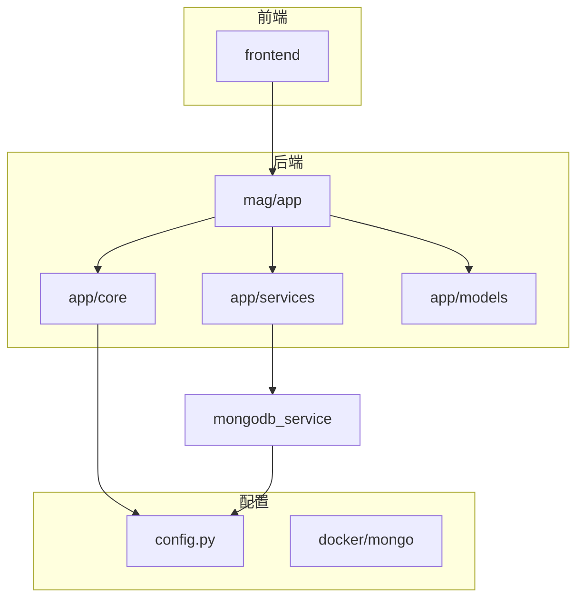
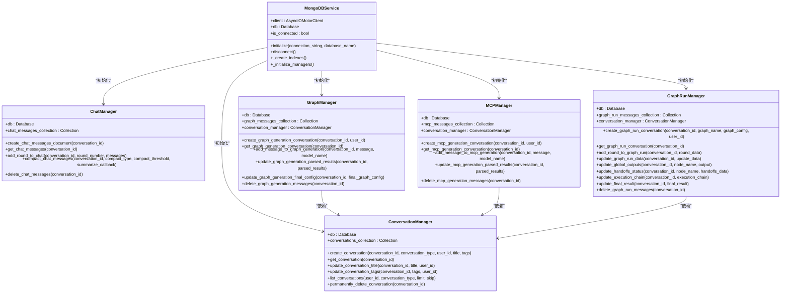
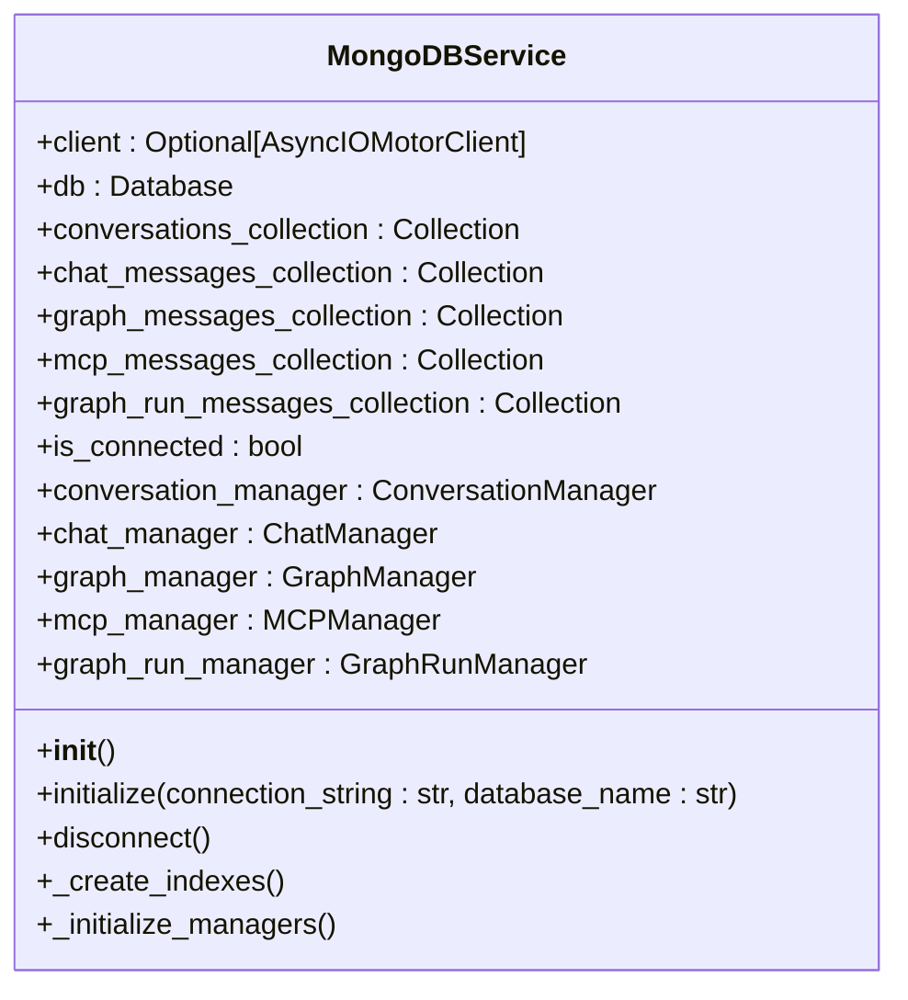
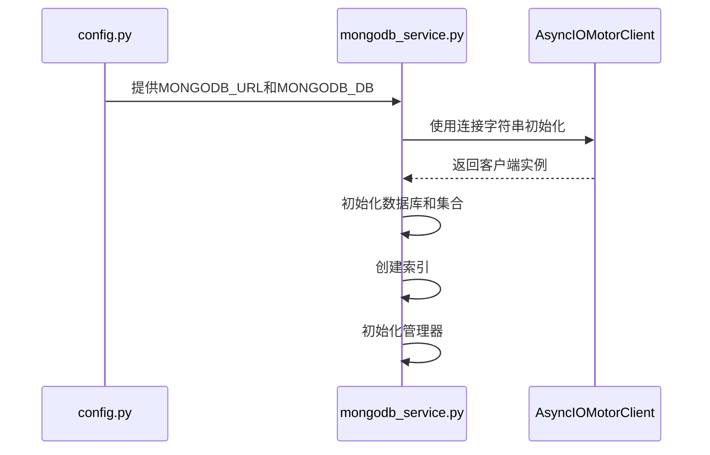
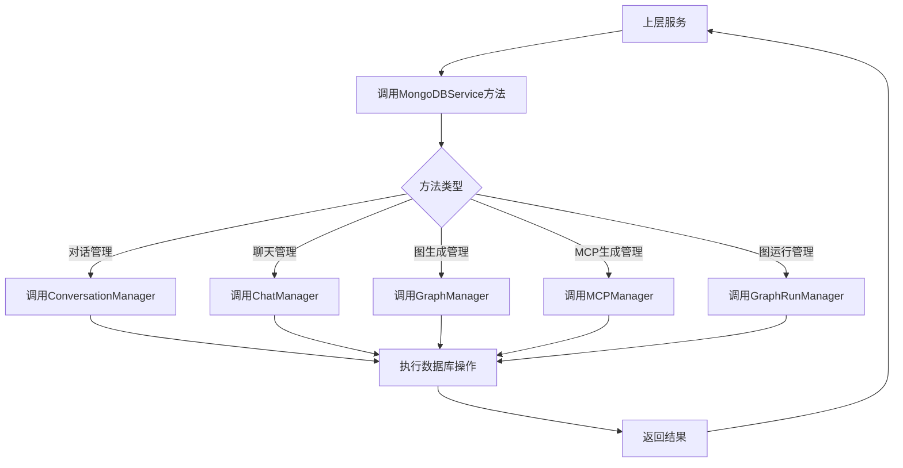
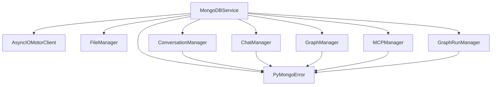

# MongoDB服务

<cite>
**本文档引用的文件**   
- [mongodb_service.py](file://mag/app/services/mongodb_service.py)
- [config.py](file://mag/app/core/config.py)
- [conversation_manager.py](file://mag/app/services/docdb/conversation_manager.py)
- [chat_manager.py](file://mag/app/services/docdb/chat_manager.py)
- [graph_manager.py](file://mag/app/services/docdb/graph_manager.py)
- [mcp_manager.py](file://mag/app/services/docdb/mcp_manager.py)
- [graph_run_manager.py](file://mag/app/services/docdb/graph_run_manager.py)
</cite>

## 目录
1. [简介](#简介)
2. [项目结构](#项目结构)
3. [核心组件](#核心组件)
4. [架构概述](#架构概述)
5. [详细组件分析](#详细组件分析)
6. [依赖分析](#依赖分析)
7. [性能考虑](#性能考虑)
8. [故障排除指南](#故障排除指南)
9. [结论](#结论)

## 简介
本文档详细说明了`mongodb_service.py`在MAG（MCP Agent Graph）系统中的核心作用。该服务作为数据访问抽象层，封装了PyMongo客户端，提供了连接池管理、数据库初始化和异常重试机制。文档阐述了其如何与`config.py`中的数据库配置集成，确保连接字符串和认证信息的安全加载，并为上层服务（如图、MCP、模型服务）提供统一的数据访问接口。

## 项目结构
MAG系统的项目结构清晰地划分了前端、后端服务和配置文件。`mongodb_service.py`位于`mag/app/services/`目录下，是后端服务的核心组件之一，负责与MongoDB数据库进行交互。

**图来源**
- [config.py](file://mag/app/core/config.py#L1-L102)
- [mongodb_service.py](file://mag/app/services/mongodb_service.py#L1-L421)

**节来源**
- [config.py](file://mag/app/core/config.py#L1-L102)
- [mongodb_service.py](file://mag/app/services/mongodb_service.py#L1-L421)

## 核心组件
`mongodb_service.py`是整个系统数据持久化的基石。它通过`MongoDBService`类提供了一个统一的接口，封装了所有与MongoDB的交互细节。该服务初始化时会建立连接、创建必要的索引，并初始化多个管理器来处理不同类型的对话数据。

**节来源**
- [mongodb_service.py](file://mag/app/services/mongodb_service.py#L1-L421)

## 架构概述
`MongoDBService`通过封装`AsyncIOMotorClient`实现了异步数据库操作。它在初始化时加载配置，建立连接，并创建多个集合的索引以优化查询性能。服务通过`_initialize_managers`方法创建了`ConversationManager`、`ChatManager`、`GraphManager`、`MCPManager`和`GraphRunManager`等管理器，这些管理器分别负责不同类型对话数据的CRUD操作。

**图来源**
- [mongodb_service.py](file://mag/app/services/mongodb_service.py#L1-L421)
- [conversation_manager.py](file://mag/app/services/docdb/conversation_manager.py#L1-L438)
- [chat_manager.py](file://mag/app/services/docdb/chat_manager.py#L1-L303)
- [graph_manager.py](file://mag/app/services/docdb/graph_manager.py#L1-L436)
- [mcp_manager.py](file://mag/app/services/docdb/mcp_manager.py#L1-L363)
- [graph_run_manager.py](file://mag/app/services/docdb/graph_run_manager.py#L1-L215)

## 详细组件分析

### MongoDB服务分析
`MongoDBService`类是整个数据访问层的核心。它通过`initialize`方法建立与MongoDB的连接，并配置了超时参数以确保连接的健壮性。服务通过`_create_indexes`方法为各个集合创建了必要的索引，以优化查询性能。

#### 类图

**图来源**
- [mongodb_service.py](file://mag/app/services/mongodb_service.py#L1-L421)

**节来源**
- [mongodb_service.py](file://mag/app/services/mongodb_service.py#L1-L421)

### 配置集成分析
`MongoDBService`通过`config.py`中的`Settings`类获取数据库连接信息。`Settings`类从环境变量中加载`MONGODB_URL`和`MONGODB_DB`，并提供了默认值以确保服务的可配置性和安全性。

**图来源**
- [config.py](file://mag/app/core/config.py#L1-L102)
- [mongodb_service.py](file://mag/app/services/mongodb_service.py#L1-L421)

**节来源**
- [config.py](file://mag/app/core/config.py#L1-L102)
- [mongodb_service.py](file://mag/app/services/mongodb_service.py#L1-L421)

### 统一数据访问接口分析
`MongoDBService`为上层服务提供了统一的数据访问接口。通过封装各个管理器的方法，它隐藏了底层数据库操作的复杂性，使得上层服务可以专注于业务逻辑。

**图来源**
- [mongodb_service.py](file://mag/app/services/mongodb_service.py#L1-L421)

**节来源**
- [mongodb_service.py](file://mag/app/services/mongodb_service.py#L1-L421)

## 依赖分析
`MongoDBService`依赖于`motor.motor_asyncio.AsyncIOMotorClient`进行异步数据库操作，并依赖于`pymongo.errors`处理数据库异常。它还依赖于`app.core.file_manager.FileManager`用于文件操作，并通过`app.services.docdb`包中的各个管理器实现具体的数据操作。

**图来源**
- [mongodb_service.py](file://mag/app/services/mongodb_service.py#L1-L421)
- [conversation_manager.py](file://mag/app/services/docdb/conversation_manager.py#L1-L438)
- [chat_manager.py](file://mag/app/services/docdb/chat_manager.py#L1-L303)
- [graph_manager.py](file://mag/app/services/docdb/graph_manager.py#L1-L436)
- [mcp_manager.py](file://mag/app/services/docdb/mcp_manager.py#L1-L363)
- [graph_run_manager.py](file://mag/app/services/docdb/graph_run_manager.py#L1-L215)

**节来源**
- [mongodb_service.py](file://mag/app/services/mongodb_service.py#L1-L421)

## 性能考虑
为了优化性能，`MongoDBService`在初始化时创建了多个索引，包括按用户ID和类型查询对话的复合索引，以及按对话ID查询消息的索引。此外，`ChatManager`提供了对话压缩功能，可以减少存储空间和查询时间。

## 故障排除指南
### 连接泄露诊断
如果发现数据库连接数异常增长，应检查`MongoDBService`的`disconnect`方法是否被正确调用。确保在应用关闭时调用此方法以释放连接。

### 查询性能瓶颈诊断
如果查询性能下降，应检查相关集合的索引是否已创建。可以通过`_create_indexes`方法确保所有必要的索引都已存在。此外，可以使用MongoDB的`explain`命令分析查询执行计划。

### 索引优化建议
根据查询模式，建议为`conversations`集合创建以下索引：
- `{"user_id": 1, "type": 1, "created_at": -1}` 用于按用户和类型查询最近的对话
- `{"status": 1}` 用于过滤活动或已删除的对话
- `{"updated_at": -1}` 用于按最后更新时间排序

对于消息集合，建议为`conversation_id`字段创建索引以优化按对话ID查询消息的性能。

### 读写分离建议
在高并发场景下，可以考虑配置MongoDB的读写分离。将读操作路由到副本集的从节点，以减轻主节点的负载。这可以通过在连接字符串中指定读偏好（read preference）来实现。

**节来源**
- [mongodb_service.py](file://mag/app/services/mongodb_service.py#L1-L421)
- [conversation_manager.py](file://mag/app/services/docdb/conversation_manager.py#L1-L438)

## 结论
`mongodb_service.py`作为MAG系统的核心数据访问层，成功地封装了与MongoDB的交互细节，为上层服务提供了统一、安全、高效的数据访问接口。通过与`config.py`的集成，确保了数据库配置的安全性和可配置性。未来可以通过引入连接池监控和查询性能分析工具进一步优化服务的稳定性和性能。