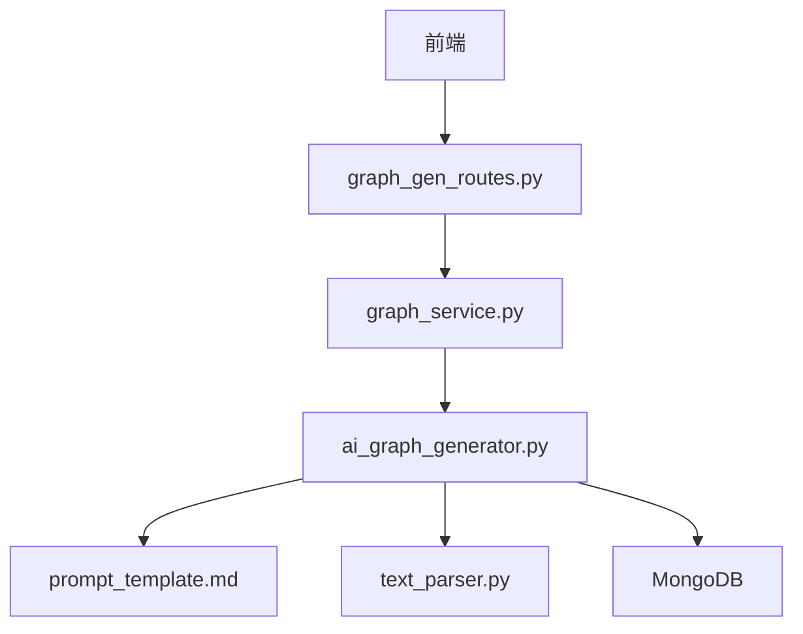
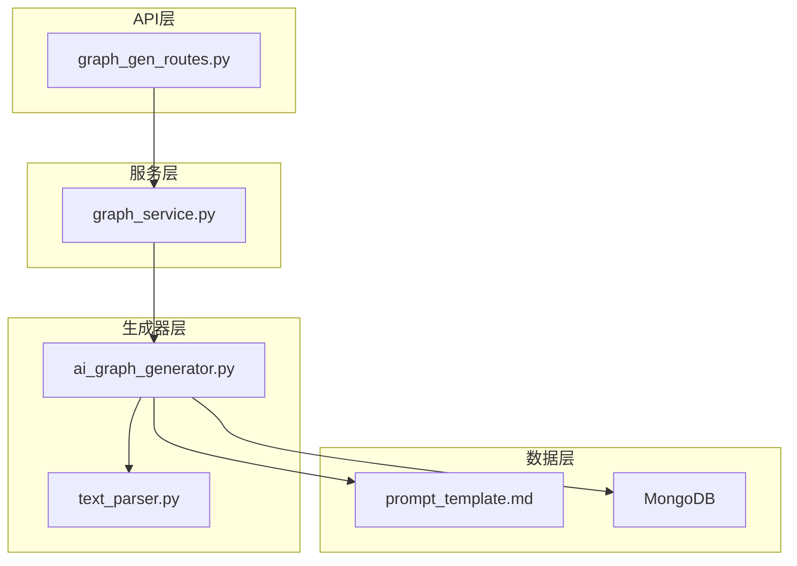
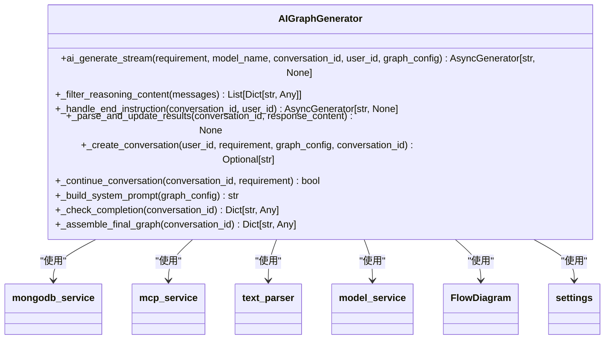
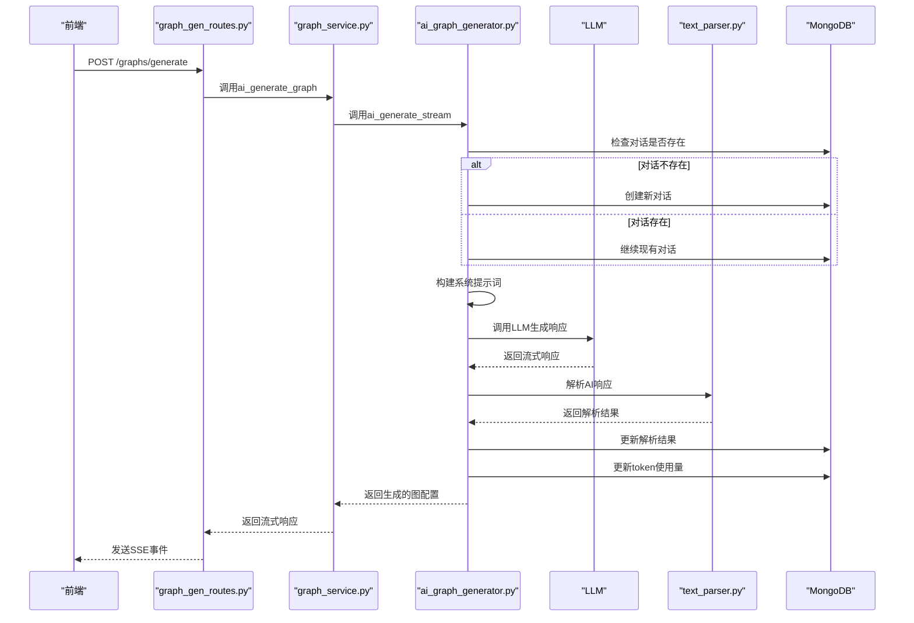
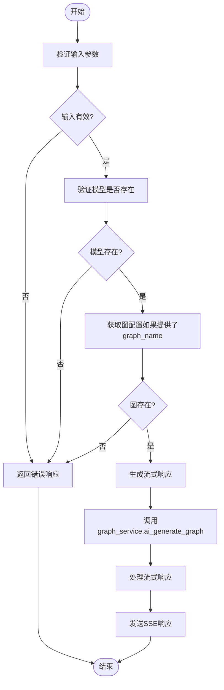
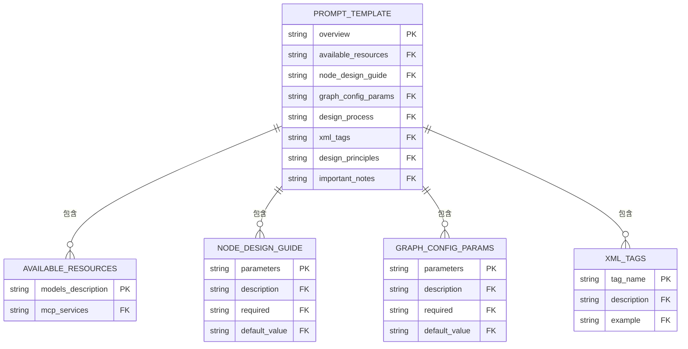
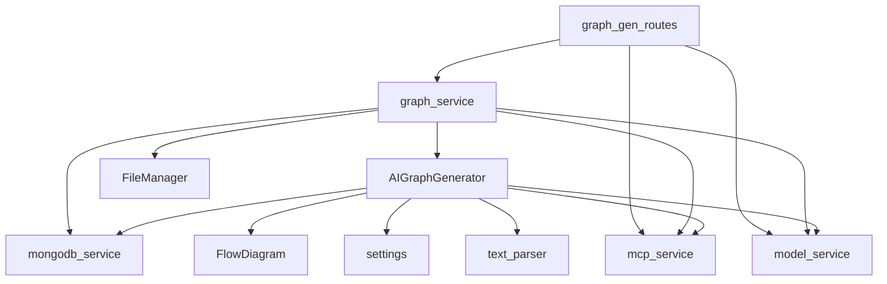

# AI图生成

<cite>
**本文档引用的文件**
- [ai_graph_generator.py](file://mag/app/services/graph/ai_graph_generator.py)
- [graph_gen_routes.py](file://mag/app/api/graph_gen_routes.py)
- [prompt_template.md](file://mag/app/templates/prompt_template.md)
- [text_parser.py](file://mag/app/utils/text_parser.py)
- [graph_service.py](file://mag/app/services/graph_service.py)
</cite>

## 目录
1. [简介](#简介)
2. [项目结构](#项目结构)
3. [核心组件](#核心组件)
4. [架构概述](#架构概述)
5. [详细组件分析](#详细组件分析)
6. [依赖分析](#依赖分析)
7. [性能考虑](#性能考虑)
8. [故障排除指南](#故障排除指南)
9. [结论](#结论)
10. [附录](#附录)（如有必要）

## 简介
本文档深入讲解AI图生成模块的实现机制，重点分析`ai_graph_generator.py`中如何通过自然语言需求自动生成Agent工作流图。详细说明其调用LLM的提示词模板设计、响应解析逻辑（如JSON结构提取）、节点与边的生成算法。结合`graph_gen_routes.py`中的API接口，描述从前端请求到后端AI生成的完整调用链路。提供实际代码示例展示如何构造prompt、处理AI输出异常（如格式错误、循环结构）。解释与模板系统（`prompt_template.md`）的集成方式，并给出优化生成质量的参数调优建议，如temperature设置、重试机制等。

## 项目结构
AI图生成模块主要由以下几个核心组件构成：
- `ai_graph_generator.py`：AI图生成器的核心实现，负责多轮交互式图生成
- `graph_gen_routes.py`：提供AI生成图的API接口
- `prompt_template.md`：提示词模板文件，定义了AI生成图的规范和要求
- `text_parser.py`：文本解析工具，用于解析AI生成的响应
- `graph_service.py`：图服务，协调各个组件的工作

**图源**
- [graph_gen_routes.py](file://mag/app/api/graph_gen_routes.py)
- [graph_service.py](file://mag/app/services/graph_service.py)
- [ai_graph_generator.py](file://mag/app/services/graph/ai_graph_generator.py)

**节源**
- [graph_gen_routes.py](file://mag/app/api/graph_gen_routes.py)
- [graph_service.py](file://mag/app/services/graph_service.py)
- [ai_graph_generator.py](file://mag/app/services/graph/ai_graph_generator.py)

## 核心组件
AI图生成模块的核心组件包括AI图生成器、API接口、提示词模板和文本解析器。这些组件协同工作，实现了从自然语言需求到Agent工作流图的自动转换。

**节源**
- [ai_graph_generator.py](file://mag/app/services/graph/ai_graph_generator.py)
- [graph_gen_routes.py](file://mag/app/api/graph_gen_routes.py)
- [prompt_template.md](file://mag/app/templates/prompt_template.md)
- [text_parser.py](file://mag/app/utils/text_parser.py)

## 架构概述
AI图生成模块采用分层架构，从上到下分为API层、服务层、生成器层和数据层。API层负责接收前端请求，服务层协调各个组件的工作，生成器层负责具体的AI生成逻辑，数据层负责存储和管理生成的图配置。

**图源**
- [graph_gen_routes.py](file://mag/app/api/graph_gen_routes.py)
- [graph_service.py](file://mag/app/services/graph_service.py)
- [ai_graph_generator.py](file://mag/app/services/graph/ai_graph_generator.py)
- [text_parser.py](file://mag/app/utils/text_parser.py)
- [prompt_template.md](file://mag/app/templates/prompt_template.md)

## 详细组件分析
### AI图生成器分析
AI图生成器是整个模块的核心，负责通过多轮交互生成Agent工作流图。它通过调用LLM，根据用户需求生成图的配置。

#### 类图

**图源**
- [ai_graph_generator.py](file://mag/app/services/graph/ai_graph_generator.py)

#### 生成流程序列图

**图源**
- [graph_gen_routes.py](file://mag/app/api/graph_gen_routes.py)
- [graph_service.py](file://mag/app/services/graph_service.py)
- [ai_graph_generator.py](file://mag/app/services/graph/ai_graph_generator.py)
- [text_parser.py](file://mag/app/utils/text_parser.py)

**节源**
- [ai_graph_generator.py](file://mag/app/services/graph/ai_graph_generator.py)
- [graph_gen_routes.py](file://mag/app/api/graph_gen_routes.py)
- [graph_service.py](file://mag/app/services/graph_service.py)
- [text_parser.py](file://mag/app/utils/text_parser.py)

### API接口分析
API接口负责接收前端请求，并将其转发给图服务进行处理。

#### API调用流程

**图源**
- [graph_gen_routes.py](file://mag/app/api/graph_gen_routes.py)

**节源**
- [graph_gen_routes.py](file://mag/app/api/graph_gen_routes.py)

### 提示词模板分析
提示词模板定义了AI生成图的规范和要求，包括可用资源、节点设计指南、图级配置参数等。

#### 模板结构

**图源**
- [prompt_template.md](file://mag/app/templates/prompt_template.md)

**节源**
- [prompt_template.md](file://mag/app/templates/prompt_template.md)

## 依赖分析
AI图生成模块依赖于多个外部组件和服务，包括MongoDB、MCP服务、模型服务等。这些依赖关系确保了模块的正常运行和功能完整性。

**图源**
- [ai_graph_generator.py](file://mag/app/services/graph/ai_graph_generator.py)
- [graph_service.py](file://mag/app/services/graph_service.py)
- [graph_gen_routes.py](file://mag/app/api/graph_gen_routes.py)

**节源**
- [ai_graph_generator.py](file://mag/app/services/graph/ai_graph_generator.py)
- [graph_service.py](file://mag/app/services/graph_service.py)
- [graph_gen_routes.py](file://mag/app/api/graph_gen_routes.py)

## 性能考虑
AI图生成模块在性能方面需要考虑以下几个方面：
- 流式响应：采用SSE（Server-Sent Events）技术，实现流式响应，提高用户体验
- 异步处理：使用异步编程模型，提高并发处理能力
- 缓存机制：对常用的提示词模板和工具信息进行缓存，减少重复计算
- 错误处理：完善的错误处理机制，确保系统稳定性

## 故障排除指南
### 常见问题及解决方案
1. **问题：AI生成图失败，返回"找不到模型配置"错误**
   - **原因**：指定的模型名称不存在或配置错误
   - **解决方案**：检查模型配置，确保模型名称正确

2. **问题：AI生成图失败，返回"创建对话失败"错误**
   - **原因**：数据库连接失败或对话创建过程中出现异常
   - **解决方案**：检查数据库连接，确保MongoDB服务正常运行

3. **问题：AI生成图失败，返回"解析和更新结果时出错"错误**
   - **原因**：AI生成的响应格式不符合预期，无法正确解析
   - **解决方案**：检查提示词模板，确保AI生成的响应格式正确

4. **问题：AI生成图失败，返回"组装最终图配置时出错"错误**
   - **原因**：图配置验证失败或保存到文件系统失败
   - **解决方案**：检查图配置，确保所有必需字段都已提供

**节源**
- [ai_graph_generator.py](file://mag/app/services/graph/ai_graph_generator.py)
- [graph_service.py](file://mag/app/services/graph_service.py)

## 结论
AI图生成模块通过结合自然语言处理、提示词工程和工作流自动化技术，实现了从自然语言需求到Agent工作流图的自动转换。该模块具有良好的可扩展性和灵活性，能够适应不同的应用场景和需求。通过优化提示词模板和参数设置，可以进一步提高生成质量和效率。

## 附录
### 优化生成质量的参数调优建议
1. **Temperature设置**：适当调整temperature参数，控制生成结果的随机性和创造性。较低的temperature值（如0.3）会产生更确定和保守的结果，较高的temperature值（如0.8）会产生更多样化和创造性的结果。
2. **重试机制**：在AI生成失败时，可以设置重试机制，尝试使用不同的模型或参数重新生成。
3. **提示词优化**：不断优化提示词模板，提高AI理解用户需求的准确性。
4. **上下文管理**：合理管理对话上下文，确保AI能够充分利用历史信息生成更高质量的结果。