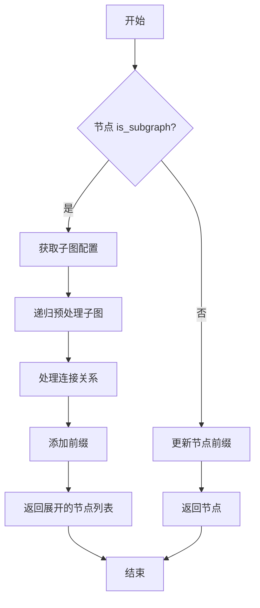

# 图处理

<cite>
**本文档中引用的文件**   
- [graph_processor.py](file://mag/app/services/graph/graph_processor.py)
- [graph_manager.py](file://mag/app/services/docdb/graph_manager.py)
</cite>

## 目录
1. [引言](#引言)
2. [图处理模块核心职责](#图处理模块核心职责)
3. [图结构化处理逻辑](#图结构化处理逻辑)
4. [图中嵌套图的实现机制](#图中嵌套图的实现机制)
5. [数据流转与预处理流程](#数据流转与预处理流程)
6. [图结构校验规则与错误处理](#图结构校验规则与错误处理)
7. [性能优化建议](#性能优化建议)
8. [结论](#结论)

## 引言
本文档详细阐述了图处理模块的核心职责，重点解析 `graph_processor.py` 中对 Agent 图的结构化处理逻辑，包括图的验证、扁平化、嵌套展开与依赖解析。说明其如何支持“图中嵌套图”这一高级特性，实现分层智能体系统的构建。结合 `graph_manager.py` 的数据存取逻辑，描述图在加载和预处理阶段的数据流转过程。提供图结构校验规则（如节点类型检查、连接合法性）的具体实现，并列举常见错误如孤立节点、非法连接的处理策略。包含性能优化建议，如缓存解析结果以加速重复执行。

## 图处理模块核心职责

图处理模块是智能体系统的核心组件，负责对复杂的 Agent 图进行结构化处理和验证。其主要职责包括：

- **图结构验证**：确保图配置的完整性与合法性，防止无效或错误的图被加载和执行。
- **图扁平化处理**：将包含子图的复杂图结构展开为扁平化的执行序列，便于后续调度和执行。
- **依赖关系解析**：计算节点间的执行依赖关系，确定节点的执行层级（level），保证执行顺序的正确性。
- **循环引用检测**：防止图配置中出现循环引用，避免系统陷入无限递归或死锁。
- **数据流转管理**：与图管理器协同工作，完成图配置的加载、解析和预处理。

**Section sources**
- [graph_processor.py](file://mag/app/services/graph/graph_processor.py#L7-L553)

## 图结构化处理逻辑

图处理器（GraphProcessor）通过一系列方法对图进行结构化处理，核心流程包括图的验证、扁平化和层级计算。

### 图验证
`validate_graph` 方法是图处理的第一道防线，它对图配置进行全面的静态检查，确保其符合系统要求。验证内容包括：
- 图必须有名称和节点列表。
- 每个节点必须有名称。
- 所有输入/输出节点引用必须指向图内存在的节点或特殊节点（`start`/`end`）。
- 子图节点必须指定有效的子图名称，且不能形成循环引用。
- 普通节点必须指定模型，且模型必须存在。
- 节点引用的 MCP 服务器必须存在且已连接。
- 图中必须至少有一个开始节点（输入包含 `start`）和一个结束节点（输出包含 `end`）。

### 图扁平化与层级计算
`preprocess_graph` 方法是图处理的核心，它将一个包含子图的复杂图转换为一个可直接执行的扁平化图。该过程分为两个主要步骤：

1.  **层级计算**：调用 `_calculate_node_levels` 方法，基于节点间的输入/输出依赖关系，为每个节点计算一个执行层级（level）。该算法通过迭代方式解决依赖，能正确处理由 `handoffs` 参数引起的循环依赖。
2.  **节点处理**：遍历图中每个节点。对于普通节点，仅更新其名称前缀以反映其在嵌套结构中的路径。对于子图节点，则调用 `_expand_subgraph_node` 方法将其递归展开。

**Section sources**
- [graph_processor.py](file://mag/app/services/graph/graph_processor.py#L463-L553)
- [graph_processor.py](file://mag/app/services/graph/graph_processor.py#L342-L391)

## 图中嵌套图的实现机制

“图中嵌套图”是实现分层智能体系统的关键特性，允许将复杂的业务逻辑封装为可复用的子图。

### 嵌套展开逻辑
`_expand_subgraph_node` 方法负责将一个子图节点展开为多个普通节点。其核心逻辑如下：
1.  **获取子图配置**：通过 `get_graph_func` 回调函数，根据子图名称从图管理器中获取子图的完整配置。
2.  **递归预处理**：对获取到的子图配置递归调用 `preprocess_graph` 方法，确保子图内部的任何嵌套图也被完全展开。
3.  **连接关系处理**：
    -   **输入连接**：将子图内部节点的 `"start"` 输入替换为父图中指向该子图节点的输入节点。
    -   **输出连接**：将子图内部节点的 `"end"` 输出替换为父图中该子图节点指向的输出节点。
4.  **命名空间隔离**：为子图内的所有节点添加前缀（`父节点名.子节点名`），确保展开后节点名称的唯一性，避免命名冲突。

### 循环引用检测
为了防止图配置陷入无限递归，`detect_graph_cycles` 方法实现了深度优先搜索（DFS）来检测循环引用。它维护一个访问路径列表，当尝试访问一个已在路径中的图时，即发现循环，并返回完整的循环引用链。



**Diagram sources**
- [graph_processor.py](file://mag/app/services/graph/graph_processor.py#L393-L461)

**Section sources**
- [graph_processor.py](file://mag/app/services/graph/graph_processor.py#L393-L461)

## 数据流转与预处理流程

图的加载和预处理涉及 `graph_manager.py` 和 `graph_processor.py` 两个模块的协同工作。

### 图管理器的数据存取
`GraphManager` 类负责与数据库交互，管理图生成对话的生命周期和数据存储。其主要功能包括：
- **创建对话**：在 `conversations` 和 `graph_messages` 两个集合中创建新的图生成记录。
- **获取对话**：合并 `conversations` 和 `graph_messages` 集合中的数据，返回完整的对话信息。
- **更新解析结果**：支持对解析出的节点进行追加、替换和删除操作，通过 MongoDB 的 `$push`、`$set` 和 `$pull` 操作符实现。
- **存储最终配置**：将验证和预处理后的最终图配置存储在 `final_graph_config` 字段中。

### 预处理阶段数据流转
1.  **加载**：`GraphManager` 从数据库加载图配置。
2.  **验证**：`GraphProcessor` 的 `validate_graph` 方法对加载的配置进行验证。
3.  **预处理**：`GraphProcessor` 的 `preprocess_graph` 方法对验证通过的配置进行扁平化和层级计算。
4.  **存储**：`GraphManager` 将预处理后的最终配置写回数据库。

```mermaid
sequenceDiagram
participant DB as 数据库
participant GM as GraphManager
participant GP as GraphProcessor
GM->>DB : 读取图配置
DB-->>GM : 返回图配置
GM->>GP : validate_graph(配置)
GP-->>GM : 验证结果
alt 验证通过
GM->>GP : preprocess_graph(配置)
GP-->>GM : 返回预处理后的配置
GM->>DB : 存储最终配置
DB-->>GM : 存储成功
else 验证失败
GM-->> : 返回错误
end
```

**Diagram sources**
- [graph_manager.py](file://mag/app/services/docdb/graph_manager.py#L8-L435)
- [graph_processor.py](file://mag/app/services/graph/graph_processor.py#L342-L391)

**Section sources**
- [graph_manager.py](file://mag/app/services/docdb/graph_manager.py#L8-L435)

## 图结构校验规则与错误处理

图结构校验是保证系统稳定运行的关键环节，`validate_graph` 方法实现了严格的校验规则。

### 核心校验规则
| 校验项 | 规则描述 | 错误信息 |
| :--- | :--- | :--- |
| **图结构** | 必须包含 `name` 和 `nodes` 字段 | "缺少图名称", "缺少节点列表或格式不正确" |
| **节点定义** | 每个节点必须有 `name` 字段 | "某个节点缺少名称" |
| **连接合法性** | 输入/输出节点必须引用图内存在的节点或 `start`/`end` | "引用了不存在的输入/输出节点" |
| **子图配置** | 子图节点必须指定 `subgraph_name`，且子图必须存在 | "未指定子图名称", "引用了不存在的子图" |
| **循环引用** | 禁止子图引用自身或形成深层循环 | "形成循环引用", "检测到循环引用链" |
| **模型依赖** | 普通节点必须指定 `model_name`，且模型必须存在 | "未指定模型", "使用了不存在的模型" |
| **MCP 服务器** | 节点引用的 MCP 服务器必须存在且已连接 | "使用了不存在或未连接的MCP服务器" |
| **起止节点** | 图中必须有至少一个输入包含 `start` 的节点和一个输出包含 `end` 的节点 | "图中没有指定开始节点", "图中没有指定结束节点" |

### 常见错误处理策略
- **孤立节点**：指没有输入或输出连接的节点。校验器通过检查每个节点的 `input_nodes` 和 `output_nodes` 是否引用了图内存在的节点来发现孤立节点，并在验证阶段直接拒绝该图。
- **非法连接**：指连接了不存在的节点。校验器会遍历所有节点的输入/输出列表，检查其引用的节点名称是否在图的节点名称集合中，若不在则报错。
- **循环依赖**：由 `handoffs` 参数或不当的图结构引起。`_calculate_node_levels` 方法通过忽略 `handoffs` 节点的输出依赖来避免循环，并在无法确定层级时，根据依赖关系或 `handoffs` 参数为节点分配一个合理的层级，确保图可以被计算。

**Section sources**
- [graph_processor.py](file://mag/app/services/graph/graph_processor.py#L463-L553)

## 性能优化建议

为提升图处理模块的性能，特别是在处理大型或复杂图时，可采取以下优化策略：

1.  **缓存解析结果**：对于频繁加载和执行的图，可以将 `preprocess_graph` 的结果（即扁平化和计算好层级的图）进行缓存。当再次请求同一图时，直接返回缓存结果，避免重复的递归展开和层级计算，显著提升响应速度。
2.  **异步处理**：对于大型图的预处理，可以考虑将其放入后台任务队列中异步执行，避免阻塞主线程，提高系统的整体响应性。
3.  **增量更新**：如果图的结构发生微小变化（如增加一个节点），可以设计增量更新算法，只重新计算受影响的节点层级，而不是对整个图进行重新处理。

## 结论
图处理模块通过 `GraphProcessor` 和 `GraphManager` 协同工作，实现了对 Agent 图的完整生命周期管理。它不仅能够高效地处理“图中嵌套图”的复杂结构，支持构建分层智能体系统，还通过严格的校验规则和循环检测机制保证了系统的健壮性。理解其内部的结构化处理逻辑、数据流转过程和错误处理策略，对于开发和维护复杂的智能体应用至关重要。未来可通过引入缓存等机制进一步优化其性能。