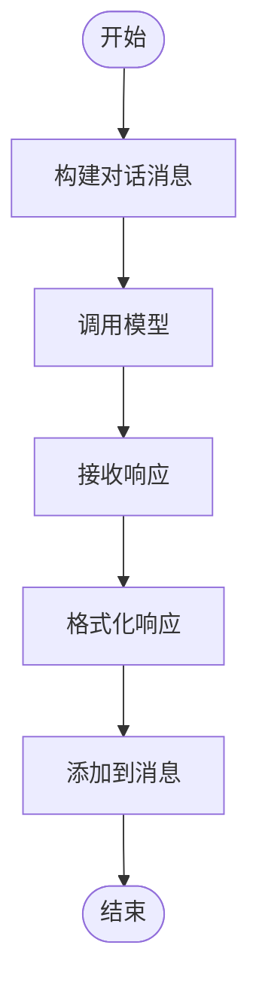

# 图执行

<cite>
**本文档引用的文件**   
- [graph_executor.py](file://mag/app/services/graph/graph_executor.py)
- [tool_executor.py](file://mag/app/services/mcp/tool_executor.py)
- [message_builder.py](file://mag/app/services/chat/message_builder.py)
- [graph_run_manager.py](file://mag/app/services/docdb/graph_run_manager.py)
- [conversation_manager.py](file://mag/app/services/graph/conversation_manager.py)
- [graph_processor.py](file://mag/app/services/graph/graph_processor.py)
- [mongodb_service.py](file://mag/app/services/mongodb_service.py)
</cite>

## 目录
1. [引言](#引言)
2. [核心执行流程](#核心执行流程)
3. [状态管理与上下文传递](#状态管理与上下文传递)
4. [异步调用与错误恢复](#异步调用与错误恢复)
5. [MCP工具协调机制](#mcp工具协调机制)
6. [模型推理与对话构建](#模型推理与对话构建)
7. [执行记录持久化](#执行记录持久化)
8. [关键执行机制](#关键执行机制)
9. [性能调优建议](#性能调优建议)
10. [执行时序图示例](#执行时序图示例)

## 引言
图执行引擎是MAG系统的核心组件，负责协调图中各节点的逐节点执行流程。该引擎通过`graph_executor.py`实现，采用流式处理方式，能够高效地管理状态、传递上下文、协调MCP工具调用、执行模型推理并构建对话。引擎还通过`graph_run_manager.py`实现执行记录的持久化，确保执行过程的可追溯性和可恢复性。本文档将深入分析图执行引擎的工作原理，重点介绍其执行流程、状态管理、上下文传递、异步调用与错误恢复机制，以及如何协调MCP工具调用、模型推理与对话构建。

## 核心执行流程
图执行引擎的核心流程始于`execute_graph_stream`方法，该方法负责执行整个图并返回流式结果。流程首先创建一个新的会话，并立即向前端发送会话ID。随后，引擎开始执行图中的节点，从`start`节点开始，逐步执行到`end`节点。每个节点的执行都通过`_execute_node_stream`方法完成，该方法会根据节点的配置调用相应的模型或工具，并将结果返回给前端。整个执行过程采用流式处理，确保前端能够实时接收到执行结果。

**图执行流程**

**图来源**
- [graph_executor.py](file://mag/app/services/graph/graph_executor.py#L15-L50)

**本节来源**
- [graph_executor.py](file://mag/app/services/graph/graph_executor.py#L15-L50)

## 状态管理与上下文传递
图执行引擎通过`conversation_manager.py`实现状态管理与上下文传递。每个会话都有一个唯一的会话ID，用于标识和管理会话状态。会话状态包括图配置、执行轮次、全局输出、执行链和handoffs状态等。引擎在执行每个节点时，会从会话状态中获取输入，并将输出更新到会话状态中。上下文传递通过`_get_node_input_from_rounds`方法实现，该方法会根据节点的输入节点获取相应的输入内容。

**状态管理流程**

**图来源**
- [conversation_manager.py](file://mag/app/services/graph/conversation_manager.py#L15-L50)

**本节来源**
- [conversation_manager.py](file://mag/app/services/graph/conversation_manager.py#L15-L50)

## 异步调用与错误恢复
图执行引擎支持异步调用和错误恢复。异步调用通过`tool_executor.py`实现，该模块负责执行MCP工具调用。当节点需要调用工具时，引擎会调用`execute_tools_batch`方法，该方法会批量执行工具调用，并返回结果。错误恢复通过`_execute_node_stream`方法中的异常处理机制实现。当执行节点时发生异常，引擎会捕获异常并返回错误信息，同时记录错误日志，以便后续分析和调试。

**异步调用流程**

**图来源**
- [tool_executor.py](file://mag/app/services/mcp/tool_executor.py#L15-L50)

**本节来源**
- [tool_executor.py](file://mag/app/services/mcp/tool_executor.py#L15-L50)

## MCP工具协调机制
图执行引擎通过`tool_executor.py`协调MCP工具调用。当节点需要调用MCP工具时，引擎会调用`prepare_chat_tools`方法，该方法会根据节点配置的MCP服务器获取相应的工具列表。然后，引擎会调用`execute_tools_batch`方法，该方法会批量执行工具调用，并返回结果。工具调用的结果会被格式化为工具消息，并添加到对话消息中。

**MCP工具协调流程**

**图来源**
- [tool_executor.py](file://mag/app/services/mcp/tool_executor.py#L15-L50)

**本节来源**
- [tool_executor.py](file://mag/app/services/mcp/tool_executor.py#L15-L50)

## 模型推理与对话构建
图执行引擎通过`message_builder.py`实现模型推理与对话构建。当节点需要执行模型推理时，引擎会调用`build_chat_messages`方法，该方法会根据会话状态构建对话消息。然后，引擎会调用模型客户端，将对话消息发送给模型，并接收模型的响应。模型的响应会被格式化为助手消息，并添加到对话消息中。

**模型推理与对话构建流程**

**图来源**
- [message_builder.py](file://mag/app/services/chat/message_builder.py#L15-L50)

**本节来源**
- [message_builder.py](file://mag/app/services/chat/message_builder.py#L15-L50)

## 执行记录持久化
图执行引擎通过`graph_run_manager.py`实现执行记录的持久化。每次执行图时，引擎都会创建一个新的执行记录，并将执行过程中的所有信息保存到MongoDB中。执行记录包括会话ID、图名称、图配置、执行轮次、全局输出、执行链、handoffs状态和最终结果等。执行记录的持久化确保了执行过程的可追溯性和可恢复性。

**执行记录持久化流程**

**图来源**
- [graph_run_manager.py](file://mag/app/services/docdb/graph_run_manager.py#L15-L50)

**本节来源**
- [graph_run_manager.py](file://mag/app/services/docdb/graph_run_manager.py#L15-L50)

## 关键执行机制
### 超时控制
图执行引擎通过`_execute_node_stream`方法中的`max_iterations`参数实现超时控制。该参数限制了每个节点的最大迭代次数，防止节点执行时间过长。当迭代次数达到最大值时，引擎会停止执行并返回结果。

### 重试策略
图执行引擎通过`_execute_node_stream`方法中的异常处理机制实现重试策略。当执行节点时发生异常，引擎会捕获异常并记录错误日志，然后继续执行下一个节点。如果需要重试，可以通过`continue_conversation_stream`方法重新执行会话。

### 断点续执行
图执行引擎通过`check_execution_resumption_point`方法实现断点续执行。该方法会检查会话的执行恢复点，确定是否需要从某个节点继续执行。如果需要，引擎会调用`_continue_from_handoffs_selection_stream`或`_continue_waiting_handoffs_stream`方法，从指定节点继续执行。

**断点续执行流程**

**图来源**
- [conversation_manager.py](file://mag/app/services/graph/conversation_manager.py#L15-L50)

**本节来源**
- [conversation_manager.py](file://mag/app/services/graph/conversation_manager.py#L15-L50)

## 性能调优建议
### 执行队列管理
为了提高高并发场景下的性能，建议使用执行队列管理。通过将执行请求放入队列中，可以避免同时执行大量请求导致系统资源耗尽。可以使用消息队列（如RabbitMQ或Kafka）来实现执行队列管理。

### 资源隔离
为了确保系统的稳定性和可靠性，建议对不同类型的执行请求进行资源隔离。例如，可以为MCP工具调用和模型推理分配不同的资源池，避免相互影响。可以使用容器化技术（如Docker）和编排工具（如Kubernetes）来实现资源隔离。

**性能调优建议**

**图来源**
- [graph_executor.py](file://mag/app/services/graph/graph_executor.py#L15-L50)

**本节来源**
- [graph_executor.py](file://mag/app/services/graph/graph_executor.py#L15-L50)

## 执行时序图示例
以下是一个从触发执行到结果返回的全过程的执行时序图示例。

**图来源**
- [graph_executor.py](file://mag/app/services/graph/graph_executor.py#L15-L50)
- [conversation_manager.py](file://mag/app/services/graph/conversation_manager.py#L15-L50)
- [tool_executor.py](file://mag/app/services/mcp/tool_executor.py#L15-L50)
- [message_builder.py](file://mag/app/services/chat/message_builder.py#L15-L50)
- [graph_run_manager.py](file://mag/app/services/docdb/graph_run_manager.py#L15-L50)

**本节来源**
- [graph_executor.py](file://mag/app/services/graph/graph_executor.py#L15-L50)
- [conversation_manager.py](file://mag/app/services/graph/conversation_manager.py#L15-L50)
- [tool_executor.py](file://mag/app/services/mcp/tool_executor.py#L15-L50)
- [message_builder.py](file://mag/app/services/chat/message_builder.py#L15-L50)
- [graph_run_manager.py](file://mag/app/services/docdb/graph_run_manager.py#L15-L50)