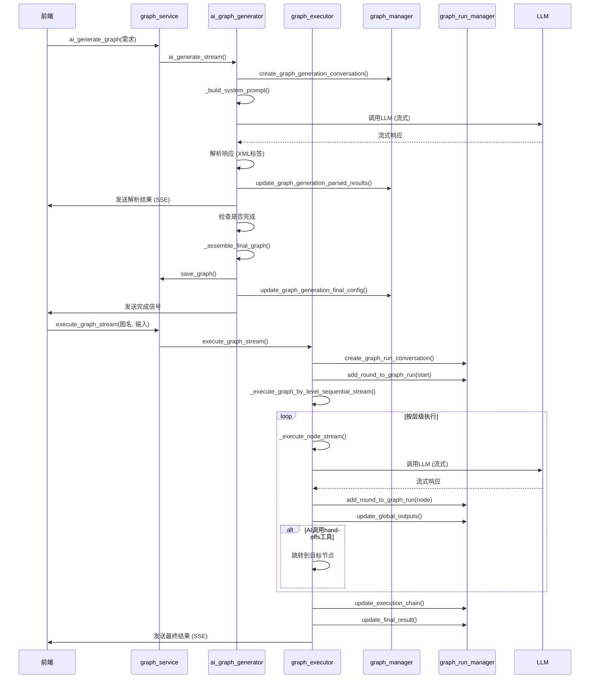

# 图服务

<cite>
**本文档引用文件**  
- [graph_service.py](file://mag/app/services/graph_service.py)
- [ai_graph_generator.py](file://mag/app/services/graph/ai_graph_generator.py)
- [graph_processor.py](file://mag/app/services/graph/graph_processor.py)
- [graph_executor.py](file://mag/app/services/graph/graph_executor.py)
- [graph_manager.py](file://mag/app/services/docdb/graph_manager.py)
- [graph_run_manager.py](file://mag/app/services/docdb/graph_run_manager.py)
- [conversation_manager.py](file://mag/app/services/graph/conversation_manager.py)
- [prompt_template.md](file://mag/app/templates/prompt_template.md)
</cite>

## 目录
1. [引言](#引言)
2. [图服务核心：graph_service.py](#图服务核心graph_servicepy)
3. [AI图生成逻辑：ai_graph_generator.py](#ai图生成逻辑ai_graph_generatorpy)
4. [图处理与嵌套：graph_processor.py](#图处理与嵌套graph_processorpy)
5. [图执行流程：graph_executor.py](#图执行流程graph_executorpy)
6. [数据交互：docdb中的图管理](#数据交互docdb中的图管理)
7. [图生成与执行时序图](#图生成与执行时序图)
8. [错误处理机制](#错误处理机制)
9. [性能优化建议](#性能优化建议)
10. [结论](#结论)

## 引言
本文档旨在深入解析MAG（MCP Agent Graph）系统中的图服务（Graph Service）架构与实现。图服务是整个系统的核心，负责协调图的全生命周期管理，包括创建、读取、更新、执行、导入导出和嵌套等操作。文档将重点阐述`graph_service.py`作为协调中心的作用，并深入分析其依赖的各个核心组件，包括AI驱动的图生成器、图处理器、图执行器以及与文档数据库（docdb）的交互模式。通过本指南，开发者和用户将全面理解图服务的内部工作原理、调用流程和最佳实践。

## 图服务核心：graph_service.py

`graph_service.py`是图服务的主入口和协调中心，它封装了所有与图相关的操作，为上层应用提供统一的API。该服务通过实例化并协调`GraphProcessor`、`ConversationManager`、`GraphExecutor`和`AIGraphGenerator`等组件，实现了对图的完整生命周期管理。

其主要职责包括：
- **图的CRUD操作**：提供`list_graphs`、`get_graph`、`save_graph`、`delete_graph`和`rename_graph`等方法，用于管理图的配置文件。
- **图的预处理与验证**：在保存或执行图之前，调用`GraphProcessor`进行扁平化展开、层级计算和循环依赖检测。
- **会话管理**：通过`ConversationManager`创建和管理图的执行会话，每个会话代表一次独立的图运行实例。
- **图的执行**：协调`GraphExecutor`来执行图的流式处理，并将结果通过SSE（Server-Sent Events）返回给前端。
- **AI图生成**：作为`AIGraphGenerator`的代理，提供`ai_generate_graph`接口，启动基于自然语言需求的AI图生成流程。

**Section sources**
- [graph_service.py](file://mag/app/services/graph_service.py#L1-L220)

## AI图生成逻辑：ai_graph_generator.py

`ai_graph_generator.py`是系统中AI驱动的核心，它实现了通过自然语言需求生成Agent图的复杂逻辑。该模块采用多轮对话的方式，引导AI模型逐步完成图的设计。

### AI驱动逻辑详解

1.  **系统提示词构建**：`_build_system_prompt`方法是整个流程的起点。它动态构建一个详尽的系统提示词，该提示词包含：
    *   **可用模型列表**：从`model_service`获取所有可用的AI模型，让AI知道可以为不同节点选择合适的模型。
    *   **可用MCP工具列表**：从`mcp_service`获取所有已连接服务器的工具信息，包括工具名称、描述和所属服务，使AI能够为节点分配正确的工具。
    *   **图设计指南**：一个包含节点参数、图级参数和设计流程的详细Markdown模板（`prompt_template.md`），指导AI如何以结构化的方式输出图配置。
    *   **更新上下文**：如果是在更新现有图，会将原图的配置附加到提示词末尾，供AI参考和修改。

2.  **流式交互与响应解析**：`ai_generate_stream`方法处理与AI模型的流式交互。
    *   **多轮对话管理**：它维护一个对话ID，可以创建新对话或继续现有对话，实现多轮交互式的图设计。
    *   **调用LLM**：使用`model_service`提供的客户端，向指定的LLM发送包含系统提示词和用户需求的请求，并以流式方式接收响应。
    *   **响应解析**：`parse_ai_generation_response`函数（在`text_parser.py`中定义）解析AI的响应。它识别特定的XML标签（如`<node>`、`<graph_name>`、`<end_template>`），并将其转换为结构化的Python字典，提取出节点配置、图名称、最终输出模板等信息。

3.  **图结构生成与组装**：`_assemble_final_graph`方法负责将解析后的结果组装成一个完整的、可验证的图配置。
    *   它从数据库中获取所有解析结果，包括节点列表、图名称、描述和结束模板。
    *   使用`GraphConfig` Pydantic模型对组装后的配置进行验证，确保其符合预定义的结构。
    *   验证通过后，调用`graph_service.save_graph`将图配置保存到文件系统，并生成一个包含图结构和依赖关系的README文件。

**Section sources**
- [ai_graph_generator.py](file://mag/app/services/graph/ai_graph_generator.py#L1-L587)

## 图处理与嵌套：graph_processor.py

`graph_processor.py`负责处理图的内部结构，特别是复杂的分层嵌套逻辑。它确保一个包含子图的复杂图在执行前被正确地转换为一个可执行的扁平化结构。

### 分层嵌套逻辑处理

1.  **子图展开**：`_flatten_all_subgraphs`和`_expand_subgraph_node`方法共同实现了子图的递归展开。
    *   当遇到一个`is_subgraph`为`True`的节点时，处理器会加载其`subgraph_name`所指向的子图配置。
    *   子图内的所有节点会被复制，并为其名称添加前缀（如`parent_node.child_node`），以确保全局唯一性。
    *   连接关系被重新映射：子图的`start`节点被替换为父图中指向该子图节点的输入节点；子图的`end`节点被替换为该子图节点的输出节点。
    *   这个过程是递归的，可以处理任意深度的嵌套。

2.  **层级计算**：`_calculate_node_levels`方法是执行顺序的核心。
    *   它构建一个依赖关系图，分析节点间的输入/输出连接。
    *   通过一个迭代算法，为每个节点分配一个`level`值。起始节点（连接到`start`）的层级为0，其直接后继节点的层级为1，依此类推。
    *   该算法特别处理了`handoffs`（交接）参数，避免因循环流程导致的无限循环，确保层级计算的稳定性。

3.  **循环依赖检测**：`detect_graph_cycles`方法防止图配置中出现循环引用。
    *   它采用深度优先搜索（DFS）的变体，跟踪图的引用路径。
    *   如果在搜索过程中发现一个图引用了自身（直接或间接），则返回一个包含循环路径的列表，阻止该图被保存或执行。

**Section sources**
- [graph_processor.py](file://mag/app/services/graph/graph_processor.py#L1-L553)

## 图执行流程：graph_executor.py

`graph_executor.py`负责图的逐节点执行流程，它将一个静态的图配置转化为一个动态的、可交互的执行过程。

### 逐节点执行流程

1.  **执行入口**：`execute_graph_stream`是执行的入口点。
    *   它首先创建一个新的会话，并立即通过SSE通知前端会话ID。
    *   记录用户的初始输入，并开始执行。

2.  **基于层级的顺序执行**：`_execute_graph_by_level_sequential_stream`是核心执行策略。
    *   执行器按照节点的`level`值从0开始，逐层执行。
    *   在同一层级内，节点按其在配置中的顺序执行。
    *   这种方式确保了数据流的正确性，即一个节点的输入节点必须在它之前执行完毕。

3.  **节点执行**：`_execute_node_stream`方法处理单个节点的执行。
    *   **消息构建**：根据节点的`system_prompt`和`user_prompt`，并用前置节点的输出替换占位符（如`{node_name}`），构建发送给AI模型的完整消息列表。
    *   **工具调用**：为节点配置的MCP服务器和`handoffs`功能准备工具列表。`handoffs`会生成一系列`transfer_to_X`工具，允许AI在执行中选择下一个要执行的节点。
    *   **流式处理**：与AI模型进行流式对话，实时将模型的响应（包括文本和工具调用）通过SSE推送给前端。
    *   **结果处理**：当AI调用`transfer_to_X`工具时，执行器会中断当前层级的执行，并跳转到目标节点继续执行，从而实现动态的流程控制。

**Section sources**
- [graph_executor.py](file://mag/app/services/graph/graph_executor.py#L1-L799)

## 数据交互：docdb中的图管理

图服务通过`docdb`包中的`graph_manager.py`和`graph_run_manager.py`与MongoDB数据库进行交互，分别管理图生成过程和图运行过程的数据。

### 数据交互模式

1.  **图生成数据管理 (graph_manager.py)**：
    *   **集合**：`graph_messages`集合。
    *   **用途**：存储AI生成图过程中的所有对话历史、解析结果和最终图配置。
    *   **关键方法**：
        *   `create_graph_generation_conversation`: 创建一个新的图生成会话。
        *   `add_message_to_graph_generation`: 向会话中添加AI的响应。
        *   `update_graph_generation_parsed_results`: 更新从AI响应中解析出的图结构信息。
        *   `update_graph_generation_final_config`: 保存最终生成的图配置。

2.  **图运行数据管理 (graph_run_manager.py)**：
    *   **集合**：`mcp-agent-graph-messages`集合。
    *   **用途**：存储每次图运行的详细执行数据，包括每一轮的输入、输出、全局状态和执行链。
    *   **关键方法**：
        *   `create_graph_run_conversation`: 创建一个新的图运行会话。
        *   `add_round_to_graph_run`: 记录每个节点的执行轮次。
        *   `update_global_outputs`: 更新设置了`global_output: true`的节点的输出，供后续节点引用。
        *   `update_execution_chain`: 记录图的实际执行路径。

`conversation_manager.py`作为中间层，统一管理内存中的会话状态，并负责与`mongodb_service`交互，将内存状态持久化到上述两个管理器中。

**Section sources**
- [graph_manager.py](file://mag/app/services/docdb/graph_manager.py#L1-L435)
- [graph_run_manager.py](file://mag/app/services/docdb/graph_run_manager.py#L1-L214)
- [conversation_manager.py](file://mag/app/services/graph/conversation_manager.py#L1-L424)

## 图生成与执行时序图

**Diagram sources**
- [graph_service.py](file://mag/app/services/graph_service.py#L1-L220)
- [ai_graph_generator.py](file://mag/app/services/graph/ai_graph_generator.py#L1-L587)
- [graph_executor.py](file://mag/app/services/graph/graph_executor.py#L1-L799)
- [graph_manager.py](file://mag/app/services/docdb/graph_manager.py#L1-L435)
- [graph_run_manager.py](file://mag/app/services/docdb/graph_run_manager.py#L1-L214)

## 错误处理机制

系统内置了多层次的错误处理机制，以确保图的稳定性和用户体验。

1.  **循环依赖**：
    *   **检测**：`GraphProcessor.detect_graph_cycles`在图保存和执行前进行检测。
    *   **处理**：一旦检测到循环，`graph_service.execute_graph_stream`会立即终止执行，并通过SSE向前端发送错误信息，如“检测到循环引用链: graph1 -> subgraph1 -> graph1”。

2.  **节点配置缺失**：
    *   **验证**：`GraphProcessor.validate_graph`在图保存和执行前进行严格验证。
    *   **处理**：如果发现节点缺少必需的`model_name`、`subgraph_name`，或引用了不存在的输入/输出节点，会返回具体的错误信息，如“节点 'research' 未指定模型”或“节点 'summary' 引用了不存在的输入节点 'nonexistent_node'”。

3.  **执行时错误**：
    *   **异常捕获**：`GraphExecutor`和`AIGraphGenerator`中的每个关键方法都使用`try-except`块捕获异常。
    *   **处理**：捕获到的异常会被记录到日志，并通过SSE发送给前端，例如“执行节点时出错: 模型客户端未初始化: gpt-4”。

**Section sources**
- [graph_processor.py](file://mag/app/services/graph/graph_processor.py#L1-L553)
- [graph_executor.py](file://mag/app/services/graph/graph_executor.py#L1-L799)
- [ai_graph_generator.py](file://mag/app/services/graph/ai_graph_generator.py#L1-L587)

## 性能优化建议

为了提升图服务的性能和响应速度，可以考虑以下优化策略：

1.  **执行缓存**：
    *   **场景**：对于幂等性高、计算成本高的节点（如数据摘要、代码生成），且其输入和上下文在一段时间内不变。
    *   **实现**：在`GraphExecutor._execute_node_stream`中，可以引入一个缓存层（如Redis）。在执行节点前，根据节点配置、输入和上下文生成一个哈希键，查询缓存。如果命中，则直接返回缓存结果，跳过LLM调用。

2.  **并发控制**：
    *   **场景**：对于同一层级内相互独立、无数据依赖的节点。
    *   **实现**：修改`_execute_graph_by_level_sequential_stream`，将同一层级内的节点执行从`for`循环改为`asyncio.gather`或`asyncio.as_completed`。这可以并行执行这些节点，显著缩短总执行时间。但需注意，这会增加对LLM API的并发请求压力，需根据API的速率限制进行调整。

**Section sources**
- [graph_executor.py](file://mag/app/services/graph/graph_executor.py#L1-L799)

## 结论
本文档全面解析了MAG系统中图服务的架构与实现。`graph_service.py`作为核心协调者，通过整合AI生成、图处理、图执行和数据管理等模块，实现了对智能体工作流的全生命周期管理。系统通过精心设计的提示词、结构化解析和层级化执行，将复杂的AI工作流自动化。同时，通过与docdb的深度集成，保证了执行过程的可追溯性和状态的持久化。理解这些核心组件及其交互方式，是高效使用和扩展MAG系统的关键。