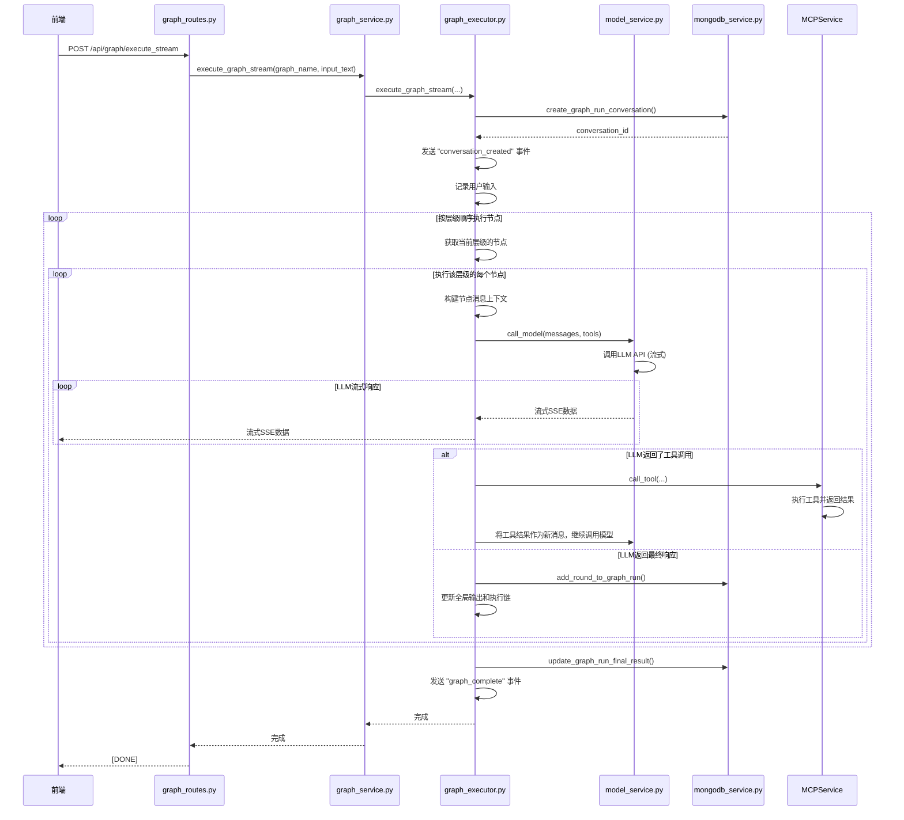

# 服务层

<cite>
**本文档引用的文件**   
- [graph_service.py](file://mag/app/services/graph_service.py)
- [mcp_service.py](file://mag/app/services/mcp_service.py)
- [model_service.py](file://mag/app/services/model_service.py)
- [chat_service.py](file://mag/app/services/chat_service.py)
- [mongodb_service.py](file://mag/app/services/mongodb_service.py)
- [ai_graph_generator.py](file://mag/app/services/graph/ai_graph_generator.py)
- [ai_mcp_generator.py](file://mag/app/services/mcp/ai_mcp_generator.py)
- [graph_processor.py](file://mag/app/services/graph/graph_processor.py)
- [graph_executor.py](file://mag/app/services/graph/graph_executor.py)
- [conversation_manager.py](file://mag/app/services/graph/conversation_manager.py)
</cite>

## 目录
1. [引言](#引言)
2. [图服务层](#图服务层)
3. [MCP服务层](#mcp服务层)
4. [模型服务层](#模型服务层)
5. [聊天服务层](#聊天服务层)
6. [数据访问服务层](#数据访问服务层)
7. [AI自动化生成服务](#ai自动化生成服务)
8. [服务调用与执行流程](#服务调用与执行流程)
9. [事务管理与错误处理](#事务管理与错误处理)
10. [性能优化策略](#性能优化策略)

## 引言

本服务层文档旨在深入剖析后端服务层的架构与核心功能。服务层作为业务逻辑的核心，承担着协调复杂工作流、封装数据访问细节、提供清晰业务接口的关键职责。它通过 `graph_service`、`mcp_service`、`model_service` 和 `chat_service` 等核心服务，实现了对图（Graph）、MCP服务器、AI模型和聊天会话的统一管理。该层向上为API路由提供简洁的业务方法，向下则通过 `mongodb_service` 与持久化存储进行交互，形成了一个高内聚、低耦合的业务处理中心。本文档将详细阐述各服务的职责、交互逻辑以及AI驱动的自动化生成机制。

## 图服务层

`graph_service.py` 是整个系统业务逻辑的核心，负责图的全生命周期管理，包括创建、读取、更新、执行和嵌套逻辑的协调。它通过组合多个内部服务组件，为上层应用提供了一个统一的、高层次的业务接口。

该服务通过 `FileManager` 与文件系统交互，实现图配置的持久化存储。`GraphProcessor` 负责处理图的复杂结构，如子图展开和层级计算。`GraphExecutor` 则负责图的实际执行流程。`ConversationManager` 用于管理图运行时的会话状态。`AIGraphGenerator` 提供了AI驱动的图生成能力。`graph_service` 将这些组件有机地整合在一起，对外暴露简洁的API。

**Section sources**
- [graph_service.py](file://mag/app/services/graph_service.py#L1-L220)

## MCP服务层

`mcp_service.py` 作为MCP（Model Context Protocol）服务器的协调者，负责管理所有MCP服务器的连接、工具注册以及AI生成工具的流程。它是系统与外部工具集成的桥梁。

该服务通过 `MCPClientManager` 启动和管理MCP客户端进程，并通过 `MCPServerManager` 与各个MCP服务器建立连接。`ToolExecutor` 负责执行具体的工具调用。`AIMCPGenerator` 则提供了AI生成MCP工具的能力。`mcp_service` 通过协调这些子模块，实现了对MCP生态的统一管理，确保了工具的可用性和调用的正确性。

**Section sources**
- [mcp_service.py](file://mag/app/services/mcp_service.py#L1-L154)

## 模型服务层

`model_service.py` 负责管理所有AI模型的配置和调用。它封装了与不同AI提供商（如OpenAI）的底层通信细节，为上层服务提供了一个标准化的模型调用接口。

该服务维护一个模型配置列表，并为每个模型初始化一个异步客户端（`AsyncOpenAI`）。它提供了添加、更新、删除和查询模型的完整CRUD操作。核心方法 `call_model` 支持同步和流式两种调用模式，并能根据模型配置自动处理各种API参数（如temperature、max_tokens等）。此外，它还负责处理LLM返回的工具调用（tool calls），并将其转换为系统内部的调用格式。

**Section sources**
- [model_service.py](file://mag/app/services/model_service.py#L1-L400)

## 聊天服务层

`chat_service.py` 专门负责处理聊天会话的完整生命周期，包括流式对话、消息构建、工具调用和会话持久化。它与 `model_service` 和 `mcp_service` 紧密协作，实现了一个支持多轮对话和工具增强的聊天系统。

该服务的核心是 `_execute_complete_flow` 方法，它实现了一个完整的“思考-行动”循环：首先调用模型生成响应，如果模型返回了工具调用，则执行这些工具并获取结果，然后将结果作为新的上下文输入，再次调用模型，直到模型不再请求工具调用为止。`MessageBuilder` 负责构建符合LLM要求的消息上下文，`ToolExecutor` 负责执行MCP工具。最终，会话的完整轮次会被持久化到MongoDB中。

**Section sources**
- [chat_service.py](file://mag/app/services/chat_service.py#L1-L446)

## 数据访问服务层

`mongodb_service.py` 是服务层与MongoDB数据库之间的抽象层，它封装了所有数据访问的细节，为上层业务服务提供了清晰的接口。它通过多个功能管理器（如 `ConversationManager`, `ChatManager`, `GraphManager`）来组织不同类型的业务数据。

该服务负责初始化数据库连接、创建索引，并提供了一系列方法来操作对话、聊天消息、图生成记录、MCP生成记录和图运行记录。它将复杂的数据库操作（如查询、更新、删除）转化为简单的业务方法调用，使得上层服务无需关心底层的数据库实现。例如，`create_conversation` 方法会同时在 `conversations` 集合和 `chat` 集合中创建文档，而上层服务只需调用一次即可。

**Section sources**
- [mongodb_service.py](file://mag/app/services/mongodb_service.py#L1-L420)

## AI自动化生成服务

服务层的核心亮点之一是其AI驱动的自动化生成能力，这主要体现在 `ai_graph_generator.py` 和 `ai_mcp_generator.py` 两个模块中。它们利用LLM的强大能力，将用户的需求自动转化为可执行的系统配置。

### AI图生成器

`ai_graph_generator.py` 负责将用户对工作流的需求（如“创建一个新闻摘要和社交媒体发布的自动化流程”）转化为一个结构化的图配置。其核心流程如下：
1.  **构建系统提示词**：`_build_system_prompt` 方法会动态生成一个包含当前可用模型和MCP工具列表的详细提示词。这确保了LLM在生成图时，能够准确地引用系统中实际存在的资源。
2.  **多轮交互式生成**：`ai_generate_stream` 方法支持流式响应，允许用户与LLM进行多轮对话，逐步完善图的设计。用户可以提供初始需求，然后根据LLM的反馈进行补充或修改。
3.  **解析与验证**：`_parse_and_update_results` 方法使用 `parse_ai_generation_response` 函数解析LLM的JSON输出，并将其结构化地存储在MongoDB中。系统会检查是否完成了所有必需阶段（如 `analysis`, `todo`, `nodes` 等）。
4.  **组装与持久化**：当用户发送结束指令时，`_assemble_final_graph` 方法会将解析出的结果组装成一个完整的 `GraphConfig` 对象，验证其有效性，并通过 `graph_service` 将其保存到文件系统，同时生成相应的README文档。

### AI MCP生成器

`ai_mcp_generator.py` 的职责是将用户对新工具的需求（如“创建一个能从网页抓取数据的工具”）转化为一个可运行的MCP工具。其流程与图生成器类似：
1.  **提示词工程**：`_build_system_prompt` 方法会向LLM提供一个包含现有工具列表的上下文，防止生成重复的工具，并引导LLM创建互补的新工具。
2.  **LLM调用模式**：同样采用流式调用模式，支持多轮迭代。LLM的输出被解析为 `script_files`（工具脚本）、`dependencies`（依赖项）和 `readme`（说明文档）等结构化数据。
3.  **工具创建与注册**：`_assemble_final_mcp` 方法会调用 `FileManager` 的 `create_mcp_tool` 方法，在文件系统中创建工具目录和脚本文件。随后，`register_ai_mcp_tool_stdio` 方法会将新工具的配置（如命令、参数）动态添加到MCP的全局配置中，并通过 `mcp_service` 的 `update_config` 方法使其生效，实现工具的“热插拔”。

**Section sources**
- [ai_graph_generator.py](file://mag/app/services/graph/ai_graph_generator.py#L1-L586)
- [ai_mcp_generator.py](file://mag/app/services/mcp/ai_mcp_generator.py#L1-L618)

## 服务调用与执行流程

服务层通过精心设计的调用链路，实现了从用户请求到最终结果的完整处理。以下是一个典型的图执行流程的时序图示例。

**Diagram sources**
- [graph_service.py](file://mag/app/services/graph_service.py#L150-L180)
- [graph_executor.py](file://mag/app/services/graph/graph_executor.py#L20-L120)
- [model_service.py](file://mag/app/services/model_service.py#L200-L250)
- [mongodb_service.py](file://mag/app/services/mongodb_service.py#L100-L150)

## 事务管理与错误处理

服务层通过多种机制来保证操作的原子性和数据的一致性，并提供了完善的错误传播机制。

### 事务管理
由于使用了MongoDB，服务层无法依赖传统的关系型数据库事务。因此，它采用了“补偿式事务”和“幂等性设计”来保证数据一致性。例如，在创建会话时，`ConversationManager` 会先在内存中创建会话对象，然后尝试在MongoDB中创建对应的文档。如果数据库操作失败，它会立即清理内存中的会话，避免状态不一致。对于图执行，每个执行轮次（round）的写入都是独立的，即使执行中断，已保存的轮次也不会丢失。

### 错误传播
服务层采用了清晰的错误传播策略。底层服务（如 `mongodb_service`）通常返回一个包含 `status` 和 `error` 字段的字典。上层服务（如 `graph_service`）在捕获到错误后，会将其包装成更具体的异常（如 `ValueError`）或通过SSE流直接发送给前端。例如，`execute_graph_stream` 方法在捕获到任何异常时，都会通过 `SSEHelper.send_error` 将错误信息实时推送给前端，确保用户能及时了解执行失败的原因。

**Section sources**
- [graph_service.py](file://mag/app/services/graph_service.py#L150-L180)
- [graph_executor.py](file://mag/app/services/graph/graph_executor.py#L20-L120)
- [conversation_manager.py](file://mag/app/services/graph/conversation_manager.py#L100-L150)

## 性能优化策略

服务层实施了多项性能优化策略，以确保系统的高效运行。

1.  **异步非阻塞I/O**：整个服务层大量使用 `async/await` 语法，无论是调用LLM API、与MongoDB交互还是执行MCP工具，所有耗时的I/O操作都是异步的。这使得单个服务实例能够高效地处理大量并发请求。
2.  **内存缓存**：`ConversationManager` 维护了一个 `active_conversations` 字典，将活跃的会话缓存在内存中。这避免了在每次节点执行时都从数据库读取整个会话状态，极大地提升了图执行的性能。
3.  **连接池与复用**：`model_service` 为每个配置的模型都初始化了一个 `AsyncOpenAI` 客户端，这些客户端内部会管理连接池，复用HTTP连接，减少了建立新连接的开销。
4.  **流式处理**：对于图执行和聊天等长耗时操作，服务层普遍采用SSE（Server-Sent Events）流式传输。这使得前端可以实时接收结果，而无需长时间等待整个流程结束，提升了用户体验。

**Section sources**
- [model_service.py](file://mag/app/services/model_service.py#L50-L100)
- [conversation_manager.py](file://mag/app/services/graph/conversation_manager.py#L10-L30)
- [graph_service.py](file://mag/app/services/graph_service.py#L150-L180)