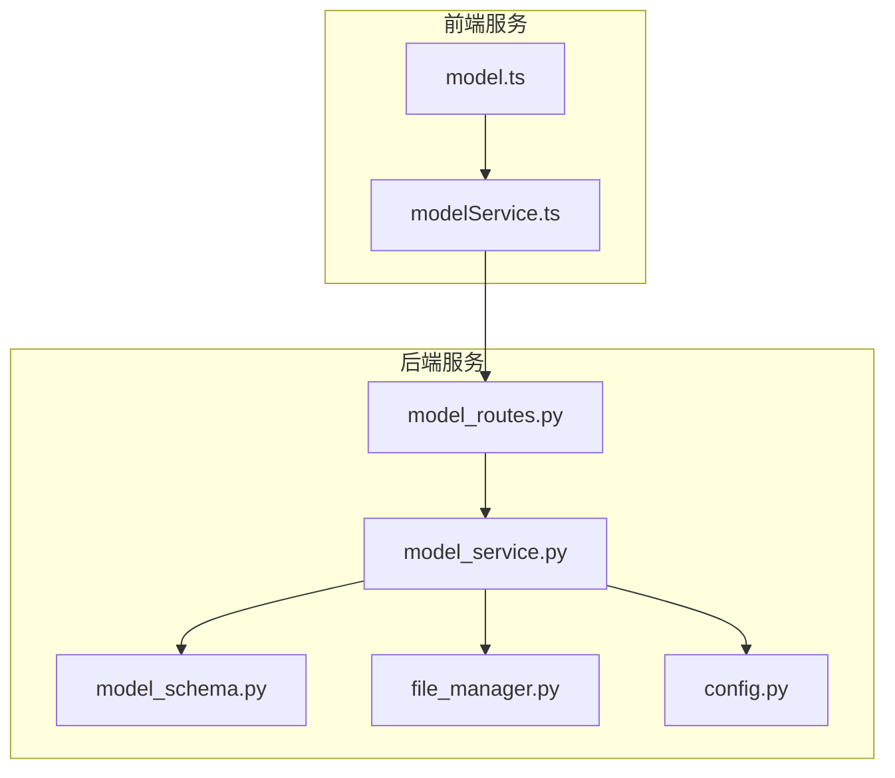
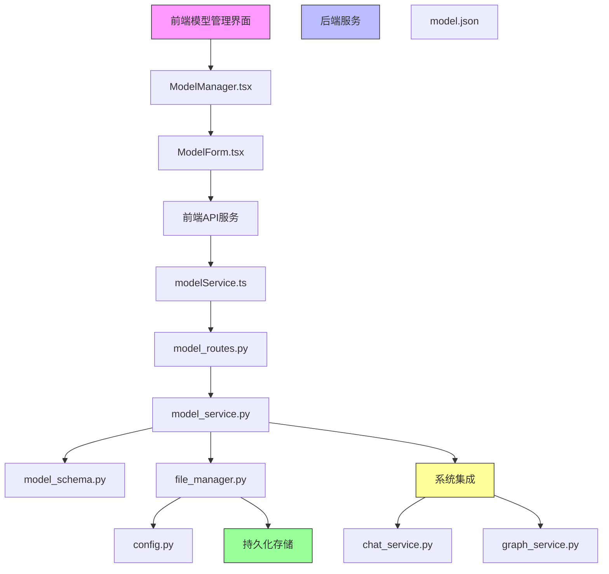
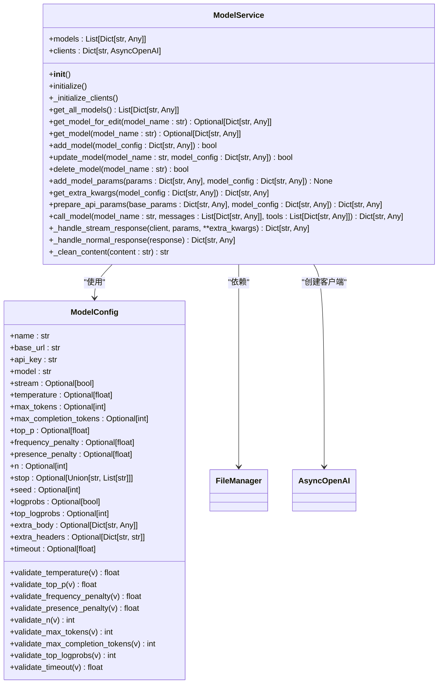
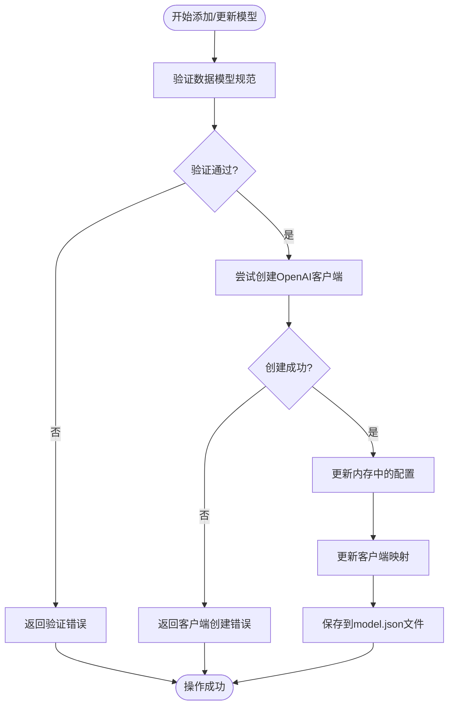
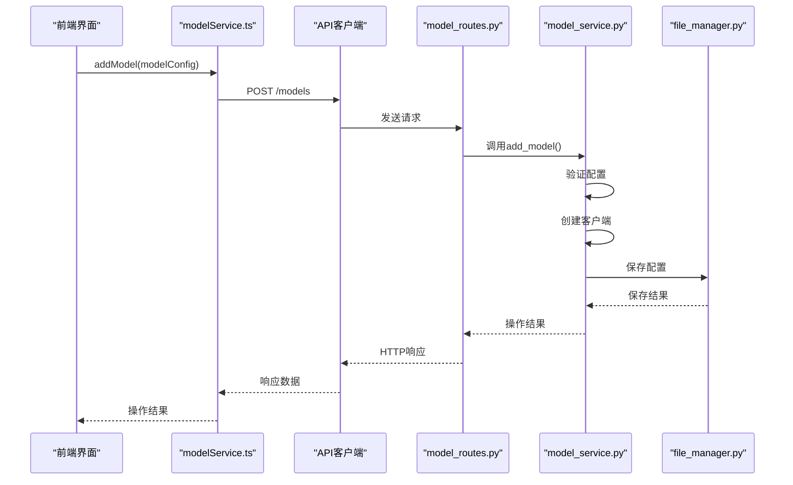
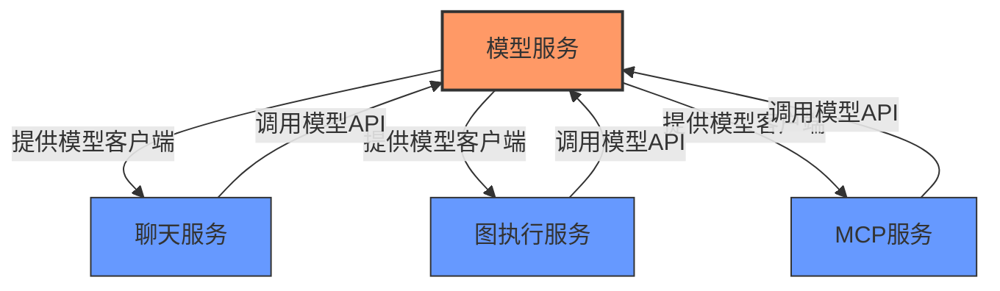
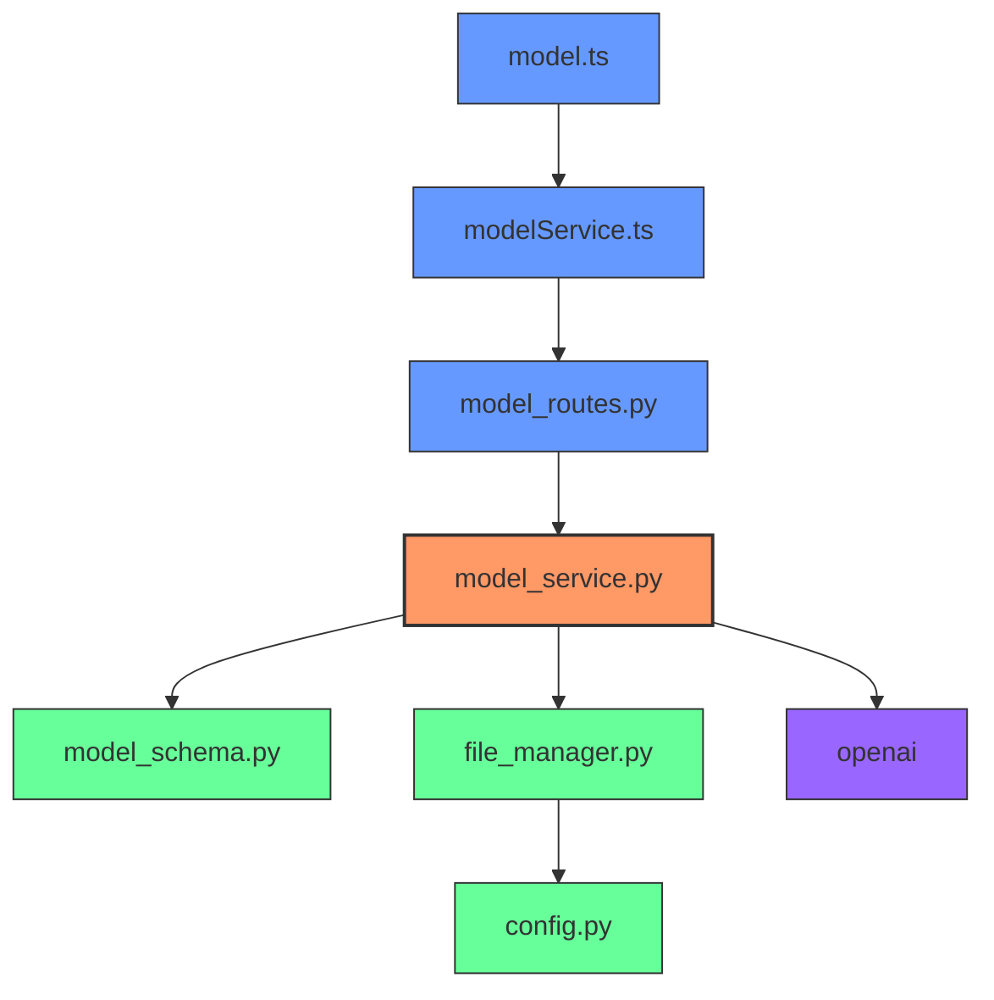

# 模型服务

<cite>
**本文档引用的文件**
- [model_service.py](file://mag/app/services/model_service.py)
- [model_schema.py](file://mag/app/models/model_schema.py)
- [model_routes.py](file://mag/app/api/model_routes.py)
- [file_manager.py](file://mag/app/core/file_manager.py)
- [config.py](file://mag/app/core/config.py)
- [chat_service.py](file://mag/app/services/chat_service.py)
- [graph_service.py](file://mag/app/services/graph_service.py)
- [modelService.ts](file://frontend/src/services/modelService.ts)
- [model.ts](file://frontend/src/types/model.ts)
</cite>

## 目录
1. [简介](#简介)
2. [项目结构](#项目结构)
3. [核心组件](#核心组件)
4. [架构概述](#架构概述)
5. [详细组件分析](#详细组件分析)
6. [依赖分析](#依赖分析)
7. [性能考虑](#性能考虑)
8. [故障排除指南](#故障排除指南)
9. [结论](#结论)

## 简介
本模型服务文档详细阐述了`model_service.py`如何管理AI模型的配置、验证和访问。该服务为系统中的AI模型提供了一套完整的增删改查（CRUD）接口，确保模型配置的全局一致性。服务通过与前端模型管理界面的交互，实现了模型配置的可视化管理，并对模型配置进行严格的有效性校验，包括API密钥、基础URL、模型名称等关键参数。同时，模型服务与系统中的其他核心服务（如图执行服务、聊天服务）紧密集成，为整个系统提供统一的模型访问接口。通过结合`model_schema.py`中定义的数据结构和验证规则，确保了模型配置的规范性和安全性。

## 项目结构

**图源**
- [model_service.py](file://mag/app/services/model_service.py)
- [model_schema.py](file://mag/app/models/model_schema.py)
- [model_routes.py](file://mag/app/api/model_routes.py)
- [file_manager.py](file://mag/app/core/file_manager.py)
- [config.py](file://mag/app/core/config.py)
- [modelService.ts](file://frontend/src/services/modelService.ts)
- [model.ts](file://frontend/src/types/model.ts)

**节源**
- [model_service.py](file://mag/app/services/model_service.py)
- [model_schema.py](file://mag/app/models/model_schema.py)
- [model_routes.py](file://mag/app/api/model_routes.py)
- [file_manager.py](file://mag/app/core/file_manager.py)
- [config.py](file://mag/app/core/config.py)
- [modelService.ts](file://frontend/src/services/modelService.ts)
- [model.ts](file://frontend/src/types/model.ts)

## 核心组件

模型服务的核心组件包括模型配置管理、客户端初始化、配置验证和API调用处理。`ModelService`类负责管理所有模型的配置和异步客户端实例，通过`FileManager`类实现配置的持久化存储。`ModelConfig`数据模型定义了所有支持的OpenAI API参数及其验证规则，确保配置的合法性。API路由层将前端请求映射到服务方法，实现RESTful接口。前端服务通过`modelService.ts`与后端进行通信，提供类型安全的API调用接口。

**节源**
- [model_service.py](file://mag/app/services/model_service.py#L1-L400)
- [model_schema.py](file://mag/app/models/model_schema.py#L1-L88)
- [model_routes.py](file://mag/app/api/model_routes.py#L1-L152)
- [modelService.ts](file://frontend/src/services/modelService.ts#L1-L30)

## 架构概述

**图源**
- [model_service.py](file://mag/app/services/model_service.py)
- [model_schema.py](file://mag/app/models/model_schema.py)
- [model_routes.py](file://mag/app/api/model_routes.py)
- [file_manager.py](file://mag/app/core/file_manager.py)
- [config.py](file://mag/app/core/config.py)
- [chat_service.py](file://mag/app/services/chat_service.py)
- [graph_service.py](file://mag/app/services/graph_service.py)

## 详细组件分析

### 模型服务分析

`ModelService`类是模型管理的核心，负责模型配置的生命周期管理。服务在初始化时从文件系统加载模型配置，并为每个模型创建异步OpenAI客户端实例。服务提供了完整的CRUD操作接口，包括添加、更新、删除和查询模型。所有操作都包含严格的验证逻辑，确保配置的有效性。当添加或更新模型时，服务会尝试使用提供的API密钥和基础URL创建客户端实例，以验证配置的正确性。模型配置通过`FileManager`类持久化存储到`model.json`文件中，确保配置在服务重启后仍然存在。

#### 类图

**图源**
- [model_service.py](file://mag/app/services/model_service.py#L1-L400)
- [model_schema.py](file://mag/app/models/model_schema.py#L1-L88)

### 模型配置验证分析

模型配置的验证是确保系统稳定运行的关键环节。`ModelConfig`类使用Pydantic库定义了完整的数据模型和验证规则。所有必填字段（如名称、基础URL、API密钥、模型标识符）都标记为必需，而可选参数则使用`Optional`类型。每个数值参数都有明确的取值范围验证，例如温度参数必须在0.0到2.0之间，top_p参数必须在0.0到1.0之间。这些验证规则在模型配置被创建或更新时自动执行，防止无效配置进入系统。此外，服务层在添加或更新模型时还会进行额外的运行时验证，通过尝试创建OpenAI客户端实例来确认API密钥和基础URL的有效性。

#### 验证流程图

**图源**
- [model_service.py](file://mag/app/services/model_service.py#L1-L400)
- [model_schema.py](file://mag/app/models/model_schema.py#L1-L88)

### 前后端交互分析

模型服务的前后端交互通过RESTful API实现，提供了清晰的接口契约。前端通过`modelService.ts`中的服务方法与后端通信，这些方法封装了HTTP请求的细节，为前端组件提供简洁的调用接口。后端的`model_routes.py`文件定义了所有模型管理相关的API端点，包括获取模型列表、获取特定模型、添加模型、更新模型和删除模型。每个API端点都使用类型注解明确指定了请求和响应的数据结构，确保了接口的类型安全。前端的`model.ts`文件定义了与后端`ModelConfig`类对应的TypeScript接口，实现了前后端数据结构的一致性。

#### 交互序列图

**图源**
- [model_service.py](file://mag/app/services/model_service.py#L1-L400)
- [model_routes.py](file://mag/app/api/model_routes.py#L1-L152)
- [modelService.ts](file://frontend/src/services/modelService.ts#L1-L30)
- [file_manager.py](file://mag/app/core/file_manager.py#L1-L720)

### 系统集成分析

模型服务作为系统的核心组件，与多个其他服务紧密集成，确保模型配置的全局一致性。聊天服务（`chat_service.py`）在执行对话时依赖模型服务获取模型配置和客户端实例，实现流式API调用。图执行服务（`graph_service.py`）在执行AI图时也需要调用模型服务来处理节点中的模型调用。这种集成模式确保了整个系统使用统一的模型配置管理，避免了配置分散和不一致的问题。当模型配置发生变化时，所有依赖服务都能通过模型服务的接口获取最新的配置，保证了系统的一致性。

#### 集成架构图

**图源**
- [model_service.py](file://mag/app/services/model_service.py)
- [chat_service.py](file://mag/app/services/chat_service.py)
- [graph_service.py](file://mag/app/services/graph_service.py)
- [mcp_service.py](file://mag/app/services/mcp_service.py)

## 依赖分析

**图源**
- [model_service.py](file://mag/app/services/model_service.py)
- [model_schema.py](file://mag/app/models/model_schema.py)
- [file_manager.py](file://mag/app/core/file_manager.py)
- [config.py](file://mag/app/core/config.py)
- [model_routes.py](file://mag/app/api/model_routes.py)
- [modelService.ts](file://frontend/src/services/modelService.ts)
- [model.ts](file://frontend/src/types/model.ts)

## 性能考虑

模型服务在设计时考虑了性能优化，特别是在客户端管理和API调用处理方面。服务在初始化时为所有配置的模型创建并缓存异步客户端实例，避免了每次API调用时重复创建客户端的开销。这种预初始化和缓存策略显著提高了API调用的响应速度。对于流式响应，服务实现了高效的异步处理机制，能够实时处理和转发模型的流式输出，确保了良好的用户体验。此外，配置的持久化操作（读写`model.json`文件）经过优化，使用原子操作和适当的错误处理，确保了数据的一致性和可靠性。

## 故障排除指南

当遇到模型配置相关的问题时，可以按照以下步骤进行排查：

1. **检查API密钥有效性**：确保提供的API密钥是有效的，并且具有访问指定模型的权限。可以在OpenAI控制台或其他AI平台验证密钥。

2. **验证基础URL**：确认基础URL格式正确，且能够通过网络访问。可以使用curl或Postman等工具测试URL的连通性。

3. **检查模型名称**：确保模型名称与AI平台支持的模型标识符完全匹配，注意大小写和特殊字符。

4. **查看日志信息**：检查服务日志（通常在控制台输出或日志文件中），查找与模型初始化或API调用相关的错误信息。

5. **验证配置文件**：检查`model.json`文件的格式是否正确，确保没有语法错误或损坏。

6. **测试网络连接**：确保服务器能够访问AI平台的API端点，检查防火墙和网络策略设置。

7. **检查依赖服务**：如果问题出现在集成场景中，检查聊天服务或图执行服务的日志，确认问题是否源于上游调用。

**节源**
- [model_service.py](file://mag/app/services/model_service.py#L1-L400)
- [file_manager.py](file://mag/app/core/file_manager.py#L1-L720)

## 结论

模型服务为MAG系统提供了强大而灵活的AI模型管理能力。通过精心设计的架构和严格的验证机制，服务确保了模型配置的安全性和一致性。前后端的清晰分离和类型安全的接口设计，使得模型管理功能易于使用和维护。与系统其他服务的深度集成，确保了整个平台能够统一、高效地访问AI模型。未来可以通过引入配置缓存、连接池等优化技术，进一步提升服务的性能和可扩展性。