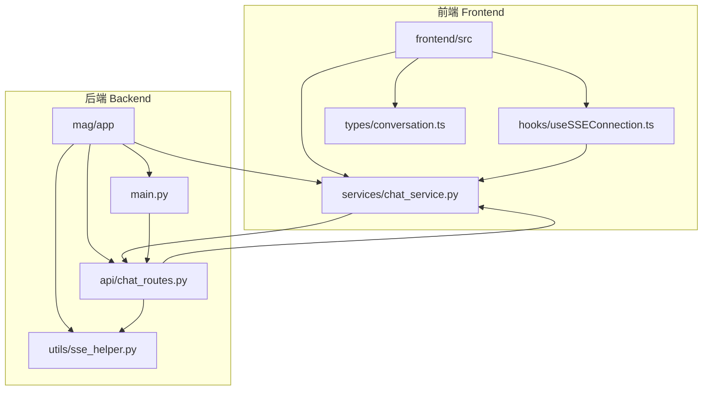
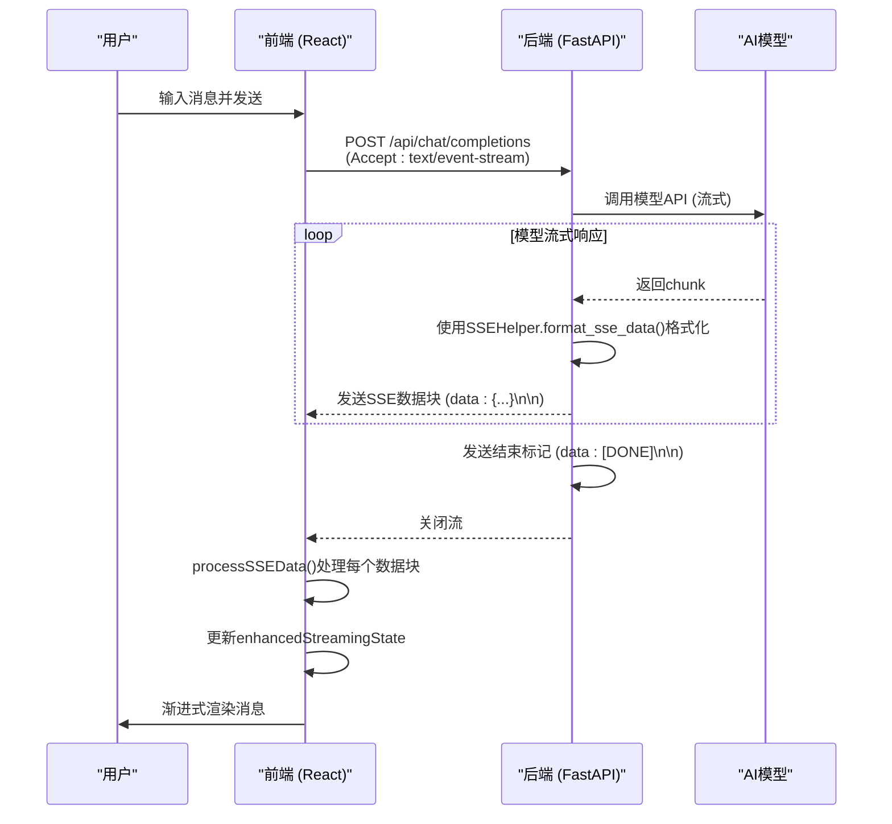
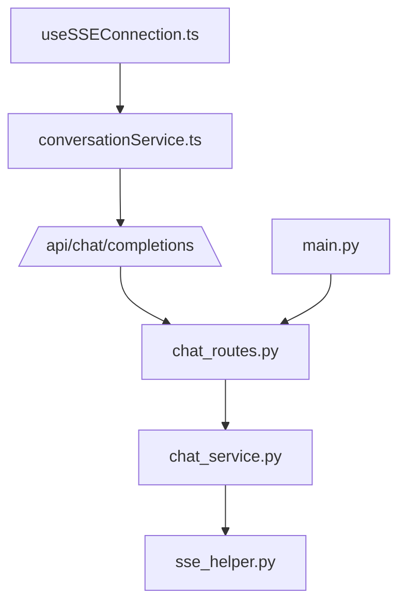

# SSE流式通信

<cite>
**本文档引用的文件**
- [sse_helper.py](file://mag/app/utils/sse_helper.py)
- [useSSEConnection.ts](file://frontend/src/hooks/useSSEConnection.ts)
- [conversationService.ts](file://frontend/src/services/conversationService.ts)
- [chat_routes.py](file://mag/app/api/chat_routes.py)
- [chat_service.py](file://mag/app/services/chat_service.py)
- [main.py](file://mag/main.py)
- [conversation.ts](file://frontend/src/types/conversation.ts)
</cite>

## 目录
1. [引言](#引言)
2. [项目结构](#项目结构)
3. [核心组件](#核心组件)
4. [架构概述](#架构概述)
5. [详细组件分析](#详细组件分析)
6. [依赖分析](#依赖分析)
7. [性能考虑](#性能考虑)
8. [故障排除指南](#故障排除指南)
9. [结论](#结论)

## 引言
本文档全面描述了基于SSE（Server-Sent Events）的实时消息推送机制，涵盖从后端`mag/app/utils/sse_helper.py`的消息编码与推送，到前端`frontend/src/hooks/useSSEConnection.ts`的连接管理、事件监听和错误重连策略。详细解释了如何通过`ReadableStreamDefaultReader`实现浏览器端的渐进式内容渲染，分析了HTTP长连接的生命周期管理、超时处理和跨域配置。提供了网络中断恢复、消息顺序保证和内存泄漏防范的最佳实践，并结合实际代码片段展示了前端`ConversationService.createChatSSE`的调用流程及异常捕获机制。

## 项目结构
本项目采用前后端分离的架构，前端位于`frontend`目录，后端服务位于`mag`目录。SSE相关的核心逻辑分布在后端的`mag/app/utils/sse_helper.py`和`mag/app/api/chat_routes.py`中，前端的SSE连接管理则由`frontend/src/hooks/useSSEConnection.ts`实现。



**Diagram sources**
- [main.py](file://mag/main.py#L44-L45)
- [chat_routes.py](file://mag/app/api/chat_routes.py#L10-L11)

**Section sources**
- [main.py](file://mag/main.py#L1-L120)
- [chat_routes.py](file://mag/app/api/chat_routes.py#L1-L450)

## 核心组件
系统的核心是SSE消息的生成、传输和消费。后端的`SSEHelper`类负责将各种事件（如节点开始、工具调用、错误）格式化为标准的SSE数据块。`chat_completions_stream`函数作为生成器，持续产生这些数据块。前端的`useSSEConnection` Hook则负责建立连接，通过`ReadableStreamDefaultReader`读取数据流，并根据消息类型更新应用状态。

**Section sources**
- [sse_helper.py](file://mag/app/utils/sse_helper.py#L1-L400)
- [useSSEConnection.ts](file://frontend/src/hooks/useSSEConnection.ts#L1-L523)
- [chat_service.py](file://mag/app/services/chat_service.py#L1-L447)

## 架构概述
整个SSE通信流程遵循典型的发布-订阅模式。当用户发起一个聊天请求时，前端调用`ConversationService.createChatSSE`，该方法向后端`/api/chat/completions`端点发起一个带有`Accept: text/event-stream`头的POST请求。后端的`chat_completions`路由接收到请求后，调用`chat_service.chat_completions_stream`，该方法返回一个异步生成器。FastAPI的`StreamingResponse`将这个生成器包装成一个持续的HTTP流。前端的`useSSEConnection` Hook通过`fetch` API获取这个流，并使用`ReadableStreamDefaultReader`逐块读取和处理数据。



**Diagram sources**
- [conversationService.ts](file://frontend/src/services/conversationService.ts#L100-L115)
- [chat_routes.py](file://mag/app/api/chat_routes.py#L15-L40)
- [chat_service.py](file://mag/app/services/chat_service.py#L25-L40)
- [useSSEConnection.ts](file://frontend/src/hooks/useSSEConnection.ts#L200-L250)

## 详细组件分析

### 后端SSE消息生成分析
后端的SSE消息生成由`SSEHelper`类和`chat_service`协同完成。`SSEHelper`提供了一系列静态方法，如`send_node_start`、`send_tool_message`等，用于创建符合特定事件类型的SSE数据块。`chat_service`中的`_execute_complete_flow`方法是核心，它在一个循环中处理模型的流式响应。每当从模型接收到一个`chunk`，它会立即使用`yield f"data: {json.dumps(chunk_dict)}\n\n"`将其转换为SSE格式并发送出去。对于工具调用的结果，它会先执行工具，然后使用`SSEHelper.send_tool_message`发送结果。整个流程确保了消息的实时性和顺序性。

```mermaid
flowchart TD
A[开始 _execute_complete_flow] --> B{迭代次数 < 最大值?}
B --> |是| C[调用模型API (流式)]
C --> D[读取模型chunk]
D --> E{chunk有内容?}
E --> |是| F[使用SSEHelper.format_sse_data格式化]
F --> G[通过yield发送SSE数据块]
G --> H{chunk有finish_reason?}
H --> |否| D
H --> |是| I{有tool_calls?}
I --> |否| J[发送[DONE]并结束]
I --> |是| K[执行工具调用]
K --> L[发送工具结果SSE消息]
L --> C
B --> |否| M[发送[DONE]并结束]
```

**Diagram sources**
- [sse_helper.py](file://mag/app/utils/sse_helper.py#L1-L400)
- [chat_service.py](file://mag/app/services/chat_service.py#L99-L200)

**Section sources**
- [sse_helper.py](file://mag/app/utils/sse_helper.py#L1-L400)
- [chat_service.py](file://mag/app/services/chat_service.py#L99-L447)

### 前端SSE连接管理分析
前端的SSE连接管理由`useSSEConnection` Hook实现。`startConnection`函数是入口，它首先调用`closeConnection`确保没有遗留连接，然后根据不同的模式（chat, agent, graph）调用`ConversationService`中相应的方法来获取一个`ReadableStreamDefaultReader`。`processSSEData`函数是关键，它负责解析从流中读取的每一行数据。它会检查数据是否为`[DONE]`以判断流的结束，然后解析JSON数据，并根据消息类型（如`node_start`、`choices`中的`delta`）更新`enhancedStreamingState`。这种分块（block）的设计允许前端实现渐进式渲染，例如，推理内容和普通内容可以并行显示。

```mermaid
flowchart TD
A[调用 startConnection] --> B[关闭旧连接]
B --> C[重置 streamingState]
C --> D[根据模式调用 createChatSSE 等]
D --> E[获取 ReadableStreamDefaultReader]
E --> F[创建 TextDecoder 和 buffer]
F --> G{reader.read()}
G --> H{done?}
H --> |否| I[解码数据并添加到 buffer]
I --> J[按行分割 buffer]
J --> K{处理每一行}
K --> L[调用 processSSEData]
L --> M{数据是 [DONE]?}
M --> |是| N[标记所有块为完成]
M --> |否| O[解析JSON]
O --> P{是错误消息?}
P --> |是| Q[更新 state.error]
P --> |否| R{是节点事件?}
R --> |是| S[创建 node_start 块]
R --> |否| T{是 delta 内容?}
T --> |是| U[创建或更新 content 块]
T --> |否| V{是工具调用?}
V --> |是| W[创建或更新 tool_calls 块]
V --> |否| X[其他处理]
X --> Y[更新 enhancedStreamingState]
Y --> G
H --> |是| Z[连接结束]
```

**Diagram sources**
- [useSSEConnection.ts](file://frontend/src/hooks/useSSEConnection.ts#L150-L300)
- [conversationService.ts](file://frontend/src/services/conversationService.ts#L100-L115)

**Section sources**
- [useSSEConnection.ts](file://frontend/src/hooks/useSSEConnection.ts#L1-L523)
- [conversationService.ts](file://frontend/src/services/conversationService.ts#L100-L115)

### HTTP长连接与跨域分析
HTTP长连接的生命周期由`StreamingResponse`和`ReadableStreamDefaultReader`共同管理。在后端，`StreamingResponse`保持连接打开，直到生成器完成并发送`[DONE]`。在前端，`reader.read()`会挂起直到有新数据或连接关闭。`AbortController`用于主动取消连接，`closeConnection`函数会调用`abortController.abort()`和`reader.cancel()`来优雅地关闭连接。跨域配置在`main.py`中通过`CORSMiddleware`实现，`allow_origins=["*"]`允许所有来源的请求，这对于本地开发很方便，但在生产环境中应限制为特定的前端域名。

**Section sources**
- [main.py](file://mag/main.py#L50-L55)
- [useSSEConnection.ts](file://frontend/src/hooks/useSSEConnection.ts#L100-L150)

## 依赖分析
系统各组件间的依赖关系清晰。前端`useSSEConnection`依赖`conversationService`来发起SSE请求。`conversationService`直接通过`fetch` API调用后端的`/api/chat/completions`等端点。后端的`chat_routes`依赖`chat_service`来处理业务逻辑，而`chat_service`又依赖`SSEHelper`来格式化消息。`main.py`作为应用入口，通过`app.include_router`将`chat_routes`注册到应用中，形成了完整的调用链。



**Diagram sources**
- [useSSEConnection.ts](file://frontend/src/hooks/useSSEConnection.ts#L200-L250)
- [conversationService.ts](file://frontend/src/services/conversationService.ts#L100-L115)
- [chat_routes.py](file://mag/app/api/chat_routes.py#L15-L40)
- [chat_service.py](file://mag/app/services/chat_service.py#L25-L40)
- [main.py](file://mag/main.py#L44-L45)

**Section sources**
- [useSSEConnection.ts](file://frontend/src/hooks/useSSEConnection.ts#L1-L523)
- [conversationService.ts](file://frontend/src/services/conversationService.ts#L1-L255)
- [chat_routes.py](file://mag/app/api/chat_routes.py#L1-L450)
- [chat_service.py](file://mag/app/services/chat_service.py#L1-L447)
- [main.py](file://mag/main.py#L1-L120)

## 性能考虑
为了保证SSE流的性能，后端采用了异步生成器（`AsyncGenerator`），避免了在内存中累积所有响应再发送。前端使用`ReadableStreamDefaultReader`进行流式处理，可以立即开始渲染接收到的数据，而不是等待整个响应完成。`TextDecoder`的`stream: true`选项确保了多字节字符（如中文）在分割时不会被破坏。此外，`chat_service`中的`max_iterations`限制了最大循环次数，防止了无限循环导致的资源耗尽。

## 故障排除指南
常见的SSE问题包括连接失败、消息解析错误和连接中断。前端`useSSEConnection`通过`try-catch`捕获`fetch`和`reader.read()`中的错误，并通过`onError`回调通知上层组件。后端`chat_completions`路由也捕获异常，并发送一个包含错误信息的SSE数据块，确保错误能被前端感知。对于网络中断，前端的`startConnection`函数可以被再次调用以重新建立连接。内存泄漏方面，`useEffect`中的清理函数和`closeConnection`方法确保了在组件卸载或连接关闭时，`AbortController`和`reader`被正确释放。

**Section sources**
- [useSSEConnection.ts](file://frontend/src/hooks/useSSEConnection.ts#L250-L300)
- [chat_routes.py](file://mag/app/api/chat_routes.py#L20-L40)

## 结论
本文档详细阐述了MAG系统中基于SSE的实时通信机制。该设计实现了高效、低延迟的消息推送，支持复杂的流式交互场景。通过后端`SSEHelper`的标准化消息格式和前端`useSSEConnection`的精细化状态管理，系统能够提供流畅的用户体验。最佳实践包括使用异步流避免阻塞、合理管理连接生命周期、以及通过分块设计实现渐进式渲染。这套机制为构建实时AI应用提供了坚实的基础。