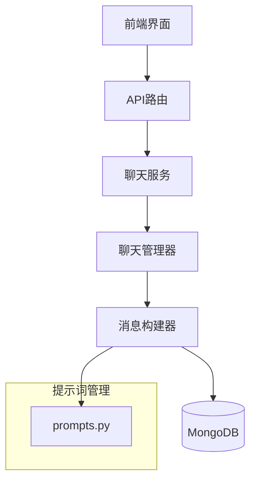
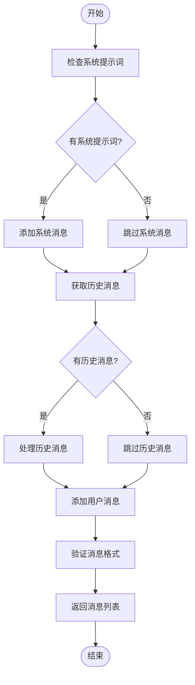
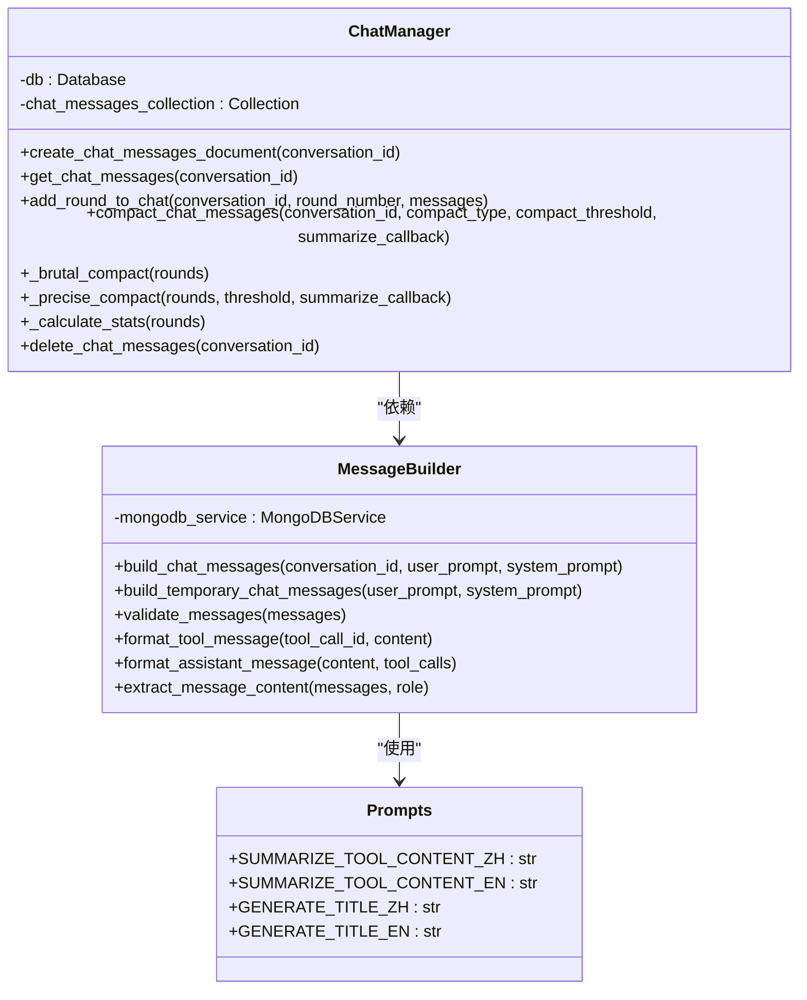
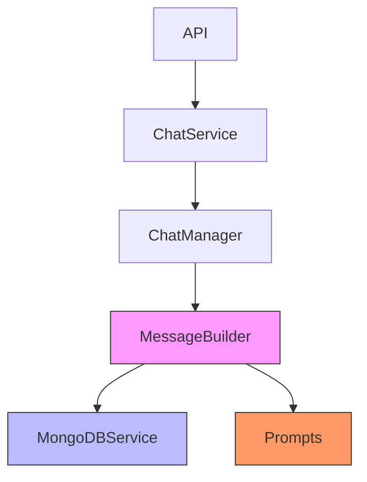

# 消息构建器

<cite>
**本文档引用的文件**
- [message_builder.py](file://mag/app/services/chat/message_builder.py)
- [prompts.py](file://mag/app/services/chat/prompts.py)
- [chat_manager.py](file://mag/app/services/docdb/chat_manager.py)
</cite>

## 目录
1. [简介](#简介)
2. [核心组件](#核心组件)
3. [架构概述](#架构概述)
4. [详细组件分析](#详细组件分析)
5. [依赖分析](#依赖分析)
6. [性能考虑](#性能考虑)
7. [故障排除指南](#故障排除指南)
8. [结论](#结论)

## 简介
消息构建器是系统中负责构建和管理聊天消息上下文的核心组件。它根据对话上下文、用户输入和AI模型要求，构建结构化的消息序列。该组件与预定义提示词模板集成，支持系统提示词注入、上下文压缩和多轮对话管理。消息构建器还实现了防止提示词注入攻击的安全机制，并通过压缩策略优化长对话的性能表现。

## 核心组件

消息构建器（MessageBuilder）是处理消息构建和格式化的主要类。它负责从数据库获取历史消息、添加系统提示词、验证消息格式以及构建临时对话消息。该组件通过MongoDB服务与数据库交互，获取完整的对话历史记录，并将其与当前用户输入结合，形成完整的上下文消息序列。

**Section sources**
- [message_builder.py](file://mag/app/services/chat/message_builder.py#L1-L116)

## 架构概述

消息构建器与其他组件协同工作，形成完整的消息处理流程。前端发起请求后，API路由处理压缩指令，调用聊天服务，最终由聊天管理器执行具体的压缩逻辑。消息构建器在此流程中负责提供格式化的消息数据。

**Diagram sources**
- [message_builder.py](file://mag/app/services/chat/message_builder.py#L1-L116)
- [chat_manager.py](file://mag/app/services/docdb/chat_manager.py#L1-L302)
- [prompts.py](file://mag/app/services/chat/prompts.py#L1-L80)

## 详细组件分析

### 消息构建器分析

消息构建器实现了多种消息处理功能，包括构建完整聊天消息、构建临时聊天消息、验证消息格式、格式化工具消息和助手消息等。其主要功能通过异步方法实现，确保在处理数据库操作时不会阻塞主线程。

#### 消息构建流程

**Diagram sources**
- [message_builder.py](file://mag/app/services/chat/message_builder.py#L35-L116)

### 上下文压缩策略

系统实现了两种对话压缩策略：暴力压缩和精确压缩。暴力压缩保留每轮对话中的系统提示词、用户消息和最后一个助手回复，而精确压缩则对超过阈值的工具消息内容进行智能总结。

#### 压缩策略对比
| 策略类型 | 描述 | 适用场景 |
|--------|------|--------|
| **暴力压缩** | 每轮只保留system + user + 最后一个assistant消息 | 需要大幅减少对话长度，仅保留核心交互 |
| **精确压缩** | 对长工具内容进行AI智能总结，保留完整对话结构 | 需要保持对话完整性，同时减少冗余内容 |

**Section sources**
- [chat_manager.py](file://mag/app/services/docdb/chat_manager.py#L185-L218)
- [chat_manager.py](file://mag/app/services/docdb/chat_manager.py#L218-L260)

### 提示词模板集成

消息构建器与prompts.py中的预定义模板紧密集成，使用专门的提示词进行内容总结和标题生成。这些模板支持中英文双语，并可根据语言参数动态选择。

#### 提示词注入逻辑

**Diagram sources**
- [prompts.py](file://mag/app/services/chat/prompts.py#L1-L80)
- [message_builder.py](file://mag/app/services/chat/message_builder.py#L1-L116)
- [chat_manager.py](file://mag/app/services/docdb/chat_manager.py#L1-L302)

## 依赖分析

消息构建器依赖于MongoDB服务来获取对话历史记录，同时与聊天管理器协同工作以实现完整的消息管理功能。系统通过回调函数机制实现模块间的松耦合，特别是在精确压缩过程中，总结回调函数的注入使得消息构建器可以灵活地使用不同的AI模型进行内容总结。

**Diagram sources**
- [message_builder.py](file://mag/app/services/chat/message_builder.py#L1-L116)
- [chat_manager.py](file://mag/app/services/docdb/chat_manager.py#L1-L302)

## 性能考虑

系统通过多种机制优化消息处理性能。首先，实现了对话压缩功能，可以显著减少长对话的存储空间和传输开销。其次，通过异步数据库操作避免阻塞主线程。此外，系统还提供了缓存机制的可能性，尽管在当前代码中未直接实现，但其架构设计为未来添加缓存层提供了便利。

消息分块和流式传输前处理通过前端的SSE（Server-Sent Events）连接管理器实现，该组件能够处理不同类型的流式数据块，包括推理内容、普通内容和工具调用，确保客户端能够实时接收和显示AI的响应。

**Section sources**
- [chat_manager.py](file://mag/app/services/docdb/chat_manager.py#L127-L156)
- [message_builder.py](file://mag/app/services/chat/message_builder.py#L1-L116)

## 故障排除指南

当消息构建或压缩功能出现问题时，可以参考以下常见问题及解决方案：

1. **历史消息获取失败**：检查MongoDB服务是否正常运行，确认对话ID是否存在。
2. **压缩功能无响应**：确认前端是否正确传递了模型名称、压缩类型和阈值参数。
3. **提示词注入攻击防护**：系统通过验证消息格式和内容类型来防止恶意输入，确保所有消息都符合预期结构。
4. **总结回调失败**：在精确压缩过程中，如果总结回调函数执行失败，系统会自动截断内容并添加失败标记，确保压缩过程不会中断。

**Section sources**
- [message_builder.py](file://mag/app/services/chat/message_builder.py#L50-L60)
- [chat_manager.py](file://mag/app/services/docdb/chat_manager.py#L240-L260)

## 结论

消息构建器是整个对话系统的核心组件，它不仅负责构建结构化的消息序列，还通过与提示词模板的集成实现了智能内容处理。其设计充分考虑了性能优化和安全性，通过两种压缩策略平衡了对话完整性和系统效率。未来的优化方向可以包括引入缓存机制、增强错误恢复能力以及支持更多类型的提示词模板。