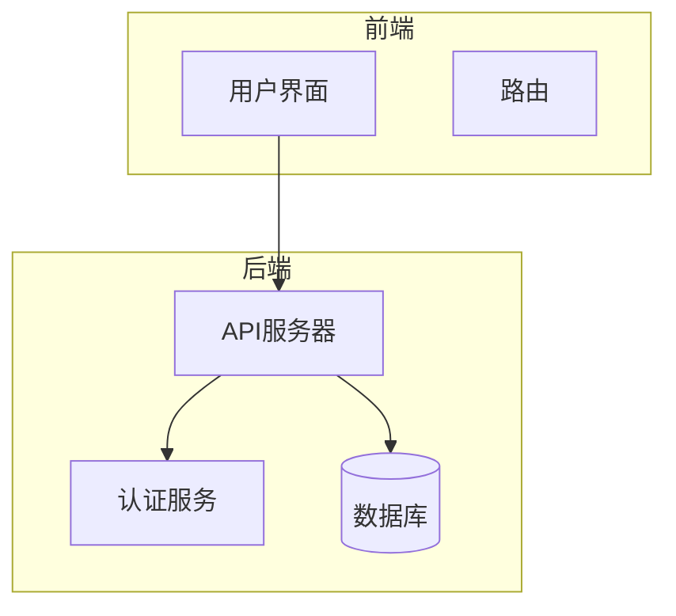
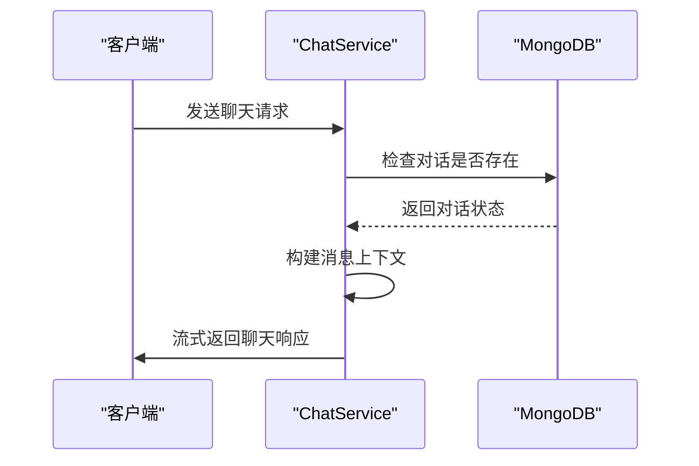
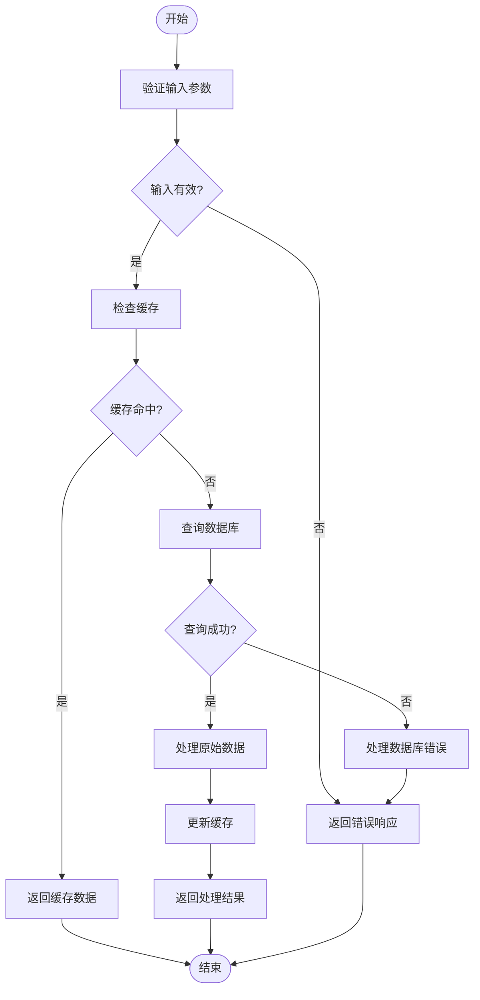
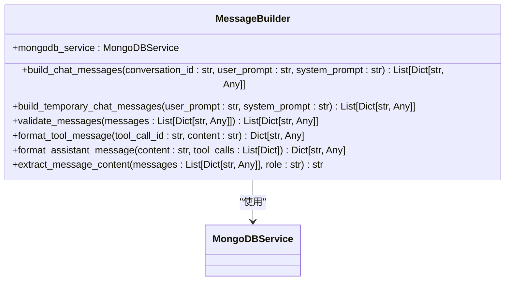
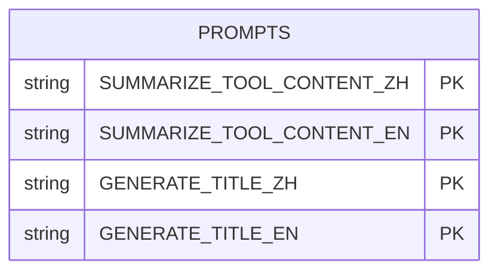
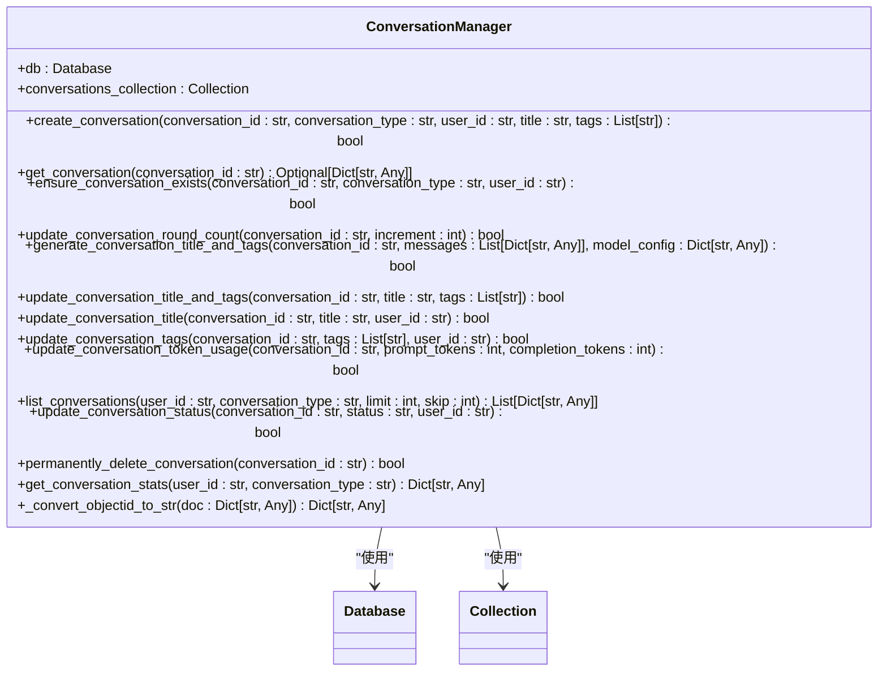
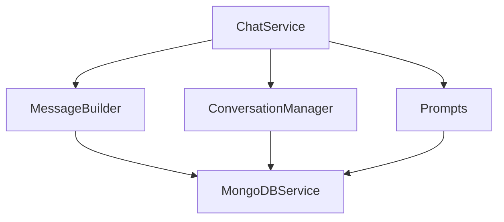

# 聊天服务

<cite>
**本文档引用的文件**
- [chat_service.py](file://mag/app/services/chat_service.py)
- [message_builder.py](file://mag/app/services/chat/message_builder.py)
- [prompts.py](file://mag/app/services/chat/prompts.py)
- [conversation_manager.py](file://mag/app/services/docdb/conversation_manager.py)
- [chat_routes.py](file://mag/app/api/chat_routes.py)
- [chat_schema.py](file://mag/app/models/chat_schema.py)
</cite>

## 目录
1. [简介](#简介)
2. [项目结构](#项目结构)
3. [核心组件](#核心组件)
4. [架构概述](#架构概述)
5. [详细组件分析](#详细组件分析)
6. [依赖分析](#依赖分析)
7. [性能考虑](#性能考虑)
8. [故障排除指南](#故障排除指南)
9. [结论](#结论)

## 简介
本文档全面阐述了聊天服务的核心功能，包括对话的创建、消息流管理、与图系统的协同工作、结构化消息的构建、预定义提示词模板的设计意图、对话持久化机制、SSE推送机制以及常见问题的处理方式。

## 项目结构
聊天服务的项目结构清晰，主要分为以下几个部分：
- `app/api`：包含聊天相关的API路由。
- `app/services/chat`：包含聊天服务的核心逻辑，如消息构建和提示词管理。
- `app/services/docdb`：包含对话管理器等数据库操作类。
- `app/models`：包含聊天相关的数据模型。

**Section sources**
- [chat_service.py](file://mag/app/services/chat_service.py)
- [message_builder.py](file://mag/app/services/chat/message_builder.py)
- [prompts.py](file://mag/app/services/chat/prompts.py)
- [conversation_manager.py](file://mag/app/services/docdb/conversation_manager.py)

## 核心组件
聊天服务的核心组件包括`ChatService`、`MessageBuilder`、`Prompts`和`ConversationManager`。这些组件协同工作，实现了聊天服务的各项功能。

**Section sources**
- [chat_service.py](file://mag/app/services/chat_service.py#L1-L446)
- [message_builder.py](file://mag/app/services/chat/message_builder.py#L1-L116)
- [prompts.py](file://mag/app/services/chat/prompts.py#L1-L80)
- [conversation_manager.py](file://mag/app/services/docdb/conversation_manager.py#L1-L437)

## 架构概述
聊天服务的架构设计遵循了模块化和分层的原则，确保了系统的可维护性和扩展性。`ChatService`作为核心服务，负责协调其他组件完成聊天任务。

**Diagram sources**
- [chat_service.py](file://mag/app/services/chat_service.py#L1-L446)
- [chat_routes.py](file://mag/app/api/chat_routes.py#L1-L449)

## 详细组件分析

### ChatService 分析
`ChatService`是聊天服务的核心，负责处理聊天的创建、消息流管理和与图系统的协同。

#### 对话创建与消息流管理
`ChatService`通过`chat_completions_stream`方法处理聊天的创建和消息流管理。该方法支持流式和非流式响应，并能够处理临时对话。

**Diagram sources**
- [chat_service.py](file://mag/app/services/chat_service.py#L1-L446)
- [chat_routes.py](file://mag/app/api/chat_routes.py#L1-L449)

#### 与图系统的协同
`ChatService`通过`_execute_complete_flow`方法与图系统协同工作，执行完整的聊天流程，包括模型调用、工具执行和消息保存。

**Diagram sources**
- [chat_service.py](file://mag/app/services/chat_service.py#L1-L446)
- [mongodb_service.py](file://mag/app/services/mongodb_service.py#L1-L420)

### MessageBuilder 分析
`MessageBuilder`负责构建结构化消息，包括系统提示、用户输入和AI响应的组装逻辑。

#### 消息构建逻辑
`MessageBuilder`通过`build_chat_messages`方法构建聊天消息上下文，支持系统提示词、历史消息和当前用户消息的组装。

**Diagram sources**
- [message_builder.py](file://mag/app/services/chat/message_builder.py#L1-L116)
- [mongodb_service.py](file://mag/app/services/mongodb_service.py#L1-L420)

### Prompts 分析
`Prompts`模块包含预定义的提示词模板，用于各种聊天场景。

#### 提示词模板设计
`Prompts`模块提供了中英文提示词模板，用于工具内容的智能压缩和对话标题的生成。

**Diagram sources**
- [prompts.py](file://mag/app/services/chat/prompts.py#L1-L80)

### ConversationManager 分析
`ConversationManager`负责对话的持久化管理，包括对话的创建、更新和删除。

#### 对话持久化
`ConversationManager`通过`create_conversation`、`update_conversation_title`和`delete_conversation`等方法实现对话的持久化。

**Diagram sources**
- [conversation_manager.py](file://mag/app/services/docdb/conversation_manager.py#L1-L437)
- [mongodb_service.py](file://mag/app/services/mongodb_service.py#L1-L420)

## 依赖分析
聊天服务的各个组件之间存在紧密的依赖关系，`ChatService`依赖于`MessageBuilder`、`Prompts`和`ConversationManager`，而这些组件又依赖于`MongoDBService`。

**Diagram sources**
- [chat_service.py](file://mag/app/services/chat_service.py#L1-L446)
- [message_builder.py](file://mag/app/services/chat/message_builder.py#L1-L116)
- [prompts.py](file://mag/app/services/chat/prompts.py#L1-L80)
- [conversation_manager.py](file://mag/app/services/docdb/conversation_manager.py#L1-L437)
- [mongodb_service.py](file://mag/app/services/mongodb_service.py#L1-L420)

## 性能考虑
聊天服务在设计时充分考虑了性能问题，通过流式响应、缓存机制和数据库索引优化了系统的响应速度和资源利用率。

**Section sources**
- [chat_service.py](file://mag/app/services/chat_service.py#L1-L446)
- [mongodb_service.py](file://mag/app/services/mongodb_service.py#L1-L420)

## 故障排除指南
### 消息解析失败
当消息解析失败时，系统会记录错误日志并返回错误信息。可以通过检查日志文件来定位问题。

### 上下文截断
当上下文过长时，系统会自动截断内容。可以通过调整`compact_threshold`参数来控制截断长度。

### 对话历史分页加载
对话历史支持分页加载，通过`list_conversations`方法的`limit`和`skip`参数实现。

### 过期清理策略
系统定期清理过期的对话，通过`permanently_delete_conversation`方法实现。

**Section sources**
- [chat_service.py](file://mag/app/services/chat_service.py#L1-L446)
- [conversation_manager.py](file://mag/app/services/docdb/conversation_manager.py#L1-L437)

## 结论
本文档详细阐述了聊天服务的各个组件及其协同工作方式，为开发者提供了全面的技术参考。通过合理的架构设计和性能优化，聊天服务能够高效地处理各种聊天场景。