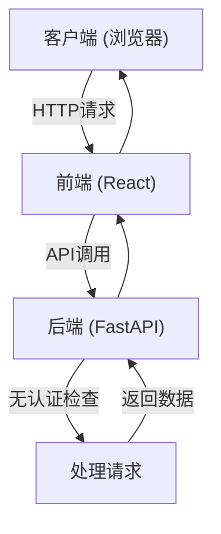
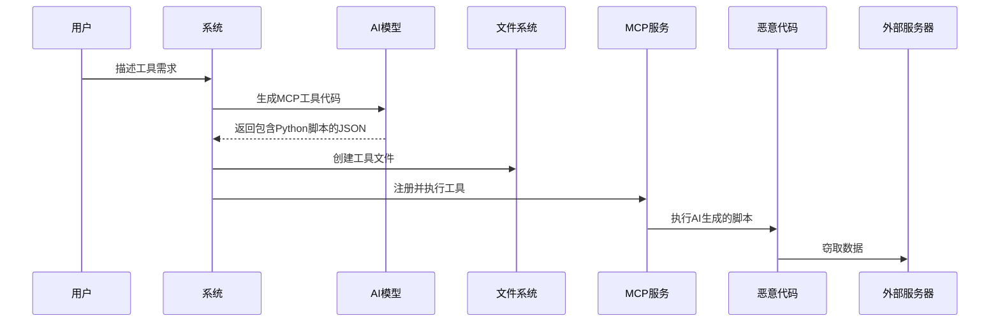

# 安全考虑

<cite>
**本文档中引用的文件**  
- [SECURITY.md](file://SECURITY.md)
- [config.py](file://mag/app/core/config.py)
- [main.py](file://mag/main.py)
- [mcp_client.py](file://mag/mcp_client.py)
- [mcp_routes.py](file://mag/app/api/mcp_routes.py)
- [ai_mcp_generator.py](file://mag/app/services/mcp/ai_mcp_generator.py)
- [systemService.ts](file://frontend/src/services/systemService.ts)
- [MainLayout.tsx](file://frontend/src/layouts/MainLayout.tsx)
- [requirements.txt](file://requirements.txt)
</cite>

## 目录
1. [安全披露政策](#安全披露政策)
2. [认证与授权机制](#认证与授权机制)
3. [配置安全](#配置安全)
4. [MCP工具执行风险](#mcp工具执行风险)
5. [依赖与运行时安全](#依赖与运行时安全)
6. [安全加固建议](#安全加固建议)

## 安全披露政策

本项目遵循负责任的漏洞披露流程，以确保安全问题能够被及时、安全地处理。

### 漏洞报告流程

根据 `SECURITY.md` 文件，报告安全漏洞的正确流程如下：

1. **禁止公开披露**：请勿通过创建 GitHub issue 的方式公开披露安全漏洞。
2. **直接邮件报告**：将漏洞详情发送至 [cloudstarai@163.com](mailto:cloudstarai@163.com)。邮件应包含：
   - 漏洞详细描述
   - 可复现的步骤
   - 潜在影响范围
   - 建议的修复方案（如有）
3. **响应时间线**：
   - 我们将在 48 小时内确认收到您的报告。
   - 我们将在 7 天内提供详细回复，包括评估结果和后续步骤。
   - 我们将持续向您通报问题处理的进展。
4. **披露流程**：
   - 漏洞确认并修复后，我们将与您协商合适的公开披露时间。
   - 我们将在安全公告中致谢您的贡献，除非您希望匿名。

**Section sources**
- [SECURITY.md](file://SECURITY.md#L1-L43)

## 认证与授权机制

### 当前认证状态

经过对代码库的全面分析，当前版本的 `mcp-agent-graph-p` **未实现内置的用户认证和授权机制**。

- **API端点**：所有后端API路由（如 `/chat`, `/mcp`, `/graph`）均未设置身份验证中间件。
- **前端界面**：前端应用（React）在加载时不会进行任何登录或身份验证检查。
- **系统操作**：关键系统操作（如 `/system/shutdown`）可通过前端界面直接调用，无需任何凭证。



**Diagram sources**
- [routes.py](file://mag/app/api/routes.py#L1-L21)
- [systemService.ts](file://frontend/src/services/systemService.ts#L1-L11)
- [MainLayout.tsx](file://frontend/src/layouts/MainLayout.tsx#L1-L47)

### 生产环境安全建议

由于缺乏内置认证，**强烈建议在生产环境中部署反向代理**，以提供必要的安全层。

**推荐方案：Nginx + 基本身份验证**

```nginx
server {
    listen 80;
    server_name your-mag-domain.com;

    # 添加基本身份验证
    auth_basic "Restricted Access";
    auth_basic_user_file /etc/nginx/.htpasswd;

    location / {
        proxy_pass http://localhost:9999;
        proxy_set_header Host $host;
        proxy_set_header X-Real-IP $remote_addr;
        proxy_set_header X-Forwarded-For $proxy_add_x_forwarded_for;
        proxy_set_header X-Forwarded-Proto $scheme;
    }
}
```

此方案可以有效防止未授权访问，并为系统提供第一道安全防线。

**Section sources**
- [main.py](file://mag/main.py#L86-L119)

## 配置安全

### 敏感信息保护

`config.py` 文件中的 `Settings` 类负责管理应用配置，其中包含对敏感信息的处理。

#### 数据库凭证

代码中直接从环境变量读取MongoDB的用户名和密码：

```python
MONGODB_URL: str = os.getenv(
    "MONGODB_URL",
    f"mongodb://{os.getenv('MONGO_ROOT_USERNAME', 'admin')}:"
    f"{os.getenv('MONGO_ROOT_PASSWORD', 'securepassword123')}@"
    f"localhost:{os.getenv('MONGO_PORT', '27017')}/"
)
```

**安全风险**：
- 如果环境变量未正确设置，将使用硬编码的默认值（如 `securepassword123`），这会带来严重的安全风险。
- 敏感信息（如密码）可能通过进程列表或日志泄露。

**Section sources**
- [config.py](file://mag/app/core/config.py#L1-L101)

### 安全最佳实践

1. **绝不使用默认凭证**：在生产环境中，必须通过 `.env` 文件或环境变量明确设置 `MONGO_ROOT_USERNAME` 和 `MONGO_ROOT_PASSWORD`。
2. **使用专用服务账户**：为MAG应用创建一个权限最小化的MongoDB用户，而非使用root账户。
3. **保护配置文件**：确保 `.env` 文件的文件权限为 `600`，仅允许所有者读写。

```bash
# 设置安全的文件权限
chmod 600 docker/mongo/.env
chown your-user:your-group docker/mongo/.env
```

## MCP工具执行风险

### AI生成工具的风险

`mcp-agent-graph-p` 的核心功能之一是通过AI生成MCP工具（`ai_mcp_generator.py`）。此功能带来了显著的便利性，但也引入了潜在的安全风险。

#### 代码注入风险

AI生成的MCP工具包含可执行的Python代码（`script_files`）。如果AI模型被误导或提示词被恶意构造，生成的代码可能包含恶意行为，例如：

- 读取服务器上的敏感文件
- 发起对外部系统的网络请求
- 执行系统命令



**Diagram sources**
- [ai_mcp_generator.py](file://mag/app/services/mcp/ai_mcp_generator.py#L478-L513)
- [mcp_routes.py](file://mag/app/api/mcp_routes.py#L534-L570)

### 安全沙箱建议

为了缓解代码注入风险，**强烈建议在安全沙箱环境中执行所有AI生成的MCP工具**。

**推荐的沙箱方案**：

1. **容器化隔离**：为每个MCP工具创建一个独立的Docker容器，限制其网络访问和文件系统权限。
2. **资源限制**：设置CPU、内存和执行时间限制，防止资源耗尽攻击。
3. **最小化依赖**：沙箱环境中只安装工具运行所必需的依赖，避免引入不必要的攻击面。
4. **代码审查**：在生产环境中部署前，对AI生成的代码进行人工审查。

**Section sources**
- [ai_mcp_generator.py](file://mag/app/services/mcp/ai_mcp_generator.py#L396-L422)
- [README.md](file://README.md#L128-L133)

## 依赖与运行时安全

### 依赖管理

`requirements.txt` 文件列出了项目的所有Python依赖。保持这些依赖的更新对于安全至关重要。

```txt
fastapi>=0.115.12
uvicorn>=0.34.2
langchain>=0.3.24
...
```

**安全风险**：
- 过时的依赖库可能包含已知的漏洞（如CVE）。
- 使用 `>=` 版本号可能导致意外升级到包含新漏洞的版本。

**Section sources**
- [requirements.txt](file://requirements.txt#L1-L14)

### 运行时安全

#### 服务绑定

后端服务在 `main.py` 中绑定到 `0.0.0.0`，这意味着它会监听所有网络接口。

```python
if __name__ == "__main__":
    uvicorn.run(
        "main:app",
        host="0.0.0.0",  # 绑定到所有接口
        port=9999,
        ...
    )
```

**安全建议**：
- 在生产环境中，应将服务绑定到 `127.0.0.1`，仅允许本地访问，并通过反向代理（如Nginx）对外提供服务。
- 使用防火墙规则限制对9999端口的访问。

**Section sources**
- [main.py](file://mag/main.py#L86-L119)

## 安全加固建议

综合以上分析，为确保 `mcp-agent-graph-p` 在生产环境中的安全，提出以下加固建议：

1. **实施反向代理认证**：使用Nginx或Caddy等反向代理服务器，强制实施基本身份验证或更高级的认证机制（如OAuth）。
2. **最小化权限运行**：以非root的专用用户身份运行MAG应用和数据库，遵循最小权限原则。
3. **定期更新依赖**：使用 `pip-audit` 或 `safety` 等工具定期扫描并更新依赖库，修复已知漏洞。
4. **启用安全沙箱**：对所有AI生成的MCP工具执行强制性的沙箱隔离，防止恶意代码危害主机系统。
5. **保护配置文件**：确保 `.env` 和 `config.py` 文件不被意外提交到版本控制系统，并设置严格的文件权限。
6. **监控与日志**：启用详细的日志记录，并监控异常活动（如频繁的 `/system/shutdown` 调用）。
7. **网络隔离**：将MAG服务部署在独立的网络区域，限制其对外部网络的访问，仅允许必要的出站连接。