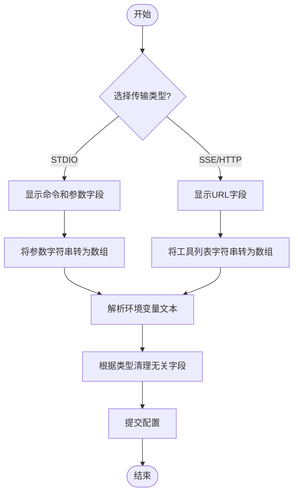

# MCP服务器数据模型

<cite>
**本文档引用的文件**  
- [MCPServerConfig](file://mag/app/models/mcp_schema.py#L3-L72)
- [MCPServerForm.tsx](file://frontend/src/components/mcp-manager/MCPServerForm.tsx#L0-L225)
- [mcp_manager.py](file://mag/app/services/docdb/mcp_manager.py#L0-L362)
- [file_manager.py](file://mag/app/core/file_manager.py#L0-L720)
- [mcp_schema.py](file://mag/app/models/mcp_schema.py#L3-L72)
</cite>

## 目录
1. [简介](#简介)
2. [项目结构](#项目结构)
3. [核心组件](#核心组件)
4. [架构概述](#架构概述)
5. [详细组件分析](#详细组件分析)
6. [依赖分析](#依赖分析)
7. [性能考虑](#性能考虑)
8. [故障排除指南](#故障排除指南)
9. [结论](#结论)

## 简介
本文档详细描述了MCP（Model Control Protocol）服务器配置（MCPServerConfig）的数据模型，涵盖其字段定义、数据类型、业务约束及其在系统中的作用。该模型用于注册和管理外部MCP工具服务，支持多种传输类型（如STDIO、SSE、流式HTTP），并提供灵活的配置选项，包括超时设置、环境变量注入和自动工具批准机制。通过前后端协同验证机制，确保配置的完整性和一致性。

## 项目结构
MCP服务器配置模型贯穿于前后端多个模块，主要分布在以下目录中：
- `mag/app/models/mcp_schema.py`：定义MCPServerConfig数据模型
- `frontend/src/components/mcp-manager/MCPServerForm.tsx`：前端配置表单组件
- `mag/app/services/docdb/mcp_manager.py`：持久化管理器
- `mag/app/core/file_manager.py`：文件系统操作

**图示来源**  
- [MCPServerForm.tsx](file://frontend/src/components/mcp-manager/MCPServerForm.tsx#L0-L225)
- [mcp_schema.py](file://mag/app/models/mcp_schema.py#L3-L72)
- [mcp_manager.py](file://mag/app/services/docdb/mcp_manager.py#L0-L362)
- [file_manager.py](file://mag/app/core/file_manager.py#L0-L720)

**章节来源**  
- [mcp_schema.py](file://mag/app/models/mcp_schema.py#L3-L72)
- [MCPServerForm.tsx](file://frontend/src/components/mcp-manager/MCPServerForm.tsx#L0-L225)

## 核心组件
MCPServerConfig是MCP系统的核心数据模型，负责定义外部工具服务器的连接和运行参数。该模型通过Pydantic BaseModel实现，支持字段验证、默认值设置和数据规范化。其设计兼顾灵活性与安全性，允许用户配置不同类型的MCP服务器（本地进程或远程API），并通过`normalize_config`根验证器自动处理传输类型转换和字段一致性。

**章节来源**  
- [mcp_schema.py](file://mag/app/models/mcp_schema.py#L3-L72)

## 架构概述
MCP服务器配置的生命周期涉及前端输入、后端验证、持久化存储和运行时管理四个阶段。前端通过MCPServerForm收集用户输入，经Ant Design表单验证后提交至后端；后端在mcp_routes中接收请求，由MCPServerConfig模型进行结构化验证和规范化；最终通过FileManager保存至mcp.json文件，并由MCPManager负责加载和查询。

**图示来源**  
- [MCPServerForm.tsx](file://frontend/src/components/mcp-manager/MCPServerForm.tsx#L0-L225)
- [mcp_schema.py](file://mag/app/models/mcp_schema.py#L3-L72)
- [file_manager.py](file://mag/app/core/file_manager.py#L0-L720)

## 详细组件分析

### MCPServerConfig模型分析
MCPServerConfig模型定义了MCP服务器的所有配置属性，每个字段都有明确的用途和约束。

#### 字段定义与业务约束
| 字段 | 类型 | 默认值 | 说明 |
|------|------|--------|------|
| autoApprove | List[str] | [] | 自动批准执行的工具列表，避免重复授权 |
| disabled | bool | False | 是否禁用该服务器，便于临时下线 |
| timeout | int | 60 | 服务器响应超时时间（秒） |
| command | Optional[str] | None | 本地进程启动命令（仅STDIO） |
| args | List[str] | [] | 启动参数列表 |
| transportType | str | "stdio" | 传输协议类型（stdio/sse/streamable_http） |
| url | Optional[str] | None | 服务器地址（SSE/HTTP） |
| type | Optional[str] | None | 旧版类型字段，自动转换为transportType |
| env | Optional[Dict[str, str]] | None | 环境变量字典，用于注入密钥等 |

**字段验证规则**：
- `transportType`为'sse'或'streamable_http'时，`url`为必填
- `transportType`为'stdio'时，`command`为必填
- `type`字段会自动映射到`transportType`，保持向后兼容

**图示来源**  
- [mcp_schema.py](file://mag/app/models/mcp_schema.py#L3-L72)

**章节来源**  
- [mcp_schema.py](file://mag/app/models/mcp_schema.py#L3-L72)

### 前端表单验证机制
MCPServerForm组件实现了与后端模型协同的验证机制。表单根据`transportType`动态显示相关字段：
- 选择"STDIO"时，显示`command`和`args`输入框
- 选择"SSE"或"流式HTTP"时，显示`url`输入框
- 环境变量以多行文本格式输入，按行解析为键值对

提交时，表单将字符串格式的`args`和`autoApprove`转换为数组，并根据传输类型清理无关字段（如SSE模式下删除`command`）。

**图示来源**  
- [MCPServerForm.tsx](file://frontend/src/components/mcp-manager/MCPServerForm.tsx#L0-L225)

**章节来源**  
- [MCPServerForm.tsx](file://frontend/src/components/mcp-manager/MCPServerForm.tsx#L0-L225)

## 依赖分析
MCPServerConfig模型与其他组件存在紧密依赖关系，形成完整的配置管理闭环。

**图示来源**  
- [MCPServerForm.tsx](file://frontend/src/components/mcp-manager/MCPServerForm.tsx#L0-L225)
- [mcp_schema.py](file://mag/app/models/mcp_schema.py#L3-L72)
- [file_manager.py](file://mag/app/core/file_manager.py#L0-L720)
- [mcp_manager.py](file://mag/app/services/docdb/mcp_manager.py#L0-L362)

**章节来源**  
- [mcp_schema.py](file://mag/app/models/mcp_schema.py#L3-L72)
- [file_manager.py](file://mag/app/core/file_manager.py#L0-L720)

## 性能考虑
尽管MCP服务器配置本身不涉及复杂计算，但其设计考虑了以下性能因素：
- 配置加载采用JSON文件存储，避免数据库查询开销
- 字段验证在请求入口处完成，防止无效配置进入系统
- 内存中缓存已连接的服务器状态，减少重复连接开销
- 使用轻量级文件操作而非数据库事务，提高I/O效率

## 故障排除指南
常见配置问题及解决方案：
- **连接失败**：检查`transportType`与对应字段（`command`/`url`）是否匹配
- **环境变量未生效**：确认`env`字段格式正确，且服务进程支持环境变量注入
- **工具未自动批准**：验证`autoApprove`列表中的工具名是否与实际工具完全一致
- **端口冲突**：通过`getUsedPorts`方法检查已占用端口，避免URL端口重复

**章节来源**  
- [mcp_schema.py](file://mag/app/models/mcp_schema.py#L3-L72)
- [MCPServerForm.tsx](file://frontend/src/components/mcp-manager/MCPServerForm.tsx#L0-L225)

## 结论
MCPServerConfig数据模型通过严谨的字段定义和验证机制，实现了对MCP服务器的统一管理。前后端协同的验证策略确保了配置数据的完整性和一致性，而基于文件的持久化方案则兼顾了性能与可靠性。该模型的设计体现了配置即代码（Configuration as Code）的理念，为系统扩展和自动化管理奠定了坚实基础。