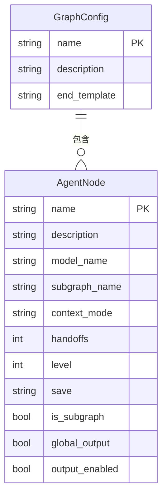

# 图数据模型

<cite>
**本文档引用的文件**  
- [graph_schema.py](file://mag/app/models/graph_schema.py)
- [graph.ts](file://frontend/src/types/graph.ts)
- [graph_manager.py](file://mag/app/services/docdb/graph_manager.py)
</cite>

## 目录
1. [引言](#引言)
2. [核心数据结构](#核心数据结构)
3. [GraphConfig 字段详解](#graphconfig-字段详解)
4. [AgentNode 结构与角色](#agentnode-结构与角色)
5. [图与节点的关系](#图与节点的关系)
6. [图的生命周期操作](#图的生命周期操作)
7. [前后端数据一致性](#前后端数据一致性)
8. [实体关系图（ER图）](#实体关系图er图)

## 引言
本文档详细描述了 MAG 系统中的图数据模型，重点分析 `GraphConfig` 和 `AgentNode` 两个核心实体。该模型用于定义和管理由多个智能体节点组成的自动化工作流图。文档将解释其字段含义、结构约束、生命周期管理机制以及前后端数据结构的一致性设计。

## 核心数据结构

系统中图配置的核心数据结构定义在后端 `graph_schema.py` 和前端 `graph.ts` 中，分别使用 Pydantic 模型和 TypeScript 接口，确保了类型安全和前后端一致性。

**Section sources**
- [graph_schema.py](file://mag/app/models/graph_schema.py#L3-L116)
- [graph.ts](file://frontend/src/types/graph.ts#L6-L113)

## GraphConfig 字段详解

`GraphConfig` 类定义了整个工作流图的配置，包含以下关键字段：

- **name（图名称）**：字符串类型，必填字段，表示图的唯一标识名称。名称验证规则禁止包含 `/`、`\` 或 `.` 等特殊字符，以确保在文件系统和数据库中的安全性。
- **description（描述）**：字符串类型，可选字段，用于提供图的简要说明。
- **nodes（节点列表）**：`AgentNode` 对象的列表，表示构成该图的所有节点。每个节点定义了其行为、输入输出关系和执行逻辑。
- **end_template（终止节点输出模板）**：可选字符串字段，用于定义图执行完毕后最终输出的模板。该模板支持 `{node_name}` 格式的占位符，可以引用图中任意节点的输出内容，实现灵活的结果聚合。

**Section sources**
- [graph_schema.py](file://mag/app/models/graph_schema.py#L77-L88)

## AgentNode 结构与角色

`AgentNode` 类定义了图中单个智能体节点的详细配置，是构成工作流的基本单元。

- **name（节点名称）**：字符串类型，必填字段，节点的唯一标识。同样禁止包含 `/`、`\` 或 `.` 等特殊字符。
- **description（描述）**：可选字符串，用于描述节点功能，辅助工具选择。
- **model_name（模型名称）**：普通节点（非子图节点）必须指定此字段，指明该节点执行时所使用的 AI 模型。
- **mcp_servers（MCP服务器列表）**：字符串列表，定义该节点需要调用的 MCP（Model Control Protocol）服务器。
- **system_prompt 和 user_prompt（系统提示词和用户提示词）**：定义了发送给 AI 模型的提示信息。
- **input_nodes 和 output_nodes（输入/输出节点）**：字符串列表，定义了节点间的数据流依赖关系。
- **is_subgraph 和 subgraph_name（是否为子图节点及子图名称）**：若节点为子图，则 `is_subgraph` 为 `true`，且必须指定 `subgraph_name`。
- **context 和 context_mode（上下文管理）**：`context` 列表指定需要引用的全局管理节点，`context_mode` 定义获取模式（"all"、"latest" 或 "latest_n"）。
- **其他字段**：如 `handoffs`（循环次数）、`global_output`（是否全局管理输出）、`position`（画布位置）、`level`（执行层级）、`save`（保存格式）等，用于精细化控制节点行为。

**Section sources**
- [graph_schema.py](file://mag/app/models/graph_schema.py#L3-L74)
- [graph.ts](file://frontend/src/types/graph.ts#L6-L27)

## 图与节点的关系

`GraphConfig` 与 `AgentNode` 之间存在明确的一对多关系。一个 `GraphConfig` 实例可以包含多个 `AgentNode` 实例，这些节点共同构成一个有向无环图（DAG）。这种关系在数据模型中通过 `GraphConfig` 的 `nodes: List[AgentNode]` 字段直接体现，是一种嵌套的复合关系，而非数据库中的外键关联。

## 图的生命周期操作

图的创建、更新、执行和删除等生命周期操作主要通过 `graph_manager.py` 中的 `GraphManager` 类实现，并最终影响 MongoDB 中的集合状态。

- **创建**：调用 `create_graph_generation_conversation` 方法，在 `conversations` 集合中创建对话记录，并在 `graph_messages` 集合中初始化消息文档。
- **更新**：通过 `add_message_to_graph_generation` 和 `update_graph_generation_parsed_results` 等方法，向 `graph_messages` 集合中的文档追加消息或更新解析结果（如节点列表、图名称等）。
- **执行**：虽然执行逻辑在其他服务中，但执行过程中的状态和消息会通过 `graph_manager` 持续更新到 `graph_messages` 集合。
- **删除**：调用 `delete_graph_generation_messages` 方法，从 `graph_messages` 集合中删除对应的文档，完成图数据的清理。

**Section sources**
- [graph_manager.py](file://mag/app/services/docdb/graph_manager.py#L0-L435)

## 前后端数据一致性

系统通过共享的数据结构定义确保了前后端数据的一致性。后端使用 Pydantic 的 `GraphConfig` 和 `AgentNode` 模型定义 API 接口的输入输出，前端则在 `types/graph.ts` 中定义了结构完全对应的 `BackendGraphConfig` 和 `AgentNode` TypeScript 接口。这种设计保证了通过 API 传输的数据在类型和结构上严格匹配，减少了因数据不一致导致的错误。

**Section sources**
- [graph_schema.py](file://mag/app/models/graph_schema.py#L77-L116)
- [graph.ts](file://frontend/src/types/graph.ts#L45-L50)

## 实体关系图（ER图）

**Diagram sources**
- [graph_schema.py](file://mag/app/models/graph_schema.py#L3-L116)