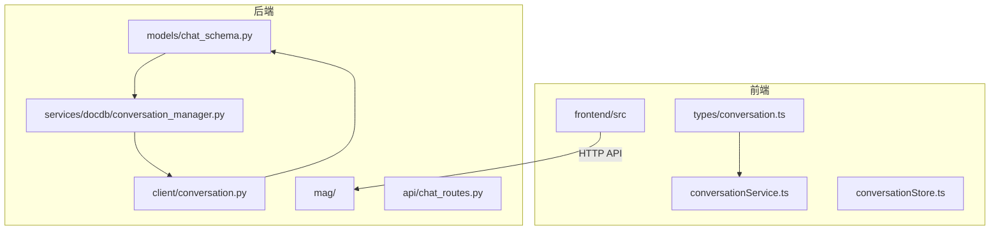
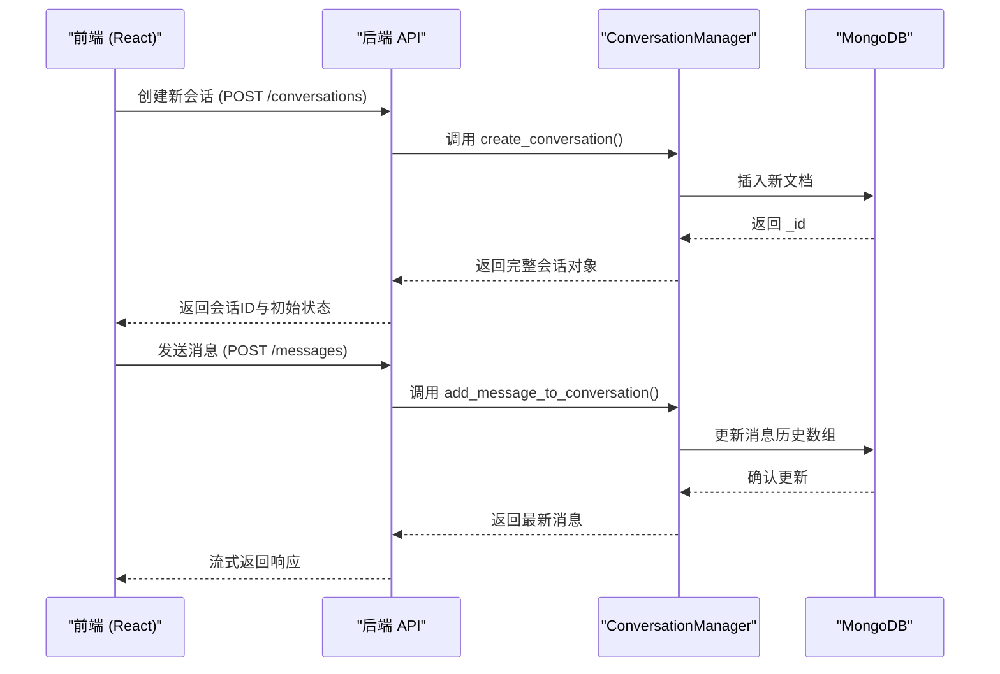
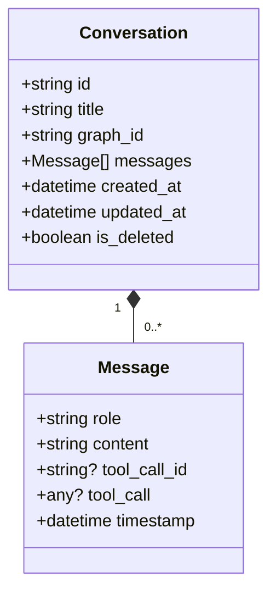
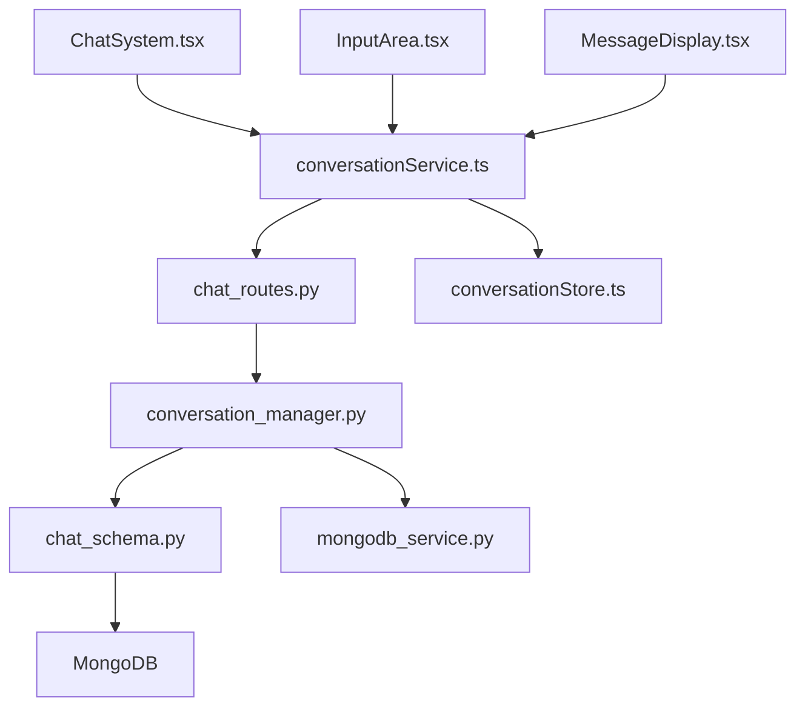

# 对话数据模型

<cite>
**本文档引用的文件**  
- [conversation.ts](file://frontend/src/types/conversation.ts)
- [chat_schema.py](file://mag/models/chat_schema.py)
- [conversation_manager.py](file://mag/services/docdb/conversation_manager.py)
- [conversation.py](file://mag/client/conversation.py)
- [conversationService.ts](file://frontend/src/services/conversationService.ts)
</cite>

## 目录
1. [引言](#引言)
2. [项目结构](#项目结构)
3. [核心组件](#核心组件)
4. [架构概述](#架构概述)
5. [详细组件分析](#详细组件分析)
6. [依赖分析](#依赖分析)
7. [性能考虑](#性能考虑)
8. [故障排除指南](#故障排除指南)
9. [结论](#结论)

## 引言
本文档深入解析系统中对话（Conversation）与消息（Message）的数据模型设计，阐述其在聊天系统中的核心作用。重点分析会话的生命周期管理、上下文保持机制、历史追溯能力以及前后端数据同步策略。同时说明对话与图配置（GraphConfig）之间的关联关系，并探讨数据库层面的索引优化方案，以支持高效查询。

## 项目结构
系统采用前后端分离架构，前端位于 `frontend/` 目录，后端服务集中在 `mag/` 目录下。对话相关的核心数据模型定义分布在前端类型文件和后端数据库模型中，业务逻辑由 `conversation_manager.py` 等服务模块实现。

**图示来源**  
- [conversation.ts](file://frontend/src/types/conversation.ts#L1-L30)
- [chat_schema.py](file://mag/models/chat_schema.py#L1-L40)
- [conversation_manager.py](file://mag/services/docdb/conversation_manager.py#L1-L20)

**本节来源**  
- [frontend/src/types/conversation.ts](file://frontend/src/types/conversation.ts)
- [mag/models/chat_schema.py](file://mag/models/chat_schema.py)

## 核心组件
对话系统的核心由数据模型、管理服务和客户端接口构成。`Conversation` 和 `Message` 是前端与后端共享的关键数据结构，`conversation_manager.py` 负责会话的创建、更新、查询和持久化操作，确保聊天上下文的连续性和一致性。

**本节来源**  
- [conversation.ts](file://frontend/src/types/conversation.ts#L1-L50)
- [chat_schema.py](file://mag/models/chat_schema.py#L10-L60)
- [conversation_manager.py](file://mag/services/docdb/conversation_manager.py#L5-L30)

## 架构概述
系统通过分层设计实现对话管理：前端定义类型并调用服务，后端提供 REST API 接口，由 `conversation_manager` 协调与 MongoDB 的交互。`GraphConfig` 与 `Conversation` 关联，使得每次对话可绑定特定的图执行流程。

**图示来源**  
- [chat_routes.py](file://mag/app/api/chat_routes.py#L15-L45)
- [conversation_manager.py](file://mag/services/docdb/conversation_manager.py#L35-L80)
- [conversationService.ts](file://frontend/src/services/conversationService.ts#L10-L40)

## 详细组件分析

### Conversation 数据模型分析
`Conversation` 对象是聊天会话的顶层容器，包含元数据、关联配置和消息历史。

#### 核心字段说明
- `id`: 唯一会话标识符（字符串）
- `title`: 会话标题，由AI根据首条消息生成
- `graph_id`: 关联的图配置ID，建立与 `GraphConfig` 的引用关系
- `messages`: 消息对象数组，按时间顺序存储完整对话历史
- `created_at`: 会话创建时间戳
- `updated_at`: 最后更新时间，用于排序和展示
- `is_deleted`: 软删除标记，支持回收站功能

**图示来源**  
- [conversation.ts](file://frontend/src/types/conversation.ts#L5-L25)
- [chat_schema.py](file://mag/models/chat_schema.py#L15-L35)

**本节来源**  
- [conversation.ts](file://frontend/src/types/conversation.ts#L1-L30)
- [chat_schema.py](file://mag/models/chat_schema.py#L10-L50)

### Message 数据结构分析
`Message` 表示单条聊天记录，支持多种角色和扩展字段。

#### 属性详解
- `role`: 角色类型，包括 "user"、"assistant"、"system"、"tool"
- `content`: 消息正文，支持纯文本和结构化内容
- `timestamp`: 消息发送时间，精确到毫秒
- `tool_call_id`: 工具调用ID，用于响应关联
- `tool_call`: 工具调用请求对象，包含函数名与参数

该设计支持复杂的多轮对话场景，包括工具调用链、函数执行结果注入等高级功能。

**本节来源**  
- [conversation.ts](file://frontend/src/types/conversation.ts#L27-L45)
- [chat_schema.py](file://mag/models/chat_schema.py#L37-L55)

### 对话与图的关联关系
每个 `Conversation` 通过 `graph_id` 字段关联一个 `GraphConfig`，该配置定义了AI推理流程的节点、连接和执行逻辑。这种设计实现了：
- **上下文隔离**：不同图配置对应独立的会话上下文
- **可追溯性**：可查询某图的所有历史执行记录
- **复用性**：同一图配置可被多个会话重复使用

关联关系在创建会话时确立，后续不可更改，保证执行环境的一致性。

**本节来源**  
- [conversation.ts](file://frontend/src/types/conversation.ts#L10-L15)
- [chat_schema.py](file://mag/models/chat_schema.py#L20-L25)
- [graph_schema.py](file://mag/models/graph_schema.py#L5-L15)

### 对话生命周期管理
`conversation_manager.py` 提供完整的 CRUD 操作接口：
- `create_conversation()`: 初始化新会话并持久化
- `get_conversation_by_id()`: 根据ID获取会话详情
- `list_conversations()`: 分页查询会话列表，支持按图或时间过滤
- `add_message_to_conversation()`: 追加消息并更新时间戳
- `update_conversation_title()`: 异步更新会话标题
- `delete_conversation()`: 软删除标记

该模块封装了数据库操作细节，提供事务安全的会话管理能力。

**本节来源**  
- [conversation_manager.py](file://mag/services/docdb/conversation_manager.py#L1-L100)

### 上下文保持与历史追溯机制
系统通过以下方式实现上下文保持：
1. **完整消息历史存储**：每次请求携带完整 `messages` 数组，确保AI模型获得完整上下文
2. **增量更新策略**：前端仅发送新增消息，后端合并历史记录
3. **时间戳排序**：所有消息按 `timestamp` 排序，防止乱序显示
4. **会话缓存**：前端 `conversationStore` 缓存当前会话，减少重复加载

历史追溯功能依赖 MongoDB 的文档嵌套结构，可快速还原任意时间点的对话状态。

**本节来源**  
- [conversation_manager.py](file://mag/services/docdb/conversation_manager.py#L40-L90)
- [conversationService.ts](file://frontend/src/services/conversationService.ts#L15-L60)

### 数据库索引优化
为提升查询性能，在 MongoDB 集合上建立了以下索引：
- `{ graph_id: 1, created_at: -1 }`: 支持按图ID查询并按创建时间倒序排列
- `{ created_at: -1 }`: 加速全局会话列表分页
- `{ is_deleted: 1, updated_at: -1 }`: 优化已删除会话的管理操作
- `{ "messages.timestamp": -1 }`: 辅助分析消息级时间序列

复合索引设计确保常见查询场景的高效执行。

**本节来源**  
- [conversation_manager.py](file://mag/services/docdb/conversation_manager.py#L25-L30)
- [mongodb_service.py](file://mag/services/mongodb_service.py#L50-L70)

### 前端数据同步机制
`conversationService.ts` 封装了所有与后端对话API的交互，结合 `conversationStore` 实现状态管理：
- **初始化**：加载会话列表并缓存
- **实时更新**：通过 SSE 或轮询监听新消息
- **乐观更新**：本地立即更新UI，异步同步到服务器
- **错误回滚**：网络失败时恢复至先前状态

该机制保障了用户操作的流畅性和数据一致性。

**本节来源**  
- [conversationService.ts](file://frontend/src/services/conversationService.ts#L1-L80)
- [conversationStore.ts](file://frontend/src/store/conversationStore.ts#L10-L50)

## 依赖分析
对话系统依赖多个核心模块协同工作。

**图示来源**  
- [conversationService.ts](file://frontend/src/services/conversationService.ts)
- [chat_routes.py](file://mag/app/api/chat_routes.py)
- [conversation_manager.py](file://mag/services/docdb/conversation_manager.py)

**本节来源**  
- [conversationService.ts](file://frontend/src/services/conversationService.ts#L1-L20)
- [chat_routes.py](file://mag/app/api/chat_routes.py#L1-L10)
- [conversation_manager.py](file://mag/services/docdb/conversation_manager.py#L1-L10)

## 性能考虑
- **消息数组增长**：长期会话可能导致 `messages` 数组过大，建议定期归档或分页加载
- **索引维护**：频繁更新 `updated_at` 可能影响写入性能，需监控索引效率
- **内存占用**：前端缓存大量会话可能增加内存消耗，应实施LRU淘汰策略
- **查询优化**：避免全表扫描，确保所有查询均命中现有索引

## 故障排除指南
- **会话无法创建**：检查 `graph_id` 是否有效，确认数据库连接正常
- **消息丢失**：验证前端是否正确调用 `add_message`，检查网络请求状态
- **加载缓慢**：审查索引使用情况，确认查询条件匹配索引前缀
- **时间错乱**：确保前后端时间同步，统一使用UTC时间戳

**本节来源**  
- [conversation_manager.py](file://mag/services/docdb/conversation_manager.py#L85-L95)
- [conversationService.ts](file://frontend/src/services/conversationService.ts#L65-L75)

## 结论
本文档全面解析了系统的对话数据模型及其管理机制。通过清晰的 `Conversation` 和 `Message` 结构设计，结合 `conversation_manager` 的生命周期管理，系统实现了强大的上下文保持和历史追溯能力。前后端协同的数据同步机制与数据库索引优化共同保障了聊天功能的高效稳定运行。未来可进一步优化长会话的分块存储与加载策略，以应对更复杂的使用场景。