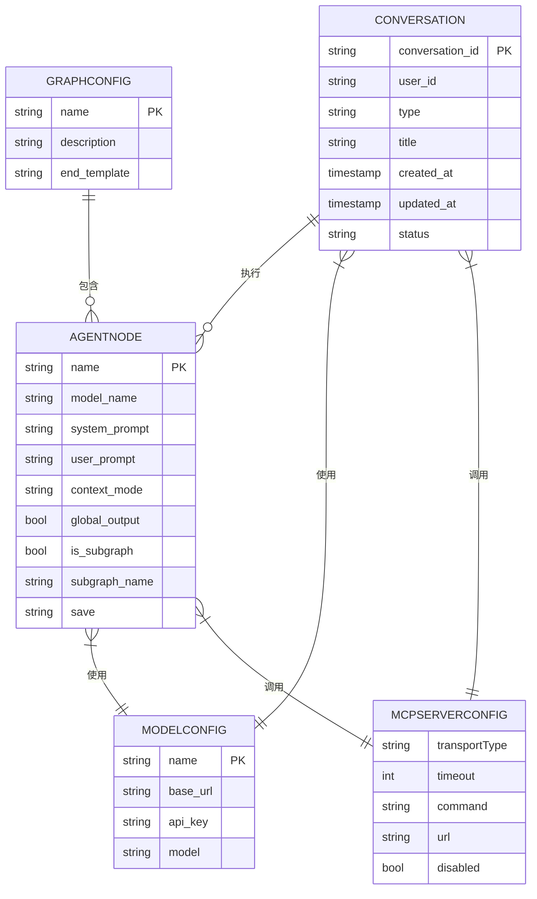
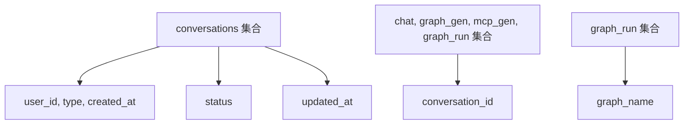

# 数据模型

<cite>
**本文档中引用的文件**   
- [graph_schema.py](file://mag/app/models/graph_schema.py)
- [chat_schema.py](file://mag/app/models/chat_schema.py)
- [mcp_schema.py](file://mag/app/models/mcp_schema.py)
- [model_schema.py](file://mag/app/models/model_schema.py)
- [mongodb_service.py](file://mag/app/services/mongodb_service.py)
- [conversation_manager.py](file://mag/app/services/docdb/conversation_manager.py)
- [graph_run_manager.py](file://mag/app/services/docdb/graph_run_manager.py)
</cite>

## 目录
1. [引言](#引言)
2. [核心实体模型](#核心实体模型)
3. [实体关系与ER图](#实体关系与er图)
4. [数据库集合与索引](#数据库集合与索引)
5. [数据生命周期](#数据生命周期)
6. [结论](#结论)

## 引言
本数据模型文档详细描述了mcp-agent-graph-p系统中存储在MongoDB中的核心实体。系统通过图（Graph）驱动的AI工作流，支持复杂的自动化任务编排。这些核心实体包括图配置（GraphConfig）、节点（Node）、MCP服务器配置（MCPServerConfig）、对话记录（Conversation）和模型配置（ModelConfig），它们共同构成了系统的数据基石。本文档旨在为开发者和系统维护者提供一个清晰、全面的数据结构参考。

## 核心实体模型

### 图配置 (GraphConfig)
`GraphConfig` 实体定义了一个AI工作流图的完整结构，是系统的核心编排单元。

**字段列表与业务含义**

| 字段名 | 数据类型 | 必填 | 约束/默认值 | 业务含义 |
| :--- | :--- | :--- | :--- | :--- |
| `name` | `str` | 是 | 唯一，不能包含 `/`, `\`, `.` | 图的唯一标识名称，用于创建、加载和执行。 |
| `description` | `str` | 否 | 默认 `""` | 图的描述信息，用于用户理解其功能。 |
| `nodes` | `List[AgentNode]` | 否 | 默认 `[]` | 构成该图的所有节点列表，定义了工作流的执行步骤。 |
| `end_template` | `Optional[str]` | 否 | 默认 `None` | 终止节点的输出模板，支持 `{node_name}` 占位符来引用其他节点的输出结果。 |

**Section sources**
- [graph_schema.py](file://mag/app/models/graph_schema.py#L45-L55)

### 节点 (Node / AgentNode)
`AgentNode` 是 `GraphConfig` 的组成部分，代表工作流中的一个具体执行单元。

**字段列表与业务含义**

| 字段名 | 数据类型 | 必填 | 约束/默认值 | 业务含义 |
| :--- | :--- | :--- | :--- | :--- |
| `name` | `str` | 是 | 唯一，不能包含 `/`, `\`, `.` | 节点的唯一标识名称。 |
| `description` | `Optional[str]` | 否 | 默认 `""` | 节点描述，用于工具选择提示。 |
| `model_name` | `Optional[str]` | 是（非子图节点） | - | 该节点使用的AI模型名称。子图节点无需指定。 |
| `mcp_servers` | `List[str]` | 否 | 默认 `[]` | 该节点可以调用的MCP服务器名称列表。 |
| `system_prompt` | `str` | 否 | 默认 `""` | 发送给AI模型的系统提示词。 |
| `user_prompt` | `str` | 否 | 默认 `""` | 发送给AI模型的用户提示词。 |
| `input_nodes` | `List[str]` | 否 | 默认 `[]` | 该节点的输入节点列表，定义了数据流入的来源。 |
| `output_nodes` | `List[str]` | 否 | 默认 `[]` | 该节点的输出节点列表，定义了数据流出的目标。 |
| `handoffs` | `Optional[int]` | 否 | 默认 `None` | 节点可执行的选择次数，用于支持循环流程。 |
| `global_output` | `bool` | 否 | 默认 `False` | 是否将此节点的输出进行全局管理，供其他节点引用。 |
| `context` | `List[str]` | 否 | 默认 `[]` | 需要引用的、具有 `global_output` 的全局管理节点列表。 |
| `context_mode` | `str` | 否 | 默认 `"all"` | 全局内容获取模式，可选 `"all"`（获取全部）或数字字符串（如 `"1"`，获取最新1次输出）。 |
| `output_enabled` | `bool` | 否 | 默认 `True` | 是否输出该节点的回复。 |
| `is_subgraph` | `bool` | 否 | 默认 `False` | 是否为子图节点。 |
| `subgraph_name` | `Optional[str]` | 是（当 `is_subgraph` 为 `True` 时） | - | 子图的名称。 |
| `position` | `Optional[Dict[str, float]]` | 否 | 默认 `None` | 节点在画布中的位置坐标（x, y）。 |
| `level` | `Optional[int]` | 否 | 默认 `None` | 节点在图中的层级，用于确定执行顺序。 |
| `save` | `Optional[str]` | 否 | 默认 `None` | 输出内容需要保存的文件扩展名，如 `md`, `html`, `py` 等。 |

**Section sources**
- [graph_schema.py](file://mag/app/models/graph_schema.py#L4-L43)

### MCP服务器配置 (MCPServerConfig)
`MCPServerConfig` 定义了与外部MCP（Model Control Protocol）服务器的连接和配置。

**字段列表与业务含义**

| 字段名 | 数据类型 | 必填 | 约束/默认值 | 业务含义 |
| :--- | :--- | :--- | :--- | :--- |
| `autoApprove` | `List[str]` | 否 | 默认 `[]` | 自动批准调用的工具列表。 |
| `disabled` | `bool` | 否 | 默认 `False` | 是否禁用该服务器。 |
| `timeout` | `int` | 否 | 默认 `60` | 服务器调用的超时时间（秒）。 |
| `command` | `Optional[str]` | 是（当 `transportType` 为 `stdio` 时） | - | 用于启动服务器的命令行指令。 |
| `args` | `List[str]` | 否 | 默认 `[]` | 服务器启动参数。 |
| `transportType` | `str` | 否 | 默认 `"stdio"` | 传输类型，可为 `stdio`, `sse`, `streamable_http`。 |
| `url` | `Optional[str]` | 是（当 `transportType` 为 `sse` 或 `streamable_http` 时） | - | MCP服务器的SSE或HTTP URL。 |
| `type` | `Optional[str]` | 否 | - | 旧版服务器类型，会自动转换为 `transportType`。 |
| `env` | `Optional[Dict[str, str]]` | 否 | 默认 `None` | 启动服务器时需要的环境变量。 |

**Section sources**
- [mcp_schema.py](file://mag/app/models/mcp_schema.py#L5-L37)

### 对话记录 (Conversation)
`Conversation` 实体记录了用户与系统交互的会话历史，包括聊天、图生成和图执行等。

**字段列表与业务含义**

| 字段名 | 数据类型 | 必填 | 约束/默认值 | 业务含义 |
| :--- | :--- | :--- | :--- | :--- |
| `conversation_id` | `str` | 是 | 唯一，作为 `_id` | 对话的唯一标识符。 |
| `user_id` | `str` | 是 | - | 创建该对话的用户ID。 |
| `type` | `str` | 是 | `chat`, `agent`, `graph` | 对话类型，区分普通聊天、AI生成和图执行。 |
| `title` | `str` | 是 | - | 对话的标题，通常为对话ID或用户自定义名称。 |
| `created_at` | `str` | 是 | - | 对话创建时间（UTC）。 |
| `updated_at` | `str` | 是 | - | 对话最后更新时间（UTC）。 |
| `round_count` | `int` | 是 | - | 对话的轮次总数。 |
| `total_token_usage` | `TokenUsage` | 是 | - | 对话的总Token使用量统计。 |
| `status` | `str` | 是 | `active`, `deleted`, `favorite` | 对话的当前状态。 |
| `tags` | `List[str]` | 否 | 默认 `[]` | 为对话添加的标签，用于分类。 |
| `rounds` | `List[Dict[str, Any]]` | 否 | 默认 `[]` | 完整的消息轮次列表，存储在 `graph_run` 集合中。 |
| `execution_chain` | `Optional[List[List[str]]]` | 否 | 默认 `None` | 图执行时的执行链，记录了节点的执行顺序。 |
| `final_result` | `Optional[str]` | 否 | 默认 `None` | 图执行的最终结果。 |

**Section sources**
- [chat_schema.py](file://mag/app/models/chat_schema.py#L50-L70)
- [chat_schema.py](file://mag/app/models/chat_schema.py#L129-L145)

### 模型配置 (ModelConfig)
`ModelConfig` 定义了AI模型的连接信息和所有可配置参数。

**字段列表与业务含义**

| 字段名 | 数据类型 | 必填 | 约束/默认值 | 业务含义 |
| :--- | :--- | :--- | :--- | :--- |
| `name` | `str` | 是 | 唯一 | 模型的配置名称。 |
| `base_url` | `str` | 是 | - | 模型API的基地址URL。 |
| `api_key` | `str` | 是 | - | 访问模型API的密钥。 |
| `model` | `str` | 是 | - | 模型在API中的具体标识符。 |
| `stream` | `Optional[bool]` | 否 | 默认 `False` | 是否启用流式响应。 |
| `temperature` | `Optional[float]` | 否 | 0.0 - 2.0 | 控制输出的随机性。 |
| `max_tokens` | `Optional[int]` | 否 | > 0 | 生成的最大令牌数。 |
| `top_p` | `Optional[float]` | 否 | 0.0 - 1.0 | 核采样参数。 |
| `frequency_penalty` | `Optional[float]` | 否 | -2.0 - 2.0 | 频率惩罚，降低重复。 |
| `presence_penalty` | `Optional[float]` | 否 | -2.0 - 2.0 | 存在惩罚，鼓励新话题。 |
| `timeout` | `Optional[float]` | 否 | > 0 | API请求的超时时间（秒）。 |
| `...` | `...` | 否 | - | 其他OpenAI兼容参数。 |

**Section sources**
- [model_schema.py](file://mag/app/models/model_schema.py#L5-L87)

## 实体关系与ER图

**Diagram sources**
- [graph_schema.py](file://mag/app/models/graph_schema.py)
- [chat_schema.py](file://mag/app/models/chat_schema.py)
- [mcp_schema.py](file://mag/app/models/mcp_schema.py)
- [model_schema.py](file://mag/app/models/model_schema.py)

## 数据库集合与索引

### 集合命名约定
系统使用多个MongoDB集合来组织不同类型的数据，命名清晰且具有描述性：
*   **`conversations`**: 存储所有对话的元数据（基本信息）。
*   **`chat`**: 存储普通聊天对话的完整消息历史。
*   **`graph_gen`**: 存储AI生成图过程中的对话消息。
*   **`mcp_gen`**: 存储AI生成MCP配置过程中的对话消息。
*   **`graph_run`**: 存储图执行过程中的对话消息和运行状态。

### 索引信息
系统在 `mongodb_service.py` 中初始化时会自动创建必要的索引以优化查询性能：

**索引说明**:
*   在 `conversations` 集合上，复合索引 `("user_id", "type", "created_at")` 用于高效地按用户、类型和时间排序查询对话列表。
*   `("status", 1)` 索引用于快速筛选特定状态（如 `deleted`）的对话。
*   `("updated_at", -1)` 索引用于按更新时间排序。
*   所有消息集合（`chat`, `graph_gen`, `mcp_gen`, `graph_run`）都基于 `conversation_id` 建立了索引，这是查询特定对话完整历史的最常见操作。
*   `graph_run` 集合额外在 `graph_name` 上建立了索引，便于根据图名称查找所有相关的执行记录。

**Section sources**
- [mongodb_service.py](file://mag/app/services/mongodb_service.py#L78-L113)

## 数据生命周期

### 图的创建与更新
当用户在前端创建或修改一个图时，`GraphConfig` 数据通过API被发送到后端。后端服务会验证数据的完整性，然后将其持久化。图的元数据（名称、描述）存储在 `conversations` 集合中，而图的完整配置（包括所有节点）则作为消息历史的一部分，存储在 `graph_gen` 集合中。每次保存都会覆盖之前的配置。

### 图的执行
图的执行是一个动态过程，其数据生命周期如下：
1.  **创建会话**: 调用 `create_graph_run_conversation` 方法，首先在 `conversations` 集合中创建一条类型为 `graph` 的新记录。
2.  **初始化运行数据**: 同时在 `graph_run` 集合中创建一个文档，用于存储该次执行的完整轮次（`rounds`）和状态。
3.  **执行与更新**: 在执行过程中，系统会不断调用 `update_graph_run_data` 和 `add_round_to_graph_run` 方法，将执行链（`execution_chain`）、中间结果和最终结果（`final_result`）写入 `graph_run` 集合的对应文档中。
4.  **完成**: 执行完成后，`conversations` 集合中的 `round_count` 和 `total_token_usage` 会被更新，`updated_at` 时间戳也会刷新。

### 图的删除
删除一个图通常意味着删除其相关的所有对话记录。系统会调用 `delete_graph_generation_messages` 删除 `graph_gen` 集合中的配置消息，并将 `conversations` 集合中对应记录的 `status` 更新为 `deleted`（软删除），而非物理删除，以保留历史记录。

**Section sources**
- [conversation_manager.py](file://mag/app/services/docdb/conversation_manager.py#L61-L91)
- [graph_run_manager.py](file://mag/app/services/docdb/graph_run_manager.py#L0-L33)
- [mongodb_service.py](file://mag/app/services/mongodb_service.py#L110-L140)
- [graph_manager.py](file://mag/app/services/docdb/graph_manager.py#407-L435)

## 结论
mcp-agent-graph-p的数据模型设计清晰地分离了静态配置（图、节点、MCP、模型）和动态会话（对话记录）。通过将元数据与详细消息历史分开放置在不同的集合中，系统实现了高效的查询和良好的可扩展性。实体间的关系通过引用（如 `conversation_id`）而非嵌套来维护，保证了数据的一致性和灵活性。该模型为系统的图编排、执行和状态管理提供了坚实的数据基础。