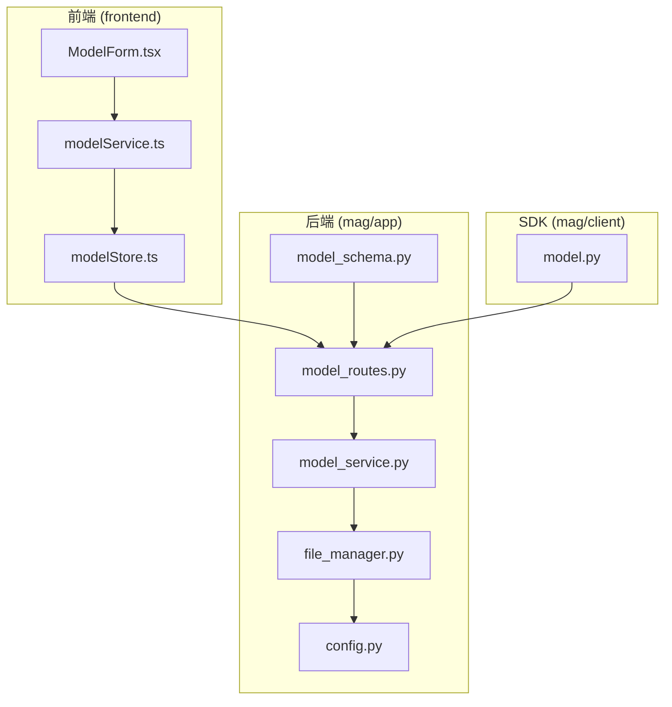
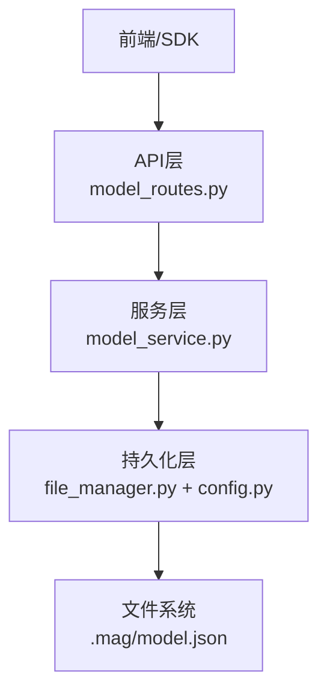
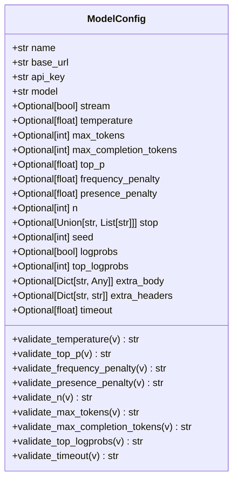
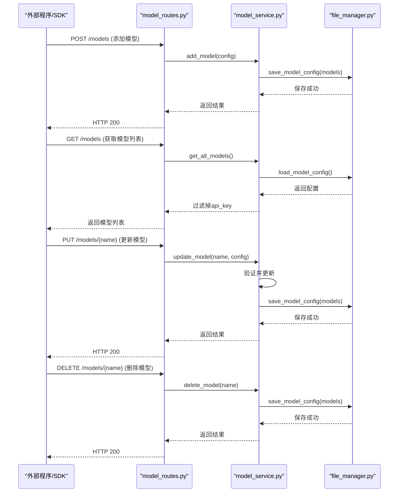
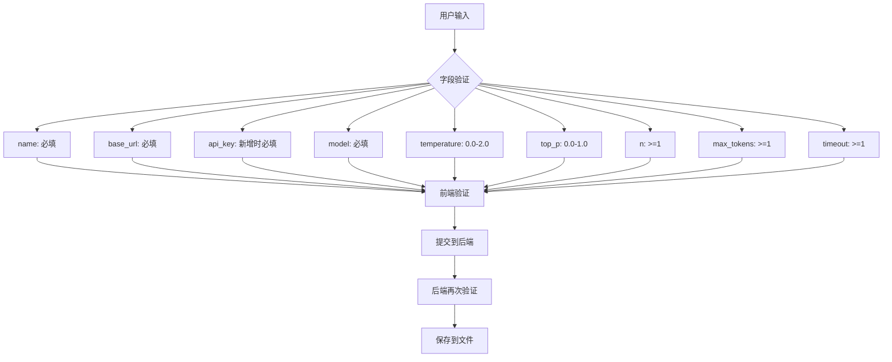
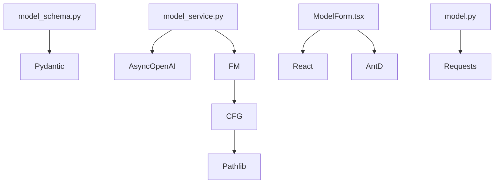

# 模型配置数据模型

<cite>
**本文档中引用的文件**
- [model_schema.py](file://mag/app/models/model_schema.py)
- [model_routes.py](file://mag/app/api/model_routes.py)
- [model_service.py](file://mag/app/services/model_service.py)
- [file_manager.py](file://mag/app/core/file_manager.py)
- [config.py](file://mag/app/core/config.py)
- [ModelForm.tsx](file://frontend/src/components/model-manager/ModelForm.tsx)
- [modelService.ts](file://frontend/src/services/modelService.ts)
- [modelStore.ts](file://frontend/src/store/modelStore.ts)
- [model.py](file://mag/client/model.py)
- [model.ts](file://frontend/src/types/model.ts)
</cite>

## 目录
1. [简介](#简介)
2. [项目结构](#项目结构)
3. [核心组件](#核心组件)
4. [架构概述](#架构概述)
5. [详细组件分析](#详细组件分析)
6. [依赖分析](#依赖分析)
7. [性能考虑](#性能考虑)
8. [故障排除指南](#故障排除指南)
9. [结论](#结论)

## 简介
本文档全面记录了MAG系统中`ModelConfig`的数据模型，重点描述其核心字段：`name`（名称）、`base_url`（API地址）、`api_key`（密钥）、`model`（模型标识符）等。文档解释了每个字段的技术要求和安全考虑，特别是API密钥的加密存储机制。同时，说明了该模型如何被图中的节点引用以执行AI推理任务。结合SDK中的`model.py`客户端实现，展示了外部程序如何通过API对模型配置进行增删改查操作。此外，分析了前端`ModelForm`组件中的表单验证逻辑与后端模型定义的一致性，并提供了该集合的唯一索引设计，以防止重复配置。

## 项目结构
MAG系统的项目结构清晰地分离了前端、后端和配置管理。模型配置的核心逻辑位于`mag/app`目录下，其中`models/model_schema.py`定义了数据模型，`api/model_routes.py`提供了REST API接口，`services/model_service.py`实现了业务逻辑。配置文件的持久化由`core/file_manager.py`和`core/config.py`共同管理。前端部分位于`frontend/src`，`components/model-manager/ModelForm.tsx`负责用户界面的表单交互，`services/modelService.ts`和`store/modelStore.ts`处理状态管理和API调用。Python SDK位于`mag/client/model.py`，为外部程序提供便捷的访问接口。

**Diagram sources**
- [model_schema.py](file://mag/app/models/model_schema.py)
- [model_routes.py](file://mag/app/api/model_routes.py)
- [model_service.py](file://mag/app/services/model_service.py)
- [file_manager.py](file://mag/app/core/file_manager.py)
- [config.py](file://mag/app/core/config.py)
- [ModelForm.tsx](file://frontend/src/components/model-manager/ModelForm.tsx)
- [modelService.ts](file://frontend/src/services/modelService.ts)
- [modelStore.ts](file://frontend/src/store/modelStore.ts)
- [model.py](file://mag/client/model.py)

**Section sources**
- [model_schema.py](file://mag/app/models/model_schema.py)
- [model_routes.py](file://mag/app/api/model_routes.py)
- [model_service.py](file://mag/app/services/model_service.py)
- [file_manager.py](file://mag/app/core/file_manager.py)
- [config.py](file://mag/app/core/config.py)
- [ModelForm.tsx](file://frontend/src/components/model-manager/ModelForm.tsx)
- [modelService.ts](file://frontend/src/services/modelService.ts)
- [modelStore.ts](file://frontend/src/store/modelStore.ts)
- [model.py](file://mag/client/model.py)

## 核心组件
`ModelConfig`数据模型是MAG系统中AI推理能力的核心。它不仅定义了与外部AI服务（如OpenAI）通信所需的基本参数，还封装了丰富的可选参数以控制生成行为。后端通过`ModelService`类管理所有模型的生命周期，包括初始化、增删改查和客户端连接。前端通过`ModelForm`提供用户友好的配置界面，并通过`modelService`和`modelStore`与后端进行数据同步。Python SDK则为自动化脚本和外部应用提供了编程接口。

**Section sources**
- [model_schema.py](file://mag/app/models/model_schema.py)
- [model_service.py](file://mag/app/services/model_service.py)
- [ModelForm.tsx](file://frontend/src/components/model-manager/ModelForm.tsx)
- [model.py](file://mag/client/model.py)

## 架构概述
MAG系统的模型配置架构采用分层设计。最底层是持久化层，由`FileManager`和`Settings`类负责，将模型配置以JSON格式安全地存储在用户主目录的`.mag`文件夹中。中间层是服务层，`ModelService`是核心，它加载配置、验证参数、管理`AsyncOpenAI`客户端实例，并提供调用AI模型的统一接口。最上层是API层，`model_routes.py`将服务层的功能暴露为标准的RESTful API，供前端和SDK调用。前端和SDK作为客户端，通过HTTP协议与API层交互，实现对模型配置的管理。

**Diagram sources**
- [model_routes.py](file://mag/app/api/model_routes.py)
- [model_service.py](file://mag/app/services/model_service.py)
- [file_manager.py](file://mag/app/core/file_manager.py)
- [config.py](file://mag/app/core/config.py)

## 详细组件分析

### 数据模型定义分析
`ModelConfig`类在`model_schema.py`中定义，继承自Pydantic的`BaseModel`，确保了强大的数据验证和类型提示。

**Diagram sources**
- [model_schema.py](file://mag/app/models/model_schema.py)

**Section sources**
- [model_schema.py](file://mag/app/models/model_schema.py)

#### 字段技术要求与安全考虑
- **name (名称)**: 模型的唯一标识符，用于在系统中引用。在数据库层面通过`FileManager`的`save_model_config`方法确保其唯一性，当尝试添加或更新为已存在的名称时，会抛出HTTP 400错误。
- **base_url (API地址)**: 指向AI服务提供商的API端点，如`https://api.openai.com/v1`。必须是有效的URL格式。
- **api_key (密钥)**: 用于身份验证的敏感信息。系统采取了严格的安全措施：
  1. **加密存储**: 密钥以明文形式存储在本地JSON文件中，但文件位于用户主目录的隐藏文件夹`.mag`内，依赖文件系统权限保护。
  2. **前端脱敏**: 当前端请求编辑模型时，后端API (`get_model_for_edit`) 会返回一个不包含`api_key`字段的配置副本，确保密钥不会在浏览器中暴露。
  3. **更新策略**: 在编辑模式下，如果用户未输入新的API密钥，后端会保留原有的密钥，避免因表单提交而意外清空。
- **model (模型标识符)**: 指定要调用的具体AI模型，如`gpt-4`或`gpt-3.5-turbo`。该值将直接传递给AI服务提供商。
- **可选参数**: 包括`temperature`、`max_tokens`等，均带有详细的范围验证器（`@validator`），确保输入值在合理范围内，防止无效请求。

### API与SDK交互分析
外部程序通过REST API或Python SDK与模型配置系统交互。

**Diagram sources**
- [model_routes.py](file://mag/app/api/model_routes.py)
- [model_service.py](file://mag/app/services/model_service.py)
- [file_manager.py](file://mag/app/core/file_manager.py)

**Section sources**
- [model_routes.py](file://mag/app/api/model_routes.py)
- [model_service.py](file://mag/app/services/model_service.py)
- [file_manager.py](file://mag/app/core/file_manager.py)
- [model.py](file://mag/client/model.py)

#### SDK客户端实现
`mag/client/model.py`提供了简洁的Python API。`add`、`update`、`delete`等函数封装了HTTP请求，使外部程序可以像调用本地函数一样管理模型。该SDK在调用前会自动启动MAG服务器（如果未运行），并确保所有必填字段都已提供。

### 前端表单验证一致性分析
前端`ModelForm`组件的验证逻辑与后端`ModelConfig`模型定义高度一致。

**Diagram sources**
- [ModelForm.tsx](file://frontend/src/components/model-manager/ModelForm.tsx)
- [model_schema.py](file://mag/app/models/model_schema.py)

**Section sources**
- [ModelForm.tsx](file://frontend/src/components/model-manager/ModelForm.tsx)
- [model_schema.py](file://mag/app/models/model_schema.py)

- **必填字段**: 前端表单对`name`、`base_url`、`model`和新增模式下的`api_key`都设置了`required: true`规则，与后端的`Field(...)`定义一致。
- **数值范围**: 前端的`InputNumber`组件通过`min`和`max`属性限制了`temperature`、`top_p`、`n`、`max_tokens`和`timeout`的输入范围，与后端的`@validator`函数逻辑匹配。
- **数据清理**: 前端在提交前会清理数据，例如只在用户输入了新值时才包含`api_key`，并将`stop`字符串转换为数组，确保了与后端期望的数据结构一致。

## 依赖分析
`ModelConfig`数据模型的实现依赖于多个关键组件。`model_schema.py`依赖于Pydantic库进行数据验证。`model_service.py`依赖于`AsyncOpenAI`库来创建和管理与AI服务的连接，并依赖于`file_manager.py`进行持久化。`file_manager.py`又依赖于`config.py`中的`Settings`类来确定配置文件的存储路径。前端组件依赖于React和Ant Design UI库。Python SDK依赖于`requests`库进行HTTP通信。

**Diagram sources**
- [model_schema.py](file://mag/app/models/model_schema.py)
- [model_service.py](file://mag/app/services/model_service.py)
- [file_manager.py](file://mag/app/core/file_manager.py)
- [config.py](file://mag/app/core/config.py)
- [ModelForm.tsx](file://frontend/src/components/model-manager/ModelForm.tsx)
- [model.py](file://mag/client/model.py)

**Section sources**
- [model_schema.py](file://mag/app/models/model_schema.py)
- [model_service.py](file://mag/app/services/model_service.py)
- [file_manager.py](file://mag/app/core/file_manager.py)
- [config.py](file://mag/app/core/config.py)
- [ModelForm.tsx](file://frontend/src/components/model-manager/ModelForm.tsx)
- [model.py](file://mag/client/model.py)

## 性能考虑
- **客户端缓存**: `ModelService`在初始化时会为每个模型创建一个`AsyncOpenAI`客户端实例并缓存起来，避免了每次调用AI模型时都重新建立连接，显著提升了性能。
- **文件I/O**: 模型配置的读写操作（`load_model_config`, `save_model_config`）是同步的，可能会阻塞事件循环。对于高并发场景，可以考虑将这些操作移至后台线程。
- **内存使用**: 所有模型配置都会被加载到内存中，对于拥有大量模型配置的系统，需要关注内存占用。

## 故障排除指南
- **模型无法添加/更新**: 检查`name`是否已存在，或`base_url`/`api_key`是否有效。查看后端日志中是否有`添加模型时出错`或`更新模型时出错`的记录。
- **API密钥丢失**: 确认在编辑模型时，如果未输入新密钥，旧密钥应被保留。如果密钥被意外清空，请重新添加。
- **无法调用模型**: 确认`ModelService`已成功初始化客户端。检查`clients`字典中是否存在对应模型名称的客户端实例。
- **前端表单提交失败**: 检查浏览器控制台是否有网络错误或验证错误。确认后端API服务正在运行。

**Section sources**
- [model_service.py](file://mag/app/services/model_service.py)
- [model_routes.py](file://mag/app/api/model_routes.py)
- [ModelForm.tsx](file://frontend/src/components/model-manager/ModelForm.tsx)

## 结论
`ModelConfig`数据模型是MAG系统灵活、安全地集成各种AI服务的基础。通过前后端协同的验证机制、安全的密钥管理策略和清晰的API设计，该模型为用户和开发者提供了一个强大且易用的配置管理方案。其设计充分考虑了唯一性约束、数据一致性和性能优化，是整个系统稳定运行的关键组件。