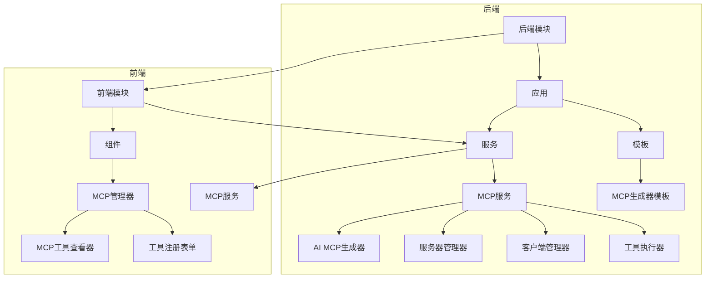
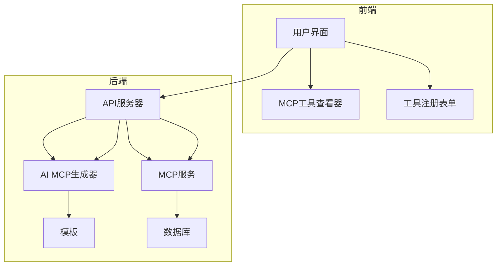
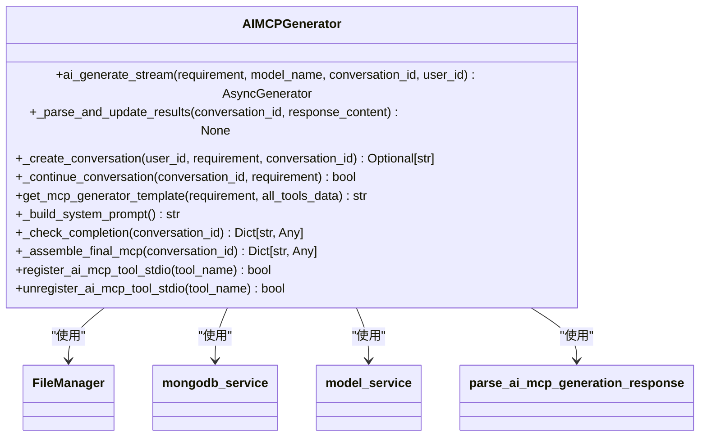
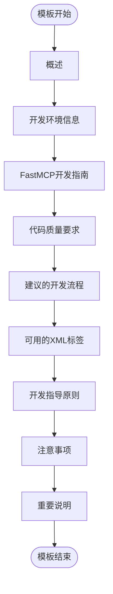
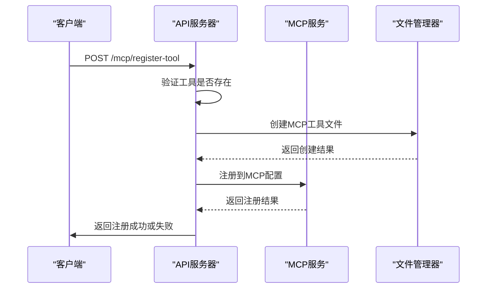
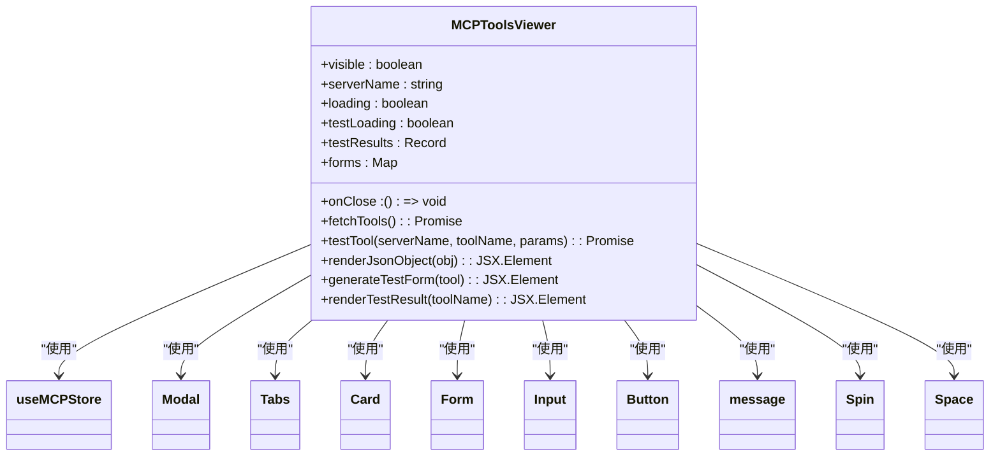
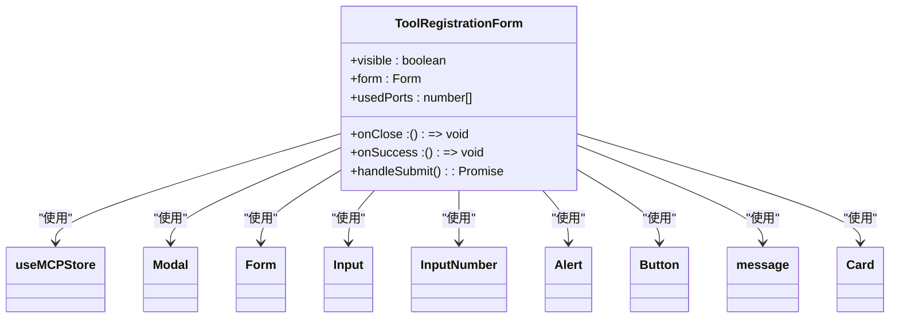
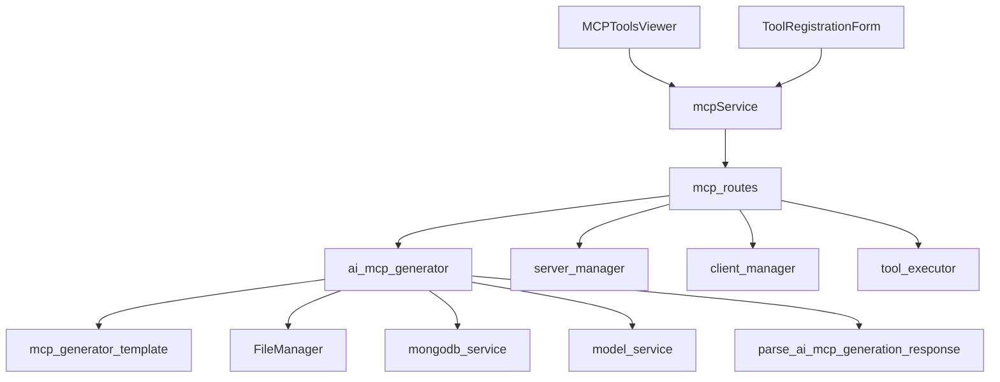

# AI生成MCP工具

<cite>
**本文档引用的文件**   
- [ai_mcp_generator.py](file://mag/app/services/mcp/ai_mcp_generator.py)
- [mcp_generator_template.md](file://mag/app/templates/mcp_generator_template.md)
- [mcp_routes.py](file://mag/app/api/mcp_routes.py)
- [MCPToolsViewer.tsx](file://frontend/src/components/mcp-manager/MCPToolsViewer.tsx)
- [ToolRegistrationForm.tsx](file://frontend/src/components/mcp-manager/ToolRegistrationForm.tsx)
- [mcpService.ts](file://frontend/src/services/mcpService.ts)
</cite>

## 目录
1. [简介](#简介)
2. [项目结构](#项目结构)
3. [核心组件](#核心组件)
4. [架构概述](#架构概述)
5. [详细组件分析](#详细组件分析)
6. [依赖分析](#依赖分析)
7. [性能考虑](#性能考虑)
8. [故障排除指南](#故障排除指南)
9. [结论](#结论)

## 简介
本文档全面记录了“AI生成MCP工具”功能的实现细节。该功能允许用户通过自然语言描述需求，系统将自动调用AI生成符合MCP协议的Python工具代码。文档详细解释了`mcp_generator_template.md`模板文件的结构及其在代码生成中的作用，包括函数签名、参数定义和返回格式等规范。同时，文档说明了生成后的工具如何通过MCP服务注册并集成到Agent图中使用。提供了API调用示例（如POST /mcp/generate-tool），展示了请求体结构与响应格式。此外，文档阐述了前端MCPToolsViewer组件如何展示生成的工具列表，以及ToolRegistrationForm如何支持手动注册与测试。最后，文档包含了常见问题如生成失败、语法错误、协议不兼容的排查方法。

## 项目结构
项目结构清晰地组织了各个模块，确保了代码的可维护性和扩展性。核心功能分布在`mag`目录下的`app`子目录中，其中`services`目录包含了MCP相关的服务实现，`templates`目录存放了生成工具所需的模板文件。前端组件位于`frontend`目录下，`components`目录中的`mcp-manager`子目录包含了与MCP工具管理相关的UI组件。

**图源**
- [ai_mcp_generator.py](file://mag/app/services/mcp/ai_mcp_generator.py)
- [mcp_generator_template.md](file://mag/app/templates/mcp_generator_template.md)
- [MCPToolsViewer.tsx](file://frontend/src/components/mcp-manager/MCPToolsViewer.tsx)
- [ToolRegistrationForm.tsx](file://frontend/src/components/mcp-manager/ToolRegistrationForm.tsx)

## 核心组件
核心组件包括AI MCP生成器、MCP生成器模板、MCP工具注册API、MCP工具查看器和工具注册表单。这些组件协同工作，实现了从用户需求到MCP工具的自动化生成和管理。

**节源**
- [ai_mcp_generator.py](file://mag/app/services/mcp/ai_mcp_generator.py)
- [mcp_generator_template.md](file://mag/app/templates/mcp_generator_template.md)
- [mcp_routes.py](file://mag/app/api/mcp_routes.py)
- [MCPToolsViewer.tsx](file://frontend/src/components/mcp-manager/MCPToolsViewer.tsx)
- [ToolRegistrationForm.tsx](file://frontend/src/components/mcp-manager/ToolRegistrationForm.tsx)

## 架构概述
系统架构分为前后端两大部分。后端负责处理AI生成MCP工具的逻辑，包括接收用户需求、调用AI生成代码、注册工具等。前端则提供了用户界面，允许用户输入需求、查看生成的工具列表和手动注册工具。

**图源**
- [ai_mcp_generator.py](file://mag/app/services/mcp/ai_mcp_generator.py)
- [mcp_routes.py](file://mag/app/api/mcp_routes.py)
- [MCPToolsViewer.tsx](file://frontend/src/components/mcp-manager/MCPToolsViewer.tsx)
- [ToolRegistrationForm.tsx](file://frontend/src/components/mcp-manager/ToolRegistrationForm.tsx)

## 详细组件分析
### AI MCP生成器分析
AI MCP生成器是整个功能的核心，负责接收用户需求并通过AI生成符合MCP协议的Python代码。

#### 类图

**图源**
- [ai_mcp_generator.py](file://mag/app/services/mcp/ai_mcp_generator.py)

### MCP生成器模板分析
MCP生成器模板文件定义了生成MCP工具所需的代码结构和规范。

#### 模板结构

**图源**
- [mcp_generator_template.md](file://mag/app/templates/mcp_generator_template.md)

### MCP工具注册API分析
MCP工具注册API负责处理工具的注册请求，包括创建工具文件和更新MCP配置。

#### 序列图

**图源**
- [mcp_routes.py](file://mag/app/api/mcp_routes.py)

### MCP工具查看器分析
MCP工具查看器组件允许用户查看和测试已注册的MCP工具。

#### 组件结构

**图源**
- [MCPToolsViewer.tsx](file://frontend/src/components/mcp-manager/MCPToolsViewer.tsx)

### 工具注册表单分析
工具注册表单组件允许用户手动注册MCP工具。

#### 组件结构

**图源**
- [ToolRegistrationForm.tsx](file://frontend/src/components/mcp-manager/ToolRegistrationForm.tsx)

## 依赖分析
系统依赖关系清晰，各组件之间通过明确的接口进行通信。后端服务通过API与前端组件交互，前端组件通过服务层调用后端API。

**图源**
- [ai_mcp_generator.py](file://mag/app/services/mcp/ai_mcp_generator.py)
- [mcp_routes.py](file://mag/app/api/mcp_routes.py)
- [MCPToolsViewer.tsx](file://frontend/src/components/mcp-manager/MCPToolsViewer.tsx)
- [ToolRegistrationForm.tsx](file://frontend/src/components/mcp-manager/ToolRegistrationForm.tsx)
- [mcpService.ts](file://frontend/src/services/mcpService.ts)

## 性能考虑
系统在设计时考虑了性能优化，例如使用流式响应减少延迟，异步处理提高并发能力。AI生成MCP工具的过程是异步的，避免阻塞主线程。前端组件使用了状态管理来优化渲染性能。

## 故障排除指南
### 生成失败
如果AI生成MCP工具失败，首先检查日志文件，确认是否有错误信息。常见的问题包括模型配置错误、网络连接问题或文件权限问题。

**节源**
- [ai_mcp_generator.py](file://mag/app/services/mcp/ai_mcp_generator.py)

### 语法错误
生成的代码可能存在语法错误，这通常是由于AI生成的代码不符合Python语法规范。可以通过检查生成的代码文件，手动修正语法错误。

**节源**
- [mcp_generator_template.md](file://mag/app/templates/mcp_generator_template.md)

### 协议不兼容
生成的工具可能不符合MCP协议，导致无法正常注册。确保生成的代码遵循MCP协议的规范，特别是函数签名、参数定义和返回格式。

**节源**
- [mcp_generator_template.md](file://mag/app/templates/mcp_generator_template.md)

## 结论
“AI生成MCP工具”功能通过自动化生成符合MCP协议的Python代码，极大地简化了MCP工具的开发过程。系统架构清晰，组件职责明确，前后端协同工作，实现了从用户需求到MCP工具的无缝集成。通过详细的文档和故障排除指南，用户可以轻松地使用和维护该功能。