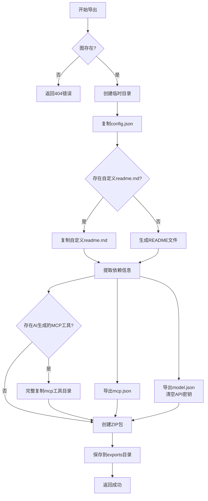

# 图导出为MCP服务

<cite>
**本文档引用文件**  
- [graph_import_export_routes.py](file://mag/app/api/graph_import_export_routes.py)
- [mcp_sequential_template.py](file://mag/app/templates/mcp_sequential_template.py)
- [app.ipynb](file://sdk_demo/app.ipynb)
- [pro.md](file://sdk_demo/pro.md)
- [graph_schema.py](file://mag/app/models/graph_schema.py)
- [graph_service.py](file://mag/app/services/graph_service.py)
- [config.py](file://mag/app/core/config.py)
- [graph_processor.py](file://mag/app/services/graph/graph_processor.py)
- [file_manager.py](file://mag/app/core/file_manager.py)
- [template_utils.py](file://mag/app/templates/template_utils.py)
</cite>

## 目录
1. [功能概述](#功能概述)
2. [导出接口实现](#导出接口实现)
3. [MCP服务代码生成](#mcp服务代码生成)
4. [生成的MCP服务结构](#生成的mcp服务结构)
5. [端到端使用示例](#端到端使用示例)
6. [版本管理与环境依赖](#版本管理与环境依赖)
7. [错误码说明](#错误码说明)
8. [安全限制](#安全限制)

## 功能概述

“图导出为MCP服务”功能允许用户将设计好的Agent工作流图通过`/graph-export/export-to-mcp`接口导出为可独立部署的MCP（Multi-Agent Graph Protocol）服务。该功能的核心是将可视化的工作流图转换为可执行的Python脚本，使得该工作流可以作为一个独立的服务运行，并通过标准接口被外部系统调用。

此功能主要服务于需要将MAG平台中设计和验证的复杂Agent工作流进行产品化部署的场景。用户可以将一个经过测试的、功能完整的Agent图导出为一个自包含的MCP服务，该服务可以部署在任何支持Python和FastMCP的环境中，从而实现工作流的独立运行和跨平台集成。

**Section sources**
- [graph_import_export_routes.py](file://mag/app/api/graph_import_export_routes.py#L0-L589)

## 导出接口实现

图导出功能的逻辑实现在`graph_import_export_routes.py`文件中，由`/graphs/{graph_name}/export`这个FastAPI路由处理。该接口接收一个图名称作为路径参数，然后执行一系列步骤来打包和导出该图。

导出流程如下：
1.  **验证图存在性**：首先调用`graph_service.get_graph(graph_name)`检查指定名称的图是否存在。如果不存在，则返回404错误。
2.  **创建临时工作区**：使用`tempfile.TemporaryDirectory()`创建一个临时目录，用于存放导出过程中生成的所有文件。
3.  **复制核心配置**：将图的JSON配置文件（`config.json`）从其存储位置复制到临时目录。
4.  **处理README文件**：系统会优先查找用户自定义的`readme.md`文件并复制。如果未找到，则会调用`FlowDiagram.generate_graph_readme()`方法，根据图的结构、使用的MCP服务器和模型信息动态生成一个详细的README文件。
5.  **提取依赖信息**：遍历图的节点，分析并提取出该图所依赖的MCP服务器和模型。
6.  **导出依赖配置**：将提取出的MCP服务器配置（`mcp.json`）和模型配置（`model.json`）保存到临时目录的`attachment`子目录中。在导出模型配置时，会将所有`api_key`字段清空，以确保敏感信息不会被泄露。
7.  **打包AI生成的MCP工具**：如果图中使用了由AI生成的MCP工具（例如通过`ai_mcp_generator`创建的工具），系统会检查`mcp`目录，并将这些工具的完整目录（包括虚拟环境）复制到导出包中，确保服务的可移植性。
8.  **创建ZIP包**：最后，将临时目录中的所有内容打包成一个ZIP文件，并保存到配置的`EXPORTS_DIR`目录下，供用户下载。



**Diagram sources**
- [graph_import_export_routes.py](file://mag/app/api/graph_import_export_routes.py#L300-L589)

**Section sources**
- [graph_import_export_routes.py](file://mag/app/api/graph_import_export_routes.py#L300-L589)
- [config.py](file://mag/app/core/config.py#L0-L101)
- [file_manager.py](file://mag/app/core/file_manager.py#L0-L720)

## MCP服务代码生成

在`graph_service.py`中，`GraphService`类提供了一个`generate_mcp_script`方法，该方法负责生成可独立运行的MCP服务脚本。虽然导出接口主要生成ZIP包，但此方法是理解如何将图转换为服务的关键。

该方法的核心是**代码模板注入**。它使用位于`mag/app/templates/`目录下的`mcp_sequential_template.py`作为模板。生成过程如下：
1.  **加载模板**：方法首先尝试从文件系统中读取`mcp_sequential_template.py`模板文件的内容。
2.  **准备格式化数据**：根据传入的图名称、描述和主机URL等信息，构建一个包含替换值的字典。
3.  **注入模板**：使用Python的`str.format()`方法，将准备好的数据注入到模板的占位符中，生成最终的Python脚本代码。

```mermaid
flowchart TD
A[generate_mcp_script] --> B[加载mcp_sequential_template.py]
B --> C{模板存在?}
C --> |否| D[返回错误]
C --> |是| E[准备格式化数据<br/>graph_name, description, host_url等]
E --> F[执行模板注入<br/>template.format(**data)]
F --> G[返回生成的Python脚本]
```

**Diagram sources**
- [graph_service.py](file://mag/app/services/graph_service.py#L200-L220)
- [mcp_sequential_template.py](file://mag/app/templates/mcp_sequential_template.py#L0-L46)

**Section sources**
- [graph_service.py](file://mag/app/services/graph_service.py#L200-L220)
- [mcp_sequential_template.py](file://mag/app/templates/mcp_sequential_template.py#L0-L46)

## 生成的MCP服务结构

通过`/graphs/{graph_name}/export`接口导出的ZIP包，其内部结构遵循一个标准的组织方式，确保了服务的可移植性和易用性。

一个典型的导出包结构如下：
```
{graph_name}.zip
├── config.json          # 图的原始JSON配置
├── readme.md            # 图的说明文档
├── prompts/             # 存放节点使用的提示词文件
│   ├── prompt1.txt
│   └── prompt2.md
├── attachment/
│   ├── mcp.json         # 该图依赖的MCP服务器配置
│   └── model.json       # 该图依赖的模型配置（无API密钥）
└── mcp/                 # （可选）AI生成的MCP工具
    └── {tool_name}/     # 工具目录，包含虚拟环境和代码
        ├── main.py
        ├── .venv/
        └── pyproject.toml
```

**启动方式**：
1.  解压ZIP包。
2.  根据`attachment/model.json`中的信息，为模型配置文件中的`api_key`字段填充实际的API密钥。
3.  （可选）如果包含`mcp`目录，则确保该目录下的虚拟环境已正确配置。
4.  使用Python运行生成的MCP服务脚本（该脚本需用户自行根据模板生成或由平台提供）。

**与外部系统集成**：
生成的MCP服务通过`execute_agents`工具函数暴露其功能。外部系统（如另一个MCP客户端或Python SDK）可以通过调用此工具，传入`input_text`和可选的`conversation_id`，来触发整个Agent工作流的执行，并获取最终结果。

**Section sources**
- [graph_import_export_routes.py](file://mag/app/api/graph_import_export_routes.py#L300-L589)
- [mcp_sequential_template.py](file://mag/app/templates/mcp_sequential_template.py#L0-L46)

## 端到端使用示例

结合`sdk_demo`目录中的`app.ipynb`和`pro.md`，可以构建一个完整的端到端示例。

1.  **图导出**：
    在Python SDK中，可以调用`mag.export_graph("news_processing_workflow")`方法。该方法会向MAG服务器的`/graphs/{graph_name}/export`接口发起请求，服务器执行导出逻辑，并返回一个包含ZIP文件路径的响应。

2.  **服务部署**：
    用户下载ZIP包后，按照上述“生成的MCP服务结构”中的说明进行部署。例如，可以将服务部署到一台云服务器上，并通过`uvicorn`或直接运行Python脚本使其监听特定端口。

3.  **通过Python SDK调用**：
    在`app.ipynb`中，用户可以使用`requests`库或MAG SDK来调用已部署的MCP服务。示例如下：
    ```python
    import requests

    # 假设MCP服务已部署在本地8000端口
    mcp_server_url = "http://localhost:8000"

    # 调用execute_agents工具
    payload = {
        "input_text": "请分析今天的科技新闻。",
        "conversation_id": "conv_123"  # 可选，用于会话保持
    }
    response = requests.post(f"{mcp_server_url}/execute_agents", json=payload)
    print(response.json())
    ```
    `pro.md`文件则可以作为`app.ipynb`中某个节点的提示词，指导Agent生成一个美观的网页报告。

**Section sources**
- [app.ipynb](file://sdk_demo/app.ipynb#L0-L799)
- [pro.md](file://sdk_demo/pro.md#L0-L63)

## 版本管理与环境依赖

*   **版本管理**：导出的ZIP包本身就是一个版本化的快照。它包含了图在导出时刻的完整配置、依赖和文档。用户可以通过为ZIP文件命名不同的版本号（如`my_graph_v1.0.zip`）来进行版本管理。MAG平台内部通过`config.json`文件的版本控制来管理图的迭代。
*   **环境依赖处理**：
    *   **MCP服务器依赖**：导出的`mcp.json`文件明确列出了服务运行所必需的MCP服务器及其配置。部署时，需要确保这些服务器可用。
    *   **模型依赖**：`model.json`文件指明了所需的模型。部署时，用户必须提供有效的API密钥。
    *   **Python依赖**：对于AI生成的MCP工具，导出包中包含了`pyproject.toml`文件和`.venv`虚拟环境，这极大地简化了Python依赖的管理，确保了环境的一致性。

**Section sources**
- [graph_import_export_routes.py](file://mag/app/api/graph_import_export_routes.py#L300-L589)
- [file_manager.py](file://mag/app/core/file_manager.py#L0-L720)

## 错误码说明

导出过程中可能遇到的HTTP错误码及其含义如下：

| 错误码 | 原因 | 解决方案 |
| :--- | :--- | :--- |
| `404 Not Found` | 指定名称的图不存在。 | 检查图名称是否正确，或通过`list_graphs`确认图是否存在。 |
| `400 Bad Request` | 请求格式错误，例如上传的文件不是ZIP或JSON格式。 | 确保上传的文件扩展名和内容格式正确。 |
| `409 Conflict` | 尝试导入的图名称已存在。 | 使用新的图名称，或先删除同名的现有图。 |
| `500 Internal Server Error` | 服务器内部错误，可能由文件读写失败、JSON解析错误或未知异常引起。 | 检查服务器日志以获取详细错误信息，并确保磁盘空间充足、文件权限正确。 |

**Section sources**
- [graph_import_export_routes.py](file://mag/app/api/graph_import_export_routes.py#L300-L589)

## 安全限制

该功能在设计上包含了多项安全限制，以保护用户数据和系统安全：

*   **敏感信息过滤**：在导出模型配置时，系统会自动将`model.json`文件中所有模型的`api_key`字段清空。这是为了防止用户的API密钥在分享或部署过程中被意外泄露。
*   **文件路径限制**：`FileManager`类在处理文件路径时，使用了`Path`对象和`glob`模式匹配，避免了路径遍历攻击的风险。所有文件操作都被限制在预定义的目录（如`AGENT_DIR`, `MCP_TOOLS_DIR`）内。
*   **输入验证**：`GraphConfig`和`AgentNode`等Pydantic模型对图配置的各个字段进行了严格的验证，例如检查节点名称是否包含非法字符（`/`, `\`, `.`），确保`context_mode`字段的格式正确等，防止了恶意或格式错误的输入破坏系统。
*   **临时文件安全**：在导入和导出过程中创建的临时文件和目录，都会在操作完成后被清理，避免了临时文件堆积和潜在的信息泄露。

**Section sources**
- [graph_import_export_routes.py](file://mag/app/api/graph_import_export_routes.py#L300-L589)
- [graph_schema.py](file://mag/app/models/graph_schema.py#L0-L116)
- [file_manager.py](file://mag/app/core/file_manager.py#L0-L720)