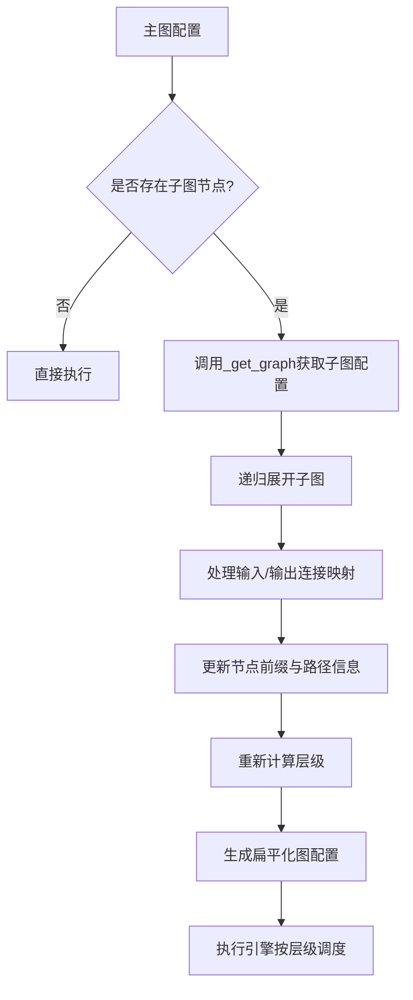
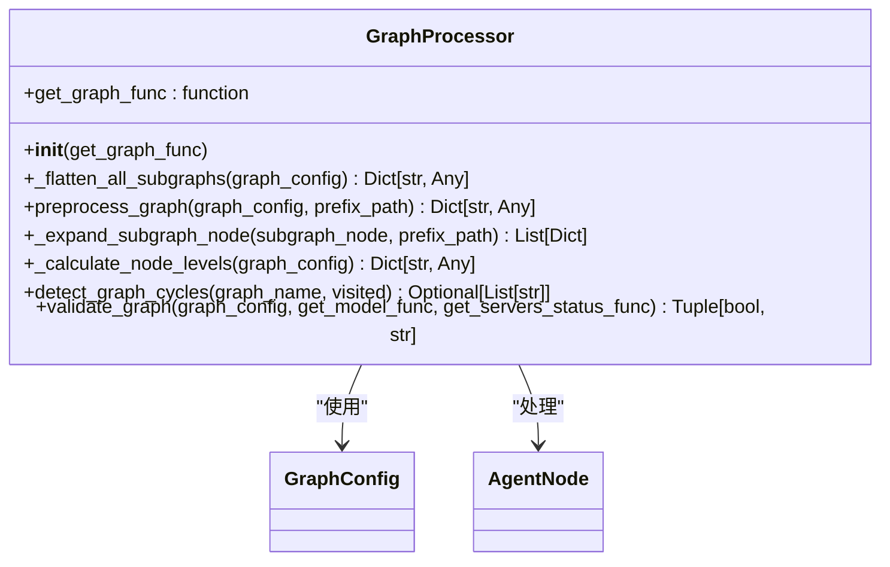
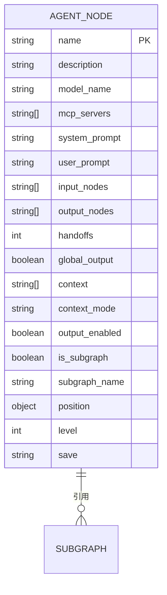
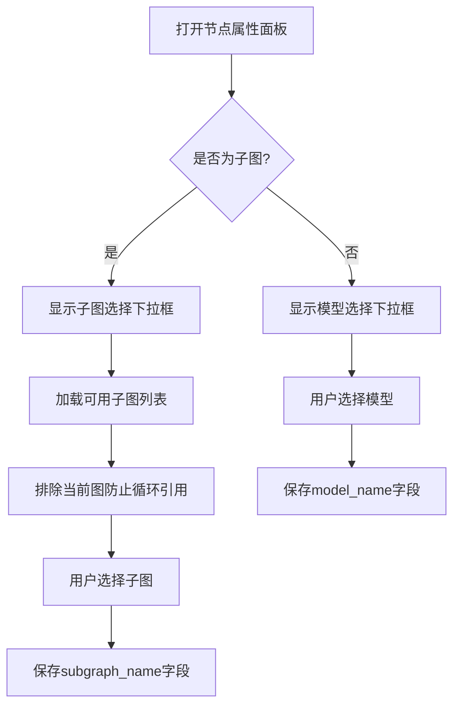
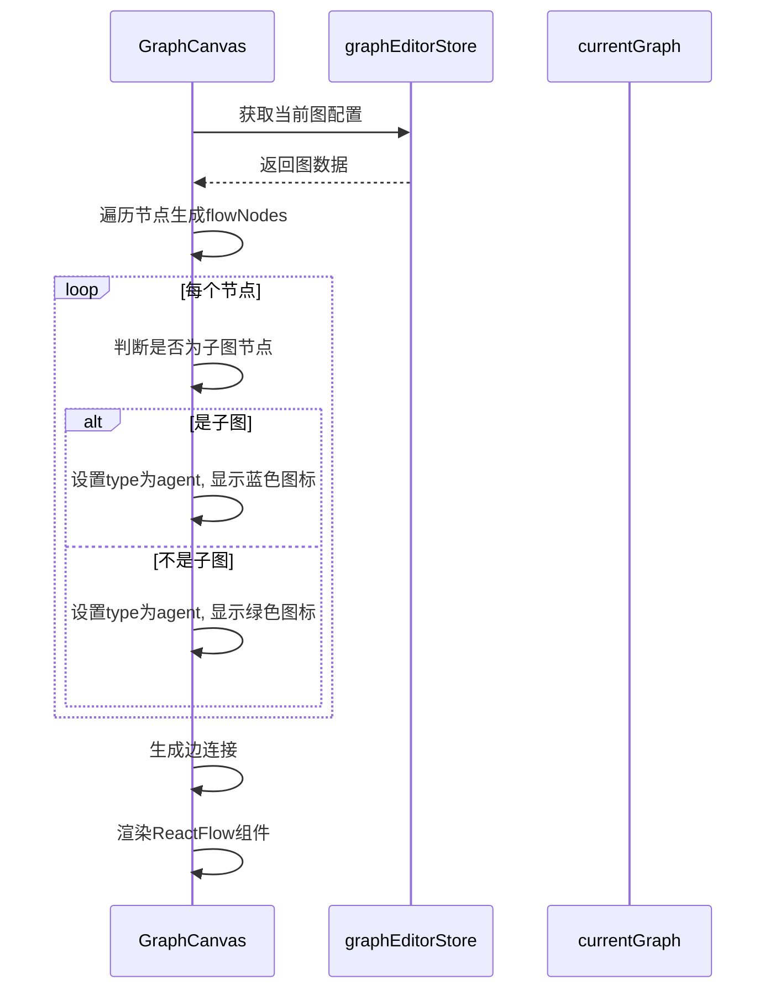
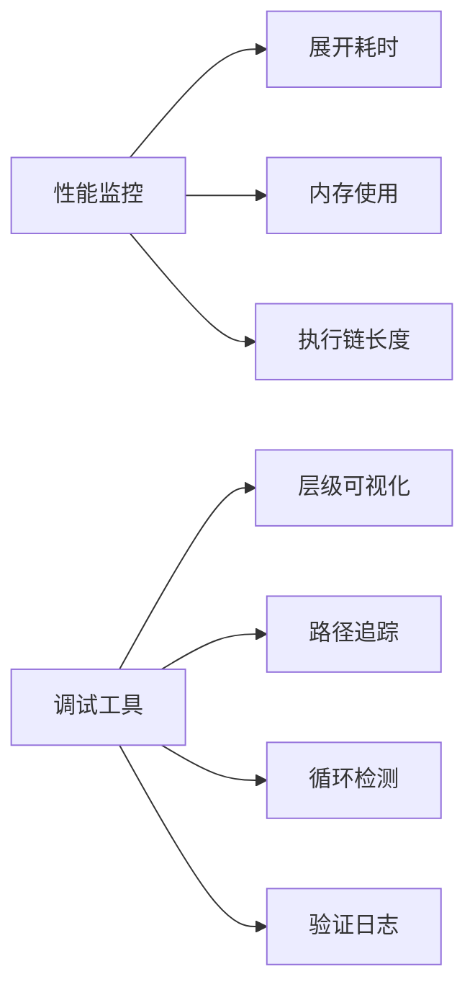

# 图嵌套图

<cite>
**本文档引用的文件**  
- [graph_processor.py](file://mag/app/services/graph/graph_processor.py)
- [graph_schema.py](file://mag/app/models/graph_schema.py)
- [NodePropertiesPanel.tsx](file://frontend/src/components/graph-editor/NodePropertiesPanel.tsx)
- [GraphCanvas.tsx](file://frontend/src/components/graph-editor/GraphCanvas.tsx)
</cite>

## 目录
1. [引言](#引言)
2. [架构设计与实现机制](#架构设计与实现机制)
3. [核心组件分析](#核心组件分析)
4. [数据结构定义](#数据结构定义)
5. [用户界面配置](#用户界面配置)
6. [可视化渲染](#可视化渲染)
7. [使用场景示例](#使用场景示例)
8. [性能影响与调试策略](#性能影响与调试策略)
9. [结论](#结论)

## 引言
“图嵌套图”功能是本系统中实现复杂智能系统分层建模与模块化复用的核心机制。该功能允许在一个Agent节点中嵌入完整的子图（subgraph），从而支持将常用流程封装为可复用的组件，并在多个主图中调用。这种设计不仅提升了系统的可维护性和扩展性，还显著降低了重复开发的成本。本文将深入解析其架构设计、实现逻辑、数据结构、用户交互及性能考量。

## 架构设计与实现机制

### 图处理流程
系统通过`GraphProcessor`类实现对嵌套图的解析与执行。当一个图包含子图节点时，系统会递归地将所有子图展开为扁平结构，同时维护节点间的输入输出映射关系和上下文传递逻辑。



**图来源**  
- [graph_processor.py](file://mag/app/services/graph/graph_processor.py#L0-L553)

**本节来源**  
- [graph_processor.py](file://mag/app/services/graph/graph_processor.py#L0-L553)

## 核心组件分析

### GraphProcessor 解析逻辑
`GraphProcessor`负责处理图的展开、层级计算等核心功能。其主要方法包括：

- `_flatten_all_subgraphs`: 将图中所有子图完全展开为扁平结构
- `preprocess_graph`: 将包含子图的复杂图展开为扁平化结构
- `_expand_subgraph_node`: 将单个子图节点展开为多个普通节点
- `_calculate_node_levels`: 计算节点执行层级，确保依赖关系正确

该组件通过递归方式处理嵌套子图，确保任意深度的嵌套都能被正确解析。



**图来源**  
- [graph_processor.py](file://mag/app/services/graph/graph_processor.py#L0-L553)

**本节来源**  
- [graph_processor.py](file://mag/app/services/graph/graph_processor.py#L0-L553)

## 数据结构定义

### AgentNode 数据模型
在`graph_schema.py`中定义了`AgentNode`类，用于描述图中每个节点的配置。与“图嵌套图”功能相关的字段如下：

- `is_subgraph`: 布尔值，标识该节点是否为子图节点
- `subgraph_name`: 字符串，指定引用的子图名称



**图来源**  
- [graph_schema.py](file://mag/app/models/graph_schema.py#L0-L116)

**本节来源**  
- [graph_schema.py](file://mag/app/models/graph_schema.py#L0-L116)

## 用户界面配置

### NodePropertiesPanel 组件
用户通过`NodePropertiesPanel`组件配置节点是否为子图引用。该组件提供直观的开关控件和下拉选择器，允许用户在“智能体”和“子图”类型之间切换，并选择具体的子图。



**图来源**  
- [NodePropertiesPanel.tsx](file://frontend/src/components/graph-editor/NodePropertiesPanel.tsx#L0-L693)

**本节来源**  
- [NodePropertiesPanel.tsx](file://frontend/src/components/graph-editor/NodePropertiesPanel.tsx#L0-L693)

## 可视化渲染

### GraphCanvas 渲染逻辑
`GraphCanvas.tsx`使用React Flow库实现图的可视化渲染。子图节点通过特殊图标（BranchesOutlined）标识，并在MiniMap中以蓝色显示。



**图来源**  
- [GraphCanvas.tsx](file://frontend/src/components/graph-editor/GraphCanvas.tsx#L0-L744)

**本节来源**  
- [GraphCanvas.tsx](file://frontend/src/components/graph-editor/GraphCanvas.tsx#L0-L744)

## 使用场景示例

### 数据清洗子图复用
假设我们将“数据清洗”流程封装为名为`data_cleaning`的子图，包含去重、格式化、异常值处理等节点。在多个主图中均可复用：

```mermaid
graph TB
subgraph 主图A
A1[原始数据] --> A2[data_cleaning]
A2 --> A3[分析模型]
end
subgraph 主图B
B1[日志数据] --> B2[data_cleaning]
B2 --> B3[报警系统]
end
subgraph data_cleaning[子图: 数据清洗]
C1[去重] --> C2[格式化]
C2 --> C3[异常值处理]
C3 --> end
end
```

当主图A执行时，系统会自动展开`data_cleaning`子图，将其节点插入执行链，并正确映射输入输出。

**本节来源**  
- [graph_processor.py](file://mag/app/services/graph/graph_processor.py#L0-L553)
- [graph_schema.py](file://mag/app/models/graph_schema.py#L0-L116)

## 性能影响与调试策略

### 性能考量
- **展开开销**: 每次执行前需递归展开子图，时间复杂度为O(n×m)，其中n为子图数量，m为平均子图规模
- **内存占用**: 扁平化后的图会增加内存消耗，建议控制子图嵌套深度
- **循环检测**: 系统通过`detect_graph_cycles`方法防止循环引用，避免无限递归

### 调试策略
- **层级计算日志**: 启用`_calculate_node_levels`中的print语句可查看层级计算过程
- **路径追踪**: 展开后的节点包含`_node_path`和`_original_name`字段，便于追溯来源
- **验证机制**: `validate_graph`方法会在保存时检查子图存在性、循环引用等问题



**本节来源**  
- [graph_processor.py](file://mag/app/services/graph/graph_processor.py#L0-L553)

## 结论
“图嵌套图”功能通过精心设计的架构实现了智能系统的模块化与复用。从前端配置到后端解析，系统完整支持子图的创建、引用、展开与执行。该机制不仅提升了开发效率，也为构建复杂AI工作流提供了坚实基础。未来可进一步优化展开算法，支持动态加载以降低内存开销。